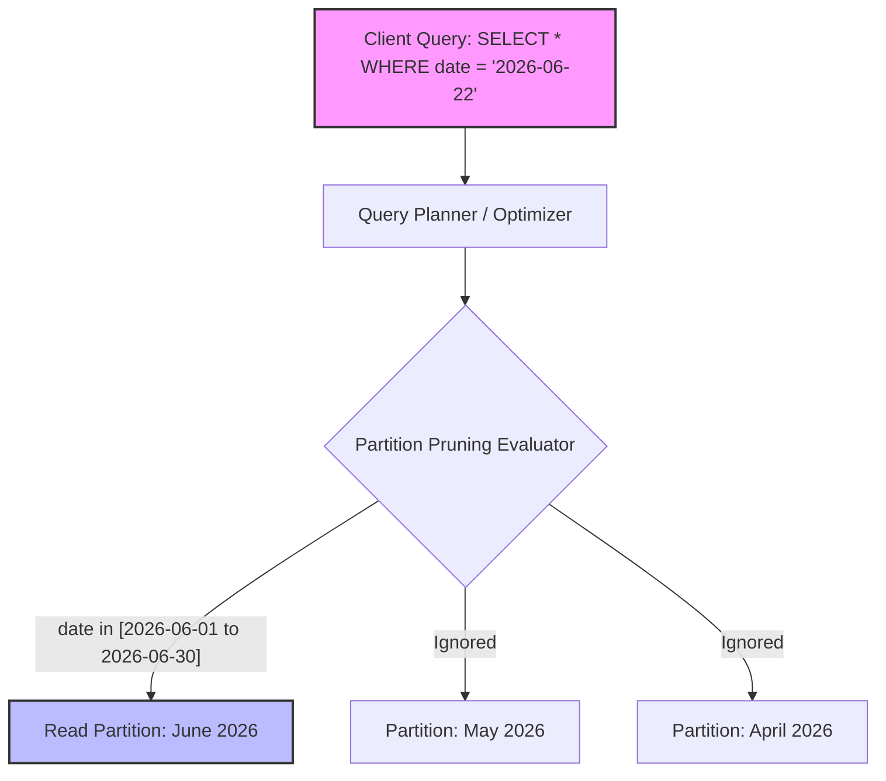

# Partitioning

## Introduction
Partitioning is the database design technique of dividing a large logical dataset into smaller, distinct, and manageable physical segments called **partitions**. Unlike sharding (which distributes partitions across different network nodes), partitioning can happen locally within a single database instance to improve query performance, reduce index sizes, and simplify data maintenance.

---

## Problem Statement
As tables grow to hundreds of millions or billions of rows:
1.  **Index Bloat:** B+ Trees become so deep and large that they no longer fit in memory. Every query causes multiple slow disk random I/O operations.
2.  **Slow Maintenance:** Operations like rebuilding indexes, running backups, or executing garbage collection (`VACUUM` in PostgreSQL) take hours or days, locking tables and degrading production performance.
3.  **Inefficient Range Deletions:** Deleting expired data (e.g., removing logs older than 90 days) requires scanning the database and performing row-by-row deletes, which generates massive transaction logs (WAL) and table fragmentation.

---

## Why This Exists
Partitioning addresses these scaling challenges by introducing:
*   **Partition Pruning:** The query optimizer analyzes query predicates (e.g., `WHERE created_at >= '2026-01-01'`) and instantly ignores all partitions containing irrelevant date ranges.
*   **Focused Indexes:** Each partition maintains its own smaller, local index which easily fits into memory (RAM), ensuring fast index lookups.
*   **Instant Deletes:** Drop old data instantly by dropping an entire partition (e.g., `DROP TABLE partition_2025_q4`), which is a metadata-only filesystem operation that executes in milliseconds without locking the primary table.

---

## Real-world Analogy
Imagine a corporate finance department storing all purchase receipts.
*   **Unpartitioned:** Throwing all receipts from the last 10 years into one massive cardboard box. To find a receipt from November 2024, you must dig through millions of receipts.
*   **Vertically Partitioned:** Storing receipt amounts and dates in a small file folder, while shipping the heavy, scanned physical PDF prints to a warehouse storage facility.
*   **Horizontally Partitioned:** Organizing receipts into 12 filing cabinets, one for each month. To find a November 2024 receipt, you immediately walk to the "November 2024" cabinet, ignoring the other 11.

---

## Definition
**Partitioning** is the decomposition of a database table or schema into smaller, independent parts.
*   **Horizontal Partitioning:** Splitting rows across multiple tables based on criteria (e.g., age range, country).
*   **Vertical Partitioning:** Splitting columns of a table into separate tables (e.g., separating frequently accessed columns from large text blobs).

---

## Key Concepts

### 1. Horizontal vs. Vertical Partitioning
```
Horizontal Partitioning (Row Splitting):
[ Row 1 (2024) ] --> Partition A
[ Row 2 (2025) ] --> Partition B
[ Row 3 (2026) ] --> Partition C

Vertical Partitioning (Column Splitting):
[ ID | Name | Age ]             --> Table 1 (Frequent Access, Small Size)
[ ID | ProfilePhoto | BioBlob ] --> Table 2 (Infrequent Access, Large Size)
```

### 2. Partitioning Strategies
*   **Range Partitioning:** Maps rows to partitions based on a continuous range of values of the partition key (e.g., Partition by Month: `Jan-2026`, `Feb-2026`).
*   **List Partitioning:** Maps rows to partitions based on explicit lists of values (e.g., Partition by Country: `US` -> Part A, `UK` & `DE` -> Part B).
*   **Hash Partitioning:** Applies a hash function to the partition key (e.g., `Hash(UserID) % 4`) to assign rows evenly across a fixed number of partitions. This prevents hotspots.
*   **Composite Partitioning:** Combines multiple strategies (e.g., Range partitioning by Date, then Hash partitioning by User ID within each date range).

### 3. Local vs. Global Indexes
*   **Local Index:** The index is partitioned in the same way as the table data. Each partition has its own self-contained index. This makes partition management easy but means a query that does not include the partition key must search every partition's local index.
*   **Global Index:** A single index structure that spans all partitions of the table. It is highly efficient for queries not using the partition key, but dropping a partition becomes complex and slow as the global index must be cleaned up.

---

## Internal Working & Routing Architecture

The database engine intercepts incoming queries, evaluates the filter conditions, and routes the query exclusively to the relevant partitions.



---

## Java Implementation

The following code implements a partitioned database engine simulation that supports:
1.  **Unpartitioned Table:** Standard lookup.
2.  **Range Partitioned Table:** Demonstrates Partition Pruning during range searches.

```java
import java.time.LocalDate;
import java.util.*;

// Core record class
class Order {
    long orderId;
    LocalDate orderDate;
    double amount;

    public Order(long orderId, LocalDate orderDate, double amount) {
        this.orderId = orderId;
        this.orderDate = orderDate;
        this.amount = amount;
    }

    @Override
    public String toString() {
        return "Order{id=" + orderId + ", date=" + orderDate + ", amount=" + amount + "}";
    }
}

// Interface for database operations
interface OrderDatabase {
    void insert(Order order);
    List<Order> getOrdersBetween(LocalDate start, LocalDate end);
}

// =====================================================================
// 1. BAD/UNPARTITIONED IMPLEMENTATION: Scans all elements
// =====================================================================
class MonolithicOrderDatabase implements OrderDatabase {
    private final List<Order> allOrders = new ArrayList<>();

    @Override
    public void insert(Order order) {
        allOrders.add(order);
    }

    @Override
    public List<Order> getOrdersBetween(LocalDate start, LocalDate end) {
        System.out.println("Scanning entire monolithic database of size: " + allOrders.size());
        List<Order> results = new ArrayList<>();
        for (Order order : allOrders) {
            if (!order.orderDate.isBefore(start) && !order.orderDate.isAfter(end)) {
                results.add(order);
            }
        }
        return results;
    }
}

// =====================================================================
// 2. BEST IMPLEMENTATION: Partitioned Database with Partition Pruning
// =====================================================================
class PartitionedOrderDatabase implements OrderDatabase {
    // Partitions organized by Year (2024, 2025, 2026, etc.)
    private final Map<Integer, List<Order>> partitions = new HashMap<>();

    @Override
    public void insert(Order order) {
        int year = order.orderDate.getYear();
        partitions.computeIfAbsent(year, k -> new ArrayList<>()).add(order);
    }

    @Override
    public List<Order> getOrdersBetween(LocalDate start, LocalDate end) {
        List<Order> results = new ArrayList<>();
        int startYear = start.getYear();
        int endYear = end.getYear();

        // Perform Partition Pruning: only scan years in range
        for (int year = startYear; year <= endYear; year++) {
            List<Order> partition = partitions.get(year);
            if (partition != null) {
                System.out.println("Searching Partition for year: " + year + " (Size: " + partition.size() + ")");
                for (Order order : partition) {
                    if (!order.orderDate.isBefore(start) && !order.orderDate.isAfter(end)) {
                        results.add(order);
                    }
                }
            } else {
                System.out.println("Partition for year " + year + " does not exist. Skipping scan.");
            }
        }
        return results;
    }
}
```

---

## Step-by-Step Explanation: Partition Pruning
When running `SELECT * FROM sales WHERE sale_date BETWEEN '2026-03-15' AND '2026-04-10'`:

1.  **Parse & Plan:** The SQL parser reads the query and recognizes that the table `sales` is partitioned by `sale_date` using a range strategy.
2.  **Determine Target Partitions:** The query planner analyzes the predicate `sale_date BETWEEN ...`. It checks the boundaries of all active partitions:
    *   `partition_2026_q1` boundaries: `2026-01-01` to `2026-03-31` (Matches!)
    *   `partition_2026_q2` boundaries: `2026-04-01` to `2026-06-30` (Matches!)
    *   `partition_2025_all` boundaries: `2025-01-01` to `2025-12-31` (Excluded)
3.  **Execute Pruned Scan:** The engine performs a scan exclusively against the files representing `partition_2026_q1` and `partition_2026_q2`. The other partition files are completely ignored at the operating system level, saving memory, cache space, and CPU.

---

## Multiple Real-world Examples

1.  **PostgreSQL Declarative Partitioning:** PostgreSQL allows setting up range or list partitioning where a parent table delegates storage to child tables, supporting automated partition pruning during query plans.
2.  **Google BigQuery:** Offers date/time partition tables. Queries filtering on the partitioning column scan significantly less data, directly reducing Google Cloud query execution costs.
3.  **Apache Kafka:** Topics are divided into partitions distributed across brokers. This allows multiple consumers in a consumer group to consume a single topic concurrently.
4.  **Amazon Athena / AWS Glue:** Partitions data files stored in S3 into virtual sub-folders (e.g., `s3://bucket/year=2026/month=06/`). Athena reads only the folder paths matching the query filters.

---

## Pros & Cons

### Pros
*   **Query Performance:** Dramatically reduces the volume of data scanned by leveraging partition pruning.
*   **Simplified Maintenance:** Dropping old data partition tables is fast and causes minimal fragmentation compared to running `DELETE`.
*   **Improved Cache Utilization:** Smaller indexes are more likely to stay cached in the database buffer pool.
*   **Improved Bulk Loading:** You can load data into a separate new partition table and then swap it into the main partitioned table with a simple metadata change.

### Cons
*   **Key Constraints Limitations:** Creating unique constraints (like `PRIMARY KEY`) across the entire table is complex; the partition key usually *must* be included in the unique index.
*   **Cross-Partition Query Overhead:** If a query doesn't use the partition key, the engine must scan all partitions (scatter-gather), which can be slower than scanning an unpartitioned table.
*   **Index Overhead:** Managing numerous small partitions can bloat the system catalog and complicate metadata tracking inside the query planner.

---

## Interview Questions

### Beginner
*   **Q:** What is the main difference between horizontal partitioning and sharding?
*   **A:** Horizontal partitioning splits a table into smaller tables stored on the **same** database server. Sharding distributes those partitions across **multiple** independent database servers over a network.

### Intermediate
*   **Q:** What is partition pruning, and how does it improve query speed?
*   **A:** Partition pruning is an optimization where the query optimizer analyzes the `WHERE` clause filters and excludes partitions whose boundaries do not overlap with the filter criteria. This prevents reading files that cannot possibly contain matching records.

### Senior
*   **Q:** If you have a table partitioned by `country_id`, what happens when you run a query filtering on `email`? How would you optimize it?
*   **A:** The query planner cannot prune partitions because the filter is on `email`, not the partition key `country_id`. It must perform a parallel scan across all partitions. To optimize, you could build a global index on `email` (if supported by the DB), or use a lookup table mapping `email` to `country_id` to make subsequent queries partition-aware.

### Staff Engineer
*   **Q:** How do you handle partition rebalancing or schema migration in a system partitioned horizontally across millions of records without causing downtime?
*   **A:** You can use a shadow-partitioning strategy: 1) Create new target partition tables with the new schema or layout. 2) Set up a trigger or application dual-write to write new updates to both old and new partitions. 3) Backfill historical data in batches. 4) Validate data consistency using checksums. 5) Swap the old and new tables using metadata renames in a single transaction.

---

## Common Mistakes
*   **Choosing a Partition Key with High Cardinality:** Partitioning on a column like `UserID` with range partitioning can create thousands of partitions, degrading the performance of the query planner.
*   **Null Values in Partition Keys:** If the partitioning column contains `NULL` values, those rows are routed to a default partition. If too many rows have `NULL` values, the default partition becomes a hotspot.
*   **Neglecting Partition Limits:** Having thousands of partitions in a single table can exceed file descriptor limits and increase database startup times.

---

## Best Practices
*   **Align Partitioning with Access Patterns:** Ensure your most common query filters match the partition key.
*   **Automate Partition Creation:** Write cron jobs or database scripts to pre-allocate future partitions (e.g., creating next month's tables before the month begins).
*   **Keep Partition Sizes Consistent:** Monitor data volume to ensure partitions are roughly similar in size to prevent uneven performance characteristics.

---

## When NOT to Use
*   **Small Tables:** Tables under 10GB rarely benefit from partitioning; the planning overhead can exceed the execution savings.
*   **Mixed Queries:** If your queries filter on diverse columns and cannot consistently target the partition key, partitioning will slow down operations.

---

## Comparison with Similar Concepts

*   **Partitioning vs. Sharding:** Partitioning is local to a single node. Sharding is distributed across multiple nodes.
*   **Partitioning vs. Indexing:** Partitioning divides the physical layout of the table. Indexing creates parallel structures to search those tables.

---

## Summary
Partitioning is a highly effective way to manage and optimize large tables within a single database node. By dividing data by range, list, or hash, database engines can prune irrelevant segments and speed up queries. Correct key selection and planning are vital to prevent performance degradation.

---

## Related Topics
- [Sharding](../sharding)
- [Replication](../replication)
- [Indexing](../indexing)
- [SQL](../sql)
- [NoSQL](../nosql)
