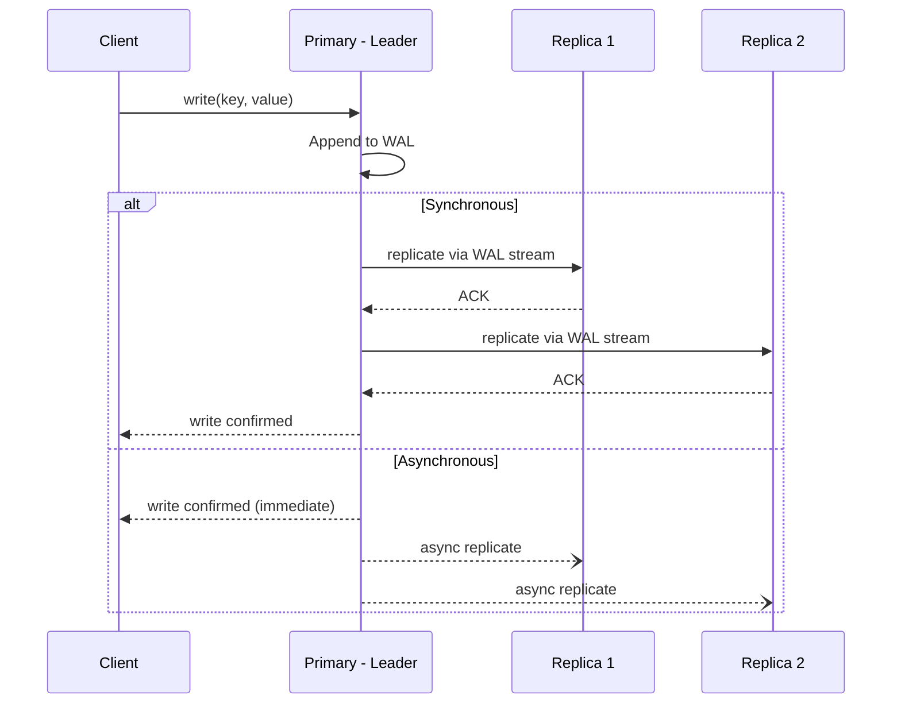
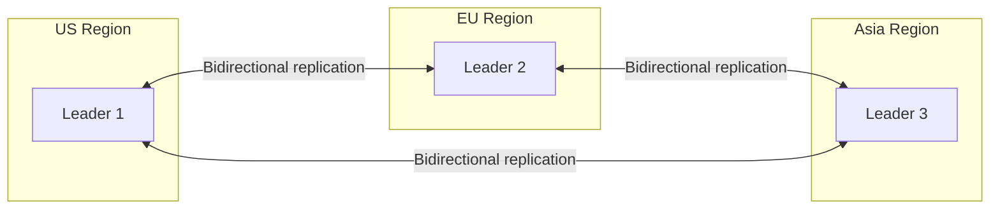
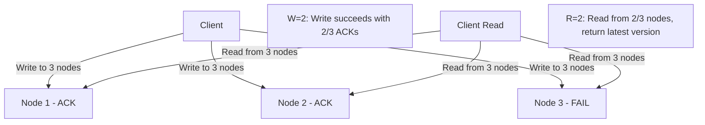

# Replication

## Introduction
Replication is the process of copying and maintaining data across multiple database nodes. It is fundamental to building fault-tolerant, highly available, and performant distributed systems. By keeping multiple copies of data, replication ensures that the system survives node failures, serves reads from geographically closer replicas, and distributes read workloads across multiple machines.

## Problem Statement
A single database node is a single point of failure. If it crashes, all data becomes inaccessible (or lost if the disk fails). Even without failures, a single node limits read throughput — every client must query the same machine. Replication solves both problems: copies of data survive individual node failures, and read traffic can be distributed across replicas.

## Why this exists
Every production database at scale uses replication. PostgreSQL, MySQL, MongoDB, Cassandra — all provide built-in replication. Without it, a single hardware failure would cause data loss and downtime. Replication is the foundation of high availability, disaster recovery, and read scalability.

## Real-world analogy
A library keeps copies of a popular book in multiple branches:
- If one branch is closed for renovation, readers can borrow from another branch (**fault tolerance**).
- Popular books are available at the nearest branch, reducing wait times (**read performance**).
- When a new edition is published, the main branch distributes copies to all branches (**replication lag**).
- If two branches accidentally order different editions, they must decide which version is authoritative (**conflict resolution**).

## Definition
**Replication** is a data distribution strategy where changes on one node (the primary/leader) are propagated to other nodes (replicas/followers) to keep them synchronised. The key design choices are: **synchronous vs. asynchronous** propagation, **single-leader vs. multi-leader vs. leaderless** topology, and the **conflict resolution** strategy.

### Replication Topologies

| Topology | Write Nodes | Conflict Risk | Use Case |
|----------|------------|---------------|----------|
| **Single-leader** | 1 primary | None | Most RDBMS: PostgreSQL, MySQL |
| **Multi-leader** | Multiple primaries | High | Multi-region writes: CockroachDB |
| **Leaderless** | Any node | Medium | Cassandra, DynamoDB, Riak |

## Key concepts
- **Primary-replica (leader-follower):** One node accepts writes; replicas receive a stream of changes.
- **Multi-leader (multi-master):** Multiple nodes accept writes; changes are merged using conflict resolution.
- **Leaderless:** Any node can accept writes; quorum reads/writes ensure consistency.
- **Synchronous replication:** Write is acknowledged only after all replicas confirm. Stronger consistency, higher latency.
- **Asynchronous replication:** Write is acknowledged immediately; replicas updated in the background. Lower latency, risk of data loss.
- **Semi-synchronous:** One replica is synchronous (guaranteed up-to-date), others are asynchronous.
- **Replication lag:** The delay between a write committing on the primary and being visible on a replica.
- **Write-Ahead Log (WAL):** An append-only log of all changes that is replayed on replicas.
- **Conflict resolution:** Strategies for handling concurrent writes in multi-leader/leaderless systems (last-writer-wins, vector clocks, CRDTs).

## Internal working

### Single-Leader Replication



### Multi-Leader Replication



### Leaderless Replication (Quorum)



## Python implementation

### Bad implementation
Naive replication that ignores ordering and failure.

```python
class NaiveReplication:
    """No ordering, no failure handling, no lag tracking."""

    def __init__(self):
        self.primary: dict[str, str] = {}
        self.replicas: list[dict[str, str]] = [{}]

    def write(self, key: str, value: str) -> None:
        self.primary[key] = value
        for replica in self.replicas:
            replica[key] = value  # What if this fails?
```

### Better implementation
An ordered replication log with synchronous/asynchronous modes.

```python
from dataclasses import dataclass, field
from enum import Enum
from typing import Any, Optional


class ReplicaMode(Enum):
    SYNC = "synchronous"
    ASYNC = "asynchronous"
    SEMI_SYNC = "semi_synchronous"


@dataclass
class ReplicaNode:
    name: str
    store: dict[str, Any] = field(default_factory=dict)
    last_applied_lsn: int = 0  # Log Sequence Number
    healthy: bool = True

    def apply(self, key: str, value: Any, lsn: int) -> bool:
        if not self.healthy:
            return False
        self.store[key] = value
        self.last_applied_lsn = lsn
        return True


class ReplicationManager:
    """Replication with ordered WAL, multiple modes, and lag tracking."""

    def __init__(self, replicas: list[ReplicaNode], mode: ReplicaMode):
        self.primary_store: dict[str, Any] = {}
        self.replicas = replicas
        self.mode = mode
        self.wal: list[dict] = []
        self.current_lsn = 0

    def write(self, key: str, value: Any) -> bool:
        self.current_lsn += 1
        lsn = self.current_lsn
        self.primary_store[key] = value
        self.wal.append({"lsn": lsn, "key": key, "value": value})

        if self.mode == ReplicaMode.SYNC:
            return self._sync_replicate(key, value, lsn)
        elif self.mode == ReplicaMode.SEMI_SYNC:
            return self._semi_sync_replicate(key, value, lsn)
        else:
            self._async_replicate(key, value, lsn)
            return True

    def _sync_replicate(self, key: str, value: Any, lsn: int) -> bool:
        for replica in self.replicas:
            if not replica.apply(key, value, lsn):
                return False
        return True

    def _semi_sync_replicate(self, key: str, value: Any, lsn: int) -> bool:
        # At least one replica must confirm
        acked = sum(r.apply(key, value, lsn) for r in self.replicas)
        return acked >= 1

    def _async_replicate(self, key: str, value: Any, lsn: int) -> None:
        for replica in self.replicas:
            replica.apply(key, value, lsn)

    def get_lag(self, replica_name: str) -> Optional[int]:
        replica = next((r for r in self.replicas if r.name == replica_name), None)
        if not replica:
            return None
        return self.current_lsn - replica.last_applied_lsn
```

### Best implementation
A production-grade replication system with leader election, conflict resolution, and read consistency guarantees.

```python
import time
from dataclasses import dataclass, field
from enum import Enum
from typing import Any, Optional
from collections import defaultdict


class Role(Enum):
    LEADER = "leader"
    FOLLOWER = "follower"
    CANDIDATE = "candidate"


@dataclass
class WALEntry:
    lsn: int
    key: str
    value: Any
    timestamp: float


@dataclass
class ReplicaNode:
    name: str
    role: Role = Role.FOLLOWER
    store: dict[str, tuple[Any, int]] = field(default_factory=dict)  # key -> (value, lsn)
    wal: list[WALEntry] = field(default_factory=list)
    last_applied_lsn: int = 0
    healthy: bool = True

    def apply_entry(self, entry: WALEntry) -> bool:
        if not self.healthy:
            return False
        self.store[entry.key] = (entry.value, entry.lsn)
        self.wal.append(entry)
        self.last_applied_lsn = entry.lsn
        return True

    def read(self, key: str, min_lsn: int = 0) -> Optional[tuple[Any, int]]:
        result = self.store.get(key)
        if result and result[1] >= min_lsn:
            return result
        return None


class ReplicationCluster:
    """
    Production replication cluster with:
    - Write-Ahead Log (WAL) for ordered replication
    - Configurable sync/async/semi-sync modes
    - Read-your-writes consistency via LSN tracking
    - Leader election simulation
    - Replication lag monitoring
    - Conflict detection
    """

    def __init__(self, node_names: list[str], mode: str = "semi_sync"):
        self.nodes = {name: ReplicaNode(name=name) for name in node_names}
        self.leader_name = node_names[0]
        self.nodes[self.leader_name].role = Role.LEADER
        self.current_lsn = 0
        self.mode = mode
        self.client_lsn: dict[str, int] = defaultdict(int)  # client_id -> last write LSN

    @property
    def leader(self) -> ReplicaNode:
        return self.nodes[self.leader_name]

    @property
    def followers(self) -> list[ReplicaNode]:
        return [n for n in self.nodes.values() if n.role == Role.FOLLOWER]

    def write(self, key: str, value: Any, client_id: str = "default") -> int:
        self.current_lsn += 1
        entry = WALEntry(
            lsn=self.current_lsn,
            key=key,
            value=value,
            timestamp=time.time(),
        )
        # Apply to leader
        self.leader.apply_entry(entry)

        # Replicate to followers
        if self.mode == "sync":
            for f in self.followers:
                if not f.apply_entry(entry):
                    raise RuntimeError(f"Sync replication failed on {f.name}")
        elif self.mode == "semi_sync":
            acks = sum(f.apply_entry(entry) for f in self.followers)
            if acks < 1:
                raise RuntimeError("Semi-sync: no follower acknowledged")
        else:
            for f in self.followers:
                f.apply_entry(entry)

        self.client_lsn[client_id] = self.current_lsn
        return self.current_lsn

    def read(self, key: str, client_id: str = "default",
             consistency: str = "eventual") -> Optional[Any]:
        if consistency == "strong":
            result = self.leader.read(key)
            return result[0] if result else None

        elif consistency == "read_your_writes":
            min_lsn = self.client_lsn.get(client_id, 0)
            # Try followers first
            for f in self.followers:
                result = f.read(key, min_lsn=min_lsn)
                if result:
                    return result[0]
            # Fallback to leader
            result = self.leader.read(key)
            return result[0] if result else None

        else:  # eventual
            for f in self.followers:
                if f.healthy:
                    result = f.read(key)
                    if result:
                        return result[0]
            result = self.leader.read(key)
            return result[0] if result else None

    def promote_follower(self, follower_name: str) -> None:
        """Simulate leader failover."""
        old_leader = self.leader
        old_leader.role = Role.FOLLOWER
        self.leader_name = follower_name
        self.nodes[follower_name].role = Role.LEADER

    def lag_report(self) -> dict[str, int]:
        return {
            f.name: self.current_lsn - f.last_applied_lsn
            for f in self.followers
        }
```

## Java implementation

```java
import java.util.*;
import java.util.concurrent.*;
import java.util.concurrent.atomic.*;

enum Role { LEADER, FOLLOWER, CANDIDATE }

record WALEntry(int lsn, String key, Object value, long timestamp) {}

class ReplicaNode {
    final String name;
    volatile Role role;
    final Map<String, Object[]> store = new ConcurrentHashMap<>(); // key -> [value, lsn]
    final List<WALEntry> wal = new CopyOnWriteArrayList<>();
    final AtomicInteger lastAppliedLsn = new AtomicInteger(0);
    volatile boolean healthy = true;

    ReplicaNode(String name, Role role) {
        this.name = name;
        this.role = role;
    }

    boolean applyEntry(WALEntry entry) {
        if (!healthy) return false;
        store.put(entry.key(), new Object[]{entry.value(), entry.lsn()});
        wal.add(entry);
        lastAppliedLsn.set(entry.lsn());
        return true;
    }

    Optional<Object> read(String key, int minLsn) {
        Object[] result = store.get(key);
        if (result != null && (int) result[1] >= minLsn) {
            return Optional.of(result[0]);
        }
        return Optional.empty();
    }
}

class ReplicationCluster {
    private final Map<String, ReplicaNode> nodes = new ConcurrentHashMap<>();
    private volatile String leaderName;
    private final AtomicInteger currentLsn = new AtomicInteger(0);
    private final Map<String, Integer> clientLsn = new ConcurrentHashMap<>();
    private final String mode;

    ReplicationCluster(List<String> nodeNames, String mode) {
        this.mode = mode;
        this.leaderName = nodeNames.get(0);
        for (int i = 0; i < nodeNames.size(); i++) {
            String name = nodeNames.get(i);
            Role role = (i == 0) ? Role.LEADER : Role.FOLLOWER;
            nodes.put(name, new ReplicaNode(name, role));
        }
    }

    ReplicaNode leader() { return nodes.get(leaderName); }

    List<ReplicaNode> followers() {
        return nodes.values().stream()
            .filter(n -> n.role == Role.FOLLOWER)
            .toList();
    }

    int write(String key, Object value, String clientId) {
        int lsn = currentLsn.incrementAndGet();
        WALEntry entry = new WALEntry(lsn, key, value, System.currentTimeMillis());
        leader().applyEntry(entry);

        long acks = followers().stream()
            .filter(f -> f.applyEntry(entry))
            .count();

        if ("sync".equals(mode) && acks < followers().size()) {
            throw new RuntimeException("Sync replication failed");
        }
        if ("semi_sync".equals(mode) && acks < 1) {
            throw new RuntimeException("Semi-sync: no follower ack");
        }

        clientLsn.put(clientId, lsn);
        return lsn;
    }

    Optional<Object> read(String key, String clientId, String consistency) {
        if ("strong".equals(consistency)) {
            return leader().read(key, 0);
        }
        if ("read_your_writes".equals(consistency)) {
            int minLsn = clientLsn.getOrDefault(clientId, 0);
            for (ReplicaNode f : followers()) {
                Optional<Object> result = f.read(key, minLsn);
                if (result.isPresent()) return result;
            }
            return leader().read(key, 0);
        }
        // eventual
        for (ReplicaNode f : followers()) {
            if (f.healthy) {
                Optional<Object> result = f.read(key, 0);
                if (result.isPresent()) return result;
            }
        }
        return leader().read(key, 0);
    }

    void promoteFollower(String name) {
        leader().role = Role.FOLLOWER;
        leaderName = name;
        nodes.get(name).role = Role.LEADER;
    }

    Map<String, Integer> lagReport() {
        int current = currentLsn.get();
        Map<String, Integer> report = new HashMap<>();
        for (ReplicaNode f : followers()) {
            report.put(f.name, current - f.lastAppliedLsn.get());
        }
        return report;
    }
}
```

## Step-by-step explanation
1. A **naive replication** approach copies data without ordering or failure handling — if a replica fails, the write is lost.
2. An **ordered WAL** ensures replicas apply changes in the same order as the primary, supporting sync, async, and semi-sync modes.
3. A **production cluster** adds leader election (promote a follower to primary on failure), read-your-writes consistency (track client LSN to avoid reading stale data), and replication lag monitoring.

## Multiple real-world examples
1. **PostgreSQL:** Uses WAL-based streaming replication. Supports synchronous (for zero data loss) and asynchronous modes. pg_basebackup creates new replicas from the primary.
2. **MySQL:** Supports statement-based, row-based, and mixed replication through the binary log. Group Replication provides multi-primary with automatic conflict detection.
3. **MongoDB:** Uses a replica set with automatic leader election using the Raft consensus protocol. Oplog (operations log) streams changes to secondaries. Read preferences allow routing reads to secondaries.
4. **Cassandra:** Uses leaderless peer-to-peer replication with tunable consistency. Any node can accept writes. Anti-entropy repair reconciles divergent replicas.
5. **Amazon Aurora:** Separates compute and storage. The storage layer replicates data 6 ways across 3 AZs. Write quorum = 4/6, read quorum = 3/6. Replicas share the same storage volume, eliminating replication lag for reads.

## Pros
- Improved read throughput by distributing reads across replicas.
- Better fault tolerance — data survives node failures.
- Faster recovery from node failure — promote a replica instead of restoring from backup.
- Geographic distribution — serve reads from the closest replica for lower latency.

## Cons
- Synchronous replication increases write latency (must wait for replica ACK).
- Asynchronous replication risks data loss if the primary fails before replication completes.
- Replication lag can cause stale reads, confusing users.
- Conflict resolution in multi-leader/leaderless setups is complex.
- Additional storage and network costs for maintaining replicas.

## Interview questions

### Beginner
- **Q: What is replication, and why is it important?**
  - **A:** Replication copies data across multiple nodes so the system survives node failures (fault tolerance), serves more read traffic (scalability), and keeps data closer to users (lower latency).

- **Q: What is replication lag?**
  - **A:** The delay between a write committing on the primary and being visible on a replica. In async replication, lag can range from milliseconds to seconds depending on load and network.

### Intermediate
- **Q: What is the difference between synchronous and asynchronous replication?**
  - **A:** Synchronous waits for all replicas to confirm before acknowledging the write — guaranteed consistency but higher latency. Asynchronous acknowledges immediately and replicates in the background — lower latency but risk of data loss if the primary fails.

- **Q: What is semi-synchronous replication?**
  - **A:** At least one replica must confirm the write before acknowledgement. This provides a balance: guaranteed durability (at least one copy) with lower latency than full synchronous replication. Used by MySQL and PostgreSQL.

### Senior
- **Q: How do you handle conflict resolution in multi-leader replication?**
  - **A:** Common strategies: (1) Last-Writer-Wins (LWW) using timestamps — simple but can lose data, (2) Vector clocks to detect concurrent writes and present conflicts to the application, (3) CRDTs (Conflict-free Replicated Data Types) that merge automatically without conflicts, (4) Custom merge functions that apply domain-specific logic.

- **Q: When should you use leaderless replication (e.g., Cassandra) vs. single-leader?**
  - **A:** Leaderless is better for multi-region deployments where you need low-latency writes everywhere and can tolerate eventual consistency. Single-leader is better when you need strong consistency and can accept all writes going to one region. Leaderless eliminates the single point of failure for writes but requires quorum logic and anti-entropy repair.

### Staff Engineer
- **Q: Design a replication scheme for a global read-heavy service with a 99.99% availability target.**
  - **A:** Deploy a single-leader primary in the write-heavy region with semi-synchronous replication to one local replica (for zero data loss). Add async read replicas in each major region (US, EU, Asia). Use DNS-based routing to direct reads to the nearest replica. Implement read-your-writes consistency by tracking client LSN and routing to replicas that are caught up. Monitor replication lag with alerts at p99 > 1 second. For disaster recovery, automated failover promotes the semi-sync replica with RPO=0 and RTO under 60 seconds.

## Common mistakes
- Assuming replicas are always up to date — always account for replication lag.
- Using synchronous replication for every workload — it significantly increases write latency.
- Not monitoring replica health and lag — a lagging replica serving reads causes data inconsistency bugs.
- Forgetting about failover testing — untested failover procedures fail when you need them most.
- Using multi-leader replication without a clear conflict resolution strategy.

## Best practices
- Use read replicas for read-heavy workloads to distribute load.
- Monitor replication lag continuously and alert when it exceeds thresholds.
- Choose the replication mode based on durability requirements: sync for zero data loss, async for performance.
- Automate failover with health checks and leader election (Raft, Paxos).
- Test failover procedures regularly with chaos engineering.
- Use semi-synchronous replication as a balance between consistency and performance.

## When NOT to use
- Small systems where a single node with regular backups is sufficient.
- Write-heavy systems where the added latency from synchronous replication is unacceptable and data loss is tolerable.
- Temporary or disposable data (e.g., ephemeral caches) where replication adds unnecessary cost.

## Comparison with similar concepts
- **Sharding:** Splits different data across nodes; replication copies the same data. Often combined: each shard is replicated.
- **Consistency models:** Replication affects how fresh reads are. Sync replication provides strong consistency; async provides eventual consistency.
- **Availability:** Replication supports high availability by providing failover targets.
- **Backup:** Replication is real-time; backups are point-in-time snapshots. Both are needed for a complete data protection strategy.

## Summary
Replication is foundational to distributed data systems. The right mode (synchronous, asynchronous, or semi-synchronous) and topology (single-leader, multi-leader, or leaderless) depend on the trade-offs between consistency, latency, and availability. Understanding replication lag, conflict resolution, and failover mechanisms is essential for designing reliable distributed systems and excelling in system design interviews.

## Related topics
- [CAP Theorem](../../fundamentals/cap-theorem)
- [Consistency Models](../../fundamentals/consistency-models)
- [Sharding](../sharding)
- [Partitioning](../partitioning)
- [Transactions](../transactions)
