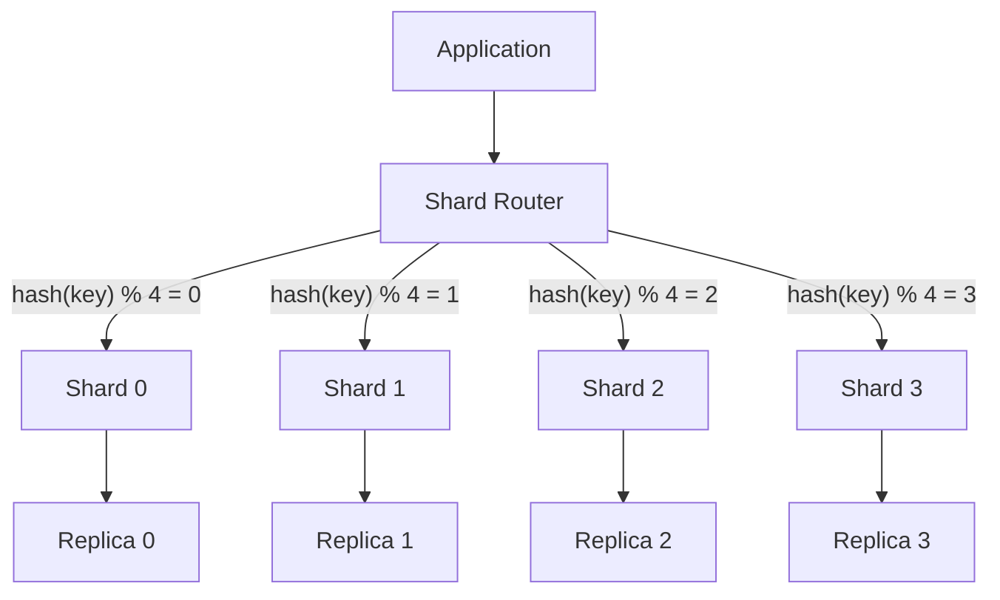
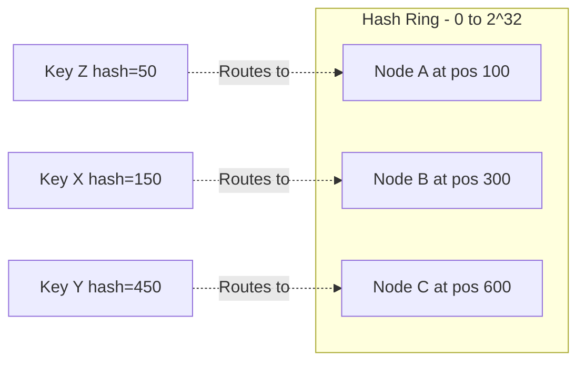
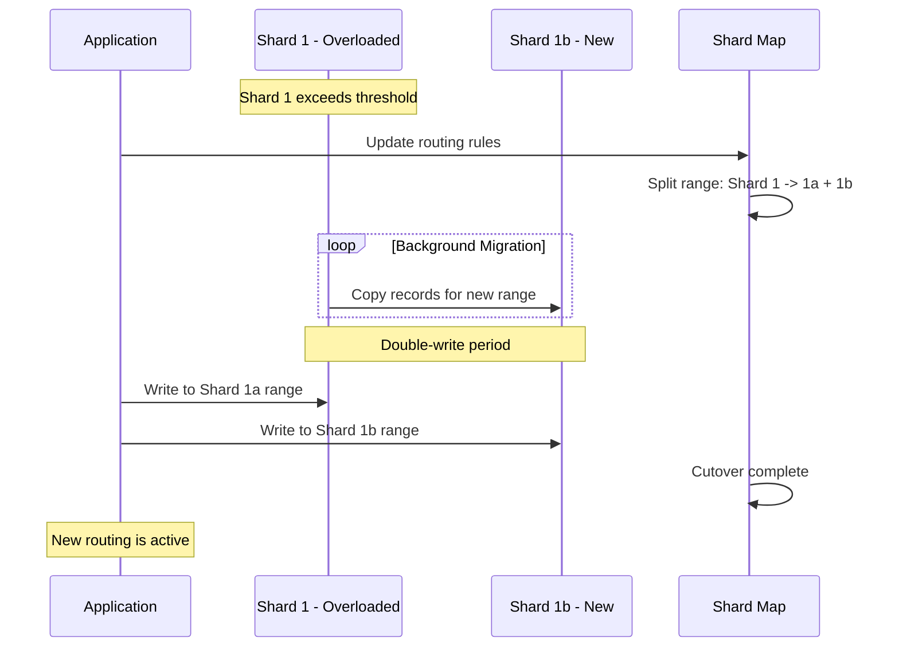

# Sharding

## Introduction
Sharding is a horizontal scaling strategy that distributes data across multiple database instances (shards), each holding a subset of the total data. It is the primary technique for scaling databases beyond the capacity of a single machine. When a single database can no longer handle the read/write volume or storage requirements, sharding allows the system to grow by adding more database nodes.

## Problem Statement
A single database instance becomes a bottleneck as data volume and traffic grow. It hits limits on storage (terabytes of data), CPU (complex queries), memory (working set does not fit in RAM), and I/O (disk throughput). Vertical scaling (bigger hardware) is expensive and has a ceiling. Sharding enables horizontal scaling — distributing data across multiple machines for virtually unlimited capacity.

## Why this exists
Every major internet company has faced the "single database bottleneck" problem. Twitter, Pinterest, and Uber all had to shard their databases as they grew. Sharding enables linear scalability — doubling the number of shards roughly doubles the system's capacity. It is the most important database scaling technique in system design.

## Real-world analogy
A delivery company divides a city into geographic zones and assigns each zone to a separate local hub:
- Each hub stores packages **only** for its zone (data locality).
- Customers in Zone A always go to Hub A — the routing is predictable (shard key).
- If Zone A grows too large, it is split into Zone A1 and Zone A2 (resharding).
- Occasionally, a customer moves zones and their packages must be transferred (data migration).

## Definition
**Sharding** divides data horizontally so that each shard contains a distinct subset of rows/records. A **shard key** determines which shard owns each record. A **shard router** directs queries to the correct shard based on the key.

### Sharding Strategies

| Strategy | How it works | Pros | Cons |
|----------|-------------|------|------|
| **Hash-based** | `shard = hash(key) % num_shards` | Even distribution | Cannot do range queries efficiently |
| **Range-based** | `shard = range(key)` | Efficient range queries | Risk of hotspots |
| **Directory-based** | Lookup table maps key to shard | Flexible routing | Lookup table is a single point of failure |
| **Geographic** | Data placed by region/location | Data locality, compliance | Uneven load across regions |
| **Consistent hashing** | Hash ring with virtual nodes | Minimal resharding on node changes | More complex implementation |

## Key concepts
- **Shard key:** The field used to determine which shard owns a record. The most critical design decision in sharding.
- **Shard map / router:** The component that maps keys to shards and routes queries.
- **Resharding:** Splitting or merging shards when data distribution becomes unbalanced.
- **Hotspot:** A shard that receives disproportionately more traffic than others.
- **Cross-shard queries:** Queries that need data from multiple shards — expensive and complex.
- **Consistent hashing:** A technique that minimises data movement when shards are added or removed.
- **Virtual nodes (vnodes):** Multiple hash positions per physical shard for better load balancing.
- **Scatter-gather:** A query pattern that sends the same query to all shards and aggregates results.

## Internal working

### Hash-Based Sharding Architecture



### Consistent Hashing Ring



### Resharding Process



## Python implementation

### Bad implementation
A single database instance — no sharding.

```python
class SingleDatabase:
    """All data on one machine. Cannot scale beyond hardware limits."""

    def __init__(self):
        self.store: dict[str, str] = {}

    def write(self, key: str, value: str) -> None:
        self.store[key] = value

    def read(self, key: str) -> str | None:
        return self.store.get(key)
```

### Better implementation
A hash-based shard router with multiple shards.

```python
from dataclasses import dataclass, field
import hashlib


@dataclass
class Shard:
    name: str
    store: dict[str, str] = field(default_factory=dict)

    def write(self, key: str, value: str) -> None:
        self.store[key] = value

    def read(self, key: str) -> str | None:
        return self.store.get(key)

    @property
    def size(self) -> int:
        return len(self.store)


class HashShardRouter:
    """Hash-based sharding with deterministic routing."""

    def __init__(self, num_shards: int = 4):
        self.shards = [Shard(name=f"shard-{i}") for i in range(num_shards)]

    def _get_shard(self, key: str) -> Shard:
        hash_val = int(hashlib.md5(key.encode()).hexdigest(), 16)
        return self.shards[hash_val % len(self.shards)]

    def write(self, key: str, value: str) -> str:
        shard = self._get_shard(key)
        shard.write(key, value)
        return shard.name

    def read(self, key: str) -> str | None:
        shard = self._get_shard(key)
        return shard.read(key)
```

### Best implementation
A production-grade shard manager with consistent hashing, virtual nodes, resharding, and cross-shard queries.

```python
import bisect
import hashlib
from dataclasses import dataclass, field
from typing import Optional, Any


@dataclass
class ShardNode:
    name: str
    store: dict[str, Any] = field(default_factory=dict)
    healthy: bool = True

    def write(self, key: str, value: Any) -> bool:
        if not self.healthy:
            return False
        self.store[key] = value
        return True

    def read(self, key: str) -> Optional[Any]:
        if not self.healthy:
            return None
        return self.store.get(key)

    @property
    def size(self) -> int:
        return len(self.store)


class ConsistentHashRouter:
    """
    Consistent hashing with virtual nodes for even distribution.
    Adding/removing a node only moves ~1/N of the keys.
    """

    def __init__(self, virtual_nodes: int = 150):
        self.virtual_nodes = virtual_nodes
        self.ring: list[int] = []
        self.ring_map: dict[int, str] = {}
        self.nodes: dict[str, ShardNode] = {}

    def _hash(self, key: str) -> int:
        return int(hashlib.sha256(key.encode()).hexdigest(), 16)

    def add_node(self, node: ShardNode) -> None:
        self.nodes[node.name] = node
        for i in range(self.virtual_nodes):
            h = self._hash(f"{node.name}:vnode:{i}")
            bisect.insort(self.ring, h)
            self.ring_map[h] = node.name

    def remove_node(self, name: str) -> dict[str, Any]:
        """Remove node and return its data for migration."""
        node = self.nodes.pop(name, None)
        if not node:
            return {}
        self.ring = [h for h in self.ring if self.ring_map.get(h) != name]
        self.ring_map = {h: n for h, n in self.ring_map.items() if n != name}
        return node.store

    def get_node(self, key: str) -> Optional[ShardNode]:
        if not self.ring:
            return None
        h = self._hash(key)
        idx = bisect.bisect_right(self.ring, h) % len(self.ring)
        node_name = self.ring_map[self.ring[idx]]
        return self.nodes.get(node_name)


class ShardManager:
    """
    Production shard manager with:
    - Consistent hashing (minimal key movement on resharding)
    - Virtual nodes (even distribution)
    - Health-aware routing
    - Cross-shard scatter-gather queries
    - Shard statistics
    """

    def __init__(self, shard_names: list[str], virtual_nodes: int = 150):
        self.router = ConsistentHashRouter(virtual_nodes=virtual_nodes)
        for name in shard_names:
            self.router.add_node(ShardNode(name=name))

    def write(self, key: str, value: Any) -> str:
        node = self.router.get_node(key)
        if node is None or not node.healthy:
            raise RuntimeError("No healthy shard available")
        node.write(key, value)
        return node.name

    def read(self, key: str) -> Optional[Any]:
        node = self.router.get_node(key)
        if node is None:
            return None
        return node.read(key)

    def scatter_gather(self, predicate) -> list[Any]:
        """Query all shards and aggregate results (expensive)."""
        results = []
        for node in self.router.nodes.values():
            if node.healthy:
                for key, value in node.store.items():
                    if predicate(key, value):
                        results.append(value)
        return results

    def add_shard(self, name: str) -> None:
        """Add a new shard — consistent hashing ensures minimal data movement."""
        self.router.add_node(ShardNode(name=name))

    def remove_shard(self, name: str) -> None:
        """Remove a shard and redistribute its data."""
        orphaned = self.router.remove_node(name)
        for key, value in orphaned.items():
            self.write(key, value)

    def stats(self) -> dict[str, Any]:
        return {
            name: {"size": node.size, "healthy": node.healthy}
            for name, node in self.router.nodes.items()
        }
```

## Java implementation

```java
import java.security.MessageDigest;
import java.util.*;
import java.util.concurrent.*;
import java.util.function.BiPredicate;
import java.util.stream.Collectors;

class ShardNode {
    final String name;
    final Map<String, Object> store = new ConcurrentHashMap<>();
    volatile boolean healthy = true;

    ShardNode(String name) { this.name = name; }

    boolean write(String key, Object value) {
        if (!healthy) return false;
        store.put(key, value);
        return true;
    }

    Object read(String key) {
        return healthy ? store.get(key) : null;
    }

    int size() { return store.size(); }
}

class ConsistentHashRouter {
    private final TreeMap<Long, String> ring = new TreeMap<>();
    private final Map<String, ShardNode> nodes = new ConcurrentHashMap<>();
    private final int virtualNodes;

    ConsistentHashRouter(int virtualNodes) {
        this.virtualNodes = virtualNodes;
    }

    private long hash(String key) {
        try {
            MessageDigest md = MessageDigest.getInstance("SHA-256");
            byte[] digest = md.digest(key.getBytes());
            long h = 0;
            for (int i = 0; i < 8; i++) {
                h = (h << 8) | (digest[i] & 0xFF);
            }
            return h;
        } catch (Exception e) {
            return key.hashCode();
        }
    }

    void addNode(ShardNode node) {
        nodes.put(node.name, node);
        for (int i = 0; i < virtualNodes; i++) {
            ring.put(hash(node.name + ":vnode:" + i), node.name);
        }
    }

    Map<String, Object> removeNode(String name) {
        ShardNode node = nodes.remove(name);
        if (node == null) return Map.of();
        ring.entrySet().removeIf(e -> e.getValue().equals(name));
        return node.store;
    }

    ShardNode getNode(String key) {
        if (ring.isEmpty()) return null;
        long h = hash(key);
        Map.Entry<Long, String> entry = ring.ceilingEntry(h);
        if (entry == null) entry = ring.firstEntry();
        return nodes.get(entry.getValue());
    }

    Collection<ShardNode> allNodes() {
        return nodes.values();
    }
}

class ShardManager {
    private final ConsistentHashRouter router;

    ShardManager(List<String> shardNames, int virtualNodes) {
        this.router = new ConsistentHashRouter(virtualNodes);
        for (String name : shardNames) {
            router.addNode(new ShardNode(name));
        }
    }

    String write(String key, Object value) {
        ShardNode node = router.getNode(key);
        if (node == null || !node.healthy) {
            throw new RuntimeException("No healthy shard");
        }
        node.write(key, value);
        return node.name;
    }

    Object read(String key) {
        ShardNode node = router.getNode(key);
        return node != null ? node.read(key) : null;
    }

    List<Object> scatterGather(BiPredicate<String, Object> predicate) {
        return router.allNodes().stream()
            .filter(n -> n.healthy)
            .flatMap(n -> n.store.entrySet().stream())
            .filter(e -> predicate.test(e.getKey(), e.getValue()))
            .map(Map.Entry::getValue)
            .collect(Collectors.toList());
    }

    void addShard(String name) {
        router.addNode(new ShardNode(name));
    }

    void removeShard(String name) {
        Map<String, Object> orphaned = router.removeNode(name);
        orphaned.forEach(this::write);
    }

    Map<String, Map<String, Object>> stats() {
        return router.allNodes().stream()
            .collect(Collectors.toMap(
                n -> n.name,
                n -> Map.of("size", n.size(), "healthy", n.healthy)
            ));
    }
}
```

## Step-by-step explanation
1. A **single database** becomes a bottleneck — all reads and writes hit one machine.
2. **Hash-based sharding** distributes data evenly using `hash(key) % N`, but adding/removing shards requires moving ~all data.
3. **Consistent hashing** with virtual nodes ensures that adding a shard only moves ~1/N of the data, and virtual nodes prevent uneven distribution.
4. **Cross-shard queries** use a scatter-gather pattern — sending the query to all shards and aggregating results — which is expensive and should be minimised.
5. **Resharding** involves creating new shards, migrating data in the background, and using double-writes during the transition period.

## Multiple real-world examples
1. **Vitess (YouTube/Google):** A sharding middleware for MySQL that provides transparent horizontal scaling. Used by YouTube to manage billions of rows across thousands of shards.
2. **Instagram:** Shards PostgreSQL by user ID. Each shard is a primary-replica pair. They use a "logical shard" mapping that allows moving logical shards between physical servers.
3. **Pinterest:** Shards MySQL by object ID using a consistent hash. Each pin, board, and user is assigned to a shard deterministically.
4. **MongoDB:** Provides built-in sharding with automatic balancing. The mongos router directs queries to the correct shard based on the shard key.
5. **CockroachDB:** Automatically shards data using range-based partitioning with automatic splits and merges. No manual shard management required.

## Pros
- Enables linear scalability for large datasets and high-traffic applications.
- Improves throughput by distributing read and write load across multiple machines.
- Allows independent failover and recovery per shard.
- Reduces the working set size per machine, improving cache hit rates.

## Cons
- Adds complexity to query routing, data migration, and operational management.
- Can create hotspots if the shard key is poorly chosen (e.g., sharding by date for time-series data).
- Cross-shard queries (JOINs, aggregations) are expensive and slow.
- Resharding requires careful planning and can cause temporary performance degradation.
- Transactions across shards are complex and often require 2PC or saga patterns.

## Interview questions

### Beginner
- **Q: What is sharding?**
  - **A:** Splitting a large dataset across multiple database instances based on a shard key. Each shard holds a distinct subset of the data, allowing the system to scale horizontally.

- **Q: What is a shard key?**
  - **A:** The field used to determine which shard owns a record. For example, `user_id` might be the shard key for a users table — all data for user 123 lives on the shard determined by `hash(123)`.

### Intermediate
- **Q: What makes a good shard key?**
  - **A:** A good shard key has high cardinality (many distinct values), distributes data evenly across shards, and aligns with the most common query patterns. It should avoid hotspots (e.g., sharding by `country` would put most data on the "US" shard).

- **Q: What is the problem with hash-based sharding when you add a new shard?**
  - **A:** With simple `hash % N` sharding, changing N (adding a shard) changes the hash assignment for almost every key, requiring massive data migration. Consistent hashing solves this by only moving ~1/N of the keys.

### Senior
- **Q: How would you handle resharding when your shard key distribution becomes unbalanced?**
  - **A:** Use a three-phase approach: (1) Create new shards and update the shard map, (2) Run background migration to copy data to new shards while dual-writing to both old and new, (3) Cut over reads to new shards and remove old shard assignments. Monitor for hotspots using per-shard metrics. Tools like Vitess automate this process.

- **Q: How do you handle cross-shard queries?**
  - **A:** Use scatter-gather: send the query to all relevant shards, collect partial results, and merge them at the application layer. For aggregations, compute partial aggregates per shard and combine. Minimise cross-shard queries by designing the shard key to co-locate related data.

### Staff Engineer
- **Q: Design a sharding strategy for a global user database serving 500M users.**
  - **A:** Shard by `user_id` using consistent hashing with 256+ virtual nodes per physical shard. Start with 64 shards across 4 regions. Each shard has a primary and 2 replicas (one in a different AZ). Use a shard map service (like ZooKeeper or etcd) for routing. Plan for resharding: use logical shards (1024 logical, mapped to 64 physical) so adding physical shards only requires remapping, not data structure changes. Monitor per-shard QPS, latency, and storage. For cross-region access, route writes to the shard's primary region and replicate asynchronously.

## Common mistakes
- Choosing a shard key with poor cardinality (e.g., boolean fields, enum with 3 values).
- Not planning for resharding from the start — designing logical shards from day one is much easier.
- Attempting complex cross-shard JOINs or transactions — this negates the benefits of sharding.
- Sharding too early — premature sharding adds significant operational complexity.
- Ignoring hotspots — a single hot shard can become the bottleneck for the entire system.

## Best practices
- Choose shard keys that distribute data evenly and match your primary access patterns.
- Use consistent hashing to minimise data movement during resharding.
- Design with logical shards from the start (more logical shards than physical shards).
- Monitor per-shard metrics: QPS, latency p99, storage size, and connection count.
- Avoid cross-shard queries by co-locating related data on the same shard.
- Automate resharding with tools like Vitess, Citus, or CockroachDB's automatic range splits.

## When NOT to use
- Small datasets that fit comfortably on a single machine (under 100GB with moderate traffic).
- Systems where strong transactional consistency across all data is required (consider NewSQL instead).
- When read replicas alone can solve the scalability problem — replication is simpler than sharding.

## Comparison with similar concepts
- **Partitioning:** Sharding is a form of horizontal partitioning across multiple servers. Partitioning can also be within a single database.
- **Replication:** Shards are often replicated for high availability. Replication copies the same data; sharding splits different data.
- **Indexing:** Still important within each shard to optimise queries on the shard's local data.
- **Consistent hashing:** The algorithm used to map keys to shards with minimal data movement.

## Summary
Sharding is the primary technique for scaling databases horizontally. The right shard key and routing strategy prevent hotspots and enable linear growth. Consistent hashing minimises data movement during resharding. Cross-shard queries should be minimised by co-locating related data. Understanding sharding strategies, trade-offs, and operational challenges is essential for system design interviews.

## Related topics
- [Partitioning](../partitioning)
- [Replication](../replication)
- [Consistency Models](../../fundamentals/consistency-models)
- [Load Balancing](../../fundamentals/load-balancing)
