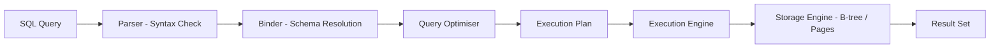
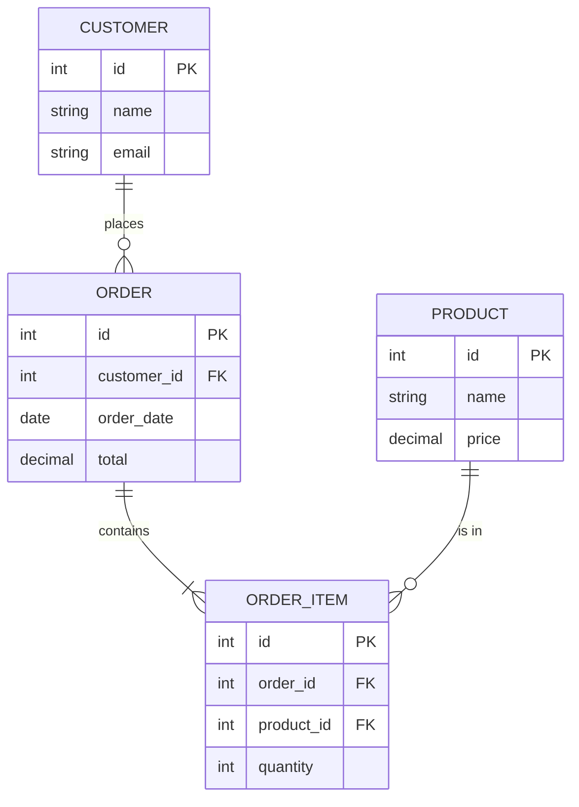

# SQL & Relational Databases

## Introduction
SQL (Structured Query Language) is the standard language for interacting with relational database management systems (RDBMS). Relational databases organise data into tables with rows and columns, enforcing relationships through foreign keys and constraints. They have been the backbone of data management for over 40 years and remain the default choice for transactional workloads, financial systems, and any domain requiring strong data integrity.

## Problem Statement
Applications need a standard, portable way to store, query, and manipulate structured data. Data must maintain integrity — invalid states should be impossible. Multiple users must be able to read and write concurrently without corrupting each other's work. SQL and relational databases solve all three problems.

## Why this exists
Before relational databases, data was stored in flat files or hierarchical databases, requiring application code to manage relationships, integrity, and concurrency. Edgar Codd's relational model (1970) and SQL provided a **declarative** approach — you describe *what* data you want, and the database figures out *how* to retrieve it efficiently.

## Real-world analogy
Think of a relational database as a well-organised filing cabinet:
- Each **drawer** is a **table** (e.g., Customers, Orders, Products).
- Each **folder** in a drawer is a **row** (one customer, one order).
- Each **label** on a folder is a **column** (name, email, order_date).
- **Cross-references** between folders are **foreign keys** (Order folder points to Customer folder).
- The **filing rules** are **constraints** (every order must have a valid customer).

## Definition
A **relational database** stores data in tables (relations) with predefined schemas. **SQL** is the declarative language used to create, query, update, and manage this data. Together, they provide ACID guarantees for transactional integrity.

### ACID Properties

| Property | Meaning | Example |
|----------|---------|---------|
| **Atomicity** | All operations in a transaction succeed or none do | Transfer: debit and credit both happen or neither |
| **Consistency** | Data moves from one valid state to another | Account balance never goes negative if constrained |
| **Isolation** | Concurrent transactions do not interfere | Two transfers to the same account produce correct totals |
| **Durability** | Committed data survives crashes | After commit, data persists even if server loses power |

## Key concepts
- **Tables and schemas:** Predefined structure with typed columns and constraints.
- **Primary key:** Unique identifier for each row.
- **Foreign key:** Reference to a row in another table, enforcing referential integrity.
- **Normalisation:** Organising data to reduce redundancy (1NF, 2NF, 3NF, BCNF).
- **Denormalisation:** Deliberately adding redundancy for read performance.
- **Joins:** Combining rows from multiple tables (INNER, LEFT, RIGHT, FULL, CROSS).
- **Indexes:** Data structures that speed up queries (B-tree, hash, composite).
- **Transactions:** Atomic units of work with ACID guarantees.
- **Query optimiser:** The engine that decides the best execution plan for a SQL query.
- **Views:** Virtual tables defined by SQL queries.
- **Stored procedures:** Server-side functions written in SQL or procedural extensions.

### Normalisation Forms

| Form | Rule | Example |
|------|------|---------|
| **1NF** | No repeating groups; atomic values | Split "phone1, phone2" into separate rows |
| **2NF** | 1NF + no partial dependencies | Move product_name to Products table |
| **3NF** | 2NF + no transitive dependencies | Move city_name to Cities table |
| **BCNF** | Every determinant is a candidate key | Handle edge cases in composite keys |

## Internal working
SQL queries are processed through a multi-stage pipeline by the database engine.

### Query Execution Pipeline



### Table Relationships



## Python implementation

### Bad implementation
Building SQL strings by concatenation — vulnerable to SQL injection.

```python
def build_query(table: str, column: str, value: str) -> str:
    """NEVER do this in production — SQL injection vulnerability."""
    return f"SELECT * FROM {table} WHERE {column} = '{value}'"

# An attacker can inject: value = "'; DROP TABLE users; --"
```

### Better implementation
Using parameterised queries with Python's `sqlite3` module.

```python
import sqlite3
from dataclasses import dataclass
from typing import Optional


@dataclass
class User:
    id: int
    name: str
    email: str


class UserRepository:
    """Safe, parameterised SQL queries with proper resource management."""

    def __init__(self, db_path: str = ":memory:"):
        self.conn = sqlite3.connect(db_path)
        self.conn.row_factory = sqlite3.Row
        self._create_table()

    def _create_table(self) -> None:
        self.conn.execute("""
            CREATE TABLE IF NOT EXISTS users (
                id INTEGER PRIMARY KEY AUTOINCREMENT,
                name TEXT NOT NULL,
                email TEXT UNIQUE NOT NULL
            )
        """)
        self.conn.commit()

    def insert(self, name: str, email: str) -> int:
        cursor = self.conn.execute(
            "INSERT INTO users (name, email) VALUES (?, ?)",
            (name, email),
        )
        self.conn.commit()
        return cursor.lastrowid

    def find_by_id(self, user_id: int) -> Optional[User]:
        row = self.conn.execute(
            "SELECT id, name, email FROM users WHERE id = ?",
            (user_id,),
        ).fetchone()
        if row:
            return User(id=row["id"], name=row["name"], email=row["email"])
        return None

    def find_by_email(self, email: str) -> Optional[User]:
        row = self.conn.execute(
            "SELECT id, name, email FROM users WHERE email = ?",
            (email,),
        ).fetchone()
        if row:
            return User(id=row["id"], name=row["name"], email=row["email"])
        return None
```

### Best implementation
A repository pattern with transaction support, connection pooling awareness, and query builder.

```python
import sqlite3
from contextlib import contextmanager
from dataclasses import dataclass
from typing import Optional, Generator


@dataclass
class User:
    id: int
    name: str
    email: str


class Database:
    """Database wrapper with transaction context manager."""

    def __init__(self, db_path: str = ":memory:"):
        self.conn = sqlite3.connect(db_path)
        self.conn.row_factory = sqlite3.Row
        self.conn.execute("PRAGMA journal_mode=WAL")
        self.conn.execute("PRAGMA foreign_keys=ON")

    @contextmanager
    def transaction(self) -> Generator[sqlite3.Cursor, None, None]:
        """ACID transaction with automatic rollback on failure."""
        cursor = self.conn.cursor()
        try:
            cursor.execute("BEGIN")
            yield cursor
            self.conn.commit()
        except Exception:
            self.conn.rollback()
            raise

    def close(self) -> None:
        self.conn.close()


class UserRepository:
    def __init__(self, db: Database):
        self.db = db
        self._migrate()

    def _migrate(self) -> None:
        with self.db.transaction() as cursor:
            cursor.execute("""
                CREATE TABLE IF NOT EXISTS users (
                    id INTEGER PRIMARY KEY AUTOINCREMENT,
                    name TEXT NOT NULL,
                    email TEXT UNIQUE NOT NULL,
                    created_at TIMESTAMP DEFAULT CURRENT_TIMESTAMP
                )
            """)
            cursor.execute("""
                CREATE INDEX IF NOT EXISTS idx_users_email ON users(email)
            """)

    def create(self, name: str, email: str) -> User:
        with self.db.transaction() as cursor:
            cursor.execute(
                "INSERT INTO users (name, email) VALUES (?, ?)",
                (name, email),
            )
            return User(id=cursor.lastrowid, name=name, email=email)

    def find_by_id(self, user_id: int) -> Optional[User]:
        row = self.db.conn.execute(
            "SELECT id, name, email FROM users WHERE id = ?",
            (user_id,),
        ).fetchone()
        return User(**dict(row)) if row else None

    def transfer_ownership(self, from_id: int, to_id: int, asset: str) -> bool:
        """Atomic transfer: demonstrates ACID transaction across multiple writes."""
        with self.db.transaction() as cursor:
            cursor.execute(
                "UPDATE assets SET owner_id = ? WHERE owner_id = ? AND name = ?",
                (to_id, from_id, asset),
            )
            cursor.execute(
                "INSERT INTO audit_log (action, from_id, to_id, asset) VALUES (?, ?, ?, ?)",
                ("transfer", from_id, to_id, asset),
            )
            return cursor.rowcount > 0
```

## Java implementation

```java
import java.sql.*;
import java.util.Optional;

record User(int id, String name, String email) {}

class UserRepository {
    private final Connection conn;

    UserRepository(String jdbcUrl) throws SQLException {
        this.conn = DriverManager.getConnection(jdbcUrl);
        conn.setAutoCommit(false);
        migrate();
    }

    private void migrate() throws SQLException {
        try (Statement stmt = conn.createStatement()) {
            stmt.execute("""
                CREATE TABLE IF NOT EXISTS users (
                    id INTEGER PRIMARY KEY AUTOINCREMENT,
                    name TEXT NOT NULL,
                    email TEXT UNIQUE NOT NULL
                )
            """);
            stmt.execute("CREATE INDEX IF NOT EXISTS idx_email ON users(email)");
            conn.commit();
        }
    }

    User create(String name, String email) throws SQLException {
        String sql = "INSERT INTO users (name, email) VALUES (?, ?)";
        try (PreparedStatement ps = conn.prepareStatement(sql,
                Statement.RETURN_GENERATED_KEYS)) {
            ps.setString(1, name);
            ps.setString(2, email);
            ps.executeUpdate();
            conn.commit();

            ResultSet keys = ps.getGeneratedKeys();
            keys.next();
            return new User(keys.getInt(1), name, email);
        } catch (SQLException e) {
            conn.rollback();
            throw e;
        }
    }

    Optional<User> findById(int id) throws SQLException {
        String sql = "SELECT id, name, email FROM users WHERE id = ?";
        try (PreparedStatement ps = conn.prepareStatement(sql)) {
            ps.setInt(1, id);
            ResultSet rs = ps.executeQuery();
            if (rs.next()) {
                return Optional.of(new User(
                    rs.getInt("id"),
                    rs.getString("name"),
                    rs.getString("email")
                ));
            }
            return Optional.empty();
        }
    }

    /**
     * Atomic bank transfer demonstrating ACID transactions.
     */
    boolean transfer(int fromAccount, int toAccount, double amount) throws SQLException {
        try {
            PreparedStatement debit = conn.prepareStatement(
                "UPDATE accounts SET balance = balance - ? WHERE id = ? AND balance >= ?");
            debit.setDouble(1, amount);
            debit.setInt(2, fromAccount);
            debit.setDouble(3, amount);

            if (debit.executeUpdate() == 0) {
                conn.rollback();
                return false; // Insufficient funds
            }

            PreparedStatement credit = conn.prepareStatement(
                "UPDATE accounts SET balance = balance + ? WHERE id = ?");
            credit.setDouble(1, amount);
            credit.setInt(2, toAccount);
            credit.executeUpdate();

            conn.commit();
            return true;
        } catch (SQLException e) {
            conn.rollback();
            throw e;
        }
    }
}
```

## Step-by-step explanation
1. The **bad example** builds SQL by concatenation, which is vulnerable to SQL injection and is never acceptable in production.
2. The **better example** uses parameterised queries — the database engine handles escaping, preventing injection attacks.
3. The **best example** adds transaction management with automatic rollback, index creation, and a repository pattern that cleanly separates data access from business logic.

## Multiple real-world examples
1. **PostgreSQL:** The most advanced open-source RDBMS. Used by Instagram, Uber, and Stripe. Supports JSONB columns, CTEs, window functions, and full-text search.
2. **MySQL / MariaDB:** The most widely deployed open-source RDBMS. Used by Facebook, Twitter, and YouTube. InnoDB engine provides ACID transactions.
3. **Oracle Database:** The enterprise standard for financial institutions and large corporations. Supports advanced partitioning, RAC (Real Application Clusters), and flashback queries.
4. **SQLite:** An embedded relational database used in every smartphone (Android, iOS), web browser, and countless IoT devices. No server required — the entire database is a single file.
5. **Amazon Aurora:** MySQL/PostgreSQL-compatible managed database on AWS. Separates compute and storage for better scalability. 5x throughput of standard MySQL.

## Pros
- **Strong consistency** through ACID transactions — essential for financial and critical data.
- **Standardised language** — SQL is portable across vendors (PostgreSQL, MySQL, Oracle, SQL Server).
- **Powerful querying** — JOINs, aggregations, CTEs, window functions, subqueries.
- **Data integrity** — foreign keys, constraints, and triggers enforce business rules in the database.
- **Mature ecosystem** — decades of tooling, monitoring, and best practices.

## Cons
- **Schema rigidity** — changing schemas requires migrations that can be complex and risky.
- **Scaling writes** is harder — horizontal scaling requires sharding, which breaks JOINs.
- **JOIN performance** degrades on very large tables or across shards.
- **Object-relational mismatch** — mapping objects to tables requires ORMs or manual mapping.
- **Vertical scaling limits** — single-node RDBMS has hardware ceiling.

## Interview questions

### Beginner
- **Q: What does SQL stand for, and what is it used for?**
  - **A:** Structured Query Language. It is used to create, query, update, and delete data in relational databases. It is declarative — you specify *what* you want, not *how* to get it.

- **Q: What is the difference between a primary key and a foreign key?**
  - **A:** A primary key uniquely identifies each row in a table. A foreign key is a column that references the primary key of another table, establishing a relationship between the two tables.

### Intermediate
- **Q: Explain the difference between INNER JOIN and LEFT JOIN.**
  - **A:** INNER JOIN returns only rows that have matching values in both tables. LEFT JOIN returns all rows from the left table and matching rows from the right table — unmatched rows get NULL values for right-table columns.

- **Q: What is normalisation, and why would you denormalise?**
  - **A:** Normalisation eliminates data redundancy by splitting data into related tables (1NF through BCNF). Denormalisation intentionally adds redundancy to improve read performance — useful for read-heavy workloads where JOINs are expensive.

### Senior
- **Q: How do indexes affect SQL query performance, and what are the trade-offs?**
  - **A:** Indexes (typically B-trees) allow the database to find rows without scanning the entire table — turning O(n) scans into O(log n) lookups. Trade-offs: indexes consume disk space, slow down INSERT/UPDATE/DELETE operations (because the index must be updated), and composite indexes only help queries that match the leading columns.

- **Q: Explain the different transaction isolation levels and their trade-offs.**
  - **A:** Read Uncommitted (fastest, dirty reads possible), Read Committed (no dirty reads, non-repeatable reads possible), Repeatable Read (no non-repeatable reads, phantom reads possible), Serializable (strictest, no anomalies but lowest concurrency). Higher isolation means fewer anomalies but more locking and lower throughput.

### Staff Engineer
- **Q: Compare SQL and NoSQL for a new e-commerce platform.**
  - **A:** Use SQL (PostgreSQL/Aurora) for orders, payments, and inventory — where ACID transactions are critical. Use NoSQL (DynamoDB/Elasticsearch) for product catalog browsing, search, and user sessions — where schema flexibility and read scalability matter. Use an event-driven architecture (Kafka) to synchronise between the two, maintaining eventual consistency for non-critical data.

- **Q: How would you migrate a large SQL database schema with zero downtime?**
  - **A:** Use expand-and-contract pattern: (1) Add new columns/tables without removing old ones, (2) Deploy application code that writes to both old and new schemas, (3) Backfill existing data, (4) Switch reads to new schema, (5) Remove old columns. Use online DDL tools like `pt-online-schema-change` (MySQL) or `pg_repack` (PostgreSQL) for lock-free table alterations.

## Common mistakes
- Selecting `SELECT *` in production queries — always specify needed columns.
- Building SQL by string concatenation — always use parameterised queries.
- Ignoring query execution plans (`EXPLAIN ANALYZE`) — slow queries often have missing indexes.
- Over-normalising to the point where every query requires 5+ JOINs.
- Not indexing foreign key columns — JOINs on unindexed foreign keys cause full table scans.

## Best practices
- Use parameterised queries to prevent SQL injection.
- Normalise data to 3NF, then denormalise selectively for read performance.
- Add indexes for columns used in WHERE, JOIN, and ORDER BY clauses.
- Keep transactions short to minimise lock contention.
- Use connection pooling (e.g., PgBouncer, HikariCP) to manage database connections efficiently.
- Monitor slow queries with `EXPLAIN ANALYZE` and query logs.

## When NOT to use
- Highly schema-less use cases with deeply nested, variable-structure data (use document stores).
- Workloads requiring massive horizontal write scaling without transactional needs (use NoSQL).
- Real-time analytics on petabyte-scale data (use columnar stores like ClickHouse or BigQuery).

## Comparison with similar concepts
- **NoSQL:** Trades schema rigidity for flexibility and horizontal scale. No JOINs, weaker consistency.
- **NewSQL:** Combines SQL interface with distributed horizontal scaling (e.g., CockroachDB, Spanner, TiDB).
- **Data warehouses:** SQL interface but optimised for analytical queries (OLAP) rather than transactions (OLTP).
- **Graph databases:** Better for highly connected data (social networks, recommendations) where SQL JOINs become impractical.

## Summary
SQL and relational databases remain the gold standard for structured data with strong consistency requirements. They provide ACID transactions, powerful querying through SQL, and decades of battle-tested tooling. Understanding normalisation, indexing, transaction isolation, and query optimisation is essential for system design interviews and production database management.

## Related topics
- [Transactions](../transactions)
- [Indexing](../indexing)
- [Sharding](../sharding)
- [NoSQL](../nosql)
- [Replication](../replication)
