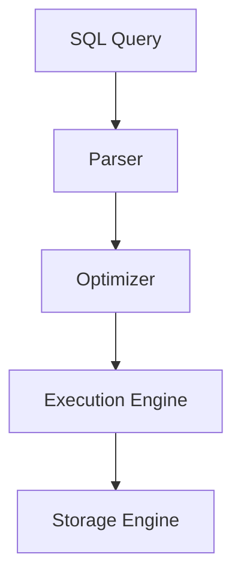

# SQL

## Introduction
SQL is a declarative language used to query and manipulate relational databases.

## Problem Statement
Applications need a standard way to express data operations across structured tabular data.

## Why this exists
SQL provides a portable, expressive syntax for querying, joining, aggregating, and updating relational data.

## Real-world analogy
SQL is like a librarian's query form: specify what data you want, and the database returns the matching records.

## Definition
SQL (Structured Query Language) is the standard language for interacting with relational database management systems.

## Key concepts
- **Tables and schemas**
- **SELECT, INSERT, UPDATE, DELETE**
- **Joins**
- **Transactions**
- **Indexes**

## Internal working
SQL queries are parsed, optimized, and executed by the database engine using query plans and access paths.

### Mermaid flowchart


## Python implementation

### Bad implementation
Building SQL strings manually without protection against injection.

```python
def build_query(table: str, column: str, value: str) -> str:
    return f"SELECT * FROM {table} WHERE {column} = '{value}'"
```

### Better implementation
Using parameterized queries with a SQL client.

```python
import sqlite3

connection = sqlite3.connect(':memory:')

cursor = connection.cursor()
cursor.execute('CREATE TABLE users (id INTEGER PRIMARY KEY, name TEXT)')

query = 'SELECT * FROM users WHERE name = ?'
cursor.execute(query, ('Alice',))
rows = cursor.fetchall()
```

### Best implementation
Using an ORM or query builder in combination with parameterized execution.

```python
from dataclasses import dataclass
from typing import Any
import sqlite3

@dataclass
class User:
    id: int
    name: str

class UserRepository:
    def __init__(self, connection: sqlite3.Connection):
        self.connection = connection

    def find_by_name(self, name: str) -> list[User]:
        cursor = self.connection.execute('SELECT id, name FROM users WHERE name = ?', (name,))
        return [User(id=row[0], name=row[1]) for row in cursor.fetchall()]
```

## Step-by-step explanation
1. SQL queries are expressed declaratively.
2. The database engine converts SQL into an execution plan.
3. The engine uses indexes and joins to return results efficiently.

## Multiple real-world examples
- OLTP applications use SQL for transactional consistency.
- Data warehouses use SQL for analytics and reporting.
- ORMs map SQL semantics to application objects.

## Pros
- Standardized across RDBMS vendors.
- Strong consistency and data integrity.
- Powerful expressive querying.

## Cons
- Can be less flexible for schema-less or nested data.
- Joins can be expensive for large datasets.
- Schema changes require careful migration.

## Interview Questions
### Beginner
- What does SQL stand for?
- Answer: Structured Query Language.

### Intermediate
- What is a JOIN?
- Answer: A SQL operation that combines rows from multiple tables.

### Senior
- How do indexes affect SQL query performance?
- Answer: Indexes enable faster lookups for WHERE clauses, joins, and orderings.

### Staff Engineer
- Compare SQL and NoSQL for a new e-commerce product catalog.
- Answer: Use SQL for transactional inventory and NoSQL for flexible, high-read catalog browsing with denormalized documents.

## Common mistakes
- Selecting `*` in production queries.
- Building SQL by concatenating strings.
- Ignoring query plans and execution costs.

## Best practices
- Use parameterized queries to avoid injection.
- Normalize data where it improves consistency.
- Add indexes for frequent query patterns.

## When NOT to use
- Highly schema-less use cases with deeply nested data.
- Workloads that require massive horizontal scale without transactional needs.

## Comparison with similar concepts
- **NoSQL:** trades schema rigidity for flexibility and scale.
- **Transactions:** SQL databases often support strong ACID semantics.
- **Sharding:** used when SQL databases need horizontal scaling.

## Summary
SQL remains a powerful foundation for structured data systems. It is well-suited for transactional applications and relational data integrity.

## Related topics
- [Transactions](../transactions)
- [Indexing](../indexing)
- [Sharding](../sharding)
- [NoSQL](../nosql)
