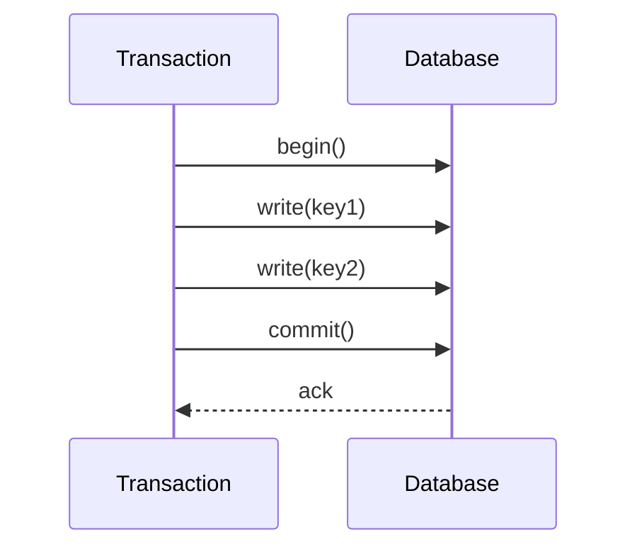

# Transactions

## Introduction
Transactions are a sequence of operations performed as a single logical unit that must either fully succeed or fully fail.

## Problem Statement
Without atomic operations, partial updates can leave data in inconsistent state.

## Why this exists
Transactions ensure consistency, isolation, and recoverability in systems that modify multiple pieces of state.

## Real-world analogy
A banking transfer either debits one account and credits another or it does nothing at all.

## Definition
A transaction is a unit of work that follows ACID properties: Atomicity, Consistency, Isolation, Durability.

## Key concepts
- **Atomicity**: all or nothing
- **Consistency**: valid state transitions
- **Isolation**: concurrent transactions do not interfere
- **Durability**: committed results survive failures
- **Two-phase commit**

## Internal working
Transactions use locks, write-ahead logs, and commit protocols to coordinate updates.

### Mermaid sequence diagram


## Python implementation

### Bad implementation
A set of updates without rollback.

```python
class BadTransaction:
    def __init__(self, store):
        self.store = store

    def execute(self, operations):
        for key, value in operations:
            self.store[key] = value
```

### Better implementation
A local rollback mechanism.

```python
class Transaction:
    def __init__(self, store):
        self.store = store
        self.backup = {}

    def execute(self, operations):
        for key, value in operations:
            self.backup[key] = self.store.get(key)
            self.store[key] = value

    def rollback(self):
        for key, value in self.backup.items():
            if value is None:
                self.store.pop(key, None)
            else:
                self.store[key] = value
```

### Best implementation
A transaction coordinator with commit and rollback.

```python
from dataclasses import dataclass
from enum import Enum
from typing import Any, Dict, List, Tuple

class TransactionState(Enum):
    ACTIVE = "active"
    COMMITTED = "committed"
    ABORTED = "aborted"

@dataclass
class Transaction:
    operations: List[Tuple[str, Any]]
    state: TransactionState = TransactionState.ACTIVE
    backup: Dict[str, Any] = None

class TransactionManager:
    def __init__(self, store: Dict[str, Any]):
        self.store = store

    def begin(self, operations: List[Tuple[str, Any]]) -> Transaction:
        return Transaction(operations=operations, backup={})

    def commit(self, tx: Transaction) -> bool:
        try:
            for key, value in tx.operations:
                tx.backup[key] = self.store.get(key)
                self.store[key] = value
            tx.state = TransactionState.COMMITTED
            return True
        except Exception:
            self.rollback(tx)
            return False

    def rollback(self, tx: Transaction) -> None:
        for key, value in tx.backup.items():
            if value is None:
                self.store.pop(key, None)
            else:
                self.store[key] = value
        tx.state = TransactionState.ABORTED
```

## Step-by-step explanation
1. Begin a transaction and isolate the operation set.
2. Perform writes while preserving previous state.
3. Commit to make changes durable, or rollback on failure.

## Multiple real-world examples
- Relational databases use ACID transactions.
- Distributed transactions use two-phase commit or sagas.
- Payment workflows require atomic transfers.

## Pros
- Prevents partial state updates.
- Makes complex operations predictable.
- Supports strong consistency guarantees.

## Cons
- Can reduce concurrency due to locking.
- May increase latency and coordination overhead.
- Distributed transactions are hard to scale.

## Interview Questions
### Beginner
- What are ACID properties?
- Answer: Atomicity, Consistency, Isolation, Durability.

### Intermediate
- When would you use a saga instead of a distributed transaction?
- Answer: When you need eventual consistency and want to avoid two-phase commit overhead.

### Senior
- How does isolation level affect transaction behavior?
- Answer: It determines the allowed visibility of concurrent changes and impacts phenomena like dirty reads.

### Staff Engineer
- Design a transaction model for a microservices payment platform.
- Answer: Use local transactions for each service and orchestrate with a saga or reliable messaging for cross-service consistency.

## Common mistakes
- Relying on serializable isolation for every workload.
- Ignoring deadlock handling.
- Using distributed transactions without evaluating alternatives.

## Best practices
- Keep transactions short and focused.
- Use optimistic concurrency when possible.
- Prefer eventual consistency for large distributed workflows.

## When NOT to use
- High-throughput analytics where ACID slows writes.
- Systems that can tolerate eventual consistency.

## Comparison with similar concepts
- **Two-phase commit:** a protocol for distributed transaction atomicity.
- **Sagas:** an eventual consistency alternative.
- **Replication:** transactions are still needed to update replicated state consistently.

## Summary
Transactions are the foundation of consistent data updates. The system must choose the right transaction model for performance, scale, and correctness.

## Related topics
- [CAP Theorem](../../fundamentals/cap-theorem)
- [Replication](../replication)
- [Partitioning](../partitioning)
- [Sharding](../sharding)
