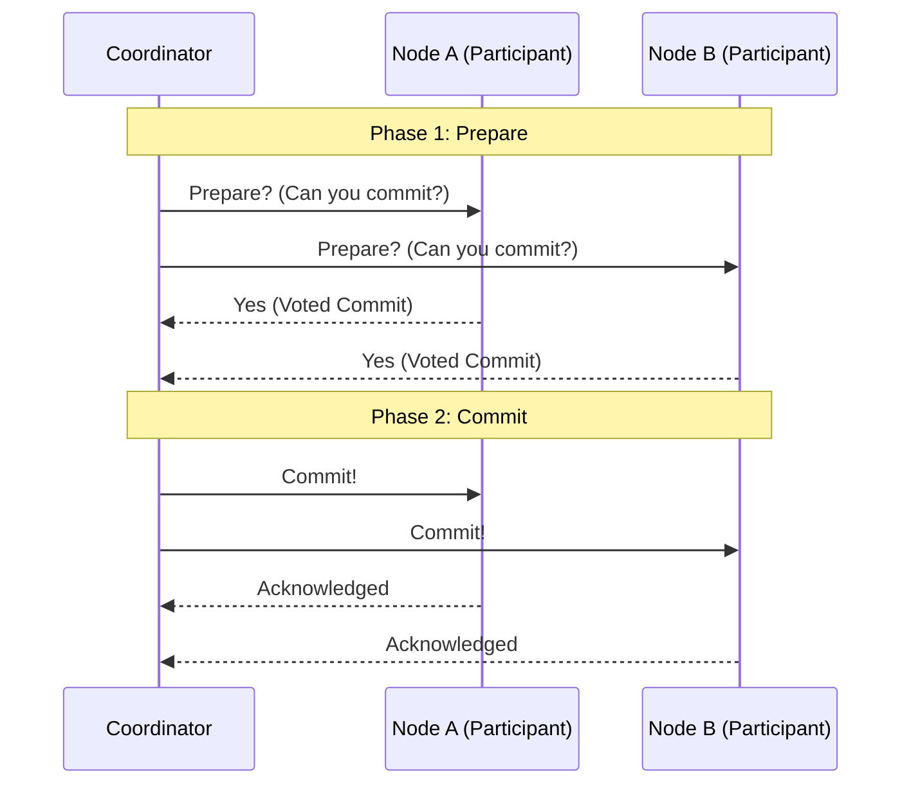

# Transactions

## Introduction
A database **transaction** is a sequence of read and write operations executed as a single, logical unit of work. To ensure database integrity, a transaction must either execute completely (commit) or have no effect at all (abort/rollback), even in the face of concurrent requests, network partitions, or system crashes.

---

## Problem Statement
In multi-user database environments:
1.  **Partial Failures:** If a system crashes halfway through transferring money between accounts (debited but not credited), data becomes corrupted.
2.  **Concurrency Anomalies:** If two users edit the same record simultaneously, one update may overwrite the other without their knowledge (Lost Update).
3.  **Read Inconsistencies:** If an analytics query runs while updates are being committed, it may calculate totals using half-old and half-new values, producing incorrect reports.

---

## Why This Exists
Transactions exist to abstract the complexity of concurrency control and fault recovery away from application developers. Instead of writing custom retry, locking, and rollback logic, developers can wrap operations in a transaction block. The database storage engine guarantees that the data remains consistent and durable.

---

## Real-world Analogy
Imagine buying a drink from a vending machine.
*   **The Workflow:** You insert money ($2), press the button for a soda, the machine dispenses the soda, and you take it.
*   **Atomicity:** If the soda bottle gets stuck on the coil, the machine returns your $2. It does not keep your money while giving you nothing.
*   **Consistency:** The machine maintains a correct inventory count and cash balance throughout the process.
*   **Isolation:** If another person tries to purchase a drink at the same time on a dual-dispenser machine, their process does not block or mix up your selection.
*   **Durability:** Once the soda drops, the transaction is finalized. Even if the machine loses power a second later, you still have the soda, and the machine keeps the record of cash inserted.

---

## Definition
A transaction is a boundary-defined group of database operations that guarantees **ACID** properties:
*   **Atomicity:** All operations in the transaction succeed, or all are rolled back.
*   **Consistency:** A transaction shifts the database from one valid state (respecting all schema constraints, triggers, and foreign keys) to another.
*   **Isolation:** The execution of concurrent transactions yields the same database state as if they had run sequentially.
*   **Durability:** Once committed, changes are written to non-volatile storage (disk/SSD) and will survive subsequent system crashes.

---

## Key Concepts

### 1. Concurrency Anomalies (Phenomena)
*   **Dirty Read:** Transaction A reads data modified by Transaction B that has *not yet been committed*. If B aborts, A has read invalid data.
*   **Non-Repeatable Read (Fuzzy Read):** Transaction A reads a row. Transaction B updates the row and commits. Transaction A re-reads the row and finds different values.
*   **Phantom Read:** Transaction A executes a range query (e.g., `WHERE age > 30`). Transaction B inserts a new row matching the filter and commits. Transaction A re-runs the query and sees new "phantom" rows.
*   **Write Skew:** Two transactions read overlapping data sets, make decisions based on what they read, and perform writes that violate a business rule. Example: Two doctors are on call. Both try to log off concurrently. The rule is "at least one doctor must be on call." Both see that two are active, both log off, leaving zero doctors on call.

### 2. Transaction Isolation Levels
ANSI SQL defines four isolation levels to balance consistency against concurrency:

| Isolation Level | Dirty Reads | Non-Repeatable Reads | Phantom Reads | Write Skew | Performance |
| :--- | :---: | :---: | :---: | :---: | :---: |
| **Read Uncommitted** | Allowed | Allowed | Allowed | Allowed | Highest |
| **Read Committed** | Prevented | Allowed | Allowed | Allowed | High |
| **Repeatable Read** | Prevented | Prevented | Allowed | Allowed | Medium |
| **Serializable** | Prevented | Prevented | Prevented | Prevented | Lowest |

### 3. Concurrency Control Mechanisms
*   **Two-Phase Locking (2PL):** A pessimistic lock-based protocol.
    *   *Growing Phase:* Transaction acquires locks but cannot release any.
    *   *Shrinking Phase:* Transaction releases locks but cannot acquire new ones.
*   **MVCC (Multi-Version Concurrency Control):** An optimistic protocol where reads do not block writes, and writes do not block reads. Each write creates a new version of the row with a timestamp/version ID. Readers read a consistent snapshot of the data matching their start timestamp.

### 4. Distributed Transactions
When a transaction spans multiple database nodes:
*   **Two-Phase Commit (2PC):** A blocking protocol. A coordinator asks participants to prepare. If all agree, the coordinator instructs all to commit. If one aborts, all abort.
*   **Saga Pattern:** A non-blocking, eventually consistent alternative. Breaks a transaction into a sequence of local transactions. If one step fails, the coordinator executes **compensating transactions** in reverse order to undo changes.

---

## Internal Working & Protocols

### Two-Phase Commit (2PC) Flow


---

## Java Implementation: Simplified MVCC Storage Engine

The following code simulates an MVCC-based storage engine where readers get a consistent snapshot of the data, and writes detect conflict using optimistic concurrency control.

```java
import java.util.*;
import java.util.concurrent.atomic.AtomicLong;

// Represents a versioned record
class VersionedRecord {
    final long versionId;
    final String value;

    public VersionedRecord(long versionId, String value) {
        this.versionId = versionId;
        this.value = value;
    }
}

// MVCC Transaction
class MVCCTransaction {
    final long readTxId;
    final Map<String, String> writeBuffer = new HashMap<>();

    public MVCCTransaction(long txId) {
        this.readTxId = txId;
    }
}

// MVCC Database Engine
class MVCCDatabase {
    private final AtomicLong txCounter = new AtomicLong(0);
    // Maps Key -> List of versions sorted by version ID descending
    private final Map<String, List<VersionedRecord>> store = new HashMap<>();

    public synchronized MVCCTransaction begin() {
        return new MVCCTransaction(txCounter.incrementAndGet());
    }

    public synchronized String read(MVCCTransaction tx, String key) {
        // Read local write buffer first
        if (tx.writeBuffer.containsKey(key)) {
            return tx.writeBuffer.get(key);
        }

        List<VersionedRecord> versions = store.get(key);
        if (versions == null || versions.isEmpty()) {
            return null;
        }

        // Return the latest version that is <= the transaction's read timestamp
        for (VersionedRecord record : versions) {
            if (record.versionId <= tx.readTxId) {
                return record.value;
            }
        }
        return null; // No version was committed before this transaction started
    }

    public void write(MVCCTransaction tx, String key, String value) {
        tx.writeBuffer.put(key, value);
    }

    public synchronized boolean commit(MVCCTransaction tx) {
        long commitTxId = txCounter.incrementAndGet();

        // Validate conflicts: Check if any key we wrote was modified after our readTxId
        for (String key : tx.writeBuffer.keySet()) {
            List<VersionedRecord> versions = store.get(key);
            if (versions != null && !versions.isEmpty()) {
                long latestVersion = versions.get(0).versionId;
                if (latestVersion > tx.readTxId) {
                    System.out.println("Write conflict detected on key: " + key + ". Aborting Tx: " + tx.readTxId);
                    return false; // Conflict! Abort transaction
                }
            }
        }

        // Apply writes
        for (Map.Entry<String, String> entry : tx.writeBuffer.entrySet()) {
            List<VersionedRecord> versions = store.computeIfAbsent(entry.getKey(), k -> new ArrayList<>());
            // Add new version at index 0 (descending order)
            versions.add(0, new VersionedRecord(commitTxId, entry.getValue()));
        }

        System.out.println("Transaction " + tx.readTxId + " committed successfully at version " + commitTxId);
        return true;
    }
}
```

---

## Step-by-Step Explanation: MVCC Read-Write Flow
1.  **Transaction Starts:** An application begins a transaction (`tx1`). The database allocates it a read timestamp (`TxID = 100`).
2.  **Consistent Read:** `tx1` queries `SELECT balance FROM accounts WHERE id = 1`. The database engine scans the versions of account 1 and returns the latest version committed *before or at* `TxID = 100`.
3.  **Concurrent Update:** Another transaction `tx2` (`TxID = 101`) starts, modifies account 1's balance to `$150`, and commits.
4.  **Repeatable Read Guarantee:** `tx1` queries the balance again. Because it reads versions $\le 100$, it still sees the old balance (e.g., `$100`), ignoring the update committed at `101`.
5.  **Write Conflict & Commit:** If `tx1` tries to update account 1, the engine detects that the latest version (`101`) is greater than `tx1`'s read version (`100`). The engine aborts `tx1` to prevent a lost update.

---

## Multiple Real-world Examples

1.  **PostgreSQL MVCC:** PostgreSQL does not overwrite data during updates. An `UPDATE` operation writes a new version of the row (tuple) to disk. The vacuum process eventually reclaims dead tuples once no active transaction can see them.
2.  **Spring Boot (`@Transactional`):** Manages transaction boundaries declaratively. Under the hood, it uses an AOP interceptor to bind database connections to the current thread and invoke commit/rollback on completion.
3.  **Distributed Sagas (Uber/Microservices):** A booking workflow: 1) Reserve car (success), 2) Reserve hotel (success), 3) Reserve flight (fails). The saga coordinator triggers compensating APIs to cancel the hotel and car bookings.
4.  **Bitcoin UTXO Model:** Bitcoin transactions are non-interactive sets of Unspent Transaction Outputs (UTXOs). Atomicity is enforced because miners reject any block containing double-spend inputs.

---

## Pros & Cons

### Pros
*   **Data Integrity:** Guarantees that system failures do not result in partial writes or inconsistent states.
*   **Concurrent Access:** MVCC enables highly concurrent workloads where read operations do not block write operations.
*   **Error Recovery:** Simplifies application error handling through rollback mechanisms.

### Cons
*   **Performance Overhead:** Writing to WAL logs, managing locks, and maintaining row versions increases query latency.
*   **Scalability Bottlenecks:** Distributed transactions require synchronization across network nodes, which degrades system throughput.
*   **Storage Bloat:** MVCC systems require regular cleaning/vacuuming to delete old row versions, consuming I/O cycles.

---

## Interview Questions

### Beginner
*   **Q:** What does ACID stand for? Explain each term.
*   **A:** 
    *   **Atomicity:** All operations in the group must succeed or fail together.
    *   **Consistency:** Validates that data follows schema constraints and business rules.
    *   **Isolation:** Concurrent transactions must execute without interfering with one another.
    *   **Durability:** Committed data is written to persistent storage and survives power outages.

### Intermediate
*   **Q:** What is MVCC (Multi-Version Concurrency Control)?
*   **A:** MVCC is a concurrency control method where the database maintains multiple versions of a single record. Instead of locking data for reads, readers look at a snapshot of the data as of a certain point in time, allowing concurrent reads and writes to happen without blocking.

### Senior
*   **Q:** How does a Write-Ahead Log (WAL) ensure durability and atomicity in the event of an abrupt power failure?
*   **A:** Before modifying a database page in memory, the engine writes the intended change to a sequential, append-only log on disk (WAL). If the system crashes, the engine uses the WAL upon startup to perform:
    1.  **Redo (Roll-Forward):** Apply committed changes that were in memory but not yet written to the database pages on disk.
    2.  **Undo (Rollback):** Revert changes from uncommitted transactions that made it to disk.

### Staff Engineer
*   **Q:** In a microservices architecture, how do you choose between the Two-Phase Commit (2PC) protocol and the Saga Pattern? What are the architectural trade-offs?
*   **A:** 2PC provides strong, immediate consistency across services but is blocking and susceptible to single points of failure, network delays, and deadlocks. It requires resources to lock until completion, limiting scale. Sagas trade immediate consistency for high availability and throughput by using eventual consistency. They use local transactions and compensating actions to handle failures. Sagas are preferred for large-scale microservices, while 2PC is reserved for critical, low-throughput systems where eventual consistency is unacceptable.

---

## Common Mistakes
*   **Keeping Transactions Open Too Long:** Doing network calls (e.g., calling an external payment API) inside a database transaction block. This holds database connections and locks open, exhausting connection pools.
*   **Assuming Read Committed Prevents Non-Repeatable Reads:** Relying on Read Committed when executing reports that run the same query multiple times and expect identical results.
*   **Overlooking Deadlocks:** Forgetting to ensure that concurrent transactions lock resource tables in the same order.

---

## Best Practices
*   **Keep Transactions Small:** Read only the data necessary and execute writes quickly to minimize lock durations.
*   **Avoid External I/O:** Perform API calls, file writes, and long computations outside the database transaction boundary.
*   **Utilize Optimistic Locking:** For high-contention systems, use version numbers on records (`WHERE version = :current_version`) instead of exclusive write locks.

---

## When NOT to Use
*   **High-Volume Logging / Analytics:** Real-time logging or clickstream ingestion where high throughput is required, and losing a few records is acceptable.
*   **Idempotent Eventual Consistency:** Systems where operations are naturally idempotent and can be safely retried without transaction state tracking.

---

## Comparison with Similar Concepts

*   **ACID vs. BASE:** ACID focuses on strong consistency and safety (relational DBs). BASE (Basically Available, Soft state, Eventual consistency) focuses on high availability and scaling (NoSQL).
*   **2PC vs. Saga:** 2PC guarantees atomicity instantly through locks and coordination. Sagas guarantee eventual consistency through sequential local transactions and compensations.

---

## Summary
Transactions are a cornerstone of reliable software architecture. Understanding the trade-offs of different isolation levels, concurrency mechanisms (such as MVCC), and distributed protocols (like Sagas) is essential for designing resilient database systems and microservices.

---

## Related Topics
- [CAP Theorem](../../fundamentals/cap-theorem)
- [Replication](../replication)
- [Partitioning](../partitioning)
- [Sharding](../sharding)
- [SQL](../sql)
- [NoSQL](../nosql)
