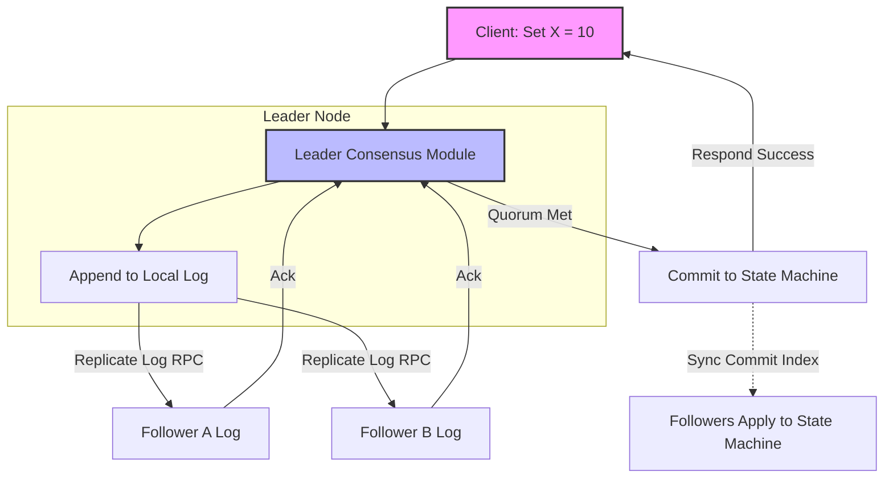

# Consensus

## Introduction
In distributed systems, **Consensus** is the process of resolving agreement among a set of independent, unreliable computing nodes on a single data value, system state, or sequence of actions. Achieving consensus guarantees that even if some nodes crash or experience network delays, the remaining nodes continue to function and maintain a unified, correct view of the system.

---

## Problem Statement
In a distributed network:
1.  **Asynchronous Networks:** Messages can be delayed, reordered, or lost indefinitely. It is impossible to distinguish between a node that has crashed and one that is simply processing slowly.
2.  **Node Failures:** Nodes can crash at any point, including mid-transaction while proposing a state change.
3.  **The FLP Impossibility Theorem:** Proven by Fischer, Lynch, and Paterson (1985), this theorem states that *in a fully asynchronous network, no deterministic consensus protocol can guarantee both safety and liveness if even a single node is allowed to fail unannounced.* 

---

## Why This Exists
Consensus is the core foundation of **Replicated State Machines (RSM)**. If multiple database replicas execute the exact same sequence of commands starting from the same initial state, they are guaranteed to produce the exact same final database state. Consensus modules orchestrate this command sequence, ensuring that all healthy replicas agree on the exact index of every log command, enabling fault-tolerant databases (like etcd, CockroachDB, and Google Spanner).

---

## Real-world Analogy
Imagine a corporate board of directors voting on a merger proposal:
*   **The Proposer:** The CEO presents the proposal.
*   **The Consensus Protocol:** To prevent misunderstandings, the board holds a formal vote.
*   **Crash Failure:** A board member gets stuck in traffic (Node crash) or their phone line drops. As long as a strict majority of board members are present (Quorum), they can vote and pass the resolution.
*   **Byzantine Failure:** A board member acts maliciously, sending false votes or telling the CEO they voted "Yes" while telling the secretary they voted "No". This requires a Byzantine Fault Tolerant (BFT) protocol to resolve.

---

## Definition
**Consensus** is the execution of a protocol that satisfies three properties:
*   **Agreement:** Every non-faulty node must decide on the exact same value.
*   **Validity:** The decided value must have been proposed by at least one node.
*   **Termination:** All non-faulty nodes eventually reach a decision.

---

## Key Concepts

### 1. Safety vs. Liveness
*   **Safety (Correctness):** Nothing bad happens. The protocol never allows nodes to commit two different values for the same slot (prevents split-brain). Consensus algorithms prioritize safety above all else.
*   **Liveness (Progress):** Something good eventually happens. The protocol ensures that nodes eventually make progress and reach a decision, rather than getting stuck in infinite voting loops.

### 2. CFT vs. BFT Protocols
*   **Crash-Fault Tolerant (CFT):** Assumes nodes are honest but can fail by crashing or dropping messages (e.g., Raft, Paxos). CFT protocols can tolerate up to $F$ failures with a cluster size of:
    $$N = 2F + 1$$
*   **Byzantine Fault Tolerant (BFT):** Assumes nodes can be malicious, collude, or send conflicting messages (e.g., PBFT, Tendermint). BFT protocols require a larger cluster size to tolerate $F$ failures:
    $$N = 3F + 1$$

### 3. Replicated State Machines (RSM)
Most consensus algorithms are implemented as an RSM.

```
[ Clients ] ---> [ Consensus Module ] ---> [ Commit Log ] ---> [ State Machine ]
```

---

## Internal Working: Replicated State Machine Workflow



---

## Java Implementation

The following Java code simulates a simplified **Replicated State Machine Consensus Module**. It proposed log entries, gathers quorum votes from peers, and commits them to the state machine only when a majority is reached.

```java
import java.util.*;
import java.util.concurrent.ConcurrentHashMap;

class LogEntry {
    final int index;
    final String command;

    public LogEntry(int index, String command) {
        this.index = index;
        this.command = command;
    }
}

class ReplicaNode {
    final String id;
    final List<LogEntry> log = new ArrayList<>();
    final Map<String, String> stateMachine = new ConcurrentHashMap<>();
    int commitIndex = -1;
    boolean isHealthy = true;

    public ReplicaNode(String id) {
        this.id = id;
    }

    public boolean appendEntry(LogEntry entry) {
        if (!isHealthy) return false;
        // In real Raft, we validate previous index/term matches.
        // For simplicity, we just append if index matches sequential order.
        if (entry.index == log.size()) {
            log.add(entry);
            return true;
        }
        return false;
    }

    public void commit(int index) {
        if (index > commitIndex && index < log.size()) {
            LogEntry entry = log.get(index);
            // Apply command to state machine (e.g. "x=10")
            String[] parts = entry.command.split("=");
            if (parts.length == 2) {
                stateMachine.put(parts[0].trim(), parts[1].trim());
            }
            commitIndex = index;
            System.out.println("Node " + id + " committed index " + index + ": " + entry.command);
        }
    }
}

public class ConsensusManager {
    private final List<ReplicaNode> cluster = new ArrayList<>();
    private final int quorum;
    private int nextIndex = 0;

    public ConsensusManager(int nodeCount) {
        this.quorum = (nodeCount / 2) + 1;
        for (int i = 0; i < nodeCount; i++) {
            cluster.add(new ReplicaNode("Node-" + i));
        }
    }

    public void simulateNodeFailure(String nodeId, boolean isHealthy) {
        for (ReplicaNode node : cluster) {
            if (node.id.equals(nodeId)) {
                node.isHealthy = isHealthy;
                System.out.println(nodeId + " health status updated to: " + isHealthy);
            }
        }
    }

    // ==========================================
    // PROPOSE VALUE: Must reach Quorum to Commit
    // ==========================================
    public boolean propose(String command) {
        LogEntry entry = new LogEntry(nextIndex, command);
        System.out.println("\nProposing command: " + command + " at index: " + nextIndex);

        int acks = 0;
        // 1. Replicate to all healthy nodes
        for (ReplicaNode node : cluster) {
            if (node.appendEntry(entry)) {
                acks++;
            }
        }

        // 2. Validate Quorum
        if (acks >= quorum) {
            System.out.println("Quorum met (" + acks + "/" + cluster.size() + " nodes). Committing...");
            
            // 3. Commit locally on all accepting nodes
            for (ReplicaNode node : cluster) {
                node.commit(entry.index);
            }
            nextIndex++;
            return true;
        } else {
            System.err.println("Proposal failed: Quorum not met (Only " + acks + " ACKs)");
            return false;
        }
    }

    public String getValue(String nodeId, String key) {
        for (ReplicaNode node : cluster) {
            if (node.id.equals(nodeId)) {
                return node.stateMachine.get(key);
            }
        }
        return null;
    }
}
```

---

## Step-by-Step Explanation: The Proposal & Commit Pipeline
Using the Java implementation above with a 5-node cluster (Quorum = 3):

1.  **Client Proposal:** The client proposes `propose("x=42")`.
2.  **Leader Append:** The leader generates `LogEntry(index=0, command="x=42")` and appends it locally.
3.  **Broadcast:** The leader sends `appendEntry` RPCs to all followers.
4.  **Acknowledgment (ACKs):**
    *   Node 1, Node 2, and Node 3 are healthy and return `true` (ACK).
    *   Node 4 is offline and does not respond.
5.  **Quorum Check:** The coordinator counts 4 ACKs (including the leader). Since $4 \ge 3$ (Quorum), safety is guaranteed.
6.  **Commit:** The leader executes the command on its local state machine (writing `{"x": "42"}`) and instructs followers to do the same. The change is now immutable.

---

## Multiple Real-world Examples

1.  **etcd (Kubernetes Metadata Store):** etcd is a distributed key-value store that uses the **Raft** consensus algorithm. Kubernetes master nodes read and write cluster states (pod counts, configs) to etcd, ensuring all master controllers see a consistent view of the cluster.
2.  **Google Spanner:** A globally distributed database that implements **Multi-Paxos** consensus groups for each data partition (directory) to replicate mutations. It couples Paxos with GPS and atomic clocks (TrueTime) to achieve external consistency.
3.  **ZooKeeper (Apache Kafka Metadata):** ZooKeeper uses the **Zab (ZooKeeper Atomic Broadcast)** consensus protocol to coordinate cluster configuration, leader elections, and node status.

---

## Pros & Cons

### Pros
*   **Strong Consistency:** Eliminates data drift across replicas. All nodes execute updates in the exact same logical order.
*   **Fault Tolerance:** The system remains online and processes writes as long as a majority of nodes ($N/2 + 1$) are operational.
*   **Auto-Healing:** Nodes that recover after a crash automatically sync and catch up with the leader's committed logs.

### Cons
*   **Write Latency:** Every write requires a round-trip network handshake with a majority of nodes before it can be committed.
*   **Availability Trade-off (CAP Theorem):** If a network partition occurs and the majority of nodes are offline, the cluster blocks all writes to preserve safety, sacrificing availability.
*   **Operational Complexity:** Designing, debugging, and maintaining consensus engines requires specialized engineering and complex state tracking.

---

## Interview Questions

### Beginner
*   **Q:** What is the FLP Impossibility Theorem?
*   **A:** Proven by Fischer, Lynch, and Paterson, it states that in a fully asynchronous network, no deterministic consensus protocol can guarantee both safety (correctness) and liveness (making progress) if even a single node is allowed to fail unannounced.

### Intermediate
*   **Q:** What is the difference between Safety and Liveness in consensus protocols?
*   **A:** Safety guarantees that "nothing bad happens"—meaning the system will never commit two different values for the same slot. Liveness guarantees that "something good eventually happens"—meaning the system will make progress and not get stuck in infinite voting loops.

### Senior
*   **Q:** Why does a 5-node cluster tolerate the same number of crash failures as a 6-node cluster?
*   **A:** A 5-node cluster needs a quorum of 3 ($5/2 + 1$). It can tolerate $5 - 3 = 2$ failures. A 6-node cluster needs a quorum of 4 ($6/2 + 1$). It can tolerate $6 - 4 = 2$ failures. Adding the 6th node increases network message traffic and latency without increasing fault tolerance. Thus, consensus clusters should always contain an odd number of nodes.

### Staff Engineer
*   **Q:** Discuss the differences between Crash-Fault Tolerant (CFT) and Byzantine Fault Tolerant (BFT) consensus. When would you choose one over the other?
*   **A:** CFT protocols (like Raft or Paxos) assume nodes are trusted but can fail by crashing or dropping packets. They are optimized for private networks where all servers are owned by the same organization (e.g., inside an AWS account or enterprise data center). BFT protocols (like PBFT, Raft-BFT, or PoW) assume nodes can be actively malicious, collude, or send conflicting votes. They are designed for public or untrusted networks (e.g., decentralized blockchains or cross-organization ledgers). CFT requires $2F + 1$ nodes, while BFT requires at least $3F + 1$ nodes to tolerate $F$ failures.

---

## Common Mistakes
*   **Using Even Node Counts:** Building clusters with 4 or 6 nodes, which increases latency without improving fault tolerance.
*   **Implementing Custom Raft/Paxos:** Writing custom consensus engines in production rather than using established, thoroughly tested libraries (like etcd, HashiCorp Raft, or JGroups).
*   **Assuming Consensus is Eventual Consistency:** Treating consensus engines as eventually consistent databases. Consensus guarantees immediate linearizable consistency.

---

## Best Practices
*   **Select Odd Node Counts:** Always deploy clusters with 3, 5, or 7 nodes.
*   **Keep State Machines Deterministic:** Replicated state machine commands must be deterministic. If a command is `Set X = Random()`, the replicas will diverge.
*   **Monitor Disk Fsync Speed:** Consensus writes logs to disk before acknowledging votes. Slow disk write I/O directly degrades the write throughput of the entire cluster.

---

## When NOT to Use
*   **High-Volume Write Ingestion:** Time-series databases, log aggregations, or analytics where writing millions of records per second requires partition partitioning without coordination overhead.
*   **Stateless Web APIs:** Systems that do not maintain critical shared metadata do not need consensus.

---

## Comparison with Similar Concepts

*   **Raft vs. Paxos:** Raft is designed for understandability, using a strong leader model and sequential log appends. Paxos is symmetric (any node can propose) and more abstract, making it harder to implement but highly flexible.
*   **Consensus vs. Two-Phase Commit (2PC):** 2PC is a blocking coordination protocol where *all* nodes must agree to commit. If one node is down, the transaction aborts. Consensus only requires a *majority* ($N/2 + 1$) to agree, providing high availability.

---

## Summary
Distributed consensus is the cornerstone of reliable cloud computing, enabling replicated state machines to maintain consistent state despite node and network failures. By understanding the FLP theorem, quorums, CFT vs. BFT trade-offs, and RSM structures, designers can build resilient distributed databases and metadata registries.

---

## Related Topics
- [Leader Election](../leader-election)
- [Raft](../raft)
- [Paxos](../paxos)
- [Distributed Locking](../distributed-locking)
