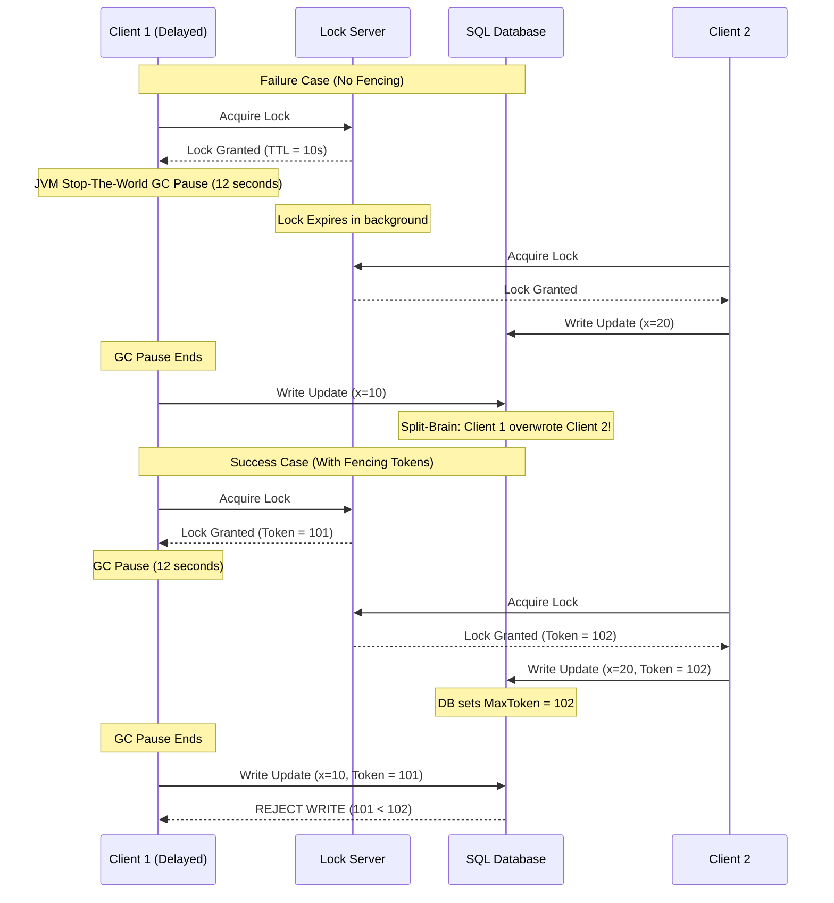

# Distributed Locking

## Introduction
In distributed systems, a **Distributed Lock** is a synchronization mechanism used to coordinate access to a shared resource (such as a file, a database row, or an external API) across multiple independent application processes running on different machines. While single-process applications use local mutexes or semaphores in RAM, distributed systems require a remote coordinator (like Redis, ZooKeeper, or etcd) to enforce cluster-wide mutual exclusion.

---

## Problem Statement
Coordinating access to shared resources across independent servers introduces complex failure modes:
1.  **Concurrency Conflicts:** Two instances of an invoice service check if a payment of $100 has been processed. Both see `false`, both charge the card, causing a double-charge.
2.  **The GC Pause / Stop-The-World Race Condition:** A server acquires a lock, starts processing, but then enters a long Garbage Collection (GC) pause. During the pause, the lock's Time-To-Live (TTL) expires. A second server acquires the lock and writes to the database. When the first server wakes up, it resumes its write operation, blindly overwriting the second server's edits and corrupting data.
3.  **Clock Drift:** If the locking algorithm relies on system wall-clock times across different nodes, minor clock desynchronizations (clock drift) can cause locks to expire early or overlap.

---

## Why This Exists
Distributed locks exist to prevent data corruption by enforcing **Mutual Exclusion** across network boundaries. They fall into two categories depending on the system's needs (CAP Theorem):
*   **AP Locks (Speed-Focused):** Built on key-value stores like Redis. Fast and highly available, but susceptible to minor consistency leaks during node failovers or network drops.
*   **CP Locks (Safety-Focused):** Built on consensus engines like ZooKeeper or etcd. Slower, but mathematically guarantee that a lock is held by exactly one node even during network partitions.

---

## Real-world Analogy
Imagine a shared dressing room in a clothing store:
*   **Without a Lock (Race Condition):** Two customers walk up, see the door closed, but both push the door open at the same time, causing embarrassment.
*   **Local Lock:** A lock on the door. It only works if both customers are trying to enter the *same* dressing room.
*   **Distributed Lock (The Key):** The store has 3 dressing rooms. At the front desk, there is a single wooden key for "Room 1". To enter Room 1, you must walk to the desk, take the key, use the room, and return the key.
*   **GC Pause (Divergent Lease):** A customer takes the key, walks to the room, but suddenly falls asleep in the hallway (GC Pause). The manager assumes the key is lost, makes a new one, and hands it to a second customer. The first customer wakes up, walks in, and walks into the occupied room.

---

## Definition
**Distributed Locking** is a protocol that ensures mutual exclusion for a resource across a network by managing lease grants, automatic timeouts, ownership verification, and optimistic write fencing.

---

## Key Concepts

### 1. Fencing Tokens
To prevent a delayed node (due to GC pauses or network lag) from writing stale data after its lock lease has expired, systems use **Fencing Tokens**.
1.  When a node acquires a lock, the lock manager returns a strictly increasing token number (e.g., token = 35).
2.  When the node writes to the database, it includes this token.
3.  The database records the highest token it has processed. If a delayed node tries to write with an older token (e.g., token = 34), the database rejects the write, protecting state integrity.

```
Client 1: [Acquires Lock] -> Gets Token: 34
Client 1: (Pauses / GC Stop-the-world) ... Lock Expires
Client 2: [Acquires Lock] -> Gets Token: 35
Client 2: [Writes to DB]  -> DB updates Highest Token = 35
Client 1: (Resumes) -> [Writes to DB with Token 34] -> DB REJECTS (34 < 35)
```

### 2. ZooKeeper Ephemeral Nodes & Recipes
ZooKeeper provides a highly reliable CP lock implementation:
*   **Ephemeral Nodes:** A client creates a node `/locks/lock_1`. If the client crashes, ZooKeeper detects the lost heartbeat session and automatically deletes the node, releasing the lock.
*   **Watcher API:** Waiting clients do not need to poll ZooKeeper in a loop. They create a temporary node and set a "Watch" (listener) on the preceding node. When the lock is deleted, ZooKeeper notifies the next client directly.

### 3. Redlock Algorithm
Proposed by Redis's creator, Redlock attempts to build a reliable lock on top of 5 independent Redis master nodes:
1.  The client notes the start time.
2.  It attempts to acquire the lock on all 5 nodes sequentially using the same key and a unique random value.
3.  If the client acquires the lock on a majority (at least 3) of nodes, and the time elapsed is less than the lock validity time, the lock is acquired.
4.  *Criticism:* Martin Kleppmann famously critiqued Redlock, proving that under clock drift or GC pauses, Redlock fails to guarantee mutual exclusion. For strict safety, a consensus-based lock (ZooKeeper/etcd) is preferred.

---

## Internal Working: GC Pause Race Condition vs. Fencing Token Resolution



---

## Java Implementation

The following Java code simulates a distributed lock manager that enforces **Fencing Tokens**. It demonstrates how the database rejects writes from a client whose lock lease expired during a simulated Garbage Collection pause.

```java
import java.util.Map;
import java.util.concurrent.ConcurrentHashMap;
import java.util.concurrent.atomic.AtomicInteger;

// Simulated Distributed Lock Manager (AP/CP Proxy)
class DistributedLockManager {
    private final AtomicInteger tokenGenerator = new AtomicInteger(100);
    private String currentLockHolder = null;
    private int currentToken = -1;
    private long leaseExpirationTime = 0;

    public synchronized LockGrant acquireLock(String clientId, long leaseDurationMs) {
        long now = System.currentTimeMillis();
        // Grant lock if no holder exists or lease expired
        if (currentLockHolder == null || now > leaseExpirationTime) {
            currentLockHolder = clientId;
            currentToken = tokenGenerator.incrementAndGet();
            leaseExpirationTime = now + leaseDurationMs;
            System.out.println("Lock granted to [" + clientId + "] with Fencing Token: " + currentToken);
            return new LockGrant(currentToken, leaseExpirationTime);
        }
        return null; // Lock busy
    }

    public synchronized void releaseLock(String clientId, int token) {
        if (clientId.equals(currentLockHolder) && token == currentToken) {
            System.out.println("Lock released by [" + clientId + "]");
            currentLockHolder = null;
            currentToken = -1;
        }
    }
}

class LockGrant {
    final int fencingToken;
    final long expirationTime;

    public LockGrant(int fencingToken, long expirationTime) {
        this.fencingToken = fencingToken;
        this.expirationTime = expirationTime;
    }
}

// Database Engine enforcing fencing token checks
class FencedDatabase {
    private String recordValue = "default";
    private int highestSeenToken = -1;

    public synchronized boolean write(String value, int token) {
        if (token >= highestSeenToken) {
            highestSeenToken = token;
            recordValue = value;
            System.out.println("DB Write Success -> Value Set to: '" + value + "' (Token: " + token + ")");
            return true;
        } else {
            System.err.println("DB Write REJECTED -> Stale Token: " + token + " (Highest seen is: " + highestSeenToken + ")");
            return false;
        }
    }

    public String getRecordValue() {
        return recordValue;
    }
}
```

---

## Step-by-Step Explanation: The Fenced Write Cycle
Using the Java classes above:

1.  **Client 1 Lock Acquisition:** Client 1 calls `acquireLock("Client-1", 1000)`. The manager grants the lock with `FencingToken = 101`.
2.  **Simulated GC Pause:** Client 1 prepares to write to the database but enters a 2-second sleep (simulating a JVM Garbage Collection pause).
3.  **Lease Expiration:** After 1 second, Client 1's lock expires on the Lock Manager.
4.  **Client 2 Lock Acquisition:** Client 2 calls `acquireLock("Client-2", 1000)`. Since the previous lease expired, the manager grants the lock with `FencingToken = 102`.
5.  **Client 2 Write:** Client 2 successfully updates the database: `write("Client-2 Data", 102)`. The database records `highestSeenToken = 102`.
6.  **Client 1 Resumes:** Client 1 wakes up from its GC pause. Unaware that its lock expired, it attempts to write: `write("Client-1 Stale Data", 101)`.
7.  **Fencing Protection:** The database checks `101 < highestSeenToken (102)`. It rejects Client 1's write, preserving Client 2's valid data.

---

## Multiple Real-world Examples

1.  **Redisson (Redis Java Client):** Redisson provides a distributed lock (`RLock`) implementation using Netty. It uses Lua scripting to acquire and release locks atomically, and runs a background thread called the "Watchdog" to periodically renew the lock TTL as long as the client thread remains active.
2.  **Apache Curator (ZooKeeper Recipes):** Curator provides a recipe called `InterProcessMutex` which handles ZNode creation, sequence paths, and watchers to manage distributed locks.
3.  **etcd Lock API:** CoreOS etcd provides a `/lock` key prefix. Clients acquire a lease and associate it with a key. etcd uses Raft consensus to guarantee lock ownership consistency.

---

## Pros & Cons

### Pros
*   **Mutual Exclusion:** Protects shared resources from race conditions across thousands of independent servers.
*   **Idempotency Protection:** Prevents duplicate task executions (e.g., duplicate payments).
*   **Resource Decoupling:** Allows application nodes to remain completely stateless.

### Cons
*   **Single Point of Failure (SPOF) Risk:** If the lock coordinator (e.g., Redis) crashes, all write-paths in the application freeze.
*   **Write Latency:** Acquiring and releasing locks requires network calls, adding overhead to every critical operation.
*   **Fragile Timings:** Setting lock TTLs too short causes split-brain; setting them too long causes long system recovery delays if a worker crashes.

---

## Interview Questions

### Beginner
*   **Q:** What is the purpose of a TTL (Time-To-Live) in a distributed lock?
*   **A:** A TTL is a safety timeout. If a client acquires a lock and then crashes or loses network connectivity, the lock would be held forever, causing a permanent deadlock. The TTL ensures that the lock server automatically deletes the lock after a set duration, allowing other workers to proceed.

### Intermediate
*   **Q:** Why must you release a Redis distributed lock using a Lua script rather than a simple `DEL` command?
*   **A:** If Client A acquires a lock, but it expires due to a long GC pause, Client B might acquire the lock. When Client A wakes up, if it executes a simple `DEL` command, it will delete the lock held by Client B! A Lua script allows the client to fetch the lock value (its unique UUID) and delete the key only if the value matches, ensuring a client only deletes its *own* lock.

### Senior
*   **Q:** Explain the Garbage Collection Pause race condition in distributed locks. How do Fencing Tokens solve it?
*   **A:** If a client experiences a JVM GC pause after acquiring a lock, the lock server's TTL might expire, and another client can acquire the lock. When the first client resumes, it is unaware its lock has expired and completes its write, overwriting the second client's data. A Fencing Token is an incrementing number returned with the lock. The database tracks the highest token it has processed. When the delayed client attempts to write with its older token, the database rejects the write, protecting data integrity.

### Staff Engineer
*   **Q:** Critique the Redlock algorithm. Why did Martin Kleppmann argue it is unsafe for critical systems?
*   **A:** Martin Kleppmann argued that Redlock is unsafe because it relies on two assumptions that are unsafe in asynchronous networks:
    1.  **Synchronized Clocks:** Redlock assumes all Redis nodes tick at the same speed. If a node experiences clock drift (or a clock jump via NTP), it can expire a lock early, allowing another client to acquire it and violate mutual exclusion.
    2.  **No GC Pauses:** It does not incorporate fencing tokens. If a client experiences a long GC pause between acquiring the lock and writing to the database, Redlock cannot prevent data corruption. For strict correctness, consensus-based locks (ZooKeeper/etcd) with fencing tokens are required.

---

## Common Mistakes
*   **Hardcoding Short TTLs:** Setting the lock TTL to 2 seconds for a process that occasionally takes 5 seconds, leading to overlapping lock ownership.
*   **Ignoring Fencing Tokens:** Relying entirely on the lock lease for consistency without enforcing fencing tokens at the storage level.
*   **Failing to use Watchdogs:** Not renewing lock leases in the background for long-running operations.

---

## Best Practices
*   **Always Use Unique Identifiers:** Use UUIDs as lock values and verify them before releasing the lock.
*   **Use Leases with Watchdogs:** Implement auto-renewing leases (like Redisson's Watchdog) to keep locks active as long as the worker is healthy.
*   **Choose the Right Store:** Use Redis (AP) for performance-focused locks where minor collisions are tolerated; use etcd/ZooKeeper (CP) for high-consistency financial operations.

---

## When NOT to Use
*   **Local DB Transactions:** If the resource is inside a single relational database, use database locks (`SELECT ... FOR UPDATE`) or optimistic concurrency control (versioning) instead of external distributed locks.
*   **Stateless Operations:** High-frequency read paths that do not modify state.

---

## Comparison with Similar Concepts

*   **Distributed Lock vs. Database Lock:** Distributed locks coordinate multiple application servers. Database locks coordinate concurrent transactions within a single database instance.
*   **Redis Lock vs. ZooKeeper Lock:** Redis locks are faster but can lose consistency during failovers. ZooKeeper locks are highly consistent (CP) and use sessions to automatically clean up locks on client crash.

---

## Summary
Distributed locks are essential for maintaining mutual exclusion in distributed architectures. While Redis offers fast, lightweight locks suitable for performance-centric workloads, safety-critical applications should rely on consensus-backed engines (like etcd or ZooKeeper) coupled with fencing tokens to guarantee data integrity.

---

## Related Topics
- [Leader Election](../leader-election)
- [Consensus](../consensus)
- [Raft](../raft)
- [Paxos](../paxos)
- [Redis](../../caching/redis)
