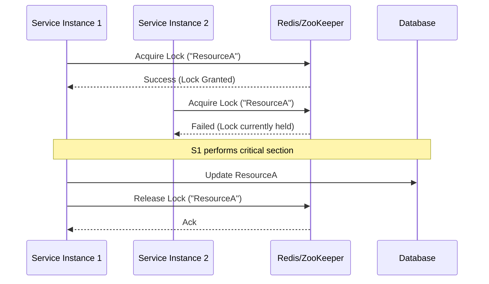

# Distributed Locking

## Introduction
In a single-machine environment, threads can coordinate access to shared resources using local mutexes or semaphores. In a distributed system, multiple independent machines need to coordinate access to a shared resource (like a database row, a file, or an external API). A Distributed Lock ensures that only one node in a cluster can hold the lock and perform the operation at any given time.

## Problem Statement
When multiple instances of a microservice try to modify the same shared resource simultaneously, race conditions occur, leading to data corruption or duplicate actions. Local locks (like Java's `synchronized`) only work within a single JVM/process and cannot prevent two different servers from stepping on each other's toes.

## Why this exists
To provide a cluster-wide synchronization mechanism, ensuring mutual exclusion across a distributed system.

## Real-world analogy
Imagine a shared calendar for a meeting room in an office with multiple floors. If two people on different floors check the calendar at the exact same time, they might both see the room is empty and try to book it simultaneously (Race Condition). A distributed lock is like a physical key to the room kept at the front desk. You must go to the front desk, take the single key, and only then can you enter the room and update the calendar.

## Key concepts
- **Mutual Exclusion:** Only one client can hold the lock at a time.
- **Deadlock Free:** The system must eventually release the lock, even if the client holding it crashes (usually via a TTL/Timeout).
- **Fault Tolerance:** The locking mechanism itself must be highly available (no single point of failure).
- **Fencing Token:** A monotonically increasing number attached to a lock to prevent a delayed client from writing stale data after its lock has expired.

## Internal working / Mermaid diagram



## Python/Java implementation

### Redis-based Distributed Lock (Python)
```python
import redis
import time
import uuid

r = redis.Redis(host='localhost', port=6379, db=0)

def acquire_lock(lock_name, acquire_timeout=10, lock_timeout=10):
    identifier = str(uuid.uuid4())
    end_time = time.time() + acquire_timeout
    
    while time.time() < end_time:
        # NX = Set only if it doesn't exist
        # EX = Expire in 'lock_timeout' seconds
        if r.set(lock_name, identifier, nx=True, ex=lock_timeout):
            return identifier
        time.sleep(0.001)
    return False

def release_lock(lock_name, identifier):
    # Lua script to ensure we only delete the lock if the identifier matches
    # This prevents us from accidentally deleting another client's lock if ours expired
    lua_script = """
    if redis.call("get", KEYS[1]) == ARGV[1] then
        return redis.call("del", KEYS[1])
    else
        return 0
    end
    """
    r.eval(lua_script, 1, lock_name, identifier)

# Usage
lock_id = acquire_lock("my_critical_resource")
if lock_id:
    try:
        print("Lock acquired! Performing critical work...")
        # Do work
    finally:
        release_lock("my_critical_resource", lock_id)
else:
    print("Could not acquire lock.")
```

## Step-by-step explanation
1. A client wants to access a shared resource.
2. It requests a lock from a central authority (Redis, ZooKeeper, or etcd) using a unique key representing the resource.
3. The central authority checks if the lock exists. If not, it creates it with a Time-To-Live (TTL) and grants it to the client.
4. If another client requests the lock, the authority denies the request until the lock is released or expires.
5. The first client completes its work and explicitly deletes the lock.
6. If the first client crashes, the TTL ensures the lock expires automatically, preventing a permanent deadlock.

## Multiple real-world examples
1. **Cron Jobs:** Ensuring a scheduled task (like sending a daily email) only runs on one microservice instance, not all of them.
2. **Order Processing:** Preventing an e-commerce system from processing the same order payment twice if the user double-clicks "Pay".
3. **Inventory Management:** Safely decrementing stock counts for a highly popular item during a flash sale.

## Pros
- Prevents data corruption from concurrent modifications in distributed systems.
- Ensures idempotency for operations that shouldn't run twice.

## Cons
- Adds latency to operations (requires a network round-trip to the lock server).
- Introduces a new dependency (the lock server).
- Complex failure modes (network partitions, clock drift, garbage collection pauses).

## Interview questions

### Beginner
- **Q: What happens if a server acquires a distributed lock and then crashes before releasing it?**
  - **A:** If implemented correctly, the lock has a TTL (Time-To-Live). Once the TTL expires, the lock server automatically releases the lock, preventing a permanent deadlock.

### Intermediate
- **Q: Why must you check the identifier (UUID) when releasing a Redis lock, rather than just deleting the key?**
  - **A:** If Client A acquires the lock, but experiences a long GC pause, its lock might expire. Client B then acquires the lock. If Client A wakes up and blindly deletes the key, it will delete Client B's lock! Checking the UUID ensures a client only deletes its *own* lock.

### Senior
- **Q: What is the Redlock algorithm?**
  - **A:** Redlock is a distributed locking algorithm proposed by Redis. Instead of relying on a single Redis node (which is a single point of failure), it requires the client to acquire the lock on a majority (quorum) of independent Redis nodes.

### Staff Engineer
- **Q: Explain the problem of "Clock Drift" and "GC Pauses" in distributed locks, and how Fencing Tokens solve it.**
  - **A:** If a client experiences a long Garbage Collection pause, its lock TTL might expire on the server, but the client doesn't know. Another client gets the lock and writes to the DB. When the first client wakes up, it thinks it still has the lock and overwrites the DB (data corruption). A **Fencing Token** is a strictly increasing number granted with the lock (e.g., Token 1, Token 2). The database must be configured to reject writes with a token lower than the highest token it has seen. When the delayed client writes with Token 1, the DB rejects it because it already processed Token 2.

## Common mistakes
- Using a single Redis instance without high availability. If the instance dies, the lock state is lost.
- Setting the TTL too short (causing the lock to expire before the work is done) or too long (causing long delays if a client crashes).

## Best practices
- Always use a unique identifier when acquiring a lock and verify it upon release.
- For strictly critical data (like financial transactions), use ZooKeeper/etcd or database-level constraints instead of Redis, as they offer stronger consistency guarantees.

## When NOT to use
- When database row-level locking (e.g., `SELECT ... FOR UPDATE`) or optimistic concurrency control (versioning) is sufficient and simpler.

## Comparison with similar concepts
- **Distributed Lock vs Local Lock:** Local locks coordinate threads in one process. Distributed locks coordinate processes across the network.
- **Redis Lock vs ZooKeeper Lock:** Redis is faster and AP (Available/Partition tolerant). ZooKeeper is CP (Consistent/Partition tolerant) and generally safer for strict locking, as it handles session heartbeats natively.

## Summary
Distributed locks are essential for coordinating access to shared resources across multiple independent servers. While caching systems like Redis are popular for implementing them due to speed, they require careful handling of edge cases like crashes, TTLs, and network delays to ensure strict mutual exclusion.

## Related topics
- [Redis](../../caching/redis)
- [Leader Election](../leader-election)
- [Consensus](../consensus)
