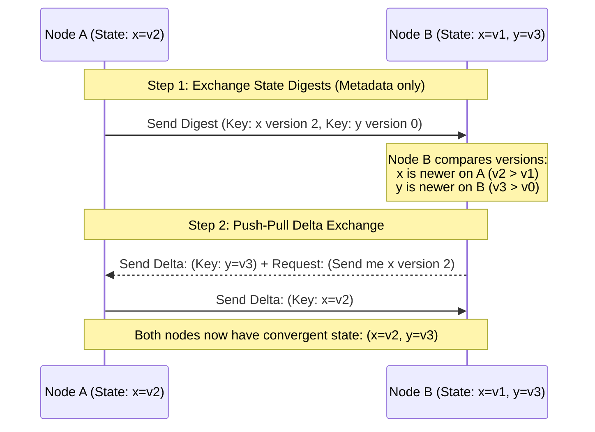

# Gossip Protocol

## Introduction
A **Gossip Protocol** (also known as an **Epidemic Protocol**) is a decentralized, peer-to-peer communication model designed to disseminate state, membership metadata, or configuration changes across a large distributed system. Inspired by the way viral diseases or social rumors spread through a population, gossip protocols rely on nodes periodically selecting random peers to exchange information, achieving eventual consistency without requiring centralized registry coordination.

---

## Problem Statement
In large-scale distributed clusters containing thousands of nodes:
1.  **Broadcast Inefficiency:** Having every node broadcast state changes to all other nodes (All-to-All communication) requires $O(N^2)$ network messages. This quickly saturates network bandwidth and exhausts thread pools.
2.  **Single Points of Failure:** Centralized registries (like ZooKeeper) become operational bottlenecks and single points of failure under extreme read/write pressures.
3.  **Dynamic Membership Churn:** Nodes frequently join, leave, crash, or experience temporary network partitions. Maintaining a correct, real-time list of healthy cluster members dynamically is computationally expensive.

---

## Why This Exists
Gossip protocols solve these scalability challenges by providing a highly decentralized, self-healing communication layer. Instead of broadcasting, nodes communicate in a peer-to-peer fashion, bounds-checking total network load. The network overhead is independent of cluster size, and information converges globally in logarithmic time:
$$\text{Time to Converge} \approx O(\log N) \text{ rounds}$$
Even if half the nodes in the cluster crash simultaneously, the remaining nodes will successfully reconcile state without intervention.

---

## Real-world Analogy
Imagine spreading a rumor in an office of 100 people:
*   **Request-Response (Broadcast):** You stand on a desk and scream the rumor (mesh broadcast). If half the office is wearing headphones (offline/partitioned), they miss it.
*   **Gossip (Epidemic):** You tell Alice and Bob. Bob tells Charlie and Dave. Dave tells Eve. Each person randomly selects 2 people they haven't talked to yet and tells them. Within minutes, the entire office has heard the rumor, even if people were away from their desks at different times.

---

## Definition
**Gossip Protocol** is a probabilistic message dissemination protocol where nodes periodically select random peers to exchange versioned state digests, ensuring eventual consistency and cluster membership alignment.

---

## Key Concepts

### 1. Dissemination Styles
*   **Anti-Entropy (Reconciliation):** Nodes continuously compare their entire datasets with random peers in the background to detect differences. To optimize network usage, nodes use **Merkle Trees** (cryptographic hash trees) to find differences quickly without transferring raw data.
*   **Rumor Mongering (Infection):** When a node receives a new update, it actively "gossips" (infects) $F$ (Fanout) random nodes. Once the rumor has been sent to enough nodes, the node stops actively gossiping it to save network traffic.

### 2. Communication Modes
*   **Push Gossip:** Node A sends its state to Node B. (Efficient when B has no data, but poor for reconciling differences).
*   **Pull Gossip:** Node A asks Node B for B's state. (Highly effective when B has many updates).
*   **Push-Pull Gossip:** Node A and Node B exchange metadata digests, identify which keys are newer on each side, and exchange only the differences. *This is the most efficient and rapidly converging mode.*

```
Push:      Node A ---- [ State Data ] ----> Node B
Pull:      Node A <--- [ State Data ] ----- Node B (Requested by A)
Push-Pull: Node A <--- [ Reconciled ] ----> Node B (Exchanged Digests)
```

### 3. Generation and Heartbeats
To prevent older updates from overwriting newer ones, gossip payloads include:
*   **Generation (or Epoch):** An incrementing integer tracking node restarts.
*   **Version Number:** An incrementing counter tracking updates within a generation.

---

## Internal Working: Push-Pull State Exchange



---

## Java Implementation

The following Java code simulates a **Push-Pull Gossip Protocol cluster**. It shows how updates spread probabilistically, resolve conflicts using version checks, and tracks how many rounds are required to achieve 100% convergence.

```java
import java.util.*;
import java.util.concurrent.ConcurrentHashMap;
import java.util.concurrent.ThreadLocalRandom;

class NodeState {
    final String value;
    final int version;

    public NodeState(String value, int version) {
        this.value = value;
        this.version = version;
    }
}

class GNode {
    final String id;
    final Map<String, NodeState> store = new ConcurrentHashMap<>();
    final List<GNode> peers = new ArrayList<>();

    public GNode(String id) {
        this.id = id;
    }

    public void update(String key, String value) {
        NodeState current = store.get(key);
        int nextVersion = (current == null) ? 1 : current.version + 1;
        store.put(key, new NodeState(value, nextVersion));
    }

    // =====================================================================
    // PUSH-PULL GOSSIP EXCHANGE
    // =====================================================================
    public void exchangeStateWith(GNode peer) {
        // 1. Pull: Grab newer data from peer
        for (Map.Entry<String, NodeState> peerEntry : peer.store.entrySet()) {
            String key = peerEntry.getKey();
            NodeState peerState = peerEntry.getValue();
            NodeState localState = this.store.get(key);

            if (localState == null || localState.version < peerState.version) {
                this.store.put(key, peerState); // Adopt newer state
            }
        }

        // 2. Push: Send newer local data to peer
        for (Map.Entry<String, NodeState> localEntry : this.store.entrySet()) {
            String key = localEntry.getKey();
            NodeState localState = localEntry.getValue();
            NodeState peerState = peer.store.get(key);

            if (peerState == null || peerState.version < localState.version) {
                peer.store.put(key, localState); // Update peer state
            }
        }
    }
}

public class GossipProtocolSimulator {
    private final List<GNode> nodes = new ArrayList<>();

    public GossipProtocolSimulator(int nodeCount) {
        for (int i = 0; i < nodeCount; i++) {
            nodes.add(new GNode("Node-" + i));
        }
        // Connect nodes in a ring network structure
        for (int i = 0; i < nodeCount; i++) {
            GNode current = nodes.get(i);
            current.peers.add(nodes.get((i + 1) % nodeCount));
            current.peers.add(nodes.get((i - 1 + nodeCount) % nodeCount));
        }
    }

    public void runConvergenceTest(String testKey, String value) {
        // Trigger update on Node 0 only
        nodes.get(0).update(testKey, value);
        System.out.println("Initiating update '" + testKey + "=" + value + "' on Node-0");

        int rounds = 0;
        boolean converged = false;

        while (!converged && rounds < 100) {
            rounds++;
            // Each node chooses a random peer to gossip with
            for (GNode node : nodes) {
                if (!node.peers.isEmpty()) {
                    GNode randomPeer = node.peers.get(ThreadLocalRandom.current().nextInt(node.peers.size()));
                    node.exchangeStateWith(randomPeer);
                }
            }

            // Check if all nodes got the update
            converged = true;
            for (GNode node : nodes) {
                NodeState state = node.store.get(testKey);
                if (state == null || !state.value.equals(value)) {
                    converged = false;
                    break;
                }
            }
        }

        System.out.println("Global Convergence achieved in " + rounds + " gossip rounds across " + nodes.size() + " nodes.");
    }
}
```

---

## Step-by-Step Explanation: The Push-Pull Exchange Lifecycle
1.  **State Drift:** `Node-0` updates key `x` to `value_42` (Version 2). `Node-1` still has `x` at Version 1.
2.  **Peer Selection:** At the next gossip interval (e.g., every 1 second), `Node-0` randomly selects `Node-1` from its peer list.
3.  **Exchange Init:** `Node-0` initiates a Push-Pull RPC with `Node-1`.
4.  **Pull Evaluation:** `Node-0` scans `Node-1`'s state map. If `Node-1` had a key `y` (Version 3) that `Node-0` was missing or had at an older version, `Node-0` copies `y` into its local map.
5.  **Push Evaluation:** `Node-0` checks `Node-1`'s map for key `x`. Seeing that `Node-0` has `x` at version 2, while `Node-1` has version 1, `Node-0` pushes the update `x=value_42` to `Node-1`.
6.  **Resolution:** Both nodes now possess identical, up-to-date state representations for both keys.

---

## Multiple Real-world Examples

1.  **Apache Cassandra (Cluster Membership):** Cassandra nodes do not rely on a master coordinator. They exchange heartbeats and node states (e.g., `JOINING`, `NORMAL`, `LEAVING`) via gossip. If a node fails to update its heartbeat within a timeout window, other nodes mark it as dead.
2.  **HashiCorp Consul (Serf memberlist):** Consul utilizes a gossip protocol (via the Serf library) to manage cluster membership lists and detect failed nodes. By running localized ping-ack tests, it quickly identifies offline servers without generating heavy network traffic.
3.  **Redis Cluster Node Auto-Discovery:** When you build a Redis Cluster, you only need to configure one node address. The node uses gossip to automatically share and discover other nodes in the cluster topology.

---

## Pros & Cons

### Pros
*   **Scalability:** Operates with $O(1)$ network packets per node per round, avoiding centralized database bottlenecks.
*   **High Fault Tolerance:** Completely decentralized; no single point of failure. If multiple nodes crash, updates detour around them naturally.
*   **Low Operational Complexity:** Nodes do not need complex leader election or log coordination structures.

### Cons
*   **Eventual Consistency Only:** Does not support immediate consistency. There is a delay (convergence window) during which nodes hold stale views.
*   **Network Overhead (Background Noise):** Nodes continually send gossip packets even when the cluster state is completely idle, generating background network traffic.
*   **Probabilistic Guarantees:** Cannot guarantee that an update is committed on 100% of nodes at a specific millisecond; convergence is bound by probability.

---

## Interview Questions

### Beginner
*   **Q:** What is a Gossip Protocol?
*   **A:** A gossip protocol is a decentralized, peer-to-peer communication protocol where nodes periodically select random peers to exchange versioned state, enabling eventual consistency across a cluster without a central master coordinator.

### Intermediate
*   **Q:** What is the difference between Anti-Entropy and Rumor Mongering?
*   **A:** Anti-Entropy is a continuous, thorough synchronization where nodes compare their entire databases (often using Merkle Trees) to correct all inconsistencies. Rumor Mongering (Infection) is triggered only when a new update occurs—the node actively broadcasts the new change to random peers for a few rounds before going idle, saving network bandwidth.

### Senior
*   **Q:** How does Cassandra utilize gossip to detect node failures? What is the role of Phi Accrual Failure Detector?
*   **A:** Cassandra nodes exchange heartbeats via gossip. Instead of using a fixed timeout (e.g., "if no heartbeat in 10s, node is dead"), which can cause false positives during garbage collection pauses, Cassandra uses a **Phi Accrual Failure Detector**. It records the historical intervals between gossip heartbeats and calculates a probability distribution. It returns a dynamic value ($\Phi$) reflecting the likelihood that the node is offline. The system adjusts its suspicion level based on real-time network conditions.

### Staff Engineer
*   **Q:** If a gossip protocol operates on a large WAN network spanning multiple global cloud regions, what modifications are required to optimize performance and prevent cross-region network costs?
*   **A:** 
    1.  **Region-Aware Peer Selection:** Restrict nodes to gossip with local region peers most of the time (e.g., 90% of gossip rounds).
    2.  **Cross-Region Aggregators (Bridge Nodes):** Elect one or two "bridge" nodes per region. Only these bridge nodes exchange gossip across the high-latency, expensive WAN links. Once the data reaches the remote bridge node, it disseminates locally within that region using LAN speed.
    3.  **Optimize Payload Size:** Swap raw JSON/XML state structures for binary serializations (like Protobuf) and only exchange lightweight cryptographic hashes (digests) rather than full values during Phase 1.

---

## Common Mistakes
*   **Using Gossip for Financial/ACID Transactions:** Attempting to build strongly consistent order logs using gossip, which violates safety guarantees due to eventual consistency.
*   **Omitting Generation Counters:** Using simple incrementing versions that reset to 0 when a node restarts, causing the node's new state to be ignored because it has a lower version number than the pre-restart states cached by peers. Always pair version numbers with a `generation` epoch (like a boot timestamp).
*   **Unbounded Fanout:** Setting the peer fanout number ($F$) too high, which degrades network performance.

---

## Best Practices
*   **Use Push-Pull Mode:** It converges significantly faster than push-only or pull-only modes.
*   **Pair Versions with Generation Epochs:** Ensure node restarts do not cause version collisions.
*   **Apply Merkle Trees:** Use Merkle Trees during Anti-Entropy checks to identify divergent data segments without sending the entire database over the wire.

---

## When NOT to Use
*   **Strongly Consistent Datastores:** Systems that require immediate transactional linearizability.
*   **Very Small Clusters:** Systems with under 10 nodes where simple mesh broadcasts or centralized registries are easier to implement.

---

## Comparison with Similar Concepts

*   **Gossip vs. Raft/Paxos:** Raft/Paxos prioritize strict safety and immediate consistency via leaders and quorums. Gossip prioritizes high availability and scalability, accepting eventual consistency.
*   **Gossip vs. Multicast:** Multicast relies on network hardware routing to broadcast packets. Gossip operates entirely at the application layer, running over standard TCP/UDP ports.

---

## Summary
Gossip protocols are essential for maintaining membership, health lists, and metadata consistency in large distributed systems. By utilizing randomized peer-to-peer push-pull exchanges and versioned state digests, clusters can achieve self-healing, high-availability operations at massive scale.

---

## Related Topics
- [Consensus](../consensus)
- [Leader Election](../leader-election)
- [Raft](../raft)
- [Paxos](../paxos)
