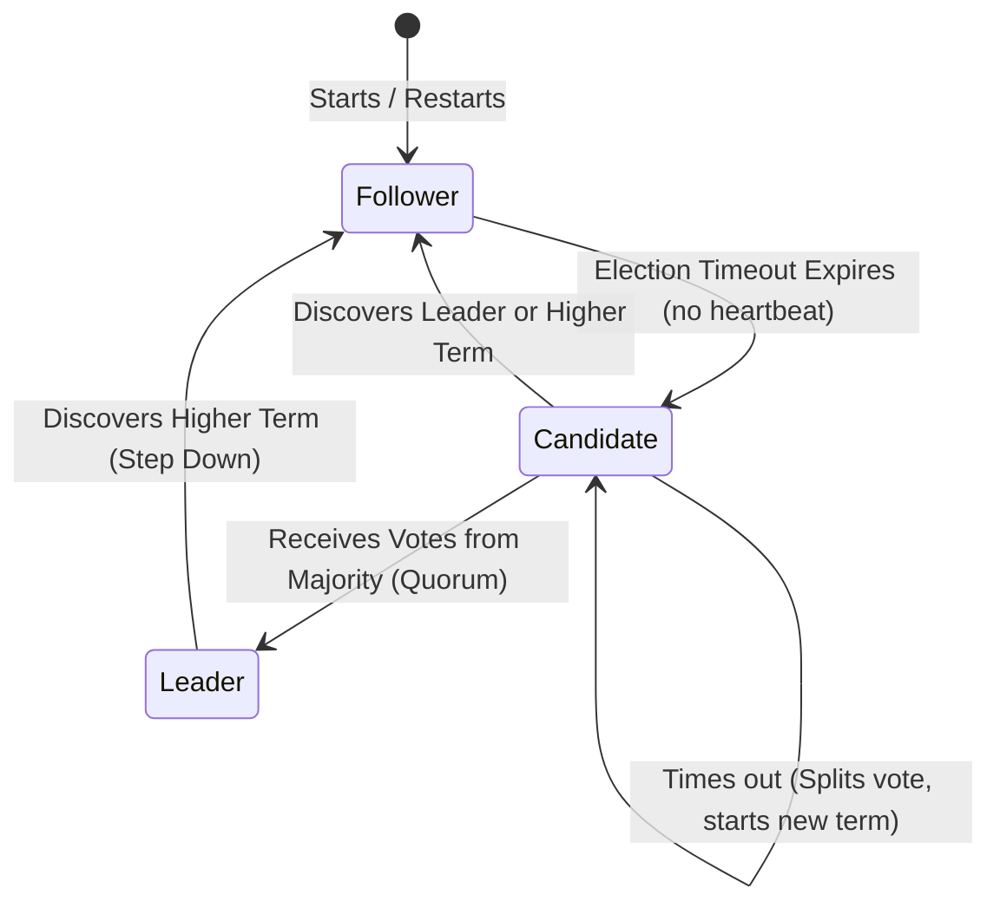

# Leader Election

## Introduction
In distributed systems, a **Leader Election** is the process of nominating and selecting a single coordinator node (the "leader") among a group of independent peers (the "followers"). The leader is tasked with making decisions, managing metadata, coordinating operations, and writing updates to the system. Once elected, the leader acts as the single source of authority, preventing conflicting state updates.

---

## Problem Statement
When multiple nodes are allowed to coordinate state changes concurrently:
1.  **Split-Brain:** If a network partition splits a 5-node cluster into two segments (a 2-node segment and a 3-node segment), and both segments elect a leader, two distinct nodes will coordinate writes. This causes the data on both sides to diverge, resulting in permanent state corruption.
2.  **Concurrency Conflicts:** Without a single coordinator, multiple nodes might attempt to execute the same scheduled task (e.g., generating daily user invoices) simultaneously, leading to double-processing.
3.  **Metadata Drift:** Distributed nodes editing cluster routing tables without a lock-holder will overwrite each other's configurations.

---

## Why This Exists
Leader election exists to simplify distributed consensus. Instead of executing complex multi-node voting protocols (like Paxos) for every single database read or write, the cluster elects a leader *once*. The leader then makes local decisions, replicates them to followers, and maintains order. If the leader crashes, the followers detect its absence and automatically elect a new leader.

---

## Real-world Analogy
Imagine a classroom working on a group project:
*   **Without a Leader:** All 5 students talk at once. Two students write different paragraphs on the same Google Slide. The presentation becomes disjointed and conflicted.
*   **The Election:** The students vote and select Alice as the Group Coordinator.
*   **Heartbeat:** To prove she is still actively coordinating, Alice says *"Okay"* every 10 seconds.
*   **Failure & Re-election:** Alice suddenly leaves the room (Node Crash). After 15 seconds of silence (Election Timeout), the remaining students realize she is gone, start a new vote, and elect Bob as the new coordinator.

---

## Definition
**Leader Election** is a distributed consensus sub-protocol that guarantees exactly one node in a cluster occupies the active "Leader" state during a specific term, while other healthy nodes occupy "Follower" or "Standby" states.

---

## Key Concepts

### 1. The Split-Brain and Quorum
To prevent two nodes from claiming leadership at the same time, elections must require a **Quorum** ($Q$).
$$Q = \left\lfloor \frac{N}{2} \right\rfloor + 1$$
Where $N$ is the total number of nodes in the cluster. A candidate node can only become the leader if it receives votes from a strict majority ($Q$) of nodes. Since a network partition can never create two separate majority segments, only one segment can elect a leader, preventing split-brain.

### 2. Leases vs. Heartbeats
*   **Heartbeat:** A periodic message sent by the leader to followers to announce: *"I am still alive, do not start an election."*
*   **Leases:** A time-bounded lock (e.g., 10 seconds) held by the leader. The leader's authority is only valid while the lease is active. If the leader fails to renew the lease before it expires, other nodes can safely elect a new leader without waiting for timeout detections, preventing double-leader states during garbage collection pauses.

### 3. Classic Election Algorithms
*   **Bully Algorithm:** Designed for systems where nodes have unique numeric IDs. When the leader dies, any node can start an election by sending messages to all nodes with higher IDs. If no one responds, it declares itself the leader. If a higher node responds, that higher node takes over and "bullies" lower nodes out of the race.
*   **Consensus-Based Election (Raft):** Nodes have randomized election timeouts (e.g., 150ms - 300ms). The node whose timeout expires first transitions to the Candidate state, increments the current term counter, votes for itself, and requests votes from peers.

---

## Internal Working: Raft State Transition & Quorum Partition



---

## Java Implementation

The following Java code implements a **Raft-style Leader Election simulator**. It models nodes running concurrent election timeouts, voting, and sending heartbeats.

```java
import java.util.*;
import java.util.concurrent.*;

enum NodeState { FOLLOWER, CANDIDATE, LEADER }

class RaftNode {
    final String id;
    NodeState state = NodeState.FOLLOWER;
    int currentTerm = 0;
    String votedFor = null;
    long lastHeartbeatReceived;
    long electionTimeoutMs;
    
    public RaftNode(String id) {
        this.id = id;
        resetElectionTimeout();
        this.lastHeartbeatReceived = System.currentTimeMillis();
    }

    public void resetElectionTimeout() {
        // Random timeout between 150ms and 300ms to avoid split votes
        this.electionTimeoutMs = 150 + ThreadLocalRandom.current().nextInt(150);
    }
}

public class RaftElectionSimulator {
    private final List<RaftNode> cluster = new ArrayList<>();
    private final ScheduledExecutorService scheduler = Executors.newScheduledThreadPool(5);
    private final int quorum;

    public RaftElectionSimulator(int nodeCount) {
        this.quorum = (nodeCount / 2) + 1;
        for (int i = 0; i < nodeCount; i++) {
            cluster.add(new RaftNode("Node-" + i));
        }
    }

    public void start() {
        // Start tickers for each node
        for (RaftNode node : cluster) {
            scheduler.scheduleAtFixedRate(() -> runNodeCycle(node), 50, 50, TimeUnit.MILLISECONDS);
        }
    }

    private synchronized void runNodeCycle(RaftNode node) {
        long now = System.currentTimeMillis();

        if (node.state == NodeState.LEADER) {
            // Send heartbeats to all followers
            sendHeartbeats(node);
        } else {
            // Check if election timeout has expired
            if (now - node.lastHeartbeatReceived > node.electionTimeoutMs) {
                startElection(node);
            }
        }
    }

    private void startElection(RaftNode candidate) {
        candidate.state = NodeState.CANDIDATE;
        candidate.currentTerm++;
        candidate.votedFor = candidate.id;
        candidate.lastHeartbeatReceived = System.currentTimeMillis(); // Reset clock
        candidate.resetElectionTimeout();

        System.out.println(candidate.id + " timed out! Initiating Election for Term: " + candidate.currentTerm);

        int votesReceived = 1; // Votes for itself
        for (RaftNode peer : cluster) {
            if (peer == candidate) continue;

            // Simple voting logic: grant vote if candidate's term is greater
            if (candidate.currentTerm > peer.currentTerm) {
                peer.currentTerm = candidate.currentTerm;
                peer.votedFor = candidate.id;
                peer.state = NodeState.FOLLOWER;
                peer.lastHeartbeatReceived = System.currentTimeMillis(); // Reset clock on vote
                votesReceived++;
            }
        }

        if (votesReceived >= quorum) {
            candidate.state = NodeState.LEADER;
            System.out.println(">>> ELECTION SUCCESS: " + candidate.id + " is elected LEADER for Term: " + candidate.currentTerm + " with " + votesReceived + " votes <<<");
        } else {
            System.out.println("Election failed for " + candidate.id + " (Received only " + votesReceived + " votes)");
            candidate.state = NodeState.FOLLOWER;
        }
    }

    private void sendHeartbeats(RaftNode leader) {
        for (RaftNode peer : cluster) {
            if (peer == leader) continue;
            peer.lastHeartbeatReceived = System.currentTimeMillis();
            peer.currentTerm = leader.currentTerm;
            peer.state = NodeState.FOLLOWER;
        }
    }

    public void shutdown() {
        scheduler.shutdown();
    }
}
```

---

## Step-by-Step Explanation: The Raft Election Cycle
1.  **Initialization:** 5 nodes boot as `FOLLOWER` with randomized election timers (e.g., Node 1 = 180ms, Node 2 = 250ms).
2.  **Timeout:** Node 1's timer expires first. It transitions to `CANDIDATE`, increments the term to `1`, votes for itself, and broadcasts a `RequestVote` RPC.
3.  **Voting:** Peer nodes receive the RPC. Since their current term is `0` (less than `1`) and they haven't voted in term `1`, they grant their votes to Node 1 and reset their timeout clocks.
4.  **Leadership Commit:** Node 1 receives 3 votes (including its own), satisfying the quorum of 3. It transitions to `LEADER` and immediately starts broadcasting `AppendEntries` heartbeats.
5.  **Heartbeat Loop:** Upon receiving heartbeats, followers reset their timeout clocks, acknowledging Node 1's leadership.

---

## Multiple Real-world Examples

1.  **Kubernetes Controller Manager:** Uses the **Lease API** to elect a leader among active replica controller manager instances. The active leader acquires a lock resource in etcd. If the leader fails to renew the lock (lease) within 15 seconds, a standby replica takes over.
2.  **Apache Kafka Controller:** When a Kafka cluster boots, the brokers compete to write their ID to a ephemeral node path `/controller` in ZooKeeper (or via KRaft voting). The broker that writes first becomes the active controller responsible for partition reassignments and leader changes.
3.  **HashiCorp Consul:** Consul uses Raft internally to elect a leader server among 3 or 5 server nodes. The elected leader handles all catalog updates and replicated consensus logs.

---

## Pros & Cons

### Pros
*   **Data Consistency:** Guarantees that only a single coordinator writes metadata, preventing split-brain corruption.
*   **High Availability:** Automated failover elects a new leader within milliseconds to seconds after a crash.
*   **Simple Operations:** Relational clients only need to know the IP of the leader to write data.

### Cons
*   **Write Bottleneck:** All write traffic is routed through a single leader node, limiting the cluster's write scaling.
*   **Election Downtime:** During leader transitions, the cluster is temporarily leaderless and cannot accept write operations (typically lasting 100ms - 5s).
*   **Network Sensitivity:** Jittery networks can cause false timeouts, triggering unnecessary elections that disrupt cluster stability.

---

## Interview Questions

### Beginner
*   **Q:** What is the "Split-Brain" problem in distributed systems?
*   **A:** Split-brain occurs when a network partition cuts a cluster into two isolated segments, and both segments elect a leader. With two leaders writing concurrently, the database states diverge, causing permanent data corruption.

### Intermediate
*   **Q:** Why do consensus protocols like Raft use randomized election timeouts?
*   **A:** If all nodes used the exact same timeout (e.g., 200ms), they would all time out at the same millisecond when the leader dies. They would all vote for themselves, splitting the votes evenly, and no candidate would receive a majority. Randomized timeouts ensure that one node times out first, giving it time to gather votes and win the election.

### Senior
*   **Q:** What is a "Lease" in leader election, and how does it differ from a standard Heartbeat?
*   **A:** A heartbeat is a one-way notification sent by the leader. A lease is a time-bound lock contract. The leader is only authorized to serve requests while its lease duration is active. If the leader experiences a long Stop-the-World garbage collection pause, its lease will expire. Other nodes can elect a new leader safely, knowing that the paused leader will automatically recognize its lease has expired once it resumes, preventing concurrent double-leader writes.

### Staff Engineer
*   **Q:** How would you design a leader election mechanism for a geo-distributed database spanning three regions (US, Europe, Asia) with high latency links?
*   **A:** 
    1.  **Quorum Configuration:** Deploy a 5-node consensus cluster where 3 nodes are placed in the primary low-latency region (e.g., US-East, US-West) and 2 in other regions. This ensures the majority quorum can be reached quickly within the primary region without waiting for transatlantic handshakes.
    2.  **Leader Pinning:** Configure node weights or priorities to pin the leader to the lowest latency region.
    3.  **Timeout Tuning:** Increase the election timeout bounds (e.g., 1s - 3s) to prevent WAN network jitter from triggering false election storms.

---

## Common Mistakes
*   **Timeouts Set Too Low:** Setting timeouts below 100ms on WAN connections, leading to constant leader re-elections during minor network spikes.
*   **Even Node Counts:** Configuring clusters with 4 nodes instead of 3 or 5. A 4-node cluster requires a quorum of 3. If a 2-2 partition occurs, neither side can form a majority, making recovery impossible. Always use odd node counts.
*   **Ignoring GC Pauses:** Not using leases, allowing a JVM-paused leader to resume and write outdated states concurrently with a newly elected leader.

---

## Best Practices
*   **Always Use Odd Node Counts:** 3, 5, or 7 nodes maximize fault tolerance vs. quorum overhead.
*   **Incorporate Jitter:** Always randomize election timeouts to prevent split vote lockouts.
*   **Implement Fencing Tokens:** When the leader makes a write to downstream storage, include an incrementing term/version number. The storage engine rejects writes containing old token versions, blocking demoted leaders from overwriting data.

---

## When NOT to Use
*   **Stateless Services:** Web microservices that do not maintain state do not need leader election; simple load balancing is sufficient.
*   **Leaderless Write Architectures:** Masterless systems (like Cassandra or Dynamo) where write operations rely on quorum consensus per key rather than a single coordinator.

---

## Comparison with Similar Concepts

*   **Leader Election vs. Distributed Locking:** Leader election is a long-term role assignment for cluster coordination. Distributed locking is a short-term resource acquisition pattern (e.g., locking a specific database row for 2 seconds).
*   **Bully Algorithm vs. Raft Election:** Bully relies on strict node IDs and is prone to election loops if high-ID nodes flap. Raft relies on randomized timers, terms, and quorum consensus, making it more stable.

---

## Summary
Leader election is a fundamental block for maintaining consistency in distributed systems. By delegating authority to a single leader elected via majority quorums, clusters avoid split-brain scenarios and simplify consensus.

---

## Related Topics
- [Consensus](../consensus)
- [Raft](../raft)
- [Paxos](../paxos)
- [Distributed Locking](../distributed-locking)
