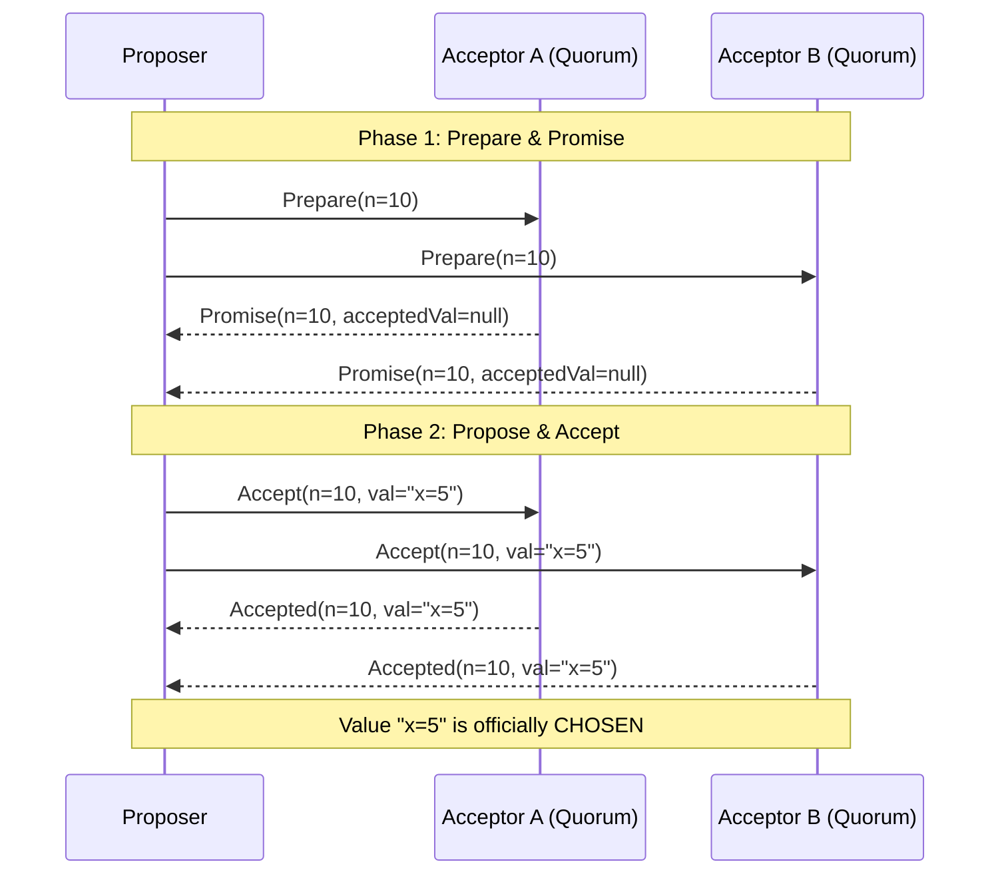

# Paxos

## Introduction
Paxos is a family of consensus protocols designed to reach agreement on a single decision among a network of unreliable, independent computing nodes. Designed by Turing Award winner Leslie Lamport (1989) and named after the legislative system of the fictional Greek island of Paxos, it is the first provably correct consensus algorithm. It acts as the mathematical foundation for modern replicated database systems.

---

## Problem Statement
Coordinating consensus in peer-to-peer (leaderless) networks is difficult because:
1.  **Concurrent Proposals:** Multiple nodes might propose conflicting values (e.g., Node A proposes `x=10`, Node B proposes `x=20`) at the same millisecond.
2.  **No Fixed Coordinator:** Without a permanent leader, nodes can fail mid-vote, leaving the cluster in a partially committed, inconsistent state.
3.  **Out-of-Order Delivery:** Network packets can be delayed or reordered, making it difficult for nodes to determine which proposal is the newest.

---

## Why This Exists
Paxos exists to guarantee **safety** (correctness) under the Crash-Recovery fault model without requiring a single permanent leader node. Unlike simple voting models, Paxos's two-phase consensus structure prevents nodes from changing their minds once a decision is made. It ensures that once a value is committed (chosen by a majority), all subsequent reading or writing nodes will discover and accept that exact same value, preventing split-brain.

---

## Real-world Analogy
Imagine a senate voting on a bill without a permanent Speaker of the House:
*   **Phase 1 (Prepare):** Senator Alice (Proposer) stands up and asks the senators (Acceptors): *"Will you promise to ignore all bills numbered below 10?"* If a majority promises, they also reply: *"I promise, but note that we previously accepted Bill 5 (which set the tax rate to 5%)."*
*   **Phase 2 (Accept):** Since a majority promised, Alice proposes Bill 10. According to the rules, she *cannot* create her own bill. She must inherit the highest-numbered bill returned by the senators. She proposes: *"Here is Bill 10: Set the tax rate to 5%."* The senators vote. Since they promised not to ignore Bill 10, they accept it. The bill is now law (Chosen).

---

## Definition
**Paxos** (specifically Single-Decree Paxos) is a consensus protocol that guarantees a set of nodes will agree on exactly one proposed value across two rounds of communication: the **Prepare/Promise** phase and the **Accept/Accepted** phase.

---

## Key Concepts

### 1. Paxos Roles
A single physical node can run one or more of these logical roles simultaneously:
*   **Proposer:** Advocates for a value from a client, generating unique proposal numbers and coordinating votes.
*   **Acceptor (Voters):** Receives proposals, votes on them, and stores the state. A majority quorum of acceptors must agree to commit.
*   **Learner:** Passive nodes that read committed values once the acceptors choose them.

### 2. Proposal Numbers
To order events without a master clock, proposers generate unique, monotonically increasing proposal numbers ($n$):
$$n = \text{sequence\_number} \cdot 1000 + \text{node\_id}$$
This guarantees that Proposal 1001 (Node 1) is always strictly smaller than Proposal 2002 (Node 2), preventing proposal collisions.

### 3. The Two Phases of Paxos
*   **Phase 1a: Prepare**
    A proposer selects a unique number $n$ and broadcasts `Prepare(n)` to a majority of acceptors.
*   **Phase 1b: Promise**
    An acceptor receives `Prepare(n)`. If $n$ is greater than any proposal number it has previously seen, it returns a `Promise(n)`:
    1.  Promising never to accept any future proposal numbered less than $n$.
    2.  Returning the highest-numbered proposal ($n_{max}$) and associated value ($v$) it has already accepted (if any).
*   **Phase 2a: Accept Request**
    If the proposer receives promises from a majority of acceptors, it must choose a value to send:
    *   It selects the value ($v$) associated with the highest-numbered proposal returned by the acceptors in Phase 1.
    *   If no acceptor returned a value, the proposer is free to use its own value.
    It broadcasts `Accept(n, v)` to the acceptors.
*   **Phase 2b: Accepted**
    An acceptor receives `Accept(n, v)`. It accepts the proposal and value if and only if it has not promised to ignore proposal $n$ (i.e., it hasn't promised to a proposal $> n$). If accepted, it broadcasts the result to the proposer and learners.

---

## Internal Working: Classic Paxos Sequence



---

## Java Implementation

The following Java code implements a **Single-Decree Paxos simulator**. It models proposers proposing values to acceptors and demonstrates how a proposer must adopt previously accepted values to maintain correctness.

```java
import java.util.*;

class Promise {
    final boolean accepted;
    final int highestAcceptedNum;
    final String highestAcceptedVal;

    public Promise(boolean accepted, int highestAcceptedNum, String highestAcceptedVal) {
        this.accepted = accepted;
        this.highestAcceptedNum = highestAcceptedNum;
        this.highestAcceptedVal = highestAcceptedVal;
    }
}

class PaxosAcceptor {
    final String id;
    int promisedNum = -1;
    int acceptedNum = -1;
    String acceptedVal = null;

    public PaxosAcceptor(String id) {
        this.id = id;
    }

    // Phase 1b: Promise
    public synchronized Promise handlePrepare(int num) {
        if (num > promisedNum) {
            promisedNum = num;
            return new Promise(true, acceptedNum, acceptedVal);
        }
        return new Promise(false, -1, null); // Reject
    }

    // Phase 2b: Accept
    public synchronized boolean handleAccept(int num, String val) {
        if (num >= promisedNum) {
            promisedNum = num;
            acceptedNum = num;
            acceptedVal = val;
            return true;
        }
        return false; // Reject
    }
}

public class PaxosCoordinator {
    private final List<PaxosAcceptor> acceptors = new ArrayList<>();
    private final int quorum;

    public PaxosCoordinator(int acceptorCount) {
        this.quorum = (acceptorCount / 2) + 1;
        for (int i = 0; i < acceptorCount; i++) {
            acceptors.add(new PaxosAcceptor("Acceptor-" + i));
        }
    }

    // ==========================================
    // PROPOSE VALUE: Run Paxos Phase 1 & 2
    // ==========================================
    public boolean propose(int proposalId, String clientValue) {
        System.out.println("\nProposer: Initiating Proposal " + proposalId + " with initial value: " + clientValue);

        // --- PHASE 1: PREPARE & PROMISE ---
        int promiseCount = 0;
        int highestAcceptedNum = -1;
        String adoptedValue = clientValue;

        for (PaxosAcceptor acceptor : acceptors) {
            Promise promise = acceptor.handlePrepare(proposalId);
            if (promise.accepted) {
                promiseCount++;
                // Adopt the highest-numbered accepted value returned
                if (promise.highestAcceptedNum > highestAcceptedNum && promise.highestAcceptedVal != null) {
                    highestAcceptedNum = promise.highestAcceptedNum;
                    adoptedValue = promise.highestAcceptedVal;
                }
            }
        }

        if (promiseCount < quorum) {
            System.err.println("Phase 1 Failed: Did not receive quorum of promises.");
            return false;
        }

        if (!adoptedValue.equals(clientValue)) {
            System.out.println("Proposer adopted previously accepted value: " + adoptedValue + " (Overrode: " + clientValue + ")");
        }

        // --- PHASE 2: ACCEPT & ACCEPTED ---
        int acceptCount = 0;
        for (PaxosAcceptor acceptor : acceptors) {
            if (acceptor.handleAccept(proposalId, adoptedValue)) {
                acceptCount++;
            }
        }

        if (acceptCount >= quorum) {
            System.out.println("SUCCESS: Value '" + adoptedValue + "' is CHOSEN under Proposal ID: " + proposalId);
            return true;
        } else {
            System.err.println("Phase 2 Failed: Did not receive quorum of accepts.");
            return false;
        }
    }
}
```

---

## Step-by-Step Explanation: Value Adoption
Using the Java implementation above with a 3-acceptor cluster:

1.  **State Setup:** `Acceptor-0` has previously accepted `{"num": 5, "val": "x=10"}`. `Acceptor-1` and `Acceptor-2` have no accepted values.
2.  **Phase 1 (Prepare):** Proposer 2 broadcasts `Prepare(num=10)`.
3.  **Promises Returned:**
    *   `Acceptor-0` promises and returns: `(acceptedNum=5, acceptedVal="x=10")`.
    *   `Acceptor-1` and `Acceptor-2` promise and return `null`.
4.  **Value Adoption:** Proposer 2 receives 3 promises (Quorum met!). It checks the returned values. Since `Acceptor-0` returned a value associated with proposal `5` (the highest seen), Proposer 2 **must discard** its initial client value (e.g. `"x=20"`) and adopt `"x=10"`.
5.  **Phase 2 (Accept):** Proposer 2 sends `Accept(num=10, val="x=10")`. The acceptors vote and commit `"x=10"`. This guarantees that once a value is accepted by even one node in a previous quorum, subsequent proposals will adopt and preserve that decision.

---

## The Livelock (Dueling Proposers) Problem
In classic Paxos, two proposers can block each other from completing Phase 2 indefinitely:
1.  Proposer A prepares $n_1$ (receives promises).
2.  Proposer B prepares $n_2 > n_1$ (receives promises, forcing acceptors to ignore $< n_2$).
3.  Proposer A sends `Accept(n_1)` (rejected because acceptors promised to ignore $< n_2$).
4.  Proposer A immediately prepares $n_3 > n_2$ (receives promises).
5.  Proposer B sends `Accept(n_2)` (rejected because acceptors promised to ignore $< n_3$).
This cycle repeats, preventing liveness.
*   *Mitigation:* Proposers implement randomized exponential backoffs before retrying, or the system uses a leader election protocol (Multi-Paxos).

---

## Multiple Real-world Examples

1.  **Google Chubby:** A highly available distributed lock service that uses Paxos. Google databases (like Bigtable) use Chubby to elect masters and store small configuration states.
2.  **Cassandra Light-Weight Transactions (LWT):** Cassandra is naturally eventually consistent. However, for operations requiring linearizability (e.g., creating a new user account without duplicates), Cassandra runs a Paxos protocol on top of its storage engine.
3.  **Microsoft Azure Cosmos DB:** Uses Paxos consensus groups to replicate data within a local region partition, achieving strong consistency and high availability.

---

## Pros & Cons

### Pros
*   **Strong Consistency:** Guarantees safety under concurrent writes and network partitions.
*   **Leaderless Resilience:** Does not require a permanent leader; any node can initiate proposals, making it resilient to coordinator failures.
*   **Minimal Constraints:** The protocol is mathematically abstract, allowing developers to adapt it to diverse topologies (e.g., WAN optimizations).

### Cons
*   **High Network Latency:** Classic Paxos requires two full round-trips (Prepare + Accept) of cluster-wide communication for every single write, which is slow.
*   **Livelock Susceptibility:** Dueling proposers can stall progress under heavy write contention.
*   **Implementation Complexity:** Moving from Single-Decree Paxos (one decision) to Multi-Paxos (a continuous stream of log entries) requires building complex log backtracking, compaction, and leader election mechanisms.

---

## Interview Questions

### Beginner
*   **Q:** What are the three primary roles in the Paxos protocol?
*   **A:** 
    *   **Proposer:** Receives client requests and advocates values by initiating voting rounds.
    *   **Acceptor:** Acts as the voter, promising to ignore older proposals and accepting values.
    *   **Learner:** Passive nodes that read chosen values once a majority of acceptors agree.

### Intermediate
*   **Q:** Why does Paxos require two phases (Prepare and Accept) to commit a value?
*   **A:** Phase 1 (Prepare) acts as a read and lock phase—it discovers if any value has already been accepted in previous rounds and locks out older proposals. Phase 2 (Accept) is the write phase—once the proposer knows it has a majority locked and has adopted any existing value, it writes the value to the acceptors. A single phase would allow concurrent nodes to write conflicting values, causing split-brain.

### Senior
*   **Q:** What is Multi-Paxos, and how does it optimize Classic Paxos?
*   **A:** Classic Paxos requires two network round-trips per write. Multi-Paxos optimizes this by electing a "Distinguished Proposer" (Leader). Once elected, the leader assumes it has the promise for all future log indices, allowing it to skip Phase 1 (Prepare) entirely. Subsequent writes only execute Phase 2 (Accept), reducing write latency to a single network round-trip.

### Staff Engineer
*   **Q:** Describe the "Dueling Proposers" (Livelock) problem in Paxos. How do you mitigate it without transitioning to a strict leader model?
*   **A:** Dueling Proposers is a livelock scenario where two proposers alternately prepare higher proposal numbers, causing the acceptors to repeatedly reject each proposer's Accept requests. This halts progress. To mitigate this without a strict leader:
    1.  **Randomized Backoff:** When a proposer's Accept request is rejected, it must wait for a randomized delay (with exponential backoff) before sending a new Prepare request. This allows one proposer to finish Phase 2 before the other retries.
    2.  **Pre-Vote:** Proposers execute a lightweight, non-blocking check to see if a higher proposal number is already active before launching a formal Prepare phase.

---

## Common Mistakes
*   **Implementing Classic Paxos for Logs:** Attempting to run Classic Paxos sequentially for every log index, resulting in poor performance due to double round-trips. Use Multi-Raft or Multi-Paxos instead.
*   **Duplicate Proposal IDs:** Generating non-unique proposal numbers, which allows different proposers to clash and overwrite each other's locks.
*   **Assuming ZooKeeper uses Paxos:** Confusing Paxos with ZAB. While ZooKeeper's Zab protocol shares concepts, it is structurally different, focusing on primary-backup recovery.

---

## Best Practices
*   **Incorporate Node IDs in Proposals:** Generate proposal IDs using `(sequence_number, node_id)` to guarantee global uniqueness.
*   **Transition to Multi-Paxos:** Implement Multi-Paxos or Raft for replicated commit logs to bypass Phase 1 overhead.
*   **Run Even Acceptor Counts:** Avoid even acceptor counts (like 4) which raise quorum requirements without improving fault tolerance.

---

## When NOT to Use
*   **Low-Complexity Projects:** Where simple databases with active-passive replication are sufficient.
*   **Write-Intensive Telemetry:** Systems where high ingestion throughput is required and eventual consistency is acceptable.

---

## Comparison with Similar Concepts

*   **Paxos vs. Raft:** Raft is leader-centric and enforces sequential logs, making it easier to implement. Paxos is symmetric (leaderless by default) and mathematically abstract, making it harder to build but highly customizable.
*   **Paxos vs. Two-Phase Commit (2PC):** 2PC is a blocking protocol requiring *unanimous* agreement to commit a database transaction. Paxos only requires a *majority* quorum to reach consensus, providing high availability.

---

## Summary
Paxos is the foundational consensus protocol of distributed systems, proving that reliable agreement is possible in unreliable networks. By utilizing a two-phase prepare/accept sequence and adopting previously accepted values, Paxos prevents split-brain and ensures strong consistency across replication nodes.

---

## Related Topics
- [Consensus](../consensus)
- [Raft](../raft)
- [Leader Election](../leader-election)
- [Distributed Locking](../distributed-locking)
