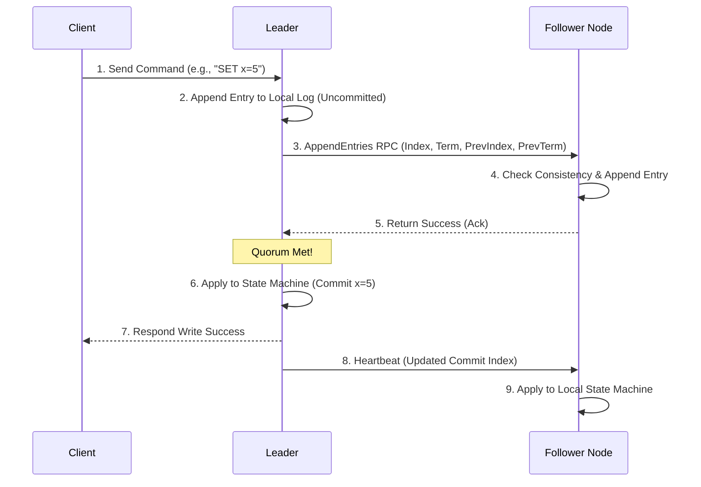

# Raft

## Introduction
Raft is a distributed consensus algorithm designed to manage a replicated commit log on behalf of a state machine. Developed by Diego Ongaro and John Ousterhout at Stanford University (2014) as an alternative to Paxos, Raft's primary design goal is **understandability**. It decomposes the complex consensus problem into three independent subproblems: **Leader Election**, **Log Replication**, and **Safety**.

---

## Problem Statement
Prior to Raft, Paxos was the dominant consensus algorithm. However, Paxos is notoriously difficult to understand and implement:
1.  **High Complexity:** The description of Paxos is highly abstract, focusing on single-value agreements rather than log streams.
2.  **No Implementation Blueprint:** Paxos leaves critical engineering details—such as leader election, log compaction (snapshotting), and dynamic cluster membership changes—open to developer interpretation, leading to buggy custom implementations.
3.  **Low Readability:** Even experienced systems engineers struggle to reason about Paxos edge cases, making it difficult to maintain.

---

## Why This Exists
Raft exists to make distributed consensus practical and easy to reason about. By enforcing a **strong leader model**—where log entries flow exclusively from the leader to followers—Raft simplifies state machine replication. It provides the exact same safety and performance guarantees as Paxos but is structured so developers can build correct, production-ready distributed key-value stores.

---

## Real-world Analogy
Imagine a democratic legislative assembly:
*   **Leader Election:** The representatives hold a vote and elect a Prime Minister (Leader) for the current legislative term.
*   **Log Replication:** The Prime Minister proposes bills (Log entries) sequentially. 
*   **Commit:** A bill is read aloud. The representatives vote on it. If a majority votes "Yes", the Prime Minister signs it, committing it into the official law registry (State Machine).
*   **Safety:** The constitution dictates that no representative can vote for a Prime Minister whose law notebook is less complete than theirs, ensuring historical laws are never deleted or rewritten during elections.

---

## Definition
**Raft** is a consensus protocol that coordinates a replicated state machine by electing a single leader, replicating log commands from leader to followers, and applying strict safety constraints to prevent data loss or drift.

---

## The Three Pillars of Raft

### 1. Leader Election
*   Nodes exist in one of three states: **Follower**, **Candidate**, or **Leader**.
*   Followers expect periodic heartbeats from the leader. If a follower's randomized **election timeout** (e.g., 150ms - 300ms) expires, it transitions to Candidate, increments the **current term**, votes for itself, and broadcasts `RequestVote` RPCs.
*   A candidate becomes leader if it obtains votes from a quorum ($N/2 + 1$) of nodes.

### 2. Log Replication
*   The leader accepts client write requests, appends the command to its local log, and broadcasts `AppendEntries` RPCs.
*   Followers check the log entry preceding the new one (its index and term). If it matches, they append the new entry and return success.
*   Once replicated to a majority of nodes, the leader updates its **commitIndex** and applies the command to its local state machine. It notifies followers of the commit index in subsequent heartbeats.

```
Leader Log:    [T1: cmd1] [T1: cmd2] [T2: cmd3] [T2: cmd4]  (Commit Index: 2)
Follower 1:    [T1: cmd1] [T1: cmd2] [T2: cmd3]
Follower 2:    [T1: cmd1] [T1: cmd2] [T2: cmd3] [T2: cmd4]
```

### 3. Raft Safety Properties
Raft enforces five core safety invariants:
*   **Election Safety:** At most one leader can be elected per term.
*   **Leader Append-Only:** A leader never overwrites or deletes its log entries; it only appends new ones.
*   **Log Matching:** If two logs contain an entry with the same index and term, they are identical up to that index.
*   **Leader Completeness:** If a log entry is committed in a given term, that entry will be present in the logs of the leaders for all higher-numbered terms.
*   **State Machine Safety:** If a server has applied a log entry at a given index to its state machine, no other server will ever apply a different log entry for that index.

---

## Internal Working: Client Request Lifecycle



---

## Java Implementation

The following Java code simulates the **Raft Log Replication and Conflict Resolution** engine. It illustrates how a leader uses `nextIndex` and `matchIndex` pointers to backtrack and overwrite divergent follower logs.

```java
import java.util.*;

class LogEntry {
    final int term;
    final String command;

    public LogEntry(int term, String command) {
        this.term = term;
        this.command = command;
    }

    @Override
    public String toString() {
        return "Term:" + term + "[" + command + "]";
    }
}

class PeerNode {
    final String id;
    List<LogEntry> log = new ArrayList<>();
    int commitIndex = -1;

    public PeerNode(String id) {
        this.id = id;
    }
}

public class RaftLogReplicationEngine {
    private final List<PeerNode> followers = new ArrayList<>();
    private final PeerNode leader;
    
    // Tracks next index to send to each follower (initialized to leader log size)
    private final Map<String, Integer> nextIndex = new HashMap<>();
    // Tracks highest entry index known to be replicated on each follower
    private final Map<String, Integer> matchIndex = new HashMap<>();

    public RaftLogReplicationEngine(String leaderId, List<String> followerIds) {
        this.leader = new PeerNode(leaderId);
        // Seed leader log
        leader.log.add(new LogEntry(1, "x=1"));
        leader.log.add(new LogEntry(1, "x=2"));
        leader.log.add(new LogEntry(2, "x=3"));
        leader.commitIndex = 2;

        for (String id : followerIds) {
            PeerNode follower = new PeerNode(id);
            // Simulate divergent follower logs due to previous partition failures
            if (id.equals("Follower-1")) {
                follower.log.add(new LogEntry(1, "x=1")); // Behind
            } else if (id.equals("Follower-2")) {
                follower.log.add(new LogEntry(1, "x=1"));
                follower.log.add(new LogEntry(1, "x=2"));
                follower.log.add(new LogEntry(1, "different_cmd")); // Divergent entry in term 1
            }
            followers.add(follower);
            nextIndex.put(id, leader.log.size());
            matchIndex.put(id, -1);
        }
    }

    // =====================================================================
    // REPLICATION LOG SYNC WITH CONFLICT RESOLUTION
    // =====================================================================
    public void replicateLogs() {
        System.out.println("Starting Log Replication. Leader Log: " + leader.log);

        for (PeerNode follower : followers) {
            boolean success = false;
            while (!success) {
                int prevLogIndex = nextIndex.get(follower.id) - 1;
                int prevLogTerm = (prevLogIndex >= 0) ? leader.log.get(prevLogIndex).term : 0;
                
                List<LogEntry> entriesToAppend = leader.log.subList(prevLogIndex + 1, leader.log.size());

                System.out.println("Syncing with " + follower.id + ". PrevIndex: " + prevLogIndex + ", Sending: " + entriesToAppend);
                
                success = appendEntriesRPC(follower, prevLogIndex, prevLogTerm, entriesToAppend);

                if (!success) {
                    // Conflict detected! Backtrack nextIndex for this follower and retry
                    int currentNext = nextIndex.get(follower.id);
                    nextIndex.put(follower.id, Math.max(0, currentNext - 1));
                    System.out.println("  Conflict! Decrementing nextIndex for " + follower.id + " to " + nextIndex.get(follower.id));
                } else {
                    // Update indices upon success
                    int lastAppendedIndex = leader.log.size() - 1;
                    nextIndex.put(follower.id, lastAppendedIndex + 1);
                    matchIndex.put(follower.id, lastAppendedIndex);
                    System.out.println("  Replication SUCCESS for " + follower.id + ". Follower Log now: " + follower.log);
                }
            }
        }
    }

    // Simulated AppendEntries RPC on Follower Node
    private boolean appendEntriesRPC(PeerNode follower, int prevLogIndex, int prevLogTerm, List<LogEntry> newEntries) {
        // 1. Reply false if follower log is shorter than prevLogIndex
        if (follower.log.size() <= prevLogIndex) {
            return false;
        }

        // 2. Reply false if follower entry at prevLogIndex term doesn't match prevLogTerm
        if (prevLogIndex >= 0 && follower.log.get(prevLogIndex).term != prevLogTerm) {
            return false;
        }

        // 3. Clear conflicting entries starting at prevLogIndex + 1
        int insertIndex = prevLogIndex + 1;
        while (follower.log.size() > insertIndex) {
            follower.log.remove(follower.log.size() - 1); // Delete divergent suffix
        }

        // 4. Append new entries
        follower.log.addAll(newEntries);
        follower.commitIndex = leader.commitIndex; // Update commit index
        return true;
    }
}
```

---

## Step-by-Step Explanation: Log Conflict Resolution
Using the Java implementation above for `Follower-2` (divergent entry `[Term:1, different_cmd]` at index 2):

1.  **Initial Attempt:** The leader tries to replicate entries starting after index 2 (`nextIndex = 3`).
    *   `prevLogIndex = 2` (points to `different_cmd` in follower's log, which has `Term = 1`).
    *   The leader's log at index 2 has `Term = 2` (`x=3`).
2.  **Conflict Rejection:** In `appendEntriesRPC`, the follower checks index 2. Since `follower_term (1) != leader_term (2)`, the follower rejects the RPC, returning `false`.
3.  **Backtracking:** The leader decrements `nextIndex` for `Follower-2` to `2`.
4.  **Second Attempt:** The leader retries with `prevLogIndex = 1`.
    *   `prevLogIndex = 1` points to `x=2` (`Term = 1`) in both logs. (Match!).
    *   `appendEntriesRPC` returns `true`.
5.  **Overwriting Suffix:** The follower deletes everything after index 1 (removing `different_cmd`) and appends the leader's entries `[T2: x=3]`, achieving identical states.

---

## Multiple Real-world Examples

1.  **HashiCorp Consul:** Consul uses Raft consensus for server replication. Consul client agents make requests to the leader server, which replicates key-value configs, service health states, and ACLs across the Consul server cluster.
2.  **CockroachDB Multi-Raft:** CockroachDB splits SQL table ranges into 64MB chunks. Instead of running a single Raft group for the whole database, it runs thousands of independent Raft groups (one per chunk), allowing parallel writes across different nodes.
3.  **etcd (Kubernetes Configuration):** Holds the definitive configuration state of Kubernetes clusters. etcd uses Raft to commit pod states and service bindings before reporting them to controllers.

---

## Pros & Cons

### Pros
*   **High Understandability:** Decomposing consensus into leader election, replication, and safety subproblems simplifies development and maintenance.
*   **Strong Consistency:** Guarantees linearizable consistency; read operations return the most recently committed write.
*   **Fast Leader Recovery:** In the event of a leader crash, randomized election timeouts ensure a new leader is elected in milliseconds.

### Cons
*   **Leader Bottleneck:** Since all writes and reads (unless read lease is used) are routed through the leader, the system cannot scale write throughput beyond a single node's CPU/network capacity.
*   **High WAN Latency:** Operating Raft across global geographic regions causes write delays, as every commit requires synchronous consensus handshakes.
*   **Downtime During Elections:** If the leader crashes, the cluster cannot process writes during the election window (usually 150ms - 2s).

---

## Interview Questions

### Beginner
*   **Q:** What are the three states a Raft node can be in?
*   **A:** Follower (passive, responds to RPCs), Candidate (starts election, votes), and Leader (handles client requests, coordinates replication).

### Intermediate
*   **Q:** What is the purpose of randomized election timeouts in Raft?
*   **A:** If all nodes timed out at the same time when a leader crashed, they would all vote for themselves, splitting the vote. No node would reach a majority quorum, causing election loops. Randomized timeouts (e.g., 150ms - 300ms) ensure one node times out first, gathers votes, and wins the election quickly.

### Senior
*   **Q:** How does Raft ensure that a newly elected leader contains all previously committed log entries? (Leader Completeness Property).
*   **A:** During an election, a follower will only vote for a candidate if the candidate's log is **at least as up-to-date** as its own. A candidate's log is more up-to-date if its last entry has a higher term, or if terms are equal, its log is longer. Because committed entries must exist on a majority of nodes, and a candidate must win votes from a majority of nodes, the candidate is guaranteed to overlap with at least one node containing the committed log, ensuring the new leader has all committed entries.

### Staff Engineer
*   **Q:** Explain the concept of Multi-Raft in distributed databases (e.g., CockroachDB). What problem does it solve, and what architectural challenges does it introduce?
*   **A:** In a single-Raft cluster, all writes are coordinated by a single leader, which limits scalability. Multi-Raft solves this by sharding database tables into smaller ranges (e.g., 64MB) and running a distinct Raft consensus group for *each* range. This allows the database to distribute leader responsibilities across all servers in the cluster, achieving horizontal write scaling. The architectural challenges include:
    1.  **Metadata Overhead:** Managing heartbeats and status for thousands of Raft groups can saturate network bandwidth.
    2.  **Distributed Transactions:** Executing transactions that span multiple independent Raft ranges requires 2PC (Two-Phase Commit) coordination on top of Raft.

---

## Common Mistakes
*   **Even Node Counts:** Configuring clusters with 4 nodes instead of 3 or 5, increasing consensus latencies without adding fault tolerance.
*   **Ignoring Disk Write Durability:** Disabling `fsync` on log appends to speed up writes. A sudden power failure can cause committed logs to be lost, violating the durability invariant.
*   **Incomplete Membership Changes:** Implementing naive single-phase membership changes (adding multiple nodes at once) rather than using joint consensus, which can result in dual-majority quorums and split-brain.

---

## Best Practices
*   **Implement Log Compaction:** Periodically write log state snapshots (e.g., etcd snapshots) to disk and truncate the committed log to prevent disk exhaustion.
*   **Utilize Read Leases:** Enable the leader to serve read queries locally without broadcasting RPCs to followers by checking its active lease timer, boosting read throughput.
*   **Tune Heartbeat/Election Ratios:** Ensure the heartbeat interval is at least one order of magnitude smaller than the election timeout (e.g., heartbeat = 15ms, election timeout = 150ms) to avoid false elections.

---

## When NOT to Use
*   **Leaderless High-Throughput Write Stores:** Systems like Cassandra or DynamoDB where write scaling is prioritized over strict linearizability.
*   **Stateless Microservices:** Applications that do not maintain critical metadata.

---

## Comparison with Similar Concepts

*   **Raft vs. Paxos:** Raft uses a strong leader and sequential log replication, making it easier to implement and reason about. Paxos is symmetric (any node can propose values), making it highly flexible but extremely complex to design for log-state replication.
*   **Raft vs. ZooKeeper (Zab):** Zab is highly similar to Raft but couples leader election with log recovery phases, whereas Raft separates them.

---

## Summary
Raft is a highly reliable consensus protocol designed for replicated state machines. By dividing consensus into leader election, log replication, and safety subproblems, it provides strong consistency guarantees while remaining highly understandable and practical for production systems.

---

## Related Topics
- [Leader Election](../leader-election)
- [Consensus](../consensus)
- [Paxos](../paxos)
- [Distributed Locking](../distributed-locking)
