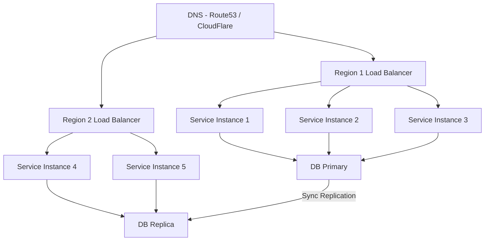
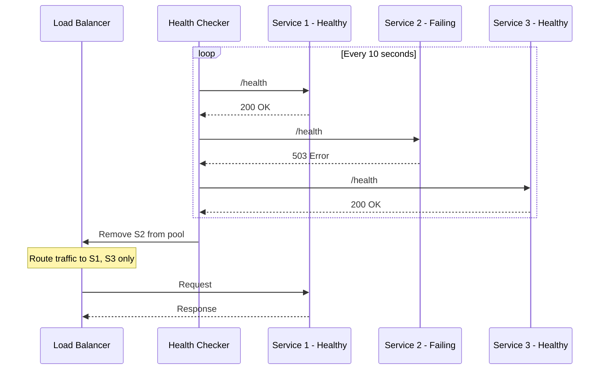

# Availability

## Introduction
Availability is one of the most critical non-functional requirements in distributed systems. It measures the proportion of time a system is operational and capable of serving requests successfully. In today's always-on world, even a few minutes of downtime can result in significant revenue loss and damage to user trust.

## Problem Statement
Modern services must remain reachable even under hardware failures, software bugs, traffic spikes, and infrastructure faults. Users expect digital services to be available 24/7, and cloud SLAs contractually guarantee specific uptime percentages. How do you design a system that stays available when individual components inevitably fail?

## Why this exists
Availability is a business-critical property. Amazon estimated that every 100ms of latency cost them 1% in sales. Google found that a 500ms delay in search results reduced traffic by 20%. Complete outages are far more costly. Availability engineering ensures that systems can serve users even when parts of the infrastructure are degraded.

## Real-world analogy
A bank ATM network is available when customers can withdraw money from any ATM, anywhere. If one ATM runs out of cash, others should still work. If the bank's central server goes down, ATMs should degrade gracefully — perhaps allowing balance inquiries while restricting withdrawals. The entire network is designed so that no single failure makes the service completely unavailable.

## Definition
**Availability** measures the proportion of time a system is able to serve requests successfully. It is typically expressed as a percentage ("nines") or computed from Mean Time Between Failures (MTBF) and Mean Time To Repair (MTTR):

```
Availability = MTBF / (MTBF + MTTR)
```

### The "Nines" of Availability

| Level | Availability | Downtime/year | Downtime/month | Downtime/week |
|-------|-------------|---------------|----------------|---------------|
| Two nines | 99% | 3.65 days | 7.31 hours | 1.68 hours |
| Three nines | 99.9% | 8.77 hours | 43.83 minutes | 10.08 minutes |
| Four nines | 99.99% | 52.60 minutes | 4.38 minutes | 1.01 minutes |
| Five nines | 99.999% | 5.26 minutes | 26.30 seconds | 6.05 seconds |

## Key concepts
- **Uptime:** The total time the system is available and serving requests.
- **Downtime:** The total time the system is unavailable or failing to respond.
- **SLO (Service Level Objective):** The target availability goal (e.g., 99.9% uptime).
- **SLA (Service Level Agreement):** A contractual commitment with penalties for breaching the SLO.
- **SLI (Service Level Indicator):** The actual measured metric (e.g., successful requests / total requests).
- **Error budget:** The allowed amount of downtime within the SLO window. If SLO is 99.9%, the error budget is 0.1%.
- **Fault domain:** The scope of a failure (single machine, rack, data centre, region).
- **Failover:** Switching to a standby resource when the primary fails.
- **Redundancy:** Having duplicate components so the system survives individual failures.

## Internal working
Availability is achieved through a combination of redundancy, health checks, automatic recovery, graceful degradation, and load balancing. The key insight is that **individual component failures are inevitable** — availability engineering ensures the system as a whole survives.

### Multi-layer Availability Architecture



### Health Check and Failover Flow



## Python implementation

### Bad implementation
A single server with no redundancy or health checks — a single point of failure.

```python
class SingleServer:
    """Single point of failure: if this crashes, everything is down."""

    def __init__(self):
        self.healthy = True

    def handle(self, request: str) -> str:
        if not self.healthy:
            raise RuntimeError("Server unavailable")
        return f"processed {request}"
```

### Better implementation
A redundant cluster with basic health checking.

```python
from dataclasses import dataclass
from typing import Optional


@dataclass
class Server:
    name: str
    healthy: bool = True
    active_requests: int = 0


class Cluster:
    """Routes to healthy servers with basic failover."""

    def __init__(self, servers: list[Server]):
        self.servers = servers

    def get_healthy(self) -> list[Server]:
        return [s for s in self.servers if s.healthy]

    def handle(self, request: str) -> str:
        healthy = self.get_healthy()
        if not healthy:
            raise RuntimeError("No healthy servers available")
        # Route to server with least active requests
        target = min(healthy, key=lambda s: s.active_requests)
        target.active_requests += 1
        try:
            return f"{target.name} processed {request}"
        finally:
            target.active_requests -= 1
```

### Best implementation
A production-grade availability controller with health checks, circuit breakers, and graceful degradation.

```python
import time
from dataclasses import dataclass, field
from enum import Enum
from typing import Optional, Callable


class HealthStatus(Enum):
    HEALTHY = "healthy"
    DEGRADED = "degraded"
    UNHEALTHY = "unhealthy"


@dataclass
class Instance:
    name: str
    region: str
    status: HealthStatus = HealthStatus.HEALTHY
    last_health_check: float = 0.0
    consecutive_failures: int = 0
    max_failures: int = 3


class AvailabilityController:
    """
    Production availability controller with:
    - Periodic health checks
    - Automatic removal of unhealthy instances
    - Graceful degradation (serve cached/stale data when partially down)
    - Multi-region failover
    """

    def __init__(self, instances: list[Instance]):
        self.instances = instances
        self.cache: dict[str, str] = {}

    def health_check(self, instance: Instance) -> HealthStatus:
        """Simulate health check (replace with HTTP check in production)."""
        # In production: response = requests.get(f"http://{instance.name}/health", timeout=2)
        if instance.consecutive_failures >= instance.max_failures:
            return HealthStatus.UNHEALTHY
        return instance.status

    def run_health_checks(self) -> None:
        for instance in self.instances:
            status = self.health_check(instance)
            instance.status = status
            instance.last_health_check = time.time()

    def get_available(self, preferred_region: Optional[str] = None) -> list[Instance]:
        healthy = [i for i in self.instances if i.status != HealthStatus.UNHEALTHY]
        if preferred_region:
            regional = [i for i in healthy if i.region == preferred_region]
            if regional:
                return regional
        return healthy

    def handle_request(self, request: str, region: Optional[str] = None) -> str:
        self.run_health_checks()
        available = self.get_available(region)

        if available:
            target = available[0]
            response = f"{target.name} processed {request}"
            self.cache[request] = response
            return response

        # Graceful degradation: serve cached response
        if request in self.cache:
            return f"[DEGRADED] {self.cache[request]}"

        raise RuntimeError("All instances unavailable and no cached response")
```

## Java implementation

```java
import java.util.*;
import java.util.concurrent.ConcurrentHashMap;
import java.util.stream.Collectors;

enum HealthStatus {
    HEALTHY, DEGRADED, UNHEALTHY
}

class Instance {
    final String name;
    final String region;
    HealthStatus status;
    int consecutiveFailures;
    final int maxFailures;

    Instance(String name, String region) {
        this(name, region, 3);
    }

    Instance(String name, String region, int maxFailures) {
        this.name = name;
        this.region = region;
        this.status = HealthStatus.HEALTHY;
        this.consecutiveFailures = 0;
        this.maxFailures = maxFailures;
    }
}

class AvailabilityController {
    private final List<Instance> instances;
    private final Map<String, String> cache = new ConcurrentHashMap<>();

    AvailabilityController(List<Instance> instances) {
        this.instances = instances;
    }

    private void runHealthChecks() {
        for (Instance inst : instances) {
            if (inst.consecutiveFailures >= inst.maxFailures) {
                inst.status = HealthStatus.UNHEALTHY;
            }
        }
    }

    private List<Instance> getAvailable(String preferredRegion) {
        List<Instance> healthy = instances.stream()
            .filter(i -> i.status != HealthStatus.UNHEALTHY)
            .collect(Collectors.toList());

        if (preferredRegion != null) {
            List<Instance> regional = healthy.stream()
                .filter(i -> i.region.equals(preferredRegion))
                .collect(Collectors.toList());
            if (!regional.isEmpty()) return regional;
        }
        return healthy;
    }

    String handleRequest(String request, String region) {
        runHealthChecks();
        List<Instance> available = getAvailable(region);

        if (!available.isEmpty()) {
            Instance target = available.get(0);
            String response = target.name + " processed " + request;
            cache.put(request, response);
            return response;
        }

        // Graceful degradation
        String cached = cache.get(request);
        if (cached != null) {
            return "[DEGRADED] " + cached;
        }
        throw new RuntimeException("All instances unavailable");
    }
}
```

## Step-by-step explanation
1. A **bad system** has a single server with no failover — it is a single point of failure.
2. A **better system** adds multiple servers with health checking and routes traffic only to healthy instances.
3. The **best system** adds multi-region support, graceful degradation (serving cached data when all instances are down), and circuit breaker logic to prevent cascading failures.

## Multiple real-world examples
1. **Kubernetes** uses liveness probes (is the container alive?) and readiness probes (can the container serve traffic?) to automatically remove unhealthy pods and reschedule them.
2. **AWS Elastic Load Balancer** performs periodic health checks and removes unhealthy EC2 instances from the target group automatically.
3. **Netflix Chaos Engineering** — Netflix runs Chaos Monkey to randomly terminate production instances, validating that their availability architecture survives real failures.
4. **Google** designs all services for "N+2" redundancy — two additional instances beyond the minimum, so the system survives both a planned maintenance and an unexpected failure simultaneously.
5. **Cloudflare** operates in 300+ cities globally. If one PoP (Point of Presence) goes down, DNS automatically routes users to the next nearest healthy PoP.

## Pros
- Improved user trust and customer retention.
- Reduced revenue loss from outages.
- Supports gradual degradation rather than complete failure.
- Enables confident deployment and maintenance (error budget allows controlled risk-taking).

## Cons
- Higher operational cost — redundancy means paying for spare capacity.
- Increased complexity in stateful services (replication, failover, split-brain).
- Risk of cascading failure if failover is not designed carefully.
- Over-engineering availability for non-critical systems wastes resources.

## Interview questions

### Beginner
- **Q: What is availability in system design?**
  - **A:** The ability of a system to respond to requests successfully over time. It is typically measured as a percentage (e.g., 99.9% uptime means 8.77 hours of downtime per year).

- **Q: What is the formula for availability?**
  - **A:** `Availability = MTBF / (MTBF + MTTR)` where MTBF is Mean Time Between Failures and MTTR is Mean Time To Repair.

### Intermediate
- **Q: How do redundancy and failover improve availability?**
  - **A:** Redundancy eliminates single points of failure by having backup components. Failover automatically switches traffic to a healthy backup when the primary fails. Together, they ensure the system remains available even when individual components crash.

- **Q: What is an error budget, and how is it used?**
  - **A:** An error budget is the allowed amount of downtime derived from the SLO. If SLO is 99.9%, the error budget is 0.1% (about 43 minutes/month). Teams use error budgets to balance reliability investment with feature velocity — if the budget is exhausted, deployments are frozen until reliability improves.

### Senior
- **Q: How should availability targets differ for user-facing and internal systems?**
  - **A:** User-facing APIs (checkout, search) typically need 99.9%–99.99% availability. Internal batch jobs, analytics pipelines, and admin tools can tolerate 99%–99.9%. The key is aligning SLOs with business impact — the cost of downtime for each system should guide the investment in redundancy.

- **Q: How do you handle database availability during deployments?**
  - **A:** Use blue-green or rolling deployments with connection draining. For schema changes, use online DDL (e.g., `pt-online-schema-change` for MySQL or `pg_repack` for PostgreSQL). Always have a read replica that can be promoted if the primary fails during migration.

### Staff Engineer
- **Q: Design the availability strategy for a global API with a 99.99% uptime goal.**
  - **A:** Use multi-region active-active deployment with DNS-based global load balancing (latency routing). Each region has multiple AZs with auto-scaling groups. Implement health checks at every layer (instance, service, region). Use circuit breakers between services. Deploy with canary releases. Maintain cross-region data replication with conflict resolution. Define a runbook for region-level failover. Monitor with SLIs that measure real user success rates, not just infrastructure uptime.

## Common mistakes
- Equating availability with performance — a system can be available but slow.
- Relying on a single instance or single region.
- Ignoring recovery time (MTTR) and only focusing on failure prevention (MTBF).
- Not defining clear SLOs — without a target, you cannot measure or improve availability.
- Conflating SLAs with SLOs — SLAs have contractual penalties; SLOs are internal targets.

## Best practices
- Define clear SLOs and error budgets for every service.
- Use automatic health checks and self-healing (Kubernetes, auto-scaling groups).
- Separate control plane from data plane — the data plane should remain available even if the control plane is down.
- Implement graceful degradation — serve cached or reduced data rather than failing completely.
- Practice incident response with game days and chaos engineering.
- Monitor SLIs (real user metrics) rather than just infrastructure metrics.

## When NOT to use
- High availability is not necessary for prototypes, internal tools with low user impact, or batch jobs that can be retried.
- Avoid over-engineering: if the cost of downtime is less than the cost of redundancy, simpler architectures are appropriate.
- Dev/staging environments do not need production-grade availability.

## Comparison with similar concepts
- **Reliability:** Availability ensures access; reliability ensures correctness. A system can be available but unreliable (serving wrong data).
- **Fault tolerance:** The mechanism by which availability is maintained during failures.
- **Scalability:** Handling increased load, not just uptime. Scalability supports availability under traffic spikes.
- **Durability:** Ensuring data is not lost. A system can be available but not durable (serving from volatile cache).

## Summary
Availability is a foundational non-functional requirement for distributed systems. It is built through redundancy, monitoring, health checks, automatic failover, and deliberate failure handling. The "nines" framework (99.9%, 99.99%) provides a practical vocabulary for setting and measuring uptime goals. Understanding how to calculate, measure, and improve availability is essential for system design interviews and production architecture.

## Related topics
- [CAP Theorem](../cap-theorem)
- [Fault Tolerance](../fault-tolerance)
- [Load Balancing](../load-balancing)
- [Reliability](../reliability)
- [Scalability](../scalability)
