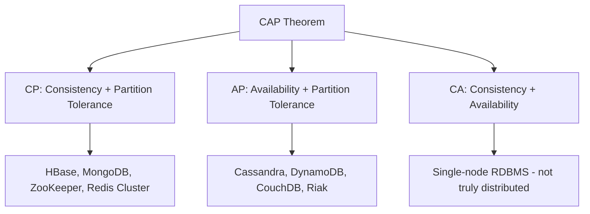
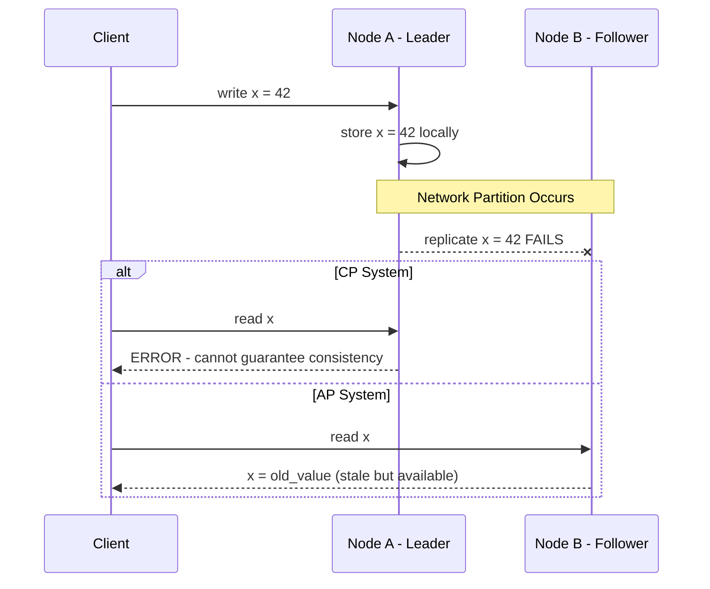

# CAP Theorem

## Introduction
The CAP theorem is one of the most fundamental concepts in distributed systems. It states that a distributed data store can only guarantee **two out of three** properties simultaneously: **Consistency**, **Availability**, and **Partition Tolerance**. Understanding this theorem is critical for making informed trade-off decisions when designing systems at scale.

## Problem Statement
When building a distributed database or data store that spans multiple nodes (or data centres), network partitions are inevitable. During a partition, the system must decide: should it continue serving requests (possibly returning stale data) or should it reject requests to maintain data correctness? The CAP theorem formalises this trade-off.

## Why this exists
Eric Brewer introduced the CAP conjecture in 2000 (later formally proved by Seth Gilbert and Nancy Lynch in 2002). It exists because engineers were building increasingly distributed systems without a clear framework for understanding the fundamental limitations of such systems. CAP provides a mental model for reasoning about these trade-offs.

## Real-world analogy
Imagine two bank branches, each with its own ledger for customer balances, connected by a phone line.

- **If the phone line goes down (partition):** Branch A cannot confirm with Branch B whether a customer already withdrew money. Branch A can either:
  - **Refuse the withdrawal** until the phone is restored → **Consistent** but **not Available**.
  - **Allow the withdrawal** based on its local ledger → **Available** but **not Consistent** (the customer may overdraw).
- **When the phone line is working:** Both branches can synchronise, so you can have both Consistency and Availability.

The phone line going down is the **Partition**. You must choose between C and A.

## Definition
**CAP Theorem**: In a distributed system, when a network partition (P) occurs, you must choose between:
- **Consistency (C):** Every read receives the most recent write or an error.
- **Availability (A):** Every request receives a non-error response, without guarantee that it contains the most recent write.
- **Partition Tolerance (P):** The system continues to operate despite an arbitrary number of messages being dropped or delayed by the network between nodes.

Since network partitions are unavoidable in distributed systems, the real choice is between **CP** and **AP**.

## Key concepts
- **Consistency (C):** All nodes see the same data at the same time. After a write completes, all subsequent reads must return that value.
- **Availability (A):** Every non-failing node returns a response for all read and write requests in a reasonable amount of time.
- **Partition Tolerance (P):** The system continues to function even when network communication between nodes is unreliable.
- **CP Systems:** Sacrifice availability during partitions to maintain consistency (e.g., HBase, MongoDB, ZooKeeper).
- **AP Systems:** Sacrifice consistency during partitions to remain available (e.g., Cassandra, DynamoDB, CouchDB).
- **CA Systems:** Theoretically possible only in a non-distributed (single-node) system where partitions don't exist (e.g., a single-node PostgreSQL).

## Internal working / Mermaid diagram

### CAP Trade-off Triangle



### Partition Scenario Flow



## Python implementation

### Bad implementation
A naive single-node store that does not address distribution at all.

```python
class SingleNodeStore:
    """No distribution, no partition handling."""

    def __init__(self):
        self.data: dict[str, str] = {}

    def write(self, key: str, value: str) -> None:
        self.data[key] = value

    def read(self, key: str) -> str | None:
        return self.data.get(key)
```

### Better implementation
A replicated store that demonstrates the CP vs AP trade-off.

```python
from dataclasses import dataclass, field
from typing import Optional


@dataclass
class Node:
    name: str
    store: dict[str, str] = field(default_factory=dict)
    is_reachable: bool = True

    def write(self, key: str, value: str) -> None:
        self.store[key] = value

    def read(self, key: str) -> Optional[str]:
        return self.store.get(key)


class CPStore:
    """Consistency + Partition Tolerance: rejects writes if not all replicas acknowledge."""

    def __init__(self, nodes: list[Node]):
        self.nodes = nodes

    def write(self, key: str, value: str) -> bool:
        reachable = [n for n in self.nodes if n.is_reachable]
        if len(reachable) < len(self.nodes):
            raise RuntimeError("Partition detected — refusing write to maintain consistency")
        for node in reachable:
            node.write(key, value)
        return True

    def read(self, key: str) -> Optional[str]:
        reachable = [n for n in self.nodes if n.is_reachable]
        if len(reachable) < len(self.nodes):
            raise RuntimeError("Partition detected — cannot guarantee consistent read")
        return reachable[0].read(key)


class APStore:
    """Availability + Partition Tolerance: always serves requests, even with stale data."""

    def __init__(self, nodes: list[Node]):
        self.nodes = nodes

    def write(self, key: str, value: str) -> bool:
        for node in self.nodes:
            if node.is_reachable:
                node.write(key, value)
        return True

    def read(self, key: str) -> Optional[str]:
        for node in self.nodes:
            if node.is_reachable:
                return node.read(key)
        raise RuntimeError("No reachable nodes")
```

### Best implementation
A quorum-based store with configurable consistency level.

```python
from dataclasses import dataclass, field
from enum import Enum
from typing import Optional


class ConsistencyLevel(Enum):
    ONE = 1
    QUORUM = 2
    ALL = 3


@dataclass
class Replica:
    name: str
    data: dict[str, tuple[str, int]] = field(default_factory=dict)
    reachable: bool = True

    def write(self, key: str, value: str, version: int) -> bool:
        if not self.reachable:
            return False
        self.data[key] = (value, version)
        return True

    def read(self, key: str) -> Optional[tuple[str, int]]:
        if not self.reachable:
            return None
        return self.data.get(key)


class QuorumStore:
    """Tunable consistency: ONE (AP-like), QUORUM (balanced), ALL (CP-like)."""

    def __init__(self, replicas: list[Replica]):
        self.replicas = replicas
        self.version = 0

    def _required_acks(self, level: ConsistencyLevel) -> int:
        n = len(self.replicas)
        if level == ConsistencyLevel.ONE:
            return 1
        elif level == ConsistencyLevel.QUORUM:
            return n // 2 + 1
        return n

    def write(self, key: str, value: str, level: ConsistencyLevel = ConsistencyLevel.QUORUM) -> bool:
        self.version += 1
        acks = sum(r.write(key, value, self.version) for r in self.replicas)
        required = self._required_acks(level)
        if acks < required:
            raise RuntimeError(
                f"Write failed: got {acks} acks, needed {required}"
            )
        return True

    def read(self, key: str, level: ConsistencyLevel = ConsistencyLevel.QUORUM) -> Optional[str]:
        responses = [r.read(key) for r in self.replicas]
        valid = [resp for resp in responses if resp is not None]
        required = self._required_acks(level)
        if len(valid) < required:
            raise RuntimeError(
                f"Read failed: got {len(valid)} responses, needed {required}"
            )
        # Return the value with the highest version
        latest = max(valid, key=lambda x: x[1])
        return latest[0]
```

## Java implementation

```java
import java.util.*;
import java.util.concurrent.ConcurrentHashMap;

enum ConsistencyLevel {
    ONE, QUORUM, ALL
}

class Replica {
    final String name;
    final Map<String, Map.Entry<String, Integer>> data = new ConcurrentHashMap<>();
    boolean reachable = true;

    Replica(String name) {
        this.name = name;
    }

    boolean write(String key, String value, int version) {
        if (!reachable) return false;
        data.put(key, Map.entry(value, version));
        return true;
    }

    Optional<Map.Entry<String, Integer>> read(String key) {
        if (!reachable) return Optional.empty();
        return Optional.ofNullable(data.get(key));
    }
}

class QuorumStore {
    private final List<Replica> replicas;
    private int version = 0;

    QuorumStore(List<Replica> replicas) {
        this.replicas = replicas;
    }

    private int requiredAcks(ConsistencyLevel level) {
        int n = replicas.size();
        return switch (level) {
            case ONE -> 1;
            case QUORUM -> n / 2 + 1;
            case ALL -> n;
        };
    }

    boolean write(String key, String value, ConsistencyLevel level) {
        version++;
        long acks = replicas.stream()
            .filter(r -> r.write(key, value, version))
            .count();
        if (acks < requiredAcks(level)) {
            throw new RuntimeException("Write failed: insufficient acks");
        }
        return true;
    }

    Optional<String> read(String key, ConsistencyLevel level) {
        List<Map.Entry<String, Integer>> valid = replicas.stream()
            .map(r -> r.read(key))
            .filter(Optional::isPresent)
            .map(Optional::get)
            .toList();
        if (valid.size() < requiredAcks(level)) {
            throw new RuntimeException("Read failed: insufficient responses");
        }
        return valid.stream()
            .max(Comparator.comparingInt(Map.Entry::getValue))
            .map(Map.Entry::getKey);
    }
}
```

## Step-by-step explanation
1. In a single-node system, there are no partitions, so both C and A are achievable.
2. Once data is replicated across multiple nodes, network failures (partitions) become possible.
3. A **CP system** detects the partition and refuses to serve requests that might be stale, sacrificing availability.
4. An **AP system** continues to serve requests from whichever nodes are reachable, accepting that data may be stale.
5. A **quorum-based** system provides tunable consistency: `ALL` behaves like CP, `ONE` behaves like AP, and `QUORUM` provides a balanced trade-off.

## Multiple real-world examples
1. **DynamoDB (AP):** Amazon designed DynamoDB to always accept writes (even during partitions) to prevent shopping cart losses. It resolves conflicts using vector clocks and last-writer-wins.
2. **MongoDB (CP):** When a primary node fails, MongoDB holds elections and stops writes until a new primary is elected. This ensures consistency but briefly sacrifices availability.
3. **ZooKeeper (CP):** Used for configuration management and leader election. During partitions, minority partitions become read-only to maintain consistency.
4. **Cassandra (AP):** Uses tunable consistency (ONE, QUORUM, ALL). By default, it favours availability with eventual consistency via anti-entropy repair.
5. **Google Spanner (Technically CP):** Uses TrueTime (GPS + atomic clocks) to achieve external consistency with very high availability. It is practically a "CA-like" system because Google's network minimises partitions.

## Pros
- Provides a clear mental model for distributed system trade-offs.
- Helps engineers choose the right database for their use case.
- Forces explicit decision-making about failure behaviour.
- Universally understood vocabulary in system design discussions.

## Cons
- Often oversimplified: real systems offer tunable consistency, not a binary choice.
- Partitions are rare in well-managed networks, making the theorem less relevant for normal operations (see PACELC).
- Does not address latency trade-offs.
- "Availability" in CAP means every non-failing node responds, which differs from operational availability (uptime percentage).

## Interview questions

### Beginner
- **Q: What are the three properties in the CAP theorem?**
  - **A:** Consistency (all nodes see the same data), Availability (every request gets a response), and Partition Tolerance (system works despite network failures).

- **Q: Can a distributed system guarantee all three CAP properties?**
  - **A:** No. During a network partition, you must choose between Consistency and Availability. Partition Tolerance is mandatory in distributed systems.

### Intermediate
- **Q: Why is Partition Tolerance considered mandatory?**
  - **A:** Network failures are inevitable in distributed systems. You cannot choose to not have partitions. Therefore, the real choice is between CP and AP.

- **Q: How does a quorum-based system relate to CAP?**
  - **A:** With quorum reads/writes (R + W > N), you can achieve strong consistency. But during a partition, if a quorum is unreachable, the system becomes unavailable for those keys.

### Senior
- **Q: Classify MongoDB, Cassandra, and ZooKeeper using the CAP theorem and explain why.**
  - **A:** MongoDB is CP — it elects a new primary during failure and pauses writes. Cassandra is AP — it allows writes to any node and reconciles later. ZooKeeper is CP — minority partitions become read-only to maintain a consistent view.

- **Q: What are the limitations of the CAP theorem?**
  - **A:** It presents a binary choice, but real systems have tunable consistency. It ignores latency. It defines availability as "every non-failed node responds," which does not match operational SLAs. The PACELC theorem addresses some of these gaps.

### Staff Engineer
- **Q: How would you design a system that behaves as CP for financial transactions and AP for product catalog reads?**
  - **A:** Use a polyglot persistence strategy. Store financial data in a CP database (e.g., PostgreSQL with synchronous replication or CockroachDB). Serve the product catalog from an AP store (e.g., DynamoDB or Cassandra) with eventual consistency. Use an API gateway to route requests to the appropriate datastore based on the operation type.

- **Q: Google Spanner claims to be "effectively CA." How is this possible?**
  - **A:** Spanner uses TrueTime (GPS + atomic clocks) for globally consistent timestamps, and Google's private network is engineered to have extremely low partition probability. It technically sacrifices availability during partitions (making it CP), but partitions are so rare on Google's network that it practically achieves CA behaviour. This is a function of extraordinary infrastructure investment, not a violation of CAP.

## Common mistakes
- Saying a system is "CA" in a distributed setting — this is impossible when partitions can occur.
- Treating CAP as a permanent, static choice — many systems allow tunable consistency per operation.
- Confusing CAP's definition of "availability" with operational uptime (e.g., 99.99% SLA).
- Ignoring latency: CAP does not account for how long a consistent read takes.
- Forgetting that CAP only applies during a partition — when there is no partition, you can have both C and A.

## Best practices
- **Understand your failure mode:** Decide upfront whether your system should fail closed (CP) or fail open (AP).
- **Use tunable consistency:** Systems like Cassandra allow per-query consistency levels — use strong consistency for critical writes and eventual consistency for reads.
- **Complement with PACELC:** Use the PACELC theorem to also reason about latency vs. consistency during normal operations.
- **Design for partition recovery:** Have a clear reconciliation strategy (last-writer-wins, vector clocks, CRDTs) for when partitions heal.
- **Test with chaos engineering:** Simulate partitions to verify your system behaves as expected under failure.

## When NOT to use
- **Single-node systems:** CAP is irrelevant when there is only one node — there are no partitions.
- **Non-distributed applications:** Desktop apps, CLI tools, or in-process caches do not need CAP reasoning.
- **When latency is the primary concern:** Use PACELC instead, which extends CAP to cover latency vs. consistency trade-offs during normal operations.

## Comparison with similar concepts
- **PACELC Theorem:** Extends CAP to include the latency vs. consistency trade-off during normal (non-partitioned) operations.
- **BASE (Basically Available, Soft state, Eventually consistent):** A design philosophy for AP systems, contrasting with ACID.
- **ACID:** Transaction properties (Atomicity, Consistency, Isolation, Durability) — CAP's "C" is different from ACID's "C."
- **Consistency Models:** CAP's consistency is linearizability; consistency models describe a broader spectrum (eventual, causal, sequential, etc.).

## Summary
The CAP theorem is the cornerstone of distributed systems theory. It states that during a network partition, a distributed system must choose between consistency and availability. Since partitions are inevitable, the practical choice is between CP (consistent but may reject requests) and AP (available but may serve stale data). Modern systems like Cassandra and DynamoDB offer tunable consistency, making the choice per-operation rather than per-system. Understanding CAP is essential for system design interviews and real-world architecture decisions.

## Related topics
- [PACELC Theorem](../pacelc)
- [Consistency Models](../consistency-models)
- [Availability](../availability)
- [Fault Tolerance](../fault-tolerance)
