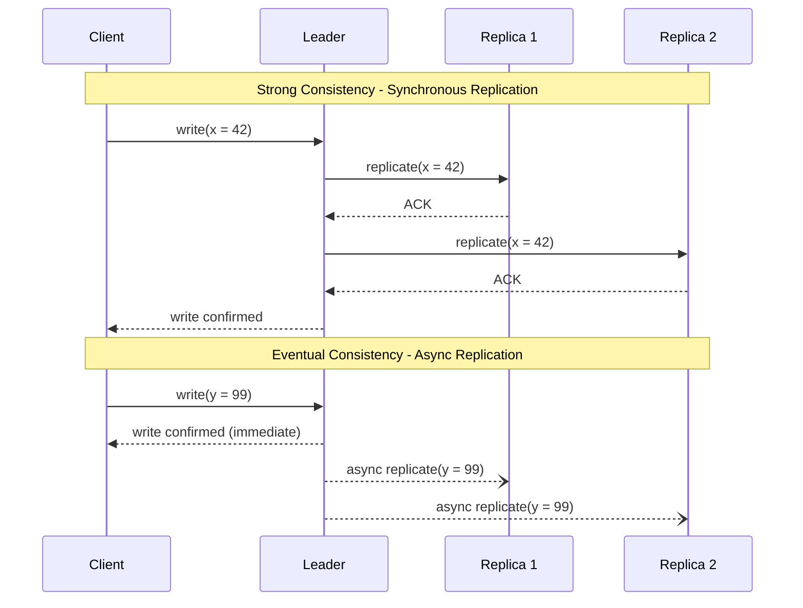
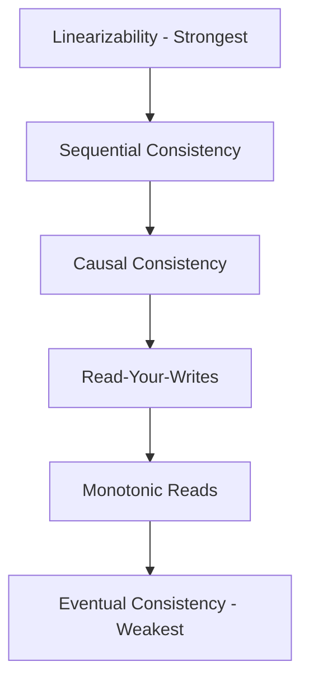

# Consistency Models

## Introduction
Consistency models define the rules for how data reads and writes behave across replicas in a distributed system. They are the contract between the system and the application — specifying when a read is guaranteed to reflect a previous write. Choosing the right consistency model is one of the most impactful architectural decisions in distributed system design.

## Problem Statement
In distributed systems, the same value can exist on multiple replicas spread across different nodes, data centres, or even continents. When a client writes to one replica, how quickly and reliably should other replicas reflect that change? If a client reads from a different replica, what value should it see? These questions are answered by the consistency model.

## Why this exists
Different applications require different consistency guarantees. A banking system cannot tolerate reading a stale account balance, while a social media feed can comfortably show a post a few seconds late. Consistency models provide a formal vocabulary for expressing these requirements and choosing the right trade-offs between correctness, latency, and availability.

## Real-world analogy
Imagine an online document shared across multiple editors in different time zones:

- **Strong consistency:** When Alice saves a change in New York, Bob in Tokyo immediately sees the update before making his next edit. This prevents conflicts but may feel slow.
- **Eventual consistency:** Alice saves, and Bob may see the old version for a few seconds before the change propagates. Faster, but Bob might temporarily edit based on stale data.
- **Causal consistency:** If Alice writes "Hello" and then "World" (and "World" depends on "Hello"), Bob will always see "Hello" before "World" — but he might see other unrelated changes in any order.

## Definition
A **consistency model** is a contract between the distributed system and the application that defines when reads reflect recent writes. It determines the ordering and visibility guarantees of operations across replicas.

### Spectrum of consistency models (strongest to weakest):

| Model | Guarantee | Latency | Use Case |
|-------|-----------|---------|----------|
| **Linearizability** | Real-time ordering; all ops appear instantaneous | Highest | Distributed locks, leader election |
| **Sequential** | All processes see the same order | High | Shared counters |
| **Causal** | Causally related ops are ordered; concurrent ops are unordered | Medium | Collaborative editing, messaging |
| **Read-your-writes** | A client always sees its own updates | Medium | User profiles, settings |
| **Monotonic reads** | A client never sees older data after seeing newer data | Low-Medium | News feeds, dashboards |
| **Eventual** | All replicas converge to the same value eventually | Lowest | DNS, CDN caches, social likes |

## Key concepts
- **Linearizability (Strong consistency):** Every operation appears to take effect atomically at a single point in time. All clients see the same order of operations, and that order respects real-time.
- **Sequential consistency:** All operations appear in some sequential order, and each process's operations appear in program order. However, this order does not need to respect real-time.
- **Causal consistency:** Operations that are causally related appear in the same order at all nodes. Concurrent (unrelated) operations may appear in different orders at different nodes.
- **Read-your-writes:** A client always sees the result of its own writes, even if it reads from a different replica.
- **Monotonic reads:** Once a client reads a value, subsequent reads will never return an older value.
- **Eventual consistency:** If no new writes occur, all replicas will eventually converge to the same value. No ordering guarantees during convergence.

## Internal working

### Replica update flow (Strong vs. Eventual)



### Consistency Hierarchy



## Python implementation

### Bad implementation
A store with no versioning, no replication — cannot detect stale data.

```python
class SimpleStore:
    """No distribution, no staleness awareness."""

    def __init__(self):
        self.store: dict[str, int] = {}

    def write(self, key: str, value: int) -> None:
        self.store[key] = value

    def read(self, key: str) -> int | None:
        return self.store.get(key)
```

### Better implementation
A versioned store that detects stale reads using version metadata.

```python
from dataclasses import dataclass
from typing import Optional


@dataclass
class VersionedValue:
    value: int
    version: int


class VersionedStore:
    """Tracks versions so clients can detect stale data."""

    def __init__(self):
        self.store: dict[str, VersionedValue] = {}

    def write(self, key: str, value: int) -> VersionedValue:
        current = self.store.get(key)
        version = (current.version + 1) if current else 1
        entry = VersionedValue(value=value, version=version)
        self.store[key] = entry
        return entry

    def read(self, key: str) -> Optional[VersionedValue]:
        return self.store.get(key)

    def is_stale(self, key: str, client_version: int) -> bool:
        current = self.store.get(key)
        if current is None:
            return False
        return client_version < current.version
```

### Best implementation
A quorum-based replicated store that supports multiple consistency models.

```python
from dataclasses import dataclass, field
from enum import Enum
from typing import Optional


class ConsistencyModel(Enum):
    EVENTUAL = "eventual"          # Read from any single replica
    READ_YOUR_WRITES = "ryw"       # Track client's last write version
    QUORUM = "quorum"              # Read from majority
    LINEARIZABLE = "linearizable"  # Read from all (strongest)


@dataclass
class Replica:
    name: str
    store: dict[str, tuple[int, int]] = field(default_factory=dict)  # key -> (value, version)

    def read(self, key: str) -> Optional[tuple[int, int]]:
        return self.store.get(key)

    def write(self, key: str, value: int, version: int) -> None:
        self.store[key] = (value, version)


class ConsistentStore:
    """Supports multiple consistency models through quorum and version tracking."""

    def __init__(self, replicas: list[Replica]):
        self.replicas = replicas
        self.version = 0
        self.client_versions: dict[str, int] = {}  # client_id -> last write version

    def write(self, key: str, value: int, client_id: str = "default") -> int:
        self.version += 1
        for replica in self.replicas:
            replica.write(key, value, self.version)
        self.client_versions[client_id] = self.version
        return self.version

    def read(self, key: str, model: ConsistencyModel, client_id: str = "default") -> Optional[int]:
        if model == ConsistencyModel.EVENTUAL:
            # Read from first available replica
            result = self.replicas[0].read(key)
            return result[0] if result else None

        elif model == ConsistencyModel.READ_YOUR_WRITES:
            # Read from replica with version >= client's last write
            min_version = self.client_versions.get(client_id, 0)
            for replica in self.replicas:
                result = replica.read(key)
                if result and result[1] >= min_version:
                    return result[0]
            return None

        elif model == ConsistencyModel.QUORUM:
            quorum_size = len(self.replicas) // 2 + 1
            responses = [r.read(key) for r in self.replicas]
            valid = [resp for resp in responses if resp is not None]
            if len(valid) < quorum_size:
                raise RuntimeError("Quorum not met")
            return max(valid, key=lambda x: x[1])[0]

        elif model == ConsistencyModel.LINEARIZABLE:
            # Read from ALL replicas and return latest
            responses = [r.read(key) for r in self.replicas]
            valid = [resp for resp in responses if resp is not None]
            if len(valid) < len(self.replicas):
                raise RuntimeError("Not all replicas responded — cannot guarantee linearizability")
            return max(valid, key=lambda x: x[1])[0]

        return None
```

## Java implementation

```java
import java.util.*;
import java.util.concurrent.ConcurrentHashMap;

enum ConsistencyModel {
    EVENTUAL, READ_YOUR_WRITES, QUORUM, LINEARIZABLE
}

class Replica {
    final String name;
    // key -> {value, version}
    final Map<String, int[]> store = new ConcurrentHashMap<>();

    Replica(String name) {
        this.name = name;
    }

    void write(String key, int value, int version) {
        store.put(key, new int[]{value, version});
    }

    Optional<int[]> read(String key) {
        return Optional.ofNullable(store.get(key));
    }
}

class ConsistentStore {
    private final List<Replica> replicas;
    private int version = 0;
    private final Map<String, Integer> clientVersions = new ConcurrentHashMap<>();

    ConsistentStore(List<Replica> replicas) {
        this.replicas = replicas;
    }

    int write(String key, int value, String clientId) {
        version++;
        for (Replica r : replicas) {
            r.write(key, value, version);
        }
        clientVersions.put(clientId, version);
        return version;
    }

    Optional<Integer> read(String key, ConsistencyModel model, String clientId) {
        return switch (model) {
            case EVENTUAL -> replicas.get(0).read(key).map(v -> v[0]);

            case READ_YOUR_WRITES -> {
                int minVersion = clientVersions.getOrDefault(clientId, 0);
                yield replicas.stream()
                    .map(r -> r.read(key))
                    .filter(Optional::isPresent)
                    .map(Optional::get)
                    .filter(v -> v[1] >= minVersion)
                    .findFirst()
                    .map(v -> v[0]);
            }

            case QUORUM -> {
                int quorum = replicas.size() / 2 + 1;
                List<int[]> valid = replicas.stream()
                    .map(r -> r.read(key))
                    .filter(Optional::isPresent)
                    .map(Optional::get)
                    .toList();
                if (valid.size() < quorum) {
                    throw new RuntimeException("Quorum not met");
                }
                yield valid.stream()
                    .max(Comparator.comparingInt(v -> v[1]))
                    .map(v -> v[0]);
            }

            case LINEARIZABLE -> {
                List<int[]> valid = replicas.stream()
                    .map(r -> r.read(key))
                    .filter(Optional::isPresent)
                    .map(Optional::get)
                    .toList();
                if (valid.size() < replicas.size()) {
                    throw new RuntimeException("Cannot guarantee linearizability");
                }
                yield valid.stream()
                    .max(Comparator.comparingInt(v -> v[1]))
                    .map(v -> v[0]);
            }
        };
    }
}
```

## Step-by-step explanation
1. The **bad example** stores values in a plain dictionary — it has no distribution, no version tracking, and no way to detect stale data.
2. The **better example** adds version metadata so clients can detect whether their local value is outdated.
3. The **best example** implements a replicated store supporting four different consistency models. `EVENTUAL` reads from a single replica (fast but possibly stale). `READ_YOUR_WRITES` ensures a client always sees its own writes. `QUORUM` requires majority agreement. `LINEARIZABLE` requires all replicas to respond with the same data.

## Multiple real-world examples
1. **Google Spanner (Linearizable):** Uses TrueTime (GPS + atomic clocks) to provide external consistency — the strongest form of consistency — across globally distributed data centres.
2. **DynamoDB (Eventual by default):** Reads are eventually consistent by default. Strongly consistent reads are available at 2x the cost and higher latency.
3. **MongoDB (Read-your-writes with `readConcern: majority`):** A client that writes to the primary and reads with `readConcern: majority` is guaranteed to see its own writes.
4. **Cassandra (Tunable):** Setting `CONSISTENCY ONE` gives eventual consistency. `QUORUM` gives strong consistency when combined with `QUORUM` writes. `ALL` gives linearizability at the cost of availability.
5. **DNS (Eventual):** DNS records propagate across the internet over hours. Old records may be served until TTL expires. This is a classic example of eventual consistency in action.

## Pros
- **Linearizability** simplifies reasoning — developers can treat the system as a single machine.
- **Eventual consistency** provides the best availability and lowest latency.
- **Causal consistency** preserves meaningful ordering without the overhead of full linearizability.
- **Read-your-writes** provides a good user experience without global synchronisation.
- **Tunable consistency** lets teams choose the right trade-off per use case.

## Cons
- **Linearizability** increases latency and reduces availability during partitions.
- **Eventual consistency** can expose stale reads, leading to confusing user experiences.
- **Causal consistency** is complex to implement correctly (requires vector clocks or dependency tracking).
- **Mixed consistency** within a system increases operational complexity and makes debugging harder.

## Interview questions

### Beginner
- **Q: What is eventual consistency?**
  - **A:** A model where replicas eventually converge to the same data after updates. If no new writes occur, all replicas will eventually return the same value.

- **Q: What is the difference between strong and eventual consistency?**
  - **A:** Strong consistency guarantees that all reads after a write return the written value. Eventual consistency only guarantees convergence over time — reads during the convergence window may return stale values.

### Intermediate
- **Q: How does quorum read/write help achieve strong consistency?**
  - **A:** By requiring R + W > N (read replicas + write replicas > total replicas), you guarantee that at least one replica in every read set has the latest write. This ensures the client always sees the most recent data.

- **Q: Explain the difference between sequential consistency and linearizability.**
  - **A:** Both ensure all processes see the same order of operations. Linearizability additionally requires that this order respects real-time — if operation A finishes before operation B starts, A must appear before B in the global order. Sequential consistency does not have this real-time constraint.

### Senior
- **Q: When would you choose causal consistency over eventual consistency?**
  - **A:** When preserving the order of related operations matters — e.g., in a messaging app, if User A sends "How are you?" and then "I'm heading out," recipients must see them in that order. Causal consistency guarantees this while allowing unrelated messages to be reordered for lower latency.

- **Q: How do CRDTs relate to eventual consistency?**
  - **A:** CRDTs (Conflict-free Replicated Data Types) are data structures designed to ensure that concurrent updates on different replicas converge to the same state without coordination. They are the building blocks for implementing eventually consistent systems that avoid conflicts (e.g., counters, sets, text editors).

### Staff Engineer
- **Q: Design a hybrid model that supports both strong and eventual consistency for different endpoints.**
  - **A:** Use strong consistency for critical metadata (user balances, inventory counts) by routing through a synchronously replicated primary. Use eventual consistency for user-facing caches and read-heavy endpoints (product listings, recommendations) by serving from asynchronous replicas. Define clear API-level contracts specifying the consistency model for each endpoint and surface staleness indicators (e.g., `X-Consistency: eventual`) in response headers.

- **Q: How does Google Spanner achieve external consistency without sacrificing performance?**
  - **A:** Spanner uses TrueTime — a clock synchronisation protocol based on GPS receivers and atomic clocks — to provide tight bounds on clock uncertainty. Transactions are assigned globally meaningful timestamps, and commit waits ensure that any transaction that starts after another will see its effects. Google's private network minimises clock drift, making the wait times negligibly small (typically a few milliseconds).

## Common mistakes
- Confusing availability with consistency — a system can be available but serve stale data.
- Assuming eventual consistency means data is "always stale" — it means data **converges** eventually.
- Omitting version metadata when building replicated state — without versions, you cannot detect or resolve conflicts.
- Using the same consistency level for all operations — critical operations need strong consistency, while read-heavy analytics can use eventual.
- Forgetting that consistency models apply **per key** in most systems, not globally.

## Best practices
- Document the consistency model for each API endpoint.
- Choose the default consistency level based on the read/write profile and business criticality.
- Use version vectors or timestamps for conflict resolution in eventually consistent systems.
- Implement read-your-writes at the session level to provide a good user experience without global strong consistency.
- Test with simulated network delays and partitions to verify consistency guarantees hold under stress.

## When NOT to use
- **Strong consistency** is not ideal for high-traffic read caches where staleness is acceptable.
- **Eventual consistency** is not appropriate for financial ledgers, inventory management, or any system where stale reads cause monetary loss.
- **Causal consistency** is unnecessary for independent, unrelated data (e.g., analytics events).

## Comparison with similar concepts
- **CAP Theorem:** Consistency is one of the three trade-off dimensions. CAP's "C" specifically refers to linearizability.
- **Replication:** Consistency describes how replicas agree on state — replication is the mechanism.
- **Availability:** A system can be available while relaxing consistency (AP systems).
- **PACELC:** Extends CAP to include the latency vs. consistency trade-off during normal operations.

## Summary
Consistency models are essential to distributed system design. They range from linearizability (strongest, highest latency) to eventual consistency (weakest, lowest latency). The right model depends on business requirements — financial systems need strong consistency, while social feeds can use eventual consistency. Modern databases like Cassandra, DynamoDB, and Cosmos DB offer tunable consistency, letting engineers choose per operation. Understanding the full spectrum of consistency models is critical for system design interviews and production architecture.

## Related topics
- [CAP Theorem](../cap-theorem)
- [PACELC Theorem](../pacelc)
- [Availability](../availability)
- [Fault Tolerance](../fault-tolerance)
