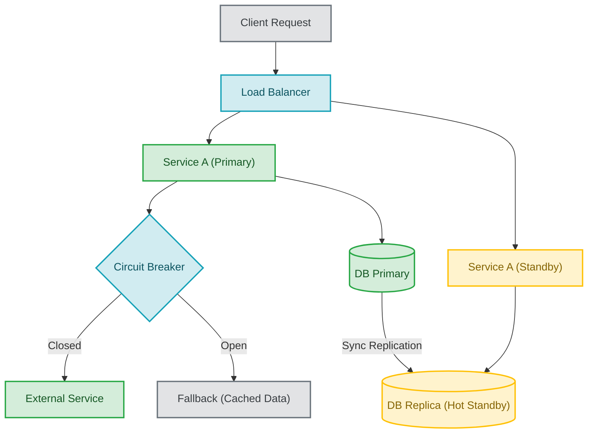
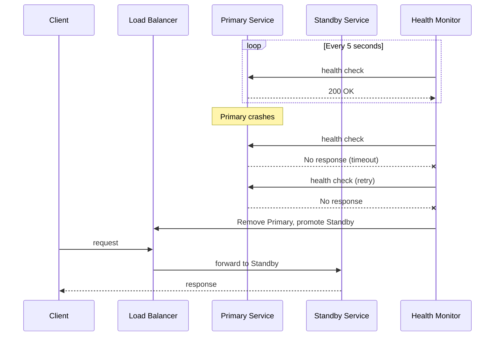
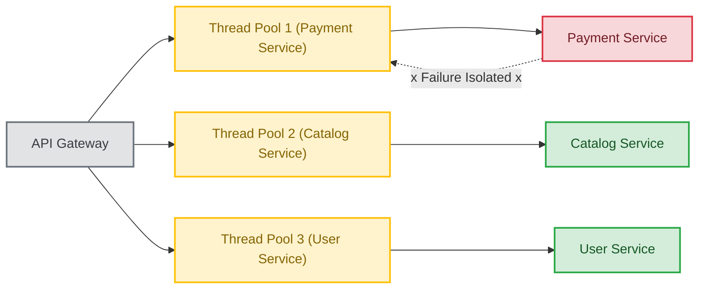

# Fault Tolerance

## Introduction
Fault tolerance is a system's ability to continue operating correctly even when one or more components fail. It is not about preventing failures — failures are inevitable in distributed systems. It is about **surviving failures gracefully**, ensuring that the system continues to serve users even when hardware crashes, software bugs occur, or network links go down.

## Problem Statement
Hardware, software, and network failures happen frequently in large-scale systems. Google reports that in a cluster of 10,000 servers, about 1,000 will experience a hard drive failure per year, and network partitions occur regularly. Systems must survive these faults without total collapse, data loss, or prolonged outages.

## Why this exists
Users expect services to keep functioning during failures. A single server crash should not bring down an entire e-commerce platform. A network partition between data centres should not prevent users from accessing their data. Fault tolerance prevents outages and enables graceful degradation — where the system continues with reduced functionality rather than failing completely.

## Real-world analogy
An airplane has redundant engines, avionics, and control systems so it can safely continue flight if one component fails:

- **Dual engines:** If one engine fails, the other keeps the plane flying.
- **Triple-redundant flight computers:** Decisions require majority agreement; one faulty computer is outvoted.
- **Backup hydraulic systems:** If the primary hydraulics fail, backup systems control the flight surfaces.

The airplane does not prevent failures — it is designed to **survive** them.

## Definition
**Fault tolerance** is the capacity of a system to detect failures and continue functioning by switching to backup resources, degrading gracefully, or isolating the failed component to prevent the failure from spreading.

### Types of faults

| Fault Type | Example | Handling Strategy |
|-----------|---------|-------------------|
| **Crash fault** | Server process dies | Restart, failover to replica |
| **Omission fault** | Network packet dropped | Retry, timeout + fallback |
| **Timing fault** | Response arrives too late | Timeout, async processing |
| **Byzantine fault** | Node sends wrong data | Consensus protocols (Raft, PBFT) |

## Key concepts
- **Redundancy:** Duplicate components so that if one fails, another takes over.
- **Graceful degradation:** Reduced functionality instead of complete failure (e.g., show cached results instead of real-time data).
- **Failover:** Automatic recovery to a standby unit when the primary fails.
- **Isolation (Bulkheading):** Preventing a failure in one component from propagating to others.
- **Circuit breaker:** Stopping calls to a failing dependency to prevent cascading failure.
- **Fallback:** An alternative response path when the primary path fails.
- **Checkpointing:** Saving system state periodically so recovery starts from the last checkpoint, not from scratch.
- **Replication:** Maintaining copies of data and services across multiple nodes.

## Internal working
Fault tolerance uses multiple replicas, retries, circuit breakers, fallback logic, bulkheading, and health monitoring. The key principle is that **every component that can fail must have a backup plan.**

### Fault Tolerance Architecture



### Failover Sequence



### Bulkhead Pattern



## Python implementation

### Bad implementation
A direct call without any failure handling.

```python
class FragileService:
    """No fault tolerance: any failure crashes the entire request."""

    def call_dependency(self) -> str:
        raise ConnectionError("dependency unavailable")

    def handle_request(self, request: str) -> str:
        result = self.call_dependency()
        return f"processed {request} with {result}"
```

### Better implementation
A service with fallback and basic retry logic.

```python
class ResilientService:
    """Basic fault tolerance with fallback."""

    def __init__(self, primary, fallback_response: str = "cached result"):
        self.primary = primary
        self.fallback_response = fallback_response

    def handle_request(self, request: str) -> str:
        try:
            return self.primary.handle_request(request)
        except Exception:
            return f"[FALLBACK] {self.fallback_response} for {request}"
```

### Best implementation
A production-grade fault-tolerant service with circuit breaker, bulkheading, retry, and fallback.

```python
import time
import random
from dataclasses import dataclass, field
from enum import Enum
from typing import Optional, Callable, Any
from concurrent.futures import ThreadPoolExecutor, TimeoutError


class CircuitState(Enum):
    CLOSED = "closed"
    OPEN = "open"
    HALF_OPEN = "half_open"


@dataclass
class CircuitBreaker:
    """Prevents cascading failures by stopping calls to a failing service."""
    failure_threshold: int = 5
    reset_timeout: float = 30.0
    failures: int = 0
    state: CircuitState = CircuitState.CLOSED
    last_failure: float = 0.0

    def allow(self) -> bool:
        if self.state == CircuitState.CLOSED:
            return True
        if self.state == CircuitState.OPEN:
            if time.time() - self.last_failure >= self.reset_timeout:
                self.state = CircuitState.HALF_OPEN
                return True
            return False
        return True

    def on_success(self) -> None:
        self.failures = 0
        self.state = CircuitState.CLOSED

    def on_failure(self) -> None:
        self.failures += 1
        self.last_failure = time.time()
        if self.failures >= self.failure_threshold:
            self.state = CircuitState.OPEN


@dataclass
class Bulkhead:
    """Isolates failures by limiting concurrent requests per dependency."""
    name: str
    max_concurrent: int = 10
    executor: ThreadPoolExecutor = field(init=False)

    def __post_init__(self):
        self.executor = ThreadPoolExecutor(
            max_workers=self.max_concurrent,
            thread_name_prefix=f"bulkhead-{self.name}",
        )

    def execute(self, func: Callable, timeout: float = 5.0) -> Any:
        future = self.executor.submit(func)
        try:
            return future.result(timeout=timeout)
        except TimeoutError:
            future.cancel()
            raise


class FaultTolerantService:
    """
    Production fault tolerance with:
    - Circuit breaker (prevents cascading failures)
    - Bulkhead (isolates dependencies)
    - Retry with exponential backoff + jitter
    - Multi-level fallback
    - Health monitoring
    """

    def __init__(self):
        self.breakers: dict[str, CircuitBreaker] = {}
        self.bulkheads: dict[str, Bulkhead] = {}
        self.cache: dict[str, str] = {}

    def register_dependency(
        self, name: str, max_concurrent: int = 10, failure_threshold: int = 5
    ) -> None:
        self.breakers[name] = CircuitBreaker(failure_threshold=failure_threshold)
        self.bulkheads[name] = Bulkhead(name=name, max_concurrent=max_concurrent)

    def call(
        self,
        dependency: str,
        func: Callable[[], str],
        fallback: Optional[Callable[[], str]] = None,
        max_retries: int = 3,
        cache_key: Optional[str] = None,
    ) -> str:
        breaker = self.breakers.get(dependency)
        bulkhead = self.bulkheads.get(dependency)

        if not breaker or not bulkhead:
            raise ValueError(f"Unknown dependency: {dependency}")

        # Check circuit breaker
        if not breaker.allow():
            return self._fallback(fallback, cache_key, dependency)

        # Retry with backoff inside bulkhead
        for attempt in range(1, max_retries + 1):
            try:
                result = bulkhead.execute(func, timeout=5.0)
                breaker.on_success()
                if cache_key:
                    self.cache[cache_key] = result
                return result
            except Exception:
                breaker.on_failure()
                if attempt < max_retries:
                    delay = min(0.1 * (2 ** (attempt - 1)), 2.0)
                    time.sleep(delay * (0.5 + random.random()))

        return self._fallback(fallback, cache_key, dependency)

    def _fallback(
        self, fallback: Optional[Callable], cache_key: Optional[str], dep: str
    ) -> str:
        # Level 1: Use explicit fallback function
        if fallback:
            try:
                return fallback()
            except Exception:
                pass
        # Level 2: Return cached response
        if cache_key and cache_key in self.cache:
            return f"[CACHED] {self.cache[cache_key]}"
        # Level 3: Return degraded response
        return f"[DEGRADED] {dep} is unavailable"
```

## Java implementation

```java
import java.util.*;
import java.util.concurrent.*;
import java.util.concurrent.atomic.*;
import java.util.function.Supplier;

enum CircuitState {
    CLOSED, OPEN, HALF_OPEN
}

class CircuitBreaker {
    private final int failureThreshold;
    private final long resetTimeoutMs;
    private final AtomicInteger failures = new AtomicInteger(0);
    private volatile CircuitState state = CircuitState.CLOSED;
    private volatile long lastFailure = 0;

    CircuitBreaker(int failureThreshold, long resetTimeoutMs) {
        this.failureThreshold = failureThreshold;
        this.resetTimeoutMs = resetTimeoutMs;
    }

    boolean allow() {
        if (state == CircuitState.CLOSED) return true;
        if (state == CircuitState.OPEN &&
            System.currentTimeMillis() - lastFailure >= resetTimeoutMs) {
            state = CircuitState.HALF_OPEN;
            return true;
        }
        return state == CircuitState.HALF_OPEN;
    }

    void onSuccess() {
        failures.set(0);
        state = CircuitState.CLOSED;
    }

    void onFailure() {
        lastFailure = System.currentTimeMillis();
        if (failures.incrementAndGet() >= failureThreshold) {
            state = CircuitState.OPEN;
        }
    }
}

class Bulkhead {
    private final ExecutorService executor;
    private final String name;

    Bulkhead(String name, int maxConcurrent) {
        this.name = name;
        this.executor = Executors.newFixedThreadPool(maxConcurrent);
    }

    <T> T execute(Callable<T> task, long timeoutMs) throws Exception {
        Future<T> future = executor.submit(task);
        try {
            return future.get(timeoutMs, TimeUnit.MILLISECONDS);
        } catch (TimeoutException e) {
            future.cancel(true);
            throw e;
        }
    }
}

class FaultTolerantService {
    private final Map<String, CircuitBreaker> breakers = new ConcurrentHashMap<>();
    private final Map<String, Bulkhead> bulkheads = new ConcurrentHashMap<>();
    private final Map<String, String> cache = new ConcurrentHashMap<>();

    void registerDependency(String name, int maxConcurrent, int failureThreshold) {
        breakers.put(name, new CircuitBreaker(failureThreshold, 30000));
        bulkheads.put(name, new Bulkhead(name, maxConcurrent));
    }

    String call(String dep, Callable<String> task,
                Supplier<String> fallback, int maxRetries, String cacheKey) {
        CircuitBreaker breaker = breakers.get(dep);
        Bulkhead bulkhead = bulkheads.get(dep);

        if (!breaker.allow()) {
            return doFallback(fallback, cacheKey, dep);
        }

        for (int attempt = 1; attempt <= maxRetries; attempt++) {
            try {
                String result = bulkhead.execute(task, 5000);
                breaker.onSuccess();
                if (cacheKey != null) cache.put(cacheKey, result);
                return result;
            } catch (Exception e) {
                breaker.onFailure();
                if (attempt < maxRetries) {
                    try {
                        long delay = Math.min(100 * (1L << (attempt - 1)), 2000);
                        Thread.sleep(delay);
                    } catch (InterruptedException ie) {
                        Thread.currentThread().interrupt();
                    }
                }
            }
        }
        return doFallback(fallback, cacheKey, dep);
    }

    private String doFallback(Supplier<String> fallback, String cacheKey, String dep) {
        if (fallback != null) {
            try { return fallback.get(); } catch (Exception ignored) {}
        }
        if (cacheKey != null && cache.containsKey(cacheKey)) {
            return "[CACHED] " + cache.get(cacheKey);
        }
        return "[DEGRADED] " + dep + " is unavailable";
    }
}
```

## Step-by-step explanation
1. A **fragile system** fails on the first error — any dependency failure crashes the entire request.
2. A **basic fallback** catches exceptions and returns an alternative response — the system stays up but with reduced data.
3. A **circuit breaker** detects persistent failures and stops sending traffic to the broken dependency, preventing cascading failures across the system.
4. A **bulkhead** isolates each dependency into its own thread pool — if the payment service hangs, it does not consume threads needed for the catalog service.
5. **Multi-level fallback** provides three tiers: explicit fallback function, cached response, and degraded response — ensuring the system always returns something useful.

## Multiple real-world examples
1. **Netflix:** Uses Hystrix (now Resilience4j) for circuit breaking and bulkheading. Each microservice dependency is isolated, and failures in one service do not cascade to others. Netflix also runs Chaos Monkey to randomly kill production instances to validate fault tolerance.
2. **AWS S3:** Replicates objects across multiple Availability Zones. If one AZ goes down, data is served from another. Provides 99.999999999% (11 nines) durability.
3. **Google Spanner:** Uses Paxos consensus for fault-tolerant replication. Can tolerate the failure of an entire data centre without losing data or availability.
4. **Kubernetes:** Automatically restarts crashed containers, reschedules pods to healthy nodes, and performs rolling updates with health checks — all forms of automated fault tolerance.
5. **Cassandra:** Uses a peer-to-peer architecture with no single point of failure. Data is replicated across multiple nodes, and the system continues operating even if several nodes go down.

## Pros
- Improves service continuity and user experience.
- Limits failure domains through isolation (bulkheading).
- Builds confidence in deploying and operating complex distributed systems.
- Enables zero-downtime maintenance through failover mechanisms.

## Cons
- Adds engineering complexity — circuit breakers, bulkheads, and fallbacks must be carefully designed and tested.
- Fallback behaviour may lead to reduced user experience (stale data, missing features).
- Requires thorough testing — fault tolerance code is exercised infrequently, making bugs hard to find.
- Can mask underlying issues if not paired with proper monitoring and alerting.

## Interview questions

### Beginner
- **Q: What is fault tolerance?**
  - **A:** The ability of a system to keep functioning despite component failures. The system detects the failure and recovers automatically, either by switching to a backup or degrading gracefully.

- **Q: What is the difference between fault tolerance and fault prevention?**
  - **A:** Fault prevention tries to stop failures from occurring (better hardware, code reviews). Fault tolerance accepts that failures will happen and designs the system to survive them.

### Intermediate
- **Q: How does graceful degradation support fault tolerance?**
  - **A:** Instead of returning an error when a component fails, the system provides reduced functionality. For example, if the recommendation engine is down, the e-commerce site shows popular products instead of personalised recommendations.

- **Q: Explain the bulkhead pattern.**
  - **A:** Named after ship bulkheads that contain flooding, the pattern isolates different parts of a system so that a failure in one does not affect others. For example, using separate thread pools for each dependency ensures a slow payment service does not consume threads needed for the catalog service.

### Senior
- **Q: How would you design a fault-tolerant service that depends on three external APIs?**
  - **A:** Wrap each dependency with a circuit breaker and a dedicated thread pool (bulkhead). Implement retries with exponential backoff for transient failures. Provide fallback responses (cached data or degraded results) for each dependency. Use a dead letter queue for operations that cannot be retried. Monitor circuit breaker states and alert on state transitions.

- **Q: What is the difference between active-active and active-passive failover?**
  - **A:** Active-active: all nodes handle traffic simultaneously; if one fails, the others absorb its load (higher utilisation, more complex). Active-passive: only the primary handles traffic; the standby is idle until failover (simpler, lower utilisation but wasted resources).

### Staff Engineer
- **Q: Architect a fault-tolerant system that remains usable during a complete regional outage.**
  - **A:** Deploy in at least 3 regions with active-active architecture. Use DNS-based global load balancing with health checks. Replicate data synchronously within a region and asynchronously across regions. Define RPO (Recovery Point Objective) and RTO (Recovery Time Objective) for each data store. Implement conflict resolution for cross-region writes (CRDTs, last-writer-wins, or application-level merge). Test with regular disaster recovery drills that simulate full region failure.

## Common mistakes
- Hiding failures without monitoring — fault tolerance code should log and alert on every fallback invocation.
- Creating complex fallback logic that is hard to maintain and debug.
- Assuming retries fix all faults — permanent failures need circuit breakers, not retries.
- Not testing fault tolerance paths — these code paths are rarely exercised in normal operation and may contain bugs.
- Confusing fault tolerance with fault prevention — you need both.

## Best practices
- Design failure modes explicitly — for every dependency, document what happens when it fails.
- Test fault tolerance with chaos engineering (Chaos Monkey, Litmus, Gremlin).
- Keep fallback logic simple and observable — complex fallbacks are unreliable fallbacks.
- Use bulkheads to isolate failures and prevent cascading outages.
- Monitor circuit breaker state transitions as a leading indicator of system health.
- Define RPO and RTO for every critical data store and validate them with regular drills.

## When NOT to use
- Simple one-off utilities and scripts that do not need high uptime.
- Early-stage prototypes where speed of development matters more than resilience.
- Non-critical batch jobs that can simply be re-run on failure.

## Comparison with similar concepts
- **Availability:** Fault tolerance supports availability by masking failures and maintaining service.
- **Reliability:** A fault-tolerant system is more reliable because it handles failures without producing incorrect results.
- **Resilience:** Often used interchangeably with fault tolerance, but resilience also includes the ability to adapt and learn from failures.
- **Disaster Recovery:** Fault tolerance handles individual component failures; disaster recovery handles catastrophic failures (region outage, data centre fire).

## Summary
Fault tolerance is a practical design strategy for building systems that survive component failures. It relies on redundancy, circuit breakers, bulkheading, graceful degradation, and automated failover. The key insight is that failures are inevitable — the goal is to contain them, recover quickly, and continue serving users. Understanding fault tolerance patterns is essential for designing robust distributed systems and excelling in system design interviews.

## Related topics
- [Availability](../availability)
- [Reliability](../reliability)
- [Load Balancing](../load-balancing)
- [CAP Theorem](../cap-theorem)
