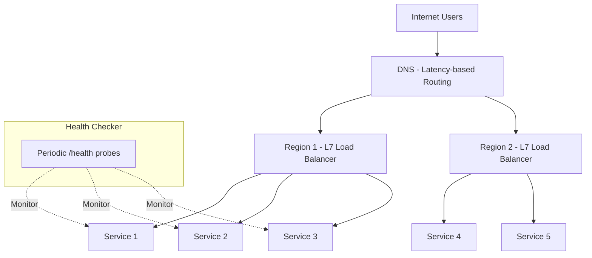
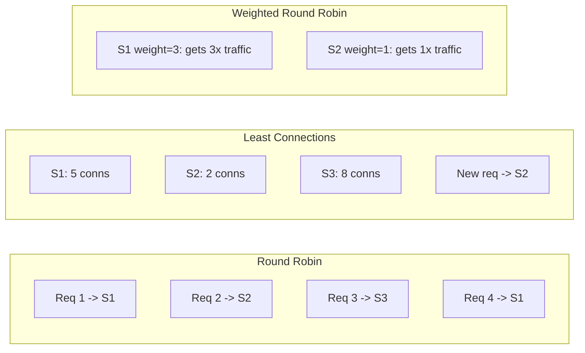

# Load Balancing

## Introduction
Load balancing distributes client requests across multiple servers to improve performance, availability, and reliability. It is one of the most fundamental infrastructure components in modern distributed systems. Without load balancing, traffic concentrates on a single node, causing bottlenecks, increased latency, and single points of failure.

## Problem Statement
When a single server handles all incoming traffic, it becomes a bottleneck. If that server crashes, the entire service goes down. As traffic grows, a single server reaches its capacity limits, resulting in slow responses or dropped requests. Load balancing solves this by distributing work across multiple servers.

## Why this exists
Distributing traffic evenly enables horizontal scaling and prevents individual machines from becoming single points of failure. Every major web service — from Google Search to Netflix — uses load balancers. They are the entry point for traffic and the first line of defence against overload and failure.

## Real-world analogy
A traffic cop directing cars across multiple lanes at a busy intersection so no single lane gets overloaded. The cop can:
- **Round robin:** Send each car to the next lane in sequence.
- **Least congested:** Direct cars to whichever lane has the fewest vehicles.
- **Weighted:** Send more cars to wider lanes (more powerful servers).
- **Geographic:** Direct cars to the nearest highway entrance.

## Definition
**Load balancing** is the practice of routing incoming requests to multiple service instances according to defined algorithms and health checks. It operates at different layers of the network stack and can be implemented in hardware, software, or DNS.

### Types of Load Balancers

| Type | Layer | Routes By | Examples |
|------|-------|-----------|----------|
| **Layer 4 (Transport)** | TCP/UDP | IP address, port | AWS NLB, HAProxy (TCP mode) |
| **Layer 7 (Application)** | HTTP/HTTPS | URL, headers, cookies | AWS ALB, Nginx, Envoy |
| **DNS-based** | DNS | Geography, latency | Route53, CloudFlare |
| **Client-side** | Application | Service discovery | gRPC, Netflix Ribbon |

## Key concepts
- **Round robin:** Distribute requests sequentially across all servers.
- **Weighted round robin:** Servers with higher weight receive proportionally more traffic.
- **Least connections:** Route to the server with the fewest active connections.
- **IP hash:** Route requests from the same client IP to the same server (sticky sessions).
- **Health checks:** Periodically probe servers; remove unhealthy ones from the pool.
- **Session affinity (sticky sessions):** Bind a client to the same backend for stateful applications.
- **Connection draining:** Allow active connections to complete before removing a server from the pool.
- **Layer 4 vs Layer 7:** L4 routes based on IP/port (fast, protocol-agnostic). L7 routes based on HTTP content (flexible, can inspect headers/URLs/cookies).
- **Consistent hashing:** Minimises redistribution when servers are added or removed.

## Internal working
Load balancers receive incoming requests and decide which backend server should handle each request based on the configured algorithm, current server load, and health status.

### Load Balancer Architecture



### Load Balancing Algorithms Comparison



## Python implementation

### Bad implementation
A naive router with no health checks — sends traffic to dead servers.

```python
class NaiveRouter:
    """No health checks. Sends traffic to servers that may be down."""

    def __init__(self, servers: list[str]):
        self.servers = servers
        self.index = 0

    def next_server(self) -> str:
        server = self.servers[self.index]
        self.index = (self.index + 1) % len(self.servers)
        return server
```

### Better implementation
A load balancer with health checking and multiple algorithms.

```python
from dataclasses import dataclass
from enum import Enum
from typing import Optional
import hashlib


class Algorithm(Enum):
    ROUND_ROBIN = "round_robin"
    LEAST_CONNECTIONS = "least_connections"
    IP_HASH = "ip_hash"


@dataclass
class Server:
    address: str
    healthy: bool = True
    active_connections: int = 0
    weight: int = 1


class LoadBalancer:
    """Health-aware load balancer with multiple routing algorithms."""

    def __init__(self, servers: list[Server], algorithm: Algorithm = Algorithm.ROUND_ROBIN):
        self.servers = servers
        self.algorithm = algorithm
        self.rr_index = 0

    def get_healthy(self) -> list[Server]:
        return [s for s in self.servers if s.healthy]

    def get_server(self, client_ip: Optional[str] = None) -> Server:
        healthy = self.get_healthy()
        if not healthy:
            raise RuntimeError("No healthy servers available")

        if self.algorithm == Algorithm.ROUND_ROBIN:
            server = healthy[self.rr_index % len(healthy)]
            self.rr_index += 1
            return server

        elif self.algorithm == Algorithm.LEAST_CONNECTIONS:
            return min(healthy, key=lambda s: s.active_connections)

        elif self.algorithm == Algorithm.IP_HASH:
            if not client_ip:
                raise ValueError("IP hash requires client_ip")
            hash_val = int(hashlib.md5(client_ip.encode()).hexdigest(), 16)
            return healthy[hash_val % len(healthy)]

        raise ValueError(f"Unknown algorithm: {self.algorithm}")
```

### Best implementation
A production-grade load balancer with weighted routing, health checks, connection draining, and consistent hashing.

```python
import time
import hashlib
import bisect
from dataclasses import dataclass, field
from typing import Optional
from enum import Enum


class ServerState(Enum):
    ACTIVE = "active"
    DRAINING = "draining"
    REMOVED = "removed"


@dataclass
class BackendServer:
    address: str
    weight: int = 1
    healthy: bool = True
    state: ServerState = ServerState.ACTIVE
    active_connections: int = 0
    max_connections: int = 1000
    last_health_check: float = 0.0
    consecutive_failures: int = 0
    max_failures: int = 3

    @property
    def is_available(self) -> bool:
        return (
            self.healthy
            and self.state == ServerState.ACTIVE
            and self.active_connections < self.max_connections
        )


class ConsistentHashRing:
    """Consistent hashing for minimal redistribution when servers change."""

    def __init__(self, virtual_nodes: int = 150):
        self.virtual_nodes = virtual_nodes
        self.ring: list[int] = []
        self.hash_to_server: dict[int, str] = {}

    def _hash(self, key: str) -> int:
        return int(hashlib.md5(key.encode()).hexdigest(), 16)

    def add_server(self, address: str) -> None:
        for i in range(self.virtual_nodes):
            h = self._hash(f"{address}:{i}")
            bisect.insort(self.ring, h)
            self.hash_to_server[h] = address

    def remove_server(self, address: str) -> None:
        self.ring = [h for h in self.ring if self.hash_to_server.get(h) != address]
        self.hash_to_server = {
            h: s for h, s in self.hash_to_server.items() if s != address
        }

    def get_server(self, key: str) -> Optional[str]:
        if not self.ring:
            return None
        h = self._hash(key)
        idx = bisect.bisect_right(self.ring, h) % len(self.ring)
        return self.hash_to_server[self.ring[idx]]


class ProductionLoadBalancer:
    """
    Production load balancer with:
    - Weighted round robin
    - Least connections
    - Consistent hashing
    - Health checks with consecutive failure tracking
    - Connection draining for graceful removal
    """

    def __init__(self, servers: list[BackendServer]):
        self.servers = {s.address: s for s in servers}
        self.hash_ring = ConsistentHashRing()
        self.weighted_index = 0
        self.weighted_sequence: list[str] = []

        for server in servers:
            self.hash_ring.add_server(server.address)
        self._rebuild_weighted_sequence()

    def _rebuild_weighted_sequence(self) -> None:
        """Build weighted sequence: server with weight 3 appears 3 times."""
        self.weighted_sequence = []
        for addr, server in self.servers.items():
            if server.is_available:
                self.weighted_sequence.extend([addr] * server.weight)

    def health_check(self) -> None:
        for server in self.servers.values():
            # In production: HTTP GET /health with timeout
            if server.consecutive_failures >= server.max_failures:
                if server.healthy:
                    server.healthy = False
                    self.hash_ring.remove_server(server.address)
            server.last_health_check = time.time()
        self._rebuild_weighted_sequence()

    def weighted_round_robin(self) -> Optional[BackendServer]:
        if not self.weighted_sequence:
            return None
        addr = self.weighted_sequence[self.weighted_index % len(self.weighted_sequence)]
        self.weighted_index += 1
        return self.servers[addr]

    def least_connections(self) -> Optional[BackendServer]:
        available = [s for s in self.servers.values() if s.is_available]
        if not available:
            return None
        return min(available, key=lambda s: s.active_connections)

    def consistent_hash(self, key: str) -> Optional[BackendServer]:
        addr = self.hash_ring.get_server(key)
        if addr and addr in self.servers and self.servers[addr].is_available:
            return self.servers[addr]
        return None

    def drain_server(self, address: str) -> None:
        """Gracefully remove a server: stop new connections, wait for existing ones."""
        if address in self.servers:
            self.servers[address].state = ServerState.DRAINING
            self.hash_ring.remove_server(address)
            self._rebuild_weighted_sequence()

    def add_server(self, server: BackendServer) -> None:
        self.servers[server.address] = server
        self.hash_ring.add_server(server.address)
        self._rebuild_weighted_sequence()
```

## Java implementation

```java
import java.security.MessageDigest;
import java.util.*;
import java.util.concurrent.*;
import java.util.concurrent.atomic.*;
import java.util.stream.Collectors;

enum ServerState {
    ACTIVE, DRAINING, REMOVED
}

class BackendServer {
    final String address;
    final int weight;
    volatile boolean healthy;
    volatile ServerState state;
    final AtomicInteger activeConnections = new AtomicInteger(0);
    final int maxConnections;
    int consecutiveFailures = 0;
    final int maxFailures;

    BackendServer(String address, int weight, int maxConnections, int maxFailures) {
        this.address = address;
        this.weight = weight;
        this.maxConnections = maxConnections;
        this.maxFailures = maxFailures;
        this.healthy = true;
        this.state = ServerState.ACTIVE;
    }

    boolean isAvailable() {
        return healthy && state == ServerState.ACTIVE
            && activeConnections.get() < maxConnections;
    }
}

class ConsistentHashRing {
    private final TreeMap<Long, String> ring = new TreeMap<>();
    private final int virtualNodes;

    ConsistentHashRing(int virtualNodes) {
        this.virtualNodes = virtualNodes;
    }

    private long hash(String key) {
        try {
            MessageDigest md = MessageDigest.getInstance("MD5");
            byte[] digest = md.digest(key.getBytes());
            return ((long) (digest[0] & 0xFF) << 24)
                 | ((long) (digest[1] & 0xFF) << 16)
                 | ((long) (digest[2] & 0xFF) << 8)
                 | ((long) (digest[3] & 0xFF));
        } catch (Exception e) {
            return key.hashCode();
        }
    }

    void addServer(String address) {
        for (int i = 0; i < virtualNodes; i++) {
            ring.put(hash(address + ":" + i), address);
        }
    }

    void removeServer(String address) {
        ring.entrySet().removeIf(e -> e.getValue().equals(address));
    }

    Optional<String> getServer(String key) {
        if (ring.isEmpty()) return Optional.empty();
        long h = hash(key);
        Map.Entry<Long, String> entry = ring.ceilingEntry(h);
        if (entry == null) entry = ring.firstEntry();
        return Optional.of(entry.getValue());
    }
}

class ProductionLoadBalancer {
    private final Map<String, BackendServer> servers = new ConcurrentHashMap<>();
    private final ConsistentHashRing hashRing = new ConsistentHashRing(150);
    private final AtomicInteger rrIndex = new AtomicInteger(0);

    void addServer(BackendServer server) {
        servers.put(server.address, server);
        hashRing.addServer(server.address);
    }

    BackendServer leastConnections() {
        return servers.values().stream()
            .filter(BackendServer::isAvailable)
            .min(Comparator.comparingInt(s -> s.activeConnections.get()))
            .orElseThrow(() -> new RuntimeException("No available servers"));
    }

    BackendServer weightedRoundRobin() {
        List<BackendServer> available = servers.values().stream()
            .filter(BackendServer::isAvailable)
            .toList();
        if (available.isEmpty()) {
            throw new RuntimeException("No available servers");
        }
        // Build weighted list
        List<BackendServer> weighted = new ArrayList<>();
        for (BackendServer s : available) {
            for (int i = 0; i < s.weight; i++) {
                weighted.add(s);
            }
        }
        return weighted.get(rrIndex.getAndIncrement() % weighted.size());
    }

    Optional<BackendServer> consistentHash(String key) {
        return hashRing.getServer(key)
            .map(servers::get)
            .filter(s -> s != null && s.isAvailable());
    }

    void drainServer(String address) {
        BackendServer server = servers.get(address);
        if (server != null) {
            server.state = ServerState.DRAINING;
            hashRing.removeServer(address);
        }
    }
}
```

## Step-by-step explanation
1. A **naive router** sends traffic to all servers sequentially with no health awareness — requests to dead servers fail.
2. A **health-aware load balancer** checks server health and supports multiple algorithms (round robin, least connections, IP hash).
3. A **production load balancer** adds weighted routing, consistent hashing for cache-friendly distribution, connection draining for graceful server removal, and periodic health checks with failure thresholds.

## Multiple real-world examples
1. **AWS Elastic Load Balancer:** Offers three types: Application LB (Layer 7, HTTP routing), Network LB (Layer 4, ultra-low latency), and Gateway LB (inline appliances). Auto-scales to handle millions of requests.
2. **Nginx:** The most widely used software load balancer. Supports round robin, least connections, IP hash, and upstream health checks. Used by companies like Dropbox, Netflix, and WordPress.com.
3. **Envoy Proxy:** A modern L7 proxy designed for cloud-native architectures. Used as a sidecar proxy in service mesh architectures (Istio). Supports circuit breaking, retries, and advanced routing.
4. **HAProxy:** High-performance TCP/HTTP load balancer. Used by GitHub, Stack Overflow, and Reddit. Supports ACLs for content-based routing and connection rate limiting.
5. **Cloudflare:** Provides DNS-based global load balancing across multiple data centres. Routes users to the nearest healthy PoP using latency-based and geo-based routing.

## Pros
- Improves performance by distributing load across multiple servers.
- Increases fault tolerance by routing around failed instances.
- Enables horizontal scaling — add more servers behind the load balancer.
- Provides session affinity for stateful applications.
- Can perform SSL termination, reducing backend server load.

## Cons
- Adds a routing layer that can itself become a bottleneck or single point of failure.
- Increases latency slightly due to the additional network hop.
- Complex configuration for advanced routing rules (path-based, header-based).
- Health checks must be accurate — stale health information can route traffic to failing servers.

## Interview questions

### Beginner
- **Q: What does a load balancer do?**
  - **A:** It distributes incoming client requests across multiple backend servers to improve performance, availability, and fault tolerance.

- **Q: Name three common load balancing algorithms.**
  - **A:** Round Robin (distribute sequentially), Least Connections (route to server with fewest active connections), and IP Hash (route same client to same server).

### Intermediate
- **Q: What is session affinity (sticky sessions) and when is it useful?**
  - **A:** Session affinity binds a client to the same backend server for the duration of a session. It is useful for legacy stateful applications that store session data in memory. However, it is better to externalise session state (e.g., Redis) and use stateless services.

- **Q: Explain the difference between Layer 4 and Layer 7 load balancing.**
  - **A:** Layer 4 routes based on transport-level information (IP address, TCP/UDP port) — it is fast but cannot inspect application content. Layer 7 routes based on application data (HTTP method, URL path, headers, cookies) — it is more flexible and can do content-based routing, but adds more processing overhead.

### Senior
- **Q: How does consistent hashing improve load balancing?**
  - **A:** Consistent hashing maps both servers and request keys to a hash ring. When a server is added or removed, only the requests that map to the affected segment are redistributed — minimising cache invalidation and request redistribution. This is critical for caching layers (e.g., Memcached, CDNs).

- **Q: How do you make the load balancer itself highly available?**
  - **A:** Use a pair of load balancers in active-passive or active-active configuration with a virtual IP (VIP). Health checks between them detect failure, and the standby takes over via IP failover (e.g., VRRP, keepalived). Cloud load balancers (AWS ALB/NLB) are managed and inherently HA.

### Staff Engineer
- **Q: Design global load balancing for a multi-region service with 99.99% availability.**
  - **A:** Use DNS-based global load balancing (Route53, Cloudflare) with latency-based routing to direct users to the nearest region. Each region has redundant L7 load balancers (ALB) with auto-scaling backend targets. Implement health checks at DNS, LB, and application levels. If a region fails, DNS health checks remove it, and traffic shifts to the next closest region. Use connection draining during deployments and canary releases. Monitor with real-user metrics (RUM) to validate end-to-end latency.

## Common mistakes
- Using stale health checks that route traffic to servers that have already failed.
- Relying on a single load balancer with no redundancy — it becomes the single point of failure.
- Ignoring connection draining during deployments — active requests are dropped.
- Using session affinity as a crutch instead of making services stateless.
- Not considering the load balancer's own capacity limits.

## Best practices
- Perform real-time health checks with configurable thresholds (e.g., 3 consecutive failures before removal).
- Use multiple load balancers for redundancy (active-active or active-passive).
- Choose the algorithm based on application traffic patterns — least connections for long-lived connections, round robin for uniform short requests.
- Implement connection draining before removing servers.
- Use consistent hashing for cache-heavy workloads to maximise cache hit rates.
- Offload SSL termination to the load balancer to reduce backend CPU usage.

## When NOT to use
- Simple local applications with a single process do not need load balancing.
- Very low traffic services where load distribution adds unnecessary complexity.
- Internal tools that run on a single VM with no horizontal scaling requirement.

## Comparison with similar concepts
- **Reverse proxy:** A load balancer is a specialised reverse proxy. Reverse proxies can also provide caching, SSL termination, and compression.
- **API gateway:** Operates at Layer 7 like a load balancer but also handles authentication, rate limiting, and request transformation.
- **Service mesh:** Handles service-to-service load balancing (east-west traffic) while traditional load balancers handle external traffic (north-south).
- **CDN:** A form of global load balancing that caches content at edge locations.

## Summary
Load balancing is essential for scaling, performance, and reliability in modern distributed systems. It distributes traffic across multiple servers using algorithms like round robin, least connections, and consistent hashing. Production load balancers include health checks, connection draining, weighted routing, and failover support. Understanding the differences between L4 and L7 load balancing, and knowing when to use each algorithm, is critical for system design interviews.

## Related topics
- [Scalability](../scalability)
- [Availability](../availability)
- [Fault Tolerance](../fault-tolerance)
- [Consistency Models](../consistency-models)
