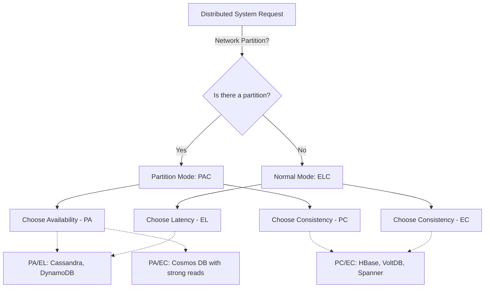
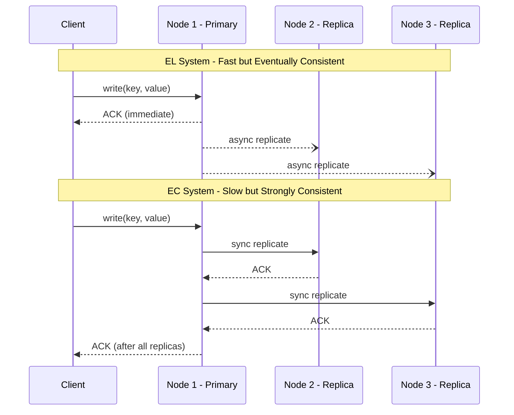

# PACELC Theorem

## Introduction
The PACELC theorem is an extension of the CAP theorem that addresses a critical gap: what trade-offs does a distributed system face during **normal** operations (when there is no partition)? While CAP only describes behaviour during network failures, PACELC covers the full spectrum — making it a more practical framework for real-world system design.

## Problem Statement
The CAP theorem only describes the trade-offs a distributed system faces when there is a network partition. However, network partitions are relatively rare in modern infrastructure with redundant networking. What trade-offs do systems face during normal, day-to-day operations? The PACELC theorem addresses this gap by adding the **Latency vs. Consistency** dimension.

## Why this exists
Daniel Abadi proposed the PACELC theorem in 2012 to provide a more complete framework for understanding the fundamental trade-offs in distributed database systems. CAP's binary choice during partitions tells only half the story. In practice, engineers spend far more time optimising for the **common case** — and PACELC acknowledges that even without network failures, replicating data across nodes to maintain consistency incurs a latency penalty.

## Real-world analogy
Imagine a global library system with multiple branches:

- **Partition scenario (PAC part):** If communication between branches is down, and a book's status is requested, a branch can either say "I can't confirm the status right now" (**Consistency** — refuse to answer) or give the last known status, which might be wrong (**Availability** — answer but risk being stale).

- **Normal scenario (ELC part):** If communication is fine, when a book is returned, the system can either update the local branch's records immediately and let the user check out another book right away (**Latency** — fast response), or it can wait until every branch globally updates its catalog before confirming (**Consistency** — slow but globally correct).

## Definition
**PACELC**: If there is a **P**artition, trade off between **A**vailability and **C**onsistency. **E**lse (normal operation), trade off between **L**atency and **C**onsistency.

This creates four possible system classifications:
- **PA/EL** — Available during partitions, Low latency normally
- **PA/EC** — Available during partitions, Consistent normally
- **PC/EL** — Consistent during partitions, Low latency normally
- **PC/EC** — Consistent during partitions, Consistent normally

## Key concepts
- **P (Partition):** A communication break between nodes in a distributed system.
- **A (Availability):** Every request receives a response, without guarantee it contains the most recent write.
- **C (Consistency):** Every read receives the most recent write or an error.
- **E (Else):** Normal operation mode — no network partition exists.
- **L (Latency):** The time it takes to process a request and receive a response. Lower latency means faster responses.
- **Tunable consistency:** Modern databases allow adjusting the C/L trade-off per query.

## Internal working / Mermaid diagram

### PACELC Decision Tree



### Latency vs Consistency Trade-off in Normal Operations



## Python implementation

### Bad implementation
A store with no awareness of the consistency/latency trade-off.

```python
class NaiveStore:
    """Single-node store: no replication, no trade-offs."""

    def __init__(self):
        self.data: dict[str, str] = {}

    def write(self, key: str, value: str) -> None:
        self.data[key] = value

    def read(self, key: str) -> str | None:
        return self.data.get(key)
```

### Better implementation
A replicated store that demonstrates EL vs EC behaviour.

```python
import time
from dataclasses import dataclass, field
from typing import Optional
from enum import Enum


class ReplicationMode(Enum):
    ASYNC = "async"  # EL: Low Latency
    SYNC = "sync"    # EC: Strong Consistency


@dataclass
class Replica:
    name: str
    store: dict[str, str] = field(default_factory=dict)
    reachable: bool = True

    def write(self, key: str, value: str) -> bool:
        if not self.reachable:
            return False
        self.store[key] = value
        return True

    def read(self, key: str) -> Optional[str]:
        if not self.reachable:
            return None
        return self.store.get(key)


class PacelcStore:
    """Demonstrates PACELC trade-offs with configurable replication mode."""

    def __init__(self, replicas: list[Replica], mode: ReplicationMode = ReplicationMode.ASYNC):
        self.replicas = replicas
        self.mode = mode

    def _is_partitioned(self) -> bool:
        reachable = sum(1 for r in self.replicas if r.reachable)
        return reachable < len(self.replicas)

    def write(self, key: str, value: str) -> dict[str, object]:
        start = time.monotonic()

        if self._is_partitioned():
            # PAC trade-off: this implementation chooses PA (Availability)
            for r in self.replicas:
                if r.reachable:
                    r.write(key, value)
            return {"status": "partial_write", "mode": "PA", "latency_ms": (time.monotonic() - start) * 1000}

        # ELC trade-off
        if self.mode == ReplicationMode.SYNC:
            # EC: wait for ALL replicas
            for r in self.replicas:
                r.write(key, value)
            return {"status": "consistent_write", "mode": "EC", "latency_ms": (time.monotonic() - start) * 1000}
        else:
            # EL: write to primary, async replicate
            self.replicas[0].write(key, value)
            # In real systems, replication happens in background
            return {"status": "fast_write", "mode": "EL", "latency_ms": (time.monotonic() - start) * 1000}

    def read(self, key: str) -> Optional[str]:
        if self._is_partitioned():
            # PA: read from any reachable node
            for r in self.replicas:
                result = r.read(key)
                if result is not None:
                    return result
            return None

        if self.mode == ReplicationMode.SYNC:
            # EC: read from primary (guaranteed consistent)
            return self.replicas[0].read(key)
        else:
            # EL: read from any node (fast but possibly stale)
            for r in self.replicas:
                result = r.read(key)
                if result is not None:
                    return result
            return None
```

### Best implementation
A configurable system that supports per-query consistency levels.

```python
from dataclasses import dataclass, field
from enum import Enum
from typing import Optional


class QueryConsistency(Enum):
    ONE = "one"          # EL: fastest, may be stale
    QUORUM = "quorum"    # Balanced: moderate latency, strong enough
    ALL = "all"          # EC: slowest, fully consistent


@dataclass
class Node:
    name: str
    data: dict[str, tuple[str, int]] = field(default_factory=dict)
    reachable: bool = True

    def write(self, key: str, value: str, version: int) -> bool:
        if not self.reachable:
            return False
        self.data[key] = (value, version)
        return True

    def read(self, key: str) -> Optional[tuple[str, int]]:
        if not self.reachable:
            return None
        return self.data.get(key)


class TunableStore:
    """
    PACELC-aware store with per-query consistency tuning.
    
    - ONE    -> PA/EL behaviour: fast, available, but potentially stale
    - QUORUM -> Balanced: survives minority failures with reasonable latency
    - ALL    -> PC/EC behaviour: consistent but high latency and low availability
    """

    def __init__(self, nodes: list[Node]):
        self.nodes = nodes
        self.version = 0

    def _required(self, level: QueryConsistency) -> int:
        n = len(self.nodes)
        if level == QueryConsistency.ONE:
            return 1
        elif level == QueryConsistency.QUORUM:
            return n // 2 + 1
        return n

    def write(self, key: str, value: str, level: QueryConsistency = QueryConsistency.QUORUM) -> bool:
        self.version += 1
        acks = sum(n.write(key, value, self.version) for n in self.nodes)
        required = self._required(level)
        if acks < required:
            raise RuntimeError(
                f"Write failed: {acks}/{required} acks. "
                f"Consistency level {level.value} not met."
            )
        return True

    def read(self, key: str, level: QueryConsistency = QueryConsistency.QUORUM) -> Optional[str]:
        responses = [n.read(key) for n in self.nodes]
        valid = [r for r in responses if r is not None]
        required = self._required(level)
        if len(valid) < required:
            raise RuntimeError(
                f"Read failed: {len(valid)}/{required} responses. "
                f"Consistency level {level.value} not met."
            )
        return max(valid, key=lambda x: x[1])[0]
```

## Java implementation

```java
import java.util.*;
import java.util.concurrent.ConcurrentHashMap;

enum QueryConsistency {
    ONE, QUORUM, ALL
}

class Node {
    final String name;
    final Map<String, Map.Entry<String, Integer>> data = new ConcurrentHashMap<>();
    boolean reachable = true;

    Node(String name) {
        this.name = name;
    }

    boolean write(String key, String value, int version) {
        if (!reachable) return false;
        data.put(key, Map.entry(value, version));
        return true;
    }

    Optional<Map.Entry<String, Integer>> read(String key) {
        if (!reachable) return Optional.empty();
        return Optional.ofNullable(data.get(key));
    }
}

/**
 * PACELC-aware distributed store with tunable consistency.
 *
 * ONE    -> PA/EL: fast reads/writes, accepts stale data.
 * QUORUM -> Balanced: tolerates minority failures.
 * ALL    -> PC/EC: fully consistent, highest latency.
 */
class TunableStore {
    private final List<Node> nodes;
    private int version = 0;

    TunableStore(List<Node> nodes) {
        this.nodes = nodes;
    }

    private int required(QueryConsistency level) {
        int n = nodes.size();
        return switch (level) {
            case ONE -> 1;
            case QUORUM -> n / 2 + 1;
            case ALL -> n;
        };
    }

    boolean write(String key, String value, QueryConsistency level) {
        version++;
        long acks = nodes.stream()
            .filter(node -> node.write(key, value, version))
            .count();
        int req = required(level);
        if (acks < req) {
            throw new RuntimeException(
                String.format("Write failed: %d/%d acks at %s", acks, req, level)
            );
        }
        return true;
    }

    Optional<String> read(String key, QueryConsistency level) {
        List<Map.Entry<String, Integer>> valid = nodes.stream()
            .map(node -> node.read(key))
            .filter(Optional::isPresent)
            .map(Optional::get)
            .toList();
        int req = required(level);
        if (valid.size() < req) {
            throw new RuntimeException(
                String.format("Read failed: %d/%d responses at %s", valid.size(), req, level)
            );
        }
        return valid.stream()
            .max(Comparator.comparingInt(Map.Entry::getValue))
            .map(Map.Entry::getKey);
    }
}
```

## Step-by-step explanation
1. A distributed system replicates data across multiple nodes for durability and read throughput.
2. We evaluate its behaviour in two states: **Partitioned** and **Normal**.
3. **Partitioned State (PAC):** Network link fails. Does the system stay available but risk stale data (PA), or reject requests to ensure no stale data is read (PC)?
4. **Normal State (ELC):** Network is healthy. Does a write return immediately after hitting one node, giving fast responses but risking temporary inconsistency (EL)? Or does the write wait until all replicas acknowledge, ensuring consistency but increasing response time (EC)?
5. Systems like Cassandra allow **per-query tuning**: use `ONE` for EL behaviour and `ALL` for EC behaviour on the same cluster.

## Multiple real-world examples
1. **Cassandra (PA/EL):** Prioritises availability during partitions and latency during normal operations. Uses eventual consistency with anti-entropy repair. Ideal for time-series data, IoT metrics, and social media feeds.
2. **DynamoDB (PA/EL):** Amazon designed it to always accept writes. Uses vector clocks for conflict resolution. Eventually consistent reads are default; strongly consistent reads are optional (at 2x cost).
3. **HBase (PC/EC):** Built on HDFS with a single active RegionServer per region. Prioritises consistency during both partitions and normal operations. Ideal for financial data and analytics.
4. **MongoDB (PC/EC):** Uses a primary-secondary architecture. During partitions, secondaries cannot accept writes. Write concern `majority` ensures consistency during normal operations.
5. **Google Spanner (PC/EC):** Uses TrueTime for globally consistent timestamps. Achieves strong consistency with remarkably low latency through Google's private fibre network and atomic clocks.
6. **Cosmos DB (Configurable):** Offers 5 consistency levels (Strong, Bounded Staleness, Session, Consistent Prefix, Eventual), allowing developers to slide along the PACELC spectrum per request.

## Pros
- Provides a comprehensive model for evaluating database trade-offs beyond just partition scenarios.
- Shifts focus to day-to-day operations (latency vs. consistency), which matter most of the time.
- Helps engineers choose the right database based on business requirements.
- More practical than CAP for modern system design discussions.

## Cons
- It is a conceptual model, not a strict law — real systems are more nuanced.
- Modern databases often allow tunable consistency, blurring the lines of PACELC categorisation.
- Does not account for other trade-offs like durability, throughput, or operational complexity.

## Interview questions

### Beginner
- **Q: What does PACELC stand for?**
  - **A:** If Partition (P), trade off between Availability (A) and Consistency (C). Else (E), trade off between Latency (L) and Consistency (C).

- **Q: Why was PACELC created when we already had the CAP theorem?**
  - **A:** CAP only focuses on behaviour during a network partition, which is an exception. PACELC explains the latency vs. consistency trade-off during normal operations, which is the standard state of a distributed system.

### Intermediate
- **Q: Can you categorise Cassandra and HBase using the PACELC theorem?**
  - **A:** Cassandra is typically PA/EL — it prioritises Availability during partitions and Latency during normal operations. HBase is PC/EC — it prioritises Consistency during both partitions and normal operations.

- **Q: What is the difference between the "C" in PACELC and the "C" in ACID?**
  - **A:** In PACELC/CAP, Consistency means linearizability (all nodes see the same data at the same time). In ACID, Consistency means database constraints are not violated. They are different concepts.

### Senior
- **Q: How does tunable consistency in modern databases affect their PACELC classification?**
  - **A:** Databases like Cassandra allow setting read/write quorum levels. Setting high consistency (e.g., QUORUM or ALL) shifts the system towards EC, increasing latency. Setting low consistency (e.g., ONE) shifts it to EL, decreasing latency. Therefore, the PACELC classification is no longer fixed per database, but per configuration or even per query.

- **Q: Design a data layer that is PA/EL for product reads and PC/EC for payment writes.**
  - **A:** Use Cassandra with `ONE` consistency for product catalog reads (PA/EL). Use PostgreSQL with synchronous replication or CockroachDB for payment writes (PC/EC). An API gateway routes requests to the appropriate datastore.

### Staff Engineer
- **Q: Compare Cosmos DB's 5 consistency levels to the PACELC spectrum.**
  - **A:** Strong = PC/EC (highest latency, full consistency). Bounded Staleness = PC/EC with a staleness window. Session = PA/EC (read-your-writes within a session). Consistent Prefix = PA/EL (ordered but possibly stale). Eventual = PA/EL (lowest latency, no ordering guarantees). This shows how Cosmos DB allows sliding along the PACELC spectrum per operation.

## Common mistakes
- Assuming a system must be permanently fixed into one PACELC category.
- Forgetting the "Else" part and only thinking about partition trade-offs (CAP).
- Confusing network latency with consistency latency — PACELC's "L" refers to the additional latency imposed by synchronous replication.
- Not considering that the same database can behave differently based on configuration.

## Best practices
- Define business requirements for latency and consistency **before** choosing a database.
- Use tunable consistency selectively — strong consistency for payments, eventual consistency for social media likes.
- Benchmark your system under both normal and partitioned conditions.
- Document the PACELC classification of each data store in your architecture.

## When NOT to use
- Single-node systems — PACELC applies only to distributed, replicated systems.
- When all your data fits in one region with no replication — there is no latency vs. consistency trade-off.

## Comparison with similar concepts
- **CAP Theorem:** PACELC is a superset of CAP. CAP only deals with the "PAC" part; PACELC adds the "ELC" dimension.
- **BASE:** Basically Available, Soft state, Eventually consistent — describes the philosophy of PA/EL systems.
- **ACID:** Transaction guarantees that are orthogonal to PACELC but often associated with PC/EC systems.

## Summary
The PACELC theorem is a fundamental model for understanding distributed systems. It extends the CAP theorem by stating that even during normal operations (no partitions), systems must trade off between latency and consistency. Modern databases like Cassandra, DynamoDB, and Cosmos DB offer tunable consistency, allowing engineers to slide along the PACELC spectrum per query. Understanding PACELC is essential for making informed database and architecture decisions.

## Related topics
- [CAP Theorem](../cap-theorem)
- [Consistency Models](../consistency-models)
- [Availability](../availability)
