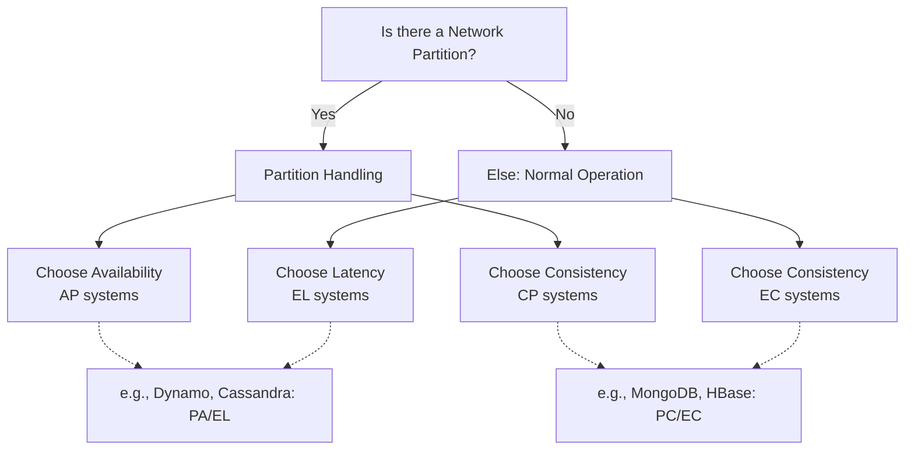

# PACELC Theorem

## Introduction
The PACELC theorem is an extension of the CAP theorem. While the CAP theorem states that in the presence of a network Partition (P), a distributed system must choose between Availability (A) and Consistency (C), PACELC extends this by stating that Else (E), when the system is running normally without partitions, it must choose between Latency (L) and Consistency (C).

## Problem Statement
The CAP theorem only describes the trade-offs a distributed system faces when there is a network partition. However, network partitions are relatively rare in modern infrastructure. What trade-offs do systems face during normal, day-to-day operations? The PACELC theorem addresses this gap.

## Why this exists
To provide a more complete framework for understanding the fundamental trade-offs in distributed database systems. It acknowledges that even without network failures, replicating data across nodes to maintain consistency incurs a latency penalty.

## Real-world analogy
Imagine a global library system with multiple branches.
- **Partition scenario (CAP):** If communication between branches is down, and a book is requested, a branch can either say "I don't know the status" (Consistency) or give the last known status, which might be wrong (Availability).
- **Normal scenario (PACELC):** If communication is fine, when a book is returned, the branch can either update its own records immediately and answer user queries fast (Latency), or it can make sure every branch globally updates its records before answering the user (Consistency).

## Definition
**PACELC**: If **P**artition, trade off between **A**vailability and **C**onsistency. **E**lse, trade off between **L**atency and **C**onsistency.

## Key concepts
- **P (Partition):** A communication break between nodes.
- **A (Availability):** Every request receives a response, without guarantee that it contains the most recent write.
- **C (Consistency):** Every read receives the most recent write or an error.
- **E (Else):** Normal operation mode (no network partition).
- **L (Latency):** The time it takes to process a request and receive a response.

## Internal working / Mermaid diagram

## Step-by-step explanation
1. A distributed system is designed to replicate data across multiple nodes.
2. We evaluate its behavior in two states: Partitioned and Normal.
3. **Partitioned State (PAC):** Network link fails. Does the system stay available but risk stale data (PA), or reject requests to ensure no stale data is read (PC)?
4. **Normal State (ELC):** Network is healthy. Does a write return immediately after hitting one node, giving fast responses but risking temporary inconsistency (EL)? Or does the write wait until all replicas acknowledge it, ensuring consistency but increasing response time (EC)?

## Multiple real-world examples
1. **PA/EL Systems (Cassandra, DynamoDB):** They prioritize availability during partitions and latency during normal operations. Great for shopping carts or social media feeds.
2. **PC/EC Systems (HBase, MongoDB, Relational DBs):** They prioritize consistency during partitions and normal operations. Great for financial systems.
3. **PA/EC Systems (VoltDB):** Prioritize availability during partitions but consistency during normal operations.

## Pros
- Provides a comprehensive model for evaluating database trade-offs.
- Shifts focus to day-to-day operations (latency vs. consistency), which matter most of the time.
- Helps engineers choose the right database based on business requirements.

## Cons
- It is a conceptual model, not a strict law.
- Modern databases often allow tunable consistency, blurring the lines of PACELC categorization.

## Interview questions

### Beginner
- **Q: What does PACELC stand for?**
  - **A:** If Partition (P), trade off between Availability (A) and Consistency (C). Else (E), trade off between Latency (L) and Consistency (C).

### Intermediate
- **Q: Why was PACELC created when we already had the CAP theorem?**
  - **A:** CAP only focuses on the behavior during a network partition, which is an exception. PACELC explains the latency vs. consistency trade-off during normal operations, which is the standard state of a distributed system.

### Senior
- **Q: Can you categorize Cassandra and HBase using the PACELC theorem?**
  - **A:** Cassandra is typically PA/EL (prioritizes Availability during partitions and Latency normally). HBase is PC/EC (prioritizes Consistency during partitions and Consistency normally).

### Staff Engineer
- **Q: How does tunable consistency in modern databases affect their PACELC classification?**
  - **A:** Databases like Cassandra allow setting read/write quorum levels. Setting high consistency (e.g., QUORUM) shifts the system towards EC, increasing latency. Setting low consistency (e.g., ONE) shifts it to EL, decreasing latency. Therefore, the PACELC classification is no longer fixed per database, but per configuration.

## Common mistakes
- Assuming a system must be permanently fixed into one category.
- Forgetting the "Else" part and only thinking about CAP.

## Best practices
- Define business requirements for latency and consistency *before* choosing a database.
- Use tunable consistency selectively (e.g., strong consistency for payments, eventual consistency for likes).

## When NOT to use
- Single-node systems (PACELC applies only to distributed, replicated systems).

## Comparison with similar concepts
- **CAP Theorem:** PACELC is a superset of CAP. CAP only deals with the "PAC" part.

## Summary
The PACELC theorem is a fundamental model for understanding distributed systems. It states that systems must trade off between availability and consistency during network partitions, and between latency and consistency during normal operations.

## Related topics
- [CAP Theorem](../cap-theorem)
- [Consistency Models](../consistency-models)
