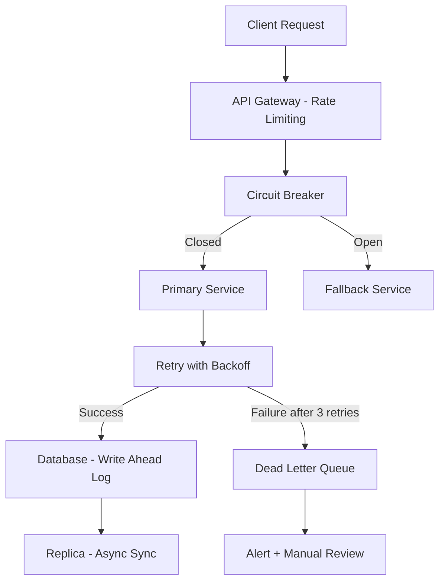
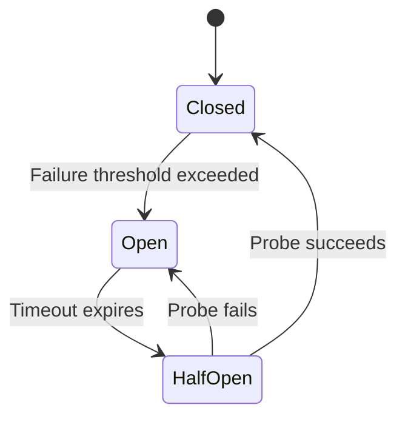

# Reliability

## Introduction
Reliability measures how consistently a system performs its intended function correctly over time. While availability asks "is the system up?", reliability asks "is the system correct?". A system can be available but unreliable — returning wrong data, dropping transactions, or behaving unpredictably. Reliable systems build user trust and are the foundation of critical infrastructure.

## Problem Statement
Users expect services to remain correct and dependable even when components fail, traffic spikes, or dependencies become slow. An e-commerce platform that charges a credit card but fails to create the order is available but unreliable. A messaging system that delivers messages out of order is available but unreliable. Reliability engineering prevents these scenarios.

## Why this exists
A system can be available but unreliable if it returns incorrect or inconsistent results. Amazon's checkout must never charge a customer twice. A hospital's patient records system must never mix up patient data. Reliability focuses on **correctness, predictability, and resilience** — ensuring the system does the right thing, every time, even under adverse conditions.

## Real-world analogy
A power grid is reliable when electricity is delivered steadily without interruptions or voltage spikes. The grid can momentarily go down (availability issue) and recover quickly. But if it delivers inconsistent voltage that damages appliances — that is a reliability failure. Reliability means the output is correct and consistent, not just present.

## Definition
**Reliability** is the probability that a system will operate without failure for a given period under specified conditions. It encompasses:

- **Correctness:** The system produces the right output.
- **Durability:** Data is not lost after being accepted.
- **Consistency:** The system behaves predictably.
- **Resilience:** The system recovers gracefully from failures.

### Key metrics

| Metric | Definition | Example |
|--------|-----------|---------|
| **MTBF** | Mean Time Between Failures | 720 hours = one failure per month |
| **MTTR** | Mean Time To Repair | 15 minutes = fast recovery |
| **MTTD** | Mean Time To Detect | 2 minutes = early detection |
| **Error Rate** | Percentage of failed requests | 0.01% = 1 in 10,000 |

## Key concepts
- **Mean Time Between Failures (MTBF):** Average time the system runs before a failure occurs.
- **Mean Time To Repair (MTTR):** Average time to restore the system after a failure.
- **Mean Time To Detect (MTTD):** Average time to detect that a failure has occurred.
- **Redundancy:** Duplicate components to survive individual failures.
- **Graceful degradation:** Offering reduced functionality instead of complete failure.
- **Idempotency:** Ensuring repeated operations produce the same result without side effects.
- **Data integrity:** Guaranteeing that data is accurate, complete, and uncorrupted.
- **Retry with backoff:** Automatically retrying failed operations with increasing delays.
- **Circuit breaker:** Stopping calls to a failing service to prevent cascading failures.

## Internal working
Reliability is enforced through multiple layers: automated recovery, retries with exponential backoff, idempotency, circuit breakers, strong monitoring, and explicit failure mode design.

### Reliability Architecture



### Circuit Breaker State Machine



## Python implementation

### Bad implementation
No retry or error handling — a single failure crashes the request.

```python
class UnreliableService:
    """Fails with no recovery mechanism."""

    def get_value(self, key: str) -> int:
        raise RuntimeError("temporary failure")
```

### Better implementation
A retry loop with basic error handling.

```python
import time
from typing import TypeVar, Callable

T = TypeVar("T")


def retry_with_backoff(
    func: Callable[[], T],
    max_retries: int = 3,
    base_delay: float = 0.1,
    max_delay: float = 5.0,
) -> T:
    """Retry with exponential backoff and jitter."""
    import random

    for attempt in range(1, max_retries + 1):
        try:
            return func()
        except Exception:
            if attempt == max_retries:
                raise
            delay = min(base_delay * (2 ** (attempt - 1)), max_delay)
            delay *= 0.5 + random.random()  # Add jitter
            time.sleep(delay)
    raise RuntimeError("unreachable")
```

### Best implementation
A reliable service wrapper with circuit breaker, retries, idempotency, and dead letter queue.

```python
import time
import uuid
from dataclasses import dataclass, field
from enum import Enum
from typing import Optional, Callable, Any
from collections import deque


class CircuitState(Enum):
    CLOSED = "closed"
    OPEN = "open"
    HALF_OPEN = "half_open"


@dataclass
class CircuitBreaker:
    failure_threshold: int = 5
    reset_timeout: float = 30.0
    failures: int = 0
    state: CircuitState = CircuitState.CLOSED
    last_failure_time: float = 0.0

    def allow_request(self) -> bool:
        if self.state == CircuitState.CLOSED:
            return True
        if self.state == CircuitState.OPEN:
            if time.time() - self.last_failure_time >= self.reset_timeout:
                self.state = CircuitState.HALF_OPEN
                return True
            return False
        return True  # HALF_OPEN: allow one probe request

    def record_success(self) -> None:
        self.failures = 0
        self.state = CircuitState.CLOSED

    def record_failure(self) -> None:
        self.failures += 1
        self.last_failure_time = time.time()
        if self.failures >= self.failure_threshold:
            self.state = CircuitState.OPEN


@dataclass
class IdempotencyStore:
    """Prevents duplicate processing of the same request."""
    processed: dict[str, Any] = field(default_factory=dict)

    def is_processed(self, idempotency_key: str) -> bool:
        return idempotency_key in self.processed

    def record(self, idempotency_key: str, result: Any) -> None:
        self.processed[idempotency_key] = result

    def get_result(self, idempotency_key: str) -> Any:
        return self.processed[idempotency_key]


class ReliableService:
    """
    Production reliability wrapper with:
    - Circuit breaker (prevents cascading failures)
    - Retry with exponential backoff and jitter
    - Idempotency (prevents duplicate processing)
    - Dead letter queue (captures permanently failed requests)
    """

    def __init__(
        self,
        service: object,
        max_retries: int = 3,
        base_delay: float = 0.2,
    ):
        self.service = service
        self.max_retries = max_retries
        self.base_delay = base_delay
        self.circuit_breaker = CircuitBreaker()
        self.idempotency = IdempotencyStore()
        self.dead_letter_queue: deque[dict] = deque(maxlen=10000)

    def execute(self, operation: str, key: str, idempotency_key: Optional[str] = None) -> Any:
        # Check idempotency
        if idempotency_key and self.idempotency.is_processed(idempotency_key):
            return self.idempotency.get_result(idempotency_key)

        # Check circuit breaker
        if not self.circuit_breaker.allow_request():
            self.dead_letter_queue.append({"operation": operation, "key": key})
            raise RuntimeError("Circuit breaker is OPEN — service unavailable")

        # Retry with backoff
        import random
        for attempt in range(1, self.max_retries + 1):
            try:
                result = getattr(self.service, operation)(key)
                self.circuit_breaker.record_success()
                if idempotency_key:
                    self.idempotency.record(idempotency_key, result)
                return result
            except Exception as error:
                self.circuit_breaker.record_failure()
                if attempt == self.max_retries:
                    self.dead_letter_queue.append({
                        "operation": operation,
                        "key": key,
                        "error": str(error),
                    })
                    raise
                delay = min(self.base_delay * (2 ** (attempt - 1)), 5.0)
                delay *= 0.5 + random.random()
                time.sleep(delay)

        raise RuntimeError("unreachable")
```

## Java implementation

```java
import java.util.*;
import java.util.concurrent.*;
import java.util.concurrent.atomic.*;

enum CircuitState {
    CLOSED, OPEN, HALF_OPEN
}

class CircuitBreaker {
    private final int failureThreshold;
    private final long resetTimeoutMs;
    private final AtomicInteger failures = new AtomicInteger(0);
    private volatile CircuitState state = CircuitState.CLOSED;
    private volatile long lastFailureTime = 0;

    CircuitBreaker(int failureThreshold, long resetTimeoutMs) {
        this.failureThreshold = failureThreshold;
        this.resetTimeoutMs = resetTimeoutMs;
    }

    boolean allowRequest() {
        if (state == CircuitState.CLOSED) return true;
        if (state == CircuitState.OPEN) {
            if (System.currentTimeMillis() - lastFailureTime >= resetTimeoutMs) {
                state = CircuitState.HALF_OPEN;
                return true;
            }
            return false;
        }
        return true; // HALF_OPEN: allow probe
    }

    void recordSuccess() {
        failures.set(0);
        state = CircuitState.CLOSED;
    }

    void recordFailure() {
        int count = failures.incrementAndGet();
        lastFailureTime = System.currentTimeMillis();
        if (count >= failureThreshold) {
            state = CircuitState.OPEN;
        }
    }
}

class IdempotencyStore {
    private final Map<String, Object> processed = new ConcurrentHashMap<>();

    boolean isProcessed(String key) {
        return processed.containsKey(key);
    }

    void record(String key, Object result) {
        processed.put(key, result);
    }

    Object getResult(String key) {
        return processed.get(key);
    }
}

class ReliableService {
    private final CircuitBreaker circuitBreaker;
    private final IdempotencyStore idempotency = new IdempotencyStore();
    private final BlockingQueue<Map<String, String>> dlq = new LinkedBlockingQueue<>(10000);
    private final int maxRetries;
    private final long baseDelayMs;

    ReliableService(int maxRetries, long baseDelayMs,
                    int failureThreshold, long resetTimeoutMs) {
        this.maxRetries = maxRetries;
        this.baseDelayMs = baseDelayMs;
        this.circuitBreaker = new CircuitBreaker(failureThreshold, resetTimeoutMs);
    }

    <T> T execute(Callable<T> operation, String idempotencyKey) throws Exception {
        // Check idempotency
        if (idempotencyKey != null && idempotency.isProcessed(idempotencyKey)) {
            @SuppressWarnings("unchecked")
            T cached = (T) idempotency.getResult(idempotencyKey);
            return cached;
        }

        // Check circuit breaker
        if (!circuitBreaker.allowRequest()) {
            dlq.offer(Map.of("status", "circuit_open"));
            throw new RuntimeException("Circuit breaker is OPEN");
        }

        // Retry with exponential backoff
        Exception lastError = null;
        for (int attempt = 1; attempt <= maxRetries; attempt++) {
            try {
                T result = operation.call();
                circuitBreaker.recordSuccess();
                if (idempotencyKey != null) {
                    idempotency.record(idempotencyKey, result);
                }
                return result;
            } catch (Exception e) {
                lastError = e;
                circuitBreaker.recordFailure();
                if (attempt < maxRetries) {
                    long delay = Math.min(
                        baseDelayMs * (1L << (attempt - 1)), 5000);
                    Thread.sleep(delay);
                }
            }
        }
        dlq.offer(Map.of("error", lastError.getMessage()));
        throw lastError;
    }
}
```

## Step-by-step explanation
1. An **unreliable service** fails on the first error with no recovery — user requests are lost.
2. **Retries with backoff** handle transient failures (network blips, temporary overload) without overwhelming the failing service.
3. A **circuit breaker** detects persistent failures and stops sending traffic to a broken service, preventing cascading failures.
4. **Idempotency** ensures that retried requests (e.g., duplicate payment submissions) do not cause double-processing.
5. A **dead letter queue** captures permanently failed requests for manual review and recovery.

## Multiple real-world examples
1. **Stripe:** Uses idempotency keys for payment processing. Clients send an `Idempotency-Key` header, and Stripe returns the cached result for duplicate requests — preventing double charges.
2. **AWS S3:** Provides 99.999999999% (11 nines) durability by replicating objects across multiple facilities. Data is checksummed on write and read to detect corruption.
3. **Netflix Hystrix:** A circuit breaker library that prevents cascading failures in microservice architectures. When a service fails, Hystrix opens the circuit and routes to fallback logic.
4. **Kafka:** Provides reliable message delivery through write-ahead logs, replication, and consumer offset tracking. Messages are durable even if consumers crash.
5. **Google SRE:** Uses error budgets to balance reliability and feature velocity. If a service exhausts its error budget (e.g., too many errors in a month), deployments are frozen until reliability improves.

## Pros
- Builds user trust — users rely on systems that behave correctly.
- Reduces incident impact through graceful failure handling.
- Makes systems more predictable and easier to debug.
- Error budgets create a healthy tension between innovation and stability.

## Cons
- Retries can mask underlying slowness and delay incident detection.
- Overuse of fallback logic increases code complexity.
- Poorly designed retries can cause cascading failures (retry storms).
- Idempotency requires additional storage and logic.

## Interview questions

### Beginner
- **Q: What is reliability in system design?**
  - **A:** Reliability is the ability of a system to operate correctly over time — producing the right output, maintaining data integrity, and recovering gracefully from failures.

- **Q: What is the difference between availability and reliability?**
  - **A:** Availability means the system is up and responding. Reliability means the system responds **correctly**. A system can be available but unreliable (serving wrong data).

### Intermediate
- **Q: How does idempotency help reliability?**
  - **A:** Idempotency ensures repeated operations produce the same result without side effects. This is critical for retries — if a payment request times out and is retried, idempotency prevents double-charging the customer.

- **Q: Explain the circuit breaker pattern and when to use it.**
  - **A:** A circuit breaker monitors failures to an external service. When failures exceed a threshold, it "opens" and stops sending requests, returning a fallback response instead. After a timeout, it enters "half-open" state and sends a probe request. If the probe succeeds, the circuit closes; if it fails, it reopens. Use it to prevent cascading failures in microservice architectures.

### Senior
- **Q: How do you design reliable distributed writes?**
  - **A:** Use write-ahead logs for durability, retries with idempotency keys for at-least-once delivery, acknowledgement from replicas before confirming writes, and conflict resolution (last-writer-wins, vector clocks, or CRDTs) for concurrent updates.

- **Q: What are the risks of excessive retries, and how do you mitigate them?**
  - **A:** Excessive retries can cause retry storms — exponentially amplifying load on a failing service. Mitigate with: exponential backoff (increasing delays), jitter (randomised delays), maximum retry limits, circuit breakers (stop retrying entirely), and deadline propagation (drop retries when the original request has already timed out).

### Staff Engineer
- **Q: Design the reliability strategy for a global payment processing system.**
  - **A:** Use idempotency keys for every payment request. Write to a durable log (Kafka/WAL) before processing. Use exactly-once semantics with transactional outbox pattern. Implement circuit breakers for all external dependencies (banks, card networks). Store failed payments in a dead letter queue for manual review. Use multi-region active-passive with synchronous replication for the payment ledger. Define an error budget (e.g., 0.001% error rate) and freeze deployments when exhausted.

## Common mistakes
- Treating retries as a substitute for fixing root causes.
- Ignoring failure modes in dependent services — assuming dependencies are always available.
- Not measuring error budgets or tracking MTBF/MTTR.
- Implementing retries without idempotency — causing duplicate side effects.
- Using the same retry policy for all failures — transient and permanent failures need different handling.

## Best practices
- Build idempotent APIs — every operation should be safely retryable.
- Define clear service contracts, SLAs, and error budgets.
- Monitor both success rates and error budgets — not just uptime.
- Use exponential backoff with jitter for retries.
- Implement circuit breakers for all remote calls.
- Test reliability with chaos engineering (fault injection, network delays).
- Use dead letter queues for permanently failed operations.

## When NOT to use
- Full reliability engineering is less critical for disposable prototypes or internal tools with low business impact.
- Some experimental systems (A/B tests, feature flags) can accept lower reliability.
- Batch jobs that are fully idempotent and can be simply re-run do not need complex circuit breakers.

## Comparison with similar concepts
- **Availability:** Ensures access; reliability ensures correctness. A system can be available but unreliable.
- **Fault tolerance:** The mechanism by which reliability is maintained during failures.
- **Consistency:** Reliable systems maintain expected state across operations.
- **Durability:** Reliable systems ensure data is not lost after being accepted.

## Summary
Reliability is the bedrock of trust in software systems. It goes beyond availability to ensure that the system produces correct results, handles failures gracefully, and recovers quickly. Key techniques include retries with exponential backoff, circuit breakers, idempotency, dead letter queues, and error budgets. Understanding and implementing these patterns is essential for building production-grade distributed systems.

## Related topics
- [Fault Tolerance](../fault-tolerance)
- [Availability](../availability)
- [Load Balancing](../load-balancing)
- [CAP Theorem](../cap-theorem)
