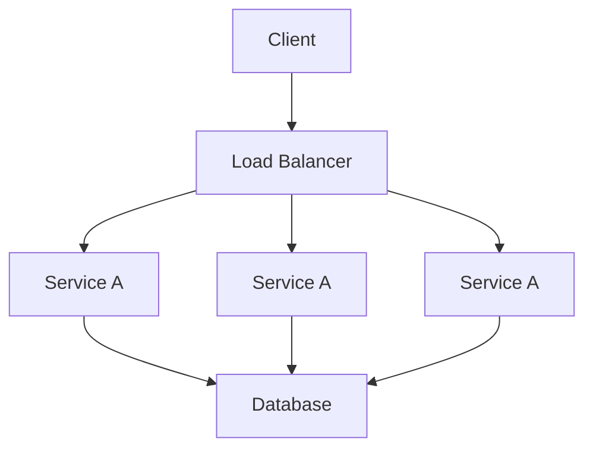

# Scalability

## Introduction
Scalability is the ability of a system to handle increased load by adding resources.

## Problem Statement
Systems often start small and need to grow without failure or extreme cost.

## Why this exists
As traffic grows, services must continue to respond quickly. Scalability helps businesses expand without rewriting systems.

## Real-world analogy
A restaurant scales by adding tables and staff during peak hours. If demand doubles, the business still serves customers smoothly.

## Definition
Scalability allows a system to increase throughput and capacity in response to demand. It can be vertical or horizontal.

## Key concepts
- **Vertical scaling:** stronger single machines.
- **Horizontal scaling:** more machines working together.
- **Elasticity:** automatic scaling based on demand.
- **Bottleneck:** limiting component that prevents growth.

## Internal working
A scalable architecture separates concerns, uses stateless services, caches, and partitions workloads.

### Flow diagram


## Python implementation

### Bad implementation
A monolithic server that cannot split work across nodes.

```python
class Monolith:
    def process(self, request: str) -> str:
        return f"processed {request}"
```

### Better implementation
A horizontal service pool with simple round-robin routing.

```python
from typing import List

class Worker:
    def __init__(self, name: str):
        self.name = name

    def process(self, request: str) -> str:
        return f"{self.name} processed {request}"

class Router:
    def __init__(self, workers: List[Worker]):
        self.workers = workers
        self.index = 0

    def route(self, request: str) -> str:
        worker = self.workers[self.index]
        self.index = (self.index + 1) % len(self.workers)
        return worker.process(request)
```

### Best implementation
A scalable service with autoscaling, request queueing, and backpressure.

```python
from dataclasses import dataclass
from queue import Queue, Empty
from threading import Thread
from typing import List

@dataclass
class ServiceInstance:
    name: str

    def process(self, request: str) -> str:
        return f"{self.name} handled {request}"

class AutoscalingPool:
    def __init__(self, target_queue_size: int = 5):
        self.instances: List[ServiceInstance] = [ServiceInstance(name="instance-1")]
        self.queue: Queue[str] = Queue()
        self.target_queue_size = target_queue_size
        self._start_workers()

    def _start_workers(self) -> None:
        for instance in self.instances:
            thread = Thread(target=self._consume, args=(instance,), daemon=True)
            thread.start()

    def _consume(self, instance: ServiceInstance) -> None:
        while True:
            try:
                request = self.queue.get(timeout=1)
                print(instance.process(request))
                self.queue.task_done()
            except Empty:
                break

    def submit(self, request: str) -> None:
        self.queue.put(request)
        if self.queue.qsize() > self.target_queue_size:
            self._scale_out()

    def _scale_out(self) -> None:
        new_instance = ServiceInstance(name=f"instance-{len(self.instances)+1}")
        self.instances.append(new_instance)
        thread = Thread(target=self._consume, args=(new_instance,), daemon=True)
        thread.start()
```

## Step-by-step explanation
1. Monoliths fail under load because they cannot spread work.
2. Horizontal scaling adds nodes and distributes requests.
3. Elastic scaling makes growth automatic while controlling cost.

## Multiple real-world examples
- Web services use autoscaling groups in AWS, GCP, or Azure.
- Content delivery networks scale edge caches.
- Databases shard to scale horizontally.

## Pros
- Better handling of unpredictable load.
- Improved fault isolation.
- Easier capacity planning.

## Cons
- More operational complexity.
- Data consistency becomes harder across many nodes.
- Network overhead and coordination costs.

## Interview Questions
### Beginner
- What are vertical and horizontal scaling?
- Answer: Vertical scaling upgrades a machine, horizontal scaling adds more machines.

### Intermediate
- Why is horizontal scaling usually preferred for large web systems?
- Answer: It is more cost-effective and fault tolerant than a single large machine.

### Senior
- How would you scale a write-heavy database?
- Answer: Use sharding, batching, and write-optimized storage engines, plus strong indexing.

### Staff Engineer
- Design a multi-tier scalable architecture for an online marketplace.
- Answer: Separate frontend, API, search, payments, and analytics into services with caches, message queues, and autoscaling.

## Common mistakes
- Scaling only the frontend while ignoring database bottlenecks.
- Assuming more hardware always solves load issues.
- Not measuring actual capacity utilization.

## Best practices
- Identify and eliminate bottlenecks first.
- Build stateless services wherever possible.
- Use capacity planning and load tests.

## When NOT to use
- Small internal tools with stable, low traffic.
- Simpler systems where over-scaling would add unnecessary cost.

## Comparison with similar concepts
- **Elasticity:** dynamic scaling, often automated.
- **Availability:** keeping services running, not necessarily handling more load.
- **Reliability:** correct behavior under growth and failure.

## Summary
Scalability allows systems to grow gracefully under demand. It requires architecture, automation, and constant observation.

## Related topics
- [Load Balancing](../load-balancing)
- [Fault Tolerance](../fault-tolerance)
- [Replication](../../databases/replication)
