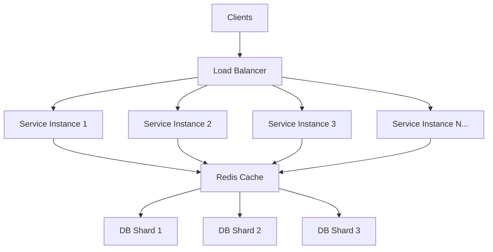
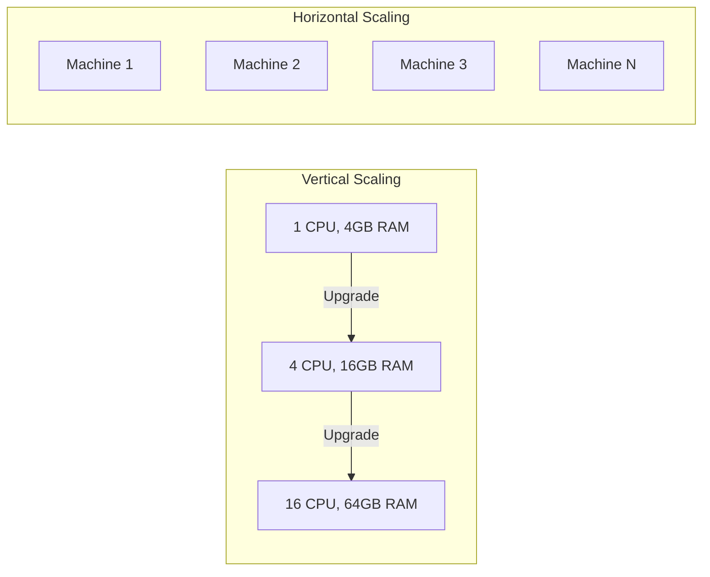

# Scalability

## Introduction
Scalability is the ability of a system to handle increased load by adding resources — without fundamental changes to its architecture. It is a core non-functional requirement for any system expected to grow. A scalable system performs well under increasing demand, whether that demand comes from more users, more data, or more complex computations.

## Problem Statement
Systems often start small — serving hundreds of users with a single server. But as the product gains traction, traffic grows from hundreds to millions. Without scalable design, the system either crashes under load, becomes unbearably slow, or requires a complete rewrite. Scalability ensures the system can grow gracefully and cost-effectively.

## Why this exists
As traffic grows, services must continue to respond quickly. Every major internet company has faced scalability challenges: Twitter's "Fail Whale" was a direct result of an architecture that could not scale. Facebook rewrote its messaging system multiple times to handle billions of messages. Scalability is not about building for scale on day one — it is about designing a system that **can** scale when needed.

## Real-world analogy
A restaurant scales by adding tables, staff, and even opening new locations during peak hours:

- **Vertical scaling:** Hiring a faster chef who can cook twice as many meals (upgrading the machine).
- **Horizontal scaling:** Opening another kitchen across the street to handle overflow (adding more machines).
- **Elasticity:** Bringing in temporary staff during the dinner rush and sending them home when it slows down (auto-scaling).

If demand doubles, the restaurant should still serve customers smoothly — that's scalability.

## Definition
Scalability is the property of a system to increase throughput and capacity in response to growing demand by adding resources. A system is scalable if adding resources results in proportionally improved performance.

**Types of scaling:**
- **Vertical scaling (scale up):** Adding more power (CPU, RAM, disk) to a single machine.
- **Horizontal scaling (scale out):** Adding more machines to distribute the workload.
- **Diagonal scaling:** Scaling up to the maximum, then scaling out.

## Key concepts
- **Vertical scaling:** Stronger single machines. Simpler but has an upper limit.
- **Horizontal scaling:** More machines working together. Complex but nearly unlimited.
- **Elasticity:** Automatic scaling based on demand (e.g., AWS Auto Scaling).
- **Bottleneck:** The limiting component that prevents the system from scaling further.
- **Stateless services:** Services that store no session data — easily replicated.
- **Sharding:** Splitting data across multiple databases to scale storage and writes.
- **Partitioning:** Dividing workload across workers by key, range, or hash.
- **Amdahl's Law:** The speedup from parallelisation is limited by the sequential portion of the workload.

## Internal working
A scalable architecture separates concerns, uses stateless services, caches aggressively, and partitions workloads across independent units.

### Horizontal Scaling Architecture



### Vertical vs Horizontal Scaling Comparison



## Python implementation

### Bad implementation
A monolithic server that cannot split work across nodes.

```python
class Monolith:
    """Single process handles everything. Cannot scale beyond one machine."""

    def __init__(self):
        self.data: dict[str, str] = {}

    def handle_request(self, request: str) -> str:
        # Everything runs in one process
        result = self._compute(request)
        self._store(request, result)
        return result

    def _compute(self, request: str) -> str:
        return f"processed {request}"

    def _store(self, key: str, value: str) -> None:
        self.data[key] = value
```

### Better implementation
A horizontal service pool with round-robin routing.

```python
from dataclasses import dataclass
from typing import Optional


@dataclass
class Worker:
    name: str
    capacity: int = 100
    current_load: int = 0

    def can_accept(self) -> bool:
        return self.current_load < self.capacity

    def process(self, request: str) -> str:
        self.current_load += 1
        result = f"{self.name} processed {request}"
        self.current_load -= 1
        return result


class ScalableRouter:
    """Routes requests across a pool of workers with load awareness."""

    def __init__(self, workers: list[Worker]):
        self.workers = workers
        self.index = 0

    def route(self, request: str) -> str:
        # Try round-robin, skip overloaded workers
        for _ in range(len(self.workers)):
            worker = self.workers[self.index]
            self.index = (self.index + 1) % len(self.workers)
            if worker.can_accept():
                return worker.process(request)
        raise RuntimeError("All workers at capacity")

    def add_worker(self, worker: Worker) -> None:
        """Scale out by adding a new worker."""
        self.workers.append(worker)

    def remove_worker(self, name: str) -> None:
        """Scale in by removing an idle worker."""
        self.workers = [w for w in self.workers if w.name != name]
```

### Best implementation
A scalable service with autoscaling, request queueing, sharding, and backpressure.

```python
from dataclasses import dataclass, field
from queue import Queue, Full, Empty
from threading import Thread, Lock
from typing import Optional
from enum import Enum
import hashlib


class ShardStrategy(Enum):
    HASH = "hash"
    RANGE = "range"


@dataclass
class ServiceInstance:
    name: str
    current_load: int = 0
    max_load: int = 50

    def process(self, request: str) -> str:
        self.current_load += 1
        result = f"{self.name} handled {request}"
        self.current_load -= 1
        return result

    @property
    def utilisation(self) -> float:
        return self.current_load / self.max_load


@dataclass
class Shard:
    shard_id: int
    data: dict[str, str] = field(default_factory=dict)

    def write(self, key: str, value: str) -> None:
        self.data[key] = value

    def read(self, key: str) -> Optional[str]:
        return self.data.get(key)


class AutoScalingPool:
    """
    Production-grade scalable pool with:
    - Auto-scaling based on utilisation
    - Backpressure via bounded queue
    - Data sharding for horizontal database scaling
    """

    def __init__(
        self,
        min_instances: int = 2,
        max_instances: int = 20,
        scale_up_threshold: float = 0.7,
        scale_down_threshold: float = 0.2,
        num_shards: int = 4,
        queue_size: int = 1000,
    ):
        self.instances = [ServiceInstance(name=f"instance-{i+1}") for i in range(min_instances)]
        self.min_instances = min_instances
        self.max_instances = max_instances
        self.scale_up_threshold = scale_up_threshold
        self.scale_down_threshold = scale_down_threshold
        self.queue: Queue[str] = Queue(maxsize=queue_size)
        self.shards = [Shard(shard_id=i) for i in range(num_shards)]
        self.lock = Lock()

    def _avg_utilisation(self) -> float:
        if not self.instances:
            return 1.0
        return sum(i.utilisation for i in self.instances) / len(self.instances)

    def _check_scaling(self) -> None:
        with self.lock:
            avg = self._avg_utilisation()
            if avg > self.scale_up_threshold and len(self.instances) < self.max_instances:
                new_id = len(self.instances) + 1
                self.instances.append(ServiceInstance(name=f"instance-{new_id}"))
            elif avg < self.scale_down_threshold and len(self.instances) > self.min_instances:
                self.instances.pop()

    def _get_shard(self, key: str) -> Shard:
        hash_val = int(hashlib.md5(key.encode()).hexdigest(), 16)
        return self.shards[hash_val % len(self.shards)]

    def submit(self, request: str) -> str:
        self._check_scaling()
        # Route to least-loaded instance
        target = min(self.instances, key=lambda i: i.current_load)
        result = target.process(request)
        # Store in appropriate shard
        shard = self._get_shard(request)
        shard.write(request, result)
        return result

    def read(self, key: str) -> Optional[str]:
        shard = self._get_shard(key)
        return shard.read(key)
```

## Java implementation

```java
import java.security.MessageDigest;
import java.util.*;
import java.util.concurrent.*;
import java.util.concurrent.atomic.AtomicInteger;

class ServiceInstance {
    final String name;
    final AtomicInteger currentLoad = new AtomicInteger(0);
    final int maxLoad;

    ServiceInstance(String name, int maxLoad) {
        this.name = name;
        this.maxLoad = maxLoad;
    }

    String process(String request) {
        currentLoad.incrementAndGet();
        try {
            return name + " handled " + request;
        } finally {
            currentLoad.decrementAndGet();
        }
    }

    double utilisation() {
        return (double) currentLoad.get() / maxLoad;
    }
}

class Shard {
    final int shardId;
    final Map<String, String> data = new ConcurrentHashMap<>();

    Shard(int shardId) {
        this.shardId = shardId;
    }

    void write(String key, String value) {
        data.put(key, value);
    }

    Optional<String> read(String key) {
        return Optional.ofNullable(data.get(key));
    }
}

class AutoScalingPool {
    private final List<ServiceInstance> instances = new CopyOnWriteArrayList<>();
    private final List<Shard> shards;
    private final int minInstances;
    private final int maxInstances;
    private final double scaleUpThreshold;
    private final double scaleDownThreshold;

    AutoScalingPool(int minInstances, int maxInstances, int numShards,
                    double scaleUpThreshold, double scaleDownThreshold) {
        this.minInstances = minInstances;
        this.maxInstances = maxInstances;
        this.scaleUpThreshold = scaleUpThreshold;
        this.scaleDownThreshold = scaleDownThreshold;
        this.shards = new ArrayList<>();

        for (int i = 0; i < minInstances; i++) {
            instances.add(new ServiceInstance("instance-" + (i + 1), 50));
        }
        for (int i = 0; i < numShards; i++) {
            shards.add(new Shard(i));
        }
    }

    private double avgUtilisation() {
        return instances.stream()
            .mapToDouble(ServiceInstance::utilisation)
            .average()
            .orElse(1.0);
    }

    private synchronized void checkScaling() {
        double avg = avgUtilisation();
        if (avg > scaleUpThreshold && instances.size() < maxInstances) {
            instances.add(new ServiceInstance(
                "instance-" + (instances.size() + 1), 50));
        } else if (avg < scaleDownThreshold && instances.size() > minInstances) {
            instances.remove(instances.size() - 1);
        }
    }

    private Shard getShard(String key) {
        int hash = Math.abs(key.hashCode());
        return shards.get(hash % shards.size());
    }

    String submit(String request) {
        checkScaling();
        ServiceInstance target = instances.stream()
            .min(Comparator.comparingInt(i -> i.currentLoad.get()))
            .orElseThrow(() -> new RuntimeException("No instances available"));
        String result = target.process(request);
        getShard(request).write(request, result);
        return result;
    }

    Optional<String> read(String key) {
        return getShard(key).read(key);
    }
}
```

## Step-by-step explanation
1. **Monoliths** fail under load because all work runs in a single process on a single machine.
2. **Horizontal scaling** adds worker nodes and distributes requests via a load-aware router.
3. **Elastic scaling** makes growth automatic by monitoring utilisation and adding/removing instances.
4. **Sharding** distributes data across multiple database partitions, preventing any single database from becoming a bottleneck.
5. **Backpressure** (bounded queues) prevents the system from accepting more work than it can handle.

## Multiple real-world examples
1. **Netflix:** Handles 250+ million subscribers using microservices on AWS. Each service auto-scales independently based on demand. During peak hours (evenings), thousands of additional instances are spun up.
2. **YouTube:** Ingests 500+ hours of video per minute. Uses horizontal scaling for encoding pipelines and serves video through a globally distributed CDN with edge caching.
3. **Twitter:** The "Fail Whale" era ended when Twitter moved from a monolithic Ruby application to a distributed Java/Scala architecture with dedicated services for timeline, search, and media.
4. **Uber:** Handles millions of ride requests per minute across 70+ countries. Uses geospatial sharding to route requests to the nearest data centre and ring-based consistent hashing for driver-rider matching.
5. **Amazon DynamoDB:** Auto-scales read/write capacity based on traffic patterns. Uses consistent hashing to partition data across nodes, with automatic rebalancing when new nodes join.

## Pros
- Handles unpredictable traffic without over-provisioning.
- Improves fault isolation — failure of one instance does not bring down the entire system.
- Enables easier capacity planning and cost optimisation.
- Supports geographic distribution for lower latency.

## Cons
- More operational complexity — monitoring, orchestration, and debugging are harder.
- Data consistency becomes challenging across many nodes (see CAP theorem).
- Network overhead and coordination costs increase with scale.
- Not all workloads scale linearly — Amdahl's Law limits parallelisable workloads.

## Interview questions

### Beginner
- **Q: What are vertical and horizontal scaling?**
  - **A:** Vertical scaling upgrades a single machine (more CPU, RAM). Horizontal scaling adds more machines to distribute the workload. Vertical scaling is simpler but has hardware limits; horizontal scaling is more complex but nearly unlimited.

- **Q: What is a bottleneck in the context of scalability?**
  - **A:** A bottleneck is the component that limits the system's ability to scale. It could be CPU, memory, disk I/O, network bandwidth, or a single database. Identifying and eliminating bottlenecks is the first step in scaling.

### Intermediate
- **Q: Why is horizontal scaling usually preferred for large web systems?**
  - **A:** It is more cost-effective (commodity hardware vs. expensive high-end servers), more fault-tolerant (losing one machine out of 100 is minor), and has no upper bound on capacity. It also enables geographic distribution.

- **Q: What is the role of stateless services in scalability?**
  - **A:** Stateless services store no session data locally. Any instance can handle any request, making it trivial to add or remove instances. Session state is externalised to a shared store (e.g., Redis, DynamoDB).

### Senior
- **Q: How would you scale a write-heavy database?**
  - **A:** Use sharding to distribute writes across multiple database instances. Apply write-optimised storage engines (LSM trees). Use write-ahead logs for durability. Batch writes where possible. Consider CQRS to separate read and write paths. For extreme write throughput, use append-only event stores (e.g., Kafka).

- **Q: Explain Amdahl's Law and its implications for scalability.**
  - **A:** Amdahl's Law states that the maximum speedup from parallelisation is limited by the sequential portion of the workload. If 10% of the workload is sequential, the maximum speedup is 10x — regardless of how many machines you add. This means you must minimise sequential bottlenecks (e.g., global locks, single-threaded components).

### Staff Engineer
- **Q: Design a multi-tier scalable architecture for an online marketplace.**
  - **A:** Separate into tiers: (1) CDN + edge caching for static assets, (2) API gateway with rate limiting, (3) stateless microservices (catalog, cart, checkout, search, recommendations) each with independent auto-scaling, (4) message queues (Kafka) for async processing (notifications, analytics), (5) sharded databases (PostgreSQL for transactions, Elasticsearch for search, Redis for sessions/cache), (6) monitoring with Prometheus/Grafana and distributed tracing with Jaeger.

## Common mistakes
- Scaling only the frontend while ignoring database bottlenecks.
- Assuming more hardware always solves load issues — sometimes the architecture is the problem.
- Not measuring actual capacity utilisation before scaling decisions.
- Premature scaling — over-engineering for scale before product-market fit.
- Ignoring network latency when scaling across regions.

## Best practices
- Identify and eliminate bottlenecks before adding more resources.
- Build stateless services wherever possible — externalise state to shared stores.
- Use capacity planning and load tests (e.g., Locust, k6, JMeter) to validate scaling strategies.
- Design for horizontal scaling from day one, even if you start with a single instance.
- Use auto-scaling with appropriate metrics (CPU, request latency, queue depth).
- Cache aggressively at every layer (CDN, application, database).

## When NOT to use
- Small internal tools with stable, low traffic — over-scaling adds unnecessary cost and complexity.
- Early-stage startups where product-market fit has not been established — focus on velocity, not scale.
- Workloads that are inherently sequential and cannot benefit from parallelisation.

## Comparison with similar concepts
- **Elasticity:** Dynamic, automatic scaling based on real-time demand. Scalability is the ability; elasticity is the automation.
- **Availability:** Keeping services running during failures. Scalability keeps services performing under load.
- **Reliability:** Correct behaviour under growth and failure. Scalability supports reliability by preventing overload.
- **Load Balancing:** The mechanism that distributes traffic across scaled-out instances.

## Summary
Scalability is the ability of a system to grow gracefully under increasing demand. It is achieved through horizontal scaling, stateless design, sharding, caching, and auto-scaling. Understanding the trade-offs between vertical and horizontal scaling, and knowing when and how to shard data, is essential for system design interviews and real-world architecture.

## Related topics
- [Load Balancing](../load-balancing)
- [Fault Tolerance](../fault-tolerance)
- [Availability](../availability)
- [Consistency Models](../consistency-models)
