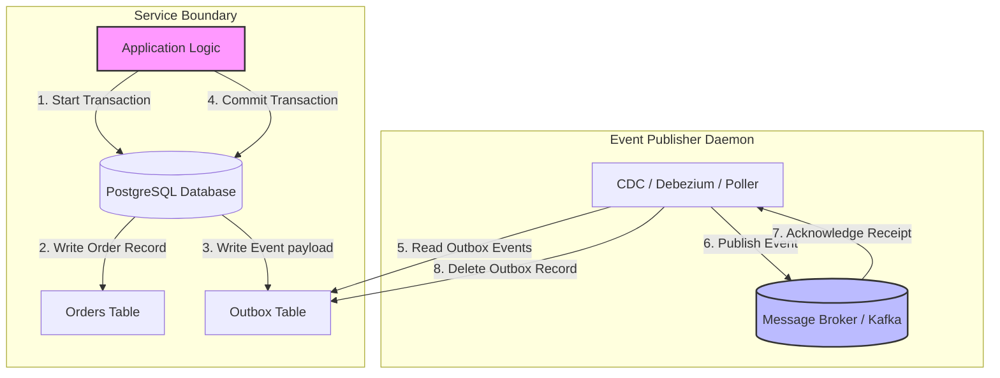

# Event-Driven Architecture

## Introduction
**Event-Driven Architecture (EDA)** is a software architecture pattern where microservices communicate asynchronously by publishing and subscribing to **events** (facts reflecting state changes) rather than invoking each other directly via synchronous remote procedure calls (RPC or HTTP REST). This paradigm shifts systems from request-response execution ("commands") to reactive execution ("events").

---

## Problem Statement
In traditional synchronous architectures (Request-Response):
1.  **Temporal Coupling:** If Service A calls Service B, and Service B is offline or slow, Service A fails or hangs. The availability of the system is the mathematical product of the availability of all chained services:
    $$\text{Availability}_{\text{System}} = \text{Availability}_{A} \times \text{Availability}_{B} \times \text{Availability}_{C}$$
2.  **Rigid Extension:** Adding a new downstream consumer (e.g., adding a recommendation engine that needs checkout data) requires modifying the core Checkout service code to call the new service API.
3.  **Database Dual-Write Failure:** Updating a local database and making a network call to notify another service is non-atomic. If the network call fails after the DB commit, the systems drift out of sync.

---

## Why This Exists
EDA exists to unlock **temporal and spatial decoupling**. Producers publish events to a broker without knowing who the consumers are, how many exist, or if they are currently online. This increases overall system resilience: if a consumer service crashes, the event broker buffers events on disk, allowing the consumer to recover and process the backlog without losing data.

---

## Real-world Analogy
Imagine a busy airport flight operations system:
*   **Request-Response (Direct Call):** The pilot calls the air traffic control tower, luggage handling, fueling crew, and catering service individually on separate radio channels to ask: *"Are you ready for flight 101?"* If one team doesn't answer, the plane cannot prepare.
*   **Event-Driven (Bulletin Board):** The airport maintains a central digital departures board (Event Broker). When flight 101 lands, the plane status updates to `Landed` (Event).
    *   The refueling crew sees the board update and drives out.
    *   The luggage crew sees the update and begins unloading.
    *   The cleaning crew reactive-drives to the gate.
    *   The pilot does not call anyone; they simply announce a fact, and others react independently.

---

## Definition
**Event-Driven Architecture** is a design pattern where sovereign services asynchronously exchange notifications of state changes (events) through an intermediary event broker to coordinate workflows without direct coupling.

---

## Key Concepts

### 1. Types of Event Models
*   **Event Notification:** Lightweight events notifying change (e.g., `OrderCompleted` containing only `{"orderId": 105}`). Consumers must call back the producer via API to fetch details (creates coupling).
*   **Event-Carried State Transfer:** Events include all data needed by consumers (e.g., `{"orderId": 105, "total": 99.9, "customer": "Alice", "items": [...]}`). Consumers cache this data locally, eliminating subsequent API calls to the producer.
*   **Event Sourcing:** The application's state is not stored in a traditional database table. Instead, it is stored as an immutable sequence of events (e.g., `AccountOpened`, `MoneyDeposited`, `MoneyWithdrawn`). The current state (account balance) is reconstructed by replaying the event log from start to finish.

### 2. Choreography vs. Orchestration
*   **Orchestration (Centralized):** A central coordinator service (the "orchestrator") directs all steps of a workflow, calling individual services synchronously or asynchronously (like a conductor directing an orchestra). *Common in Saga patterns.*
*   **Choreography (Decoupled):** Services react independently to events published by others. There is no central point of control (like dancers reacting to the music and each other).

### 3. Transactional Outbox Pattern
To prevent data inconsistency where a database write succeeds but the event publication fails, systems use the **Transactional Outbox Pattern**:
1.  The application writes the business state update (e.g., inserting an order) and the event payload into an `Outbox` table in the *same* database transaction.
2.  A separate background publisher process (or Change Data Capture tool like Debezium) continuously polls the `Outbox` table, publishes the events to the broker, and deletes them from the table upon acknowledgment.

---

## Architecture Flow: The Transactional Outbox Pattern



---

## Java Implementation

The following Java code simulates the **Transactional Outbox Pattern**, illustrating how database writes and event creation are kept atomic within a local transaction, and then processed asynchronously by a publishing daemon.

```java
import java.util.*;
import java.util.concurrent.*;

// Represents an Event stored in the Outbox Table
class OutboxEvent {
    final String id;
    final String aggregateType;
    final String eventType;
    final String payload;
    boolean processed = false;

    public OutboxEvent(String aggregateType, String eventType, String payload) {
        this.id = UUID.randomUUID().toString();
        this.aggregateType = aggregateType;
        this.eventType = eventType;
        this.payload = payload;
    }
}

// Database Mock supporting transactional commits
class TransactionalDatabase {
    final Map<String, String> ordersTable = new ConcurrentHashMap<>();
    final List<OutboxEvent> outboxTable = Collections.synchronizedList(new ArrayList<>());

    public void executeInTransaction(Runnable dbOps) {
        // In a real DB, this is wrapped in BEGIN and COMMIT.
        // If any operation fails, the transaction is rolled back.
        synchronized (this) {
            dbOps.run();
        }
    }
}

// Event Publisher Daemon
class OutboxPublisherDaemon {
    private final TransactionalDatabase db;
    private final List<String> messageBroker = new ArrayList<>(); // Mock Kafka
    private final ScheduledExecutorService scheduler = Executors.newSingleThreadScheduledExecutor();

    public OutboxPublisherDaemon(TransactionalDatabase db) {
        this.db = db;
        // Poll outbox table every 500 milliseconds
        scheduler.scheduleAtFixedRate(this::pollAndPublish, 500, 500, TimeUnit.MILLISECONDS);
    }

    private void pollAndPublish() {
        synchronized (db) {
            Iterator<OutboxEvent> iterator = db.outboxTable.iterator();
            while (iterator.hasNext()) {
                OutboxEvent event = iterator.next();
                if (!event.processed) {
                    try {
                        // Publish to Kafka/RabbitMQ
                        publishToBroker(event);
                        event.processed = true;
                        
                        // Delete processed outbox event
                        iterator.remove();
                        System.out.println("Outbox: Published and removed event ID: " + event.id);
                    } catch (Exception e) {
                        System.err.println("Broker unreachable, holding event: " + e.getMessage());
                        break; // Stop processing batch, retry later
                    }
                }
            }
        }
    }

    private void publishToBroker(OutboxEvent event) throws Exception {
        // Simulate network failure randomly
        if (Math.random() < 0.1) {
            throw new Exception("Network Timeout");
        }
        messageBroker.add(event.payload);
        System.out.println("Broker: Received Event [" + event.eventType + "] Payload: " + event.payload);
    }

    public void shutdown() {
        scheduler.shutdown();
    }
}

// Checkout Service using the Outbox Pattern
public class OrderService {
    private final TransactionalDatabase database;

    public OrderService(TransactionalDatabase database) {
        this.database = database;
    }

    public void placeOrder(String orderId, String customer, double total) {
        // Execute both writes atomically inside a single local transaction
        database.executeInTransaction(() -> {
            // 1. Insert Order
            database.ordersTable.put(orderId, customer + ":" + total);
            
            // 2. Insert Event into Outbox Table
            String payload = String.format("{\"orderId\":\"%s\",\"total\":%.2f}", orderId, total);
            OutboxEvent event = new OutboxEvent("Order", "OrderCreated", payload);
            database.outboxTable.add(event);
            
            System.out.println("DB Transaction committed: Saved Order " + orderId + " and Outbox Event");
        });
    }
}
```

---

## Step-by-Step Explanation: The Outbox Publish Sequence
Using the Java implementation above:

1.  **Checkout Request:** A client requests to place an order.
2.  **Atomic Transaction:** The `OrderService` triggers `database.executeInTransaction()`.
    *   It updates the local `ordersTable` with the business data.
    *   It appends an `OutboxEvent` containing the `OrderCreated` payload into the `outboxTable` in memory.
    *   If either fails, the transaction rolls back.
3.  **Daemon Polling:** The `OutboxPublisherDaemon` executes its background thread.
4.  **Broker Publish:** The daemon reads uncommitted events, converts them to bytes, and publishes them to the message broker.
5.  **Acknowledge & Prune:** Once the broker returns success, the daemon marks the event as processed and removes it from the `outboxTable`, maintaining strict reliability without dual-write risks.

---

## Multiple Real-world Examples

1.  **E-Commerce Fulfillment (Choreography):**
    *   `Order Service` emits `OrderCreated`.
    *   `Inventory Service` reacts by holding stock and emits `StockReserved`.
    *   `Payment Service` reacts to `StockReserved` by charging the card and emits `PaymentSucceeded`.
    *   `Shipping Service` reacts to `PaymentSucceeded` and schedules delivery.
2.  **Ride-Sharing State Machines (Uber):** A driver accepts a ride. The server emits `RideAccepted`. The mapping service consumes this event to calculate routes, the notification service sends a SMS to the customer, and the billing service sets up the trip transaction.
3.  **Change Data Capture (CDC):** A legacy application updates records directly in MySQL. A CDC agent (Debezium) monitors the MySQL replication binary logs (binlog), translates database updates into event streams, and publishes them to Kafka for indexing.

---

## Pros & Cons

### Pros
*   **Zero Temporal Coupling:** Services function independently. If shipping is down, order processing continues.
*   **High Scalability & Elasticity:** Consumers read from queues at their own pace, protecting downstream services from traffic spikes.
*   **Simplified Extensibility:** New services (e.g., reporting, machine learning features) can be added as consumers of existing topics without modifying the producer's code.
*   **Audit-Ready History:** Event streams provide a clear, timestamped ledger of all state changes across the system.

### Cons
*   **Complex Distributed Tracing:** Tracing a workflow that spans multiple asynchronous queues requires injecting **Correlation IDs** in every event header.
*   **Eventual Consistency Complexity:** The system is eventually consistent. A user might place an order and reload their screen before the inventory consumer has updated the status, displaying stale data.
*   **Schema Evolution Overhead:** If you modify an event schema (e.g., adding a field), you must ensure backward compatibility so older consumers don't crash.

---

## Interview Questions

### Beginner
*   **Q:** What is the difference between Orchestration and Choreography in microservice architectures?
*   **A:** Orchestration uses a central coordinator service (the orchestrator) that directs other services on what to do (command-based). Choreography operates without central control; services react independently to events published by others (event-based).

### Intermediate
*   **Q:** What is the "Transactional Outbox Pattern" and what problem does it solve?
*   **A:** The Outbox pattern solves the "dual-write" problem where updating a database and publishing an event to a broker are not atomic. It solves this by writing both the database update and the event payload into the same database atomically in a single local transaction. A background process then reads from the outbox table and publishes events to the broker reliably.

### Senior
*   **Q:** How do you handle schema evolution in an event-driven system to prevent breaking downstream consumers?
*   **A:** 
    1.  **Use a Schema Registry:** Use tools like the Confluent Schema Registry (for Avro/Protobuf) to enforce schema compatibility rules (e.g., backward compatibility).
    2.  **Add, Don't Delete:** Only add optional fields. Never delete or rename existing fields in event payloads.
    3.  **Version Topics:** If a breaking change is unavoidable, publish to a new topic version (e.g., `orders-v2`) and deprecate `orders-v1` gradually.

### Staff Engineer
*   **Q:** Discuss the trade-offs between Event-Carried State Transfer and Event Notification patterns at enterprise scale.
*   **A:** Event Notification is lightweight, containing only record IDs (e.g., `{"orderId": 105}`). This keeps event schemas simple but forces consumers to make synchronous API callbacks to the producer to fetch the full payload, creating temporal coupling and high read load on the producer. Event-Carried State Transfer includes the entire payload (e.g., items, customer billing details), allowing consumers to cache state locally and run independently. However, this increases event sizes, consumes more network bandwidth and broker storage, and exposes schemas to more frequent changes, increasing schema management overhead.

---

## Common Mistakes
*   **Using Events as Commands:** Naming events `CreateOrder` instead of `OrderCreated`. Events are records of things that *already happened*, not instructions on what to do next.
*   **Ignoring Idempotency:** Assuming messages will only be delivered once. Network retries mean consumers will occasionally receive duplicate events.
*   **Omitting Correlation IDs:** Not passing a unique request ID across event headers, rendering distributed debugging impossible.

---

## Best Practices
*   **Design for Idempotency:** Ensure consumers can safely receive the same event multiple times without duplicate side-effects.
*   **Implement Correlation IDs:** Inject a unique UUID into the metadata header of all events to track asynchronous flows across services.
*   **Use Schema Registries:** Enforce schema contracts using Avro or Protobuf to validate payloads before they are published to brokers.

---

## When NOT to Use
*   **Low-Complexity Systems:** Monolithic or small applications where simple direct database queries are faster and easier to maintain.
*   **Strict Synchronous Workflows:** Interactive logins or checkout authentication where the user must wait for confirmation before the HTTP request returns.

---

## Comparison with Similar Concepts

*   **EDA vs. Event Sourcing:** EDA is an integration pattern for communicating *between* microservices. Event Sourcing is a persistence pattern for storing state *within* a single microservice as a sequence of events.
*   **EDA vs. Request-Response:** EDA is asynchronous and decoupled (producers don't know who reads the event). Request-Response is synchronous and coupled (producers wait for a specific receiver's response).

---

## Summary
Event-Driven Architecture decouples distributed services, allowing them to scale, recover, and evolve independently. By replacing synchronous REST chains with asynchronous event logs, implementing the Transactional Outbox pattern, and designing idempotent consumers, engineers can build highly resilient, reactive systems.

---

## Related Topics
- [Kafka](../kafka)
- [RabbitMQ](../rabbitmq)
- [SQS](../sqs)
- [Distributed Systems](../../distributed-systems)
