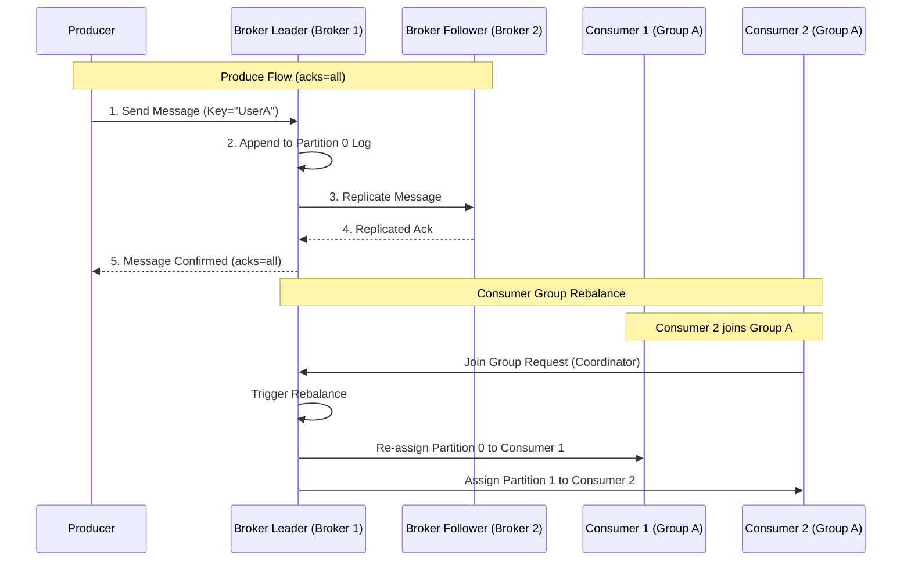

# Kafka

## Introduction
Apache Kafka is an open-source, distributed event streaming platform optimized for high-throughput, fault-tolerant, and low-latency ingestion of real-time data feeds. Originally developed at LinkedIn to solve the bottleneck of tracking massive user activity streams, Kafka has evolved into the standard log-centric backbone for distributed event-driven architectures.

---

## Problem Statement
Traditional message queues (like RabbitMQ or ActiveMQ) utilize a "smart broker, dumb consumer" model. The broker tracks which messages have been acknowledged and deletes them immediately upon delivery. While this works well for classic task distribution, it suffers from several major limitations:
1.  **Scalability Limits:** Tracking acknowledgments for individual messages incurs high CPU and disk lock overhead, causing brokers to choke under high throughput.
2.  **No Event Replay:** Once a message is consumed, it is deleted. If a downstream database crashes and needs to reconstruct its history, the historical events cannot be replayed.
3.  **Point-to-Point Coupling:** If multiple microservices need the same event feed, the publisher must manage distinct queues for each service.

---

## Why This Exists
Kafka operates on a **commit log architecture** ("dumb broker, smart consumer"). It persists all incoming events sequentially to disk in append-only partition files. It does not delete messages immediately upon consumption, nor does it track individual message acknowledgments. Instead, messages are retained for a configurable time (e.g., 7 days), and consumers track their own positions (**offsets**). This unlocks:
*   **Extreme Throughput:** Serves millions of messages per second by utilizing sequential disk writes and Zero-Copy network transfers.
*   **Event Replayability:** Consumers can rewind their offsets to reprocess historical events (e.g., re-running analytics after fixing a bug).
*   **Massive Fan-out:** Any number of independent systems can read the same partition stream without affecting each other.

---

## Real-world Analogy
Imagine a security guard's logbook at a secure building entrance:
*   **The Topic:** The visitor logbook.
*   **The Partitions:** The book is divided into multiple pages (Partitions) so multiple guards (Producers) can write at the same time.
*   **The Offset:** When visitors sign in, they receive an incrementing number (Offset). 1, 2, 3, etc.
*   **The Consumers:** Inspectors reviewing the logbook. Inspector A wants to know about VIP visitors and reads page 1. Inspector B reviews fire safety and reads page 2. 
*   **Smart Consumer:** The guard does not tear out pages when an inspector finishes reading. Instead, each inspector writes down in their pocket notebook (Offset commit): *"I have read up to number 45."* Next week, they pick up at 46. If they lose their notebook, they can re-read the logbook from number 1.

---

## Definition
**Apache Kafka** is a distributed, sharded, replicated commit-log service. It organizes message streams into **Topics** which are divided into **Partitions** across a cluster of **Brokers**, allowing high-throughput, ordered, and decoupled event streaming.

---

## Key Concepts

### 1. Topics, Partitions, and Offsets
*   **Topic:** A logical channel or category where producers write events (e.g., `user-clicks`).
*   **Partition:** A physical commit-log file on disk. Topics are split into multiple partitions for scalability and parallelism. Ordering is guaranteed **only within a single partition**, not across the entire topic.
*   **Offset:** A unique, sequential ID assigned to each message as it is appended to a partition.

```
Partition 0: [Msg 0] [Msg 1] [Msg 2] [Msg 3] ... (Append Only Log)
Partition 1: [Msg 0] [Msg 1] [Msg 2] ...
```

### 2. Producers and Consumers
*   **Producer:** Publishes messages to topics. It uses a **partitioner** (e.g., hashing the message key `CRC32(key) % partition_count`) to route messages to specific partitions.
*   **Consumer:** Reads messages from partitions sequentially.
*   **Consumer Group:** A set of consumers that cooperate to process a topic. Each partition in the topic is assigned to **exactly one** consumer in the group. If there are 4 partitions and 4 consumers, each gets 1 partition. If there are 5 consumers, the 5th remains idle (scale limit).

```
Consumer Group A:
[ Consumer 1 ] <--- Partition 0
[ Consumer 2 ] <--- Partition 1
[ Consumer 3 ] <--- Partition 2 & 3
```

### 3. Replicas and ISR (In-Sync Replicas)
*   **Partition Leader:** The broker node handling all reads and writes for a given partition.
*   **Partition Follower:** Nodes that replicate the partition log from the leader to ensure durability.
*   **ISR (In-Sync Replicas):** Followers that are caught up with the leader. If the leader fails, a new leader is elected *only* from the ISR pool.

### 4. Zero-Copy Performance Optimization
To send a cached log file over a network socket:
*   *Standard Queue:* Disk $\to$ OS Kernel Page Cache $\to$ JVM User Space $\to$ Socket Buffer $\to$ Network Card NIC. (4 context switches, 4 copy cycles).
*   *Kafka Zero-Copy:* Kafka calls the OS `sendfile()` system call. The OS transfers bytes directly from Disk $\to$ OS Page Cache $\to$ Network Card NIC, bypassing JVM memory entirely.

---

## Internal Working: Publish and Consumer Group Rebalancing



---

## Java Implementation

The following Java class simulates a partitioned commit log and coordinates message routing and consumer group offset management.

```java
import java.util.*;
import java.util.concurrent.ConcurrentHashMap;

// Represents a Message in Kafka
class EventRecord {
    final String key;
    final String value;
    final long offset;

    public EventRecord(String key, String value, long offset) {
        this.key = key;
        this.value = value;
        this.offset = offset;
    }
}

// Simulated Topic Partition
class TopicPartition {
    private final List<EventRecord> log = new ArrayList<>();
    
    public synchronized long append(String key, String value) {
        long nextOffset = log.size();
        log.add(new EventRecord(key, value, nextOffset));
        return nextOffset;
    }

    public synchronized List<EventRecord> readFrom(long offset, int batchSize) {
        List<EventRecord> records = new ArrayList<>();
        int logSize = log.size();
        for (int i = (int) offset; i < logSize && records.size() < batchSize; i++) {
            records.add(log.get(i));
        }
        return records;
    }

    public synchronized int size() {
        return log.size();
    }
}

// Kafka Broker Simulator
public class KafkaBrokerSimulator {
    // Maps Topic -> Map of Partition ID -> Partition Log
    private final Map<String, Map<Integer, TopicPartition>> topics = new ConcurrentHashMap<>();
    // Tracks Consumer Group Offsets: GroupID#Topic#Partition -> CommittedOffset
    private final Map<String, Long> committedOffsets = new ConcurrentHashMap<>();

    public void createTopic(String topicName, int partitionCount) {
        Map<Integer, TopicPartition> partitionMap = new HashMap<>();
        for (int i = 0; i < partitionCount; i++) {
            partitionMap.put(i, new TopicPartition());
        }
        topics.put(topicName, partitionMap);
    }

    // ==========================================
    // PRODUCER: Routing by Hash key
    // ==========================================
    public void publish(String topicName, String key, String value) {
        Map<Integer, TopicPartition> partitionMap = topics.get(topicName);
        if (partitionMap == null) throw new IllegalArgumentException("Topic not found");

        // Routing key
        int partitionId = Math.abs(key.hashCode()) % partitionMap.size();
        TopicPartition partition = partitionMap.get(partitionId);
        long offset = partition.append(key, value);
        
        System.out.println("Published to [" + topicName + "-Partition-" + partitionId + "] at Offset: " + offset);
    }

    // ==========================================
    // CONSUMER: Fetch & Commit Offsets
    // ==========================================
    public List<EventRecord> poll(String consumerGroupId, String topicName, int partitionId, int batchSize) {
        Map<Integer, TopicPartition> partitionMap = topics.get(topicName);
        if (partitionMap == null) return Collections.emptyList();
        
        TopicPartition partition = partitionMap.get(partitionId);
        if (partition == null) return Collections.emptyList();

        String offsetKey = consumerGroupId + "#" + topicName + "#" + partitionId;
        long lastCommittedOffset = committedOffsets.getOrDefault(offsetKey, 0L);

        List<EventRecord> records = partition.readFrom(lastCommittedOffset, batchSize);
        
        // Auto-commit simulated (or manual commit)
        if (!records.isEmpty()) {
            long nextOffset = records.get(records.size() - 1).offset + 1;
            committedOffsets.put(offsetKey, nextOffset);
        }
        return records;
    }

    public long getCommittedOffset(String consumerGroupId, String topicName, int partitionId) {
        return committedOffsets.getOrDefault(consumerGroupId + "#" + topicName + "#" + partitionId, 0L);
    }
}
```

---

## Step-by-Step Explanation: Message Replication & Commits
When a producer writes with `acks=all`:

1.  **Publish:** The producer sends an event to Broker 1 (the partition leader).
2.  **Append:** The leader writes the event to its local commit log. At this stage, the message is uncommitted and cannot be read by consumers.
3.  **Replication:** Broker 2 (follower) polls the leader for new messages. It receives the event and writes it to its local log.
4.  **Acknowledgment:** Broker 2 sends a fetch request to the leader, implicitly acknowledging that it replicated the message.
5.  **High Watermark Update:** Once all nodes in the In-Sync Replicas (ISR) group have acknowledged the write, the leader moves the **High Watermark (HW)** offset forward. The message is now "committed".
6.  **Producer Ack:** The leader returns a success response to the producer, and the event becomes visible to consumers.

---

## Multiple Real-world Examples

1.  **Log Aggregation (ELK Stack):** Application servers append error logs to Kafka. Logstash consumers pull log events, parse them, and index them into Elasticsearch in batches, insulating Elasticsearch from traffic spikes.
2.  **Order Processing (Microservices):** A checkout service publishes `OrderPlaced` events to a topic.
    *   *Inventory Service* consumes the event to reserve products.
    *   *Notification Service* consumes the event to send emails.
    *   *Analytics Service* consumes the event to calculate revenue in real time.
3.  **Real-Time Fraud Detection:** Bank transactions stream into a Kafka topic. A Flink stream processing application analyzes transaction windows for suspicious activity and writes flagged transactions to a fraud alerts topic.

---

## Pros & Cons

### Pros
*   **Extreme Throughput:** Sequentially appends to disk and leverages zero-copy network operations, enabling gigabytes of throughput per second.
*   **Scalability:** Supports horizontal scaling by adding partition nodes to split workloads across brokers.
*   **Event Retention & Durability:** Retains events on disk for days or weeks, permitting historical audit logs and system replays.
*   **Consumer Decoupling:** Dumb broker architecture allows slow and fast consumers to process the same feeds independently.

### Cons
*   **Operational Overhead:** Deploying and maintaining clusters requires robust monitoring of replication, Zookeeper/KRaft, partition limits, and consumer lag.
*   **Lack of Global Ordering:** Ordering is only guaranteed per partition. To maintain order across related events, they must share the same partition key.
*   **Rebalance Storms:** Adding or removing consumers in a group triggers partition reassignment, temporarily blocking consumption.

---

## Interview Questions

### Beginner
*   **Q:** What is a consumer group in Kafka?
*   **A:** A consumer group is a group of consumers that cooperate to read from a topic. Kafka assigns each partition to exactly one consumer in the group, ensuring that messages are processed in parallel without duplicate processing.

### Intermediate
*   **Q:** What is the difference between "At-least-once", "At-most-once", and "Exactly-once" processing semantics in Kafka?
*   **A:** 
    *   **At-most-once:** Offsets are committed *before* processing the message. If the consumer crashes during processing, the message is lost (never re-read).
    *   **At-least-once:** Messages are processed *before* offsets are committed. If the consumer crashes, the message is re-processed, potentially causing duplicate entries (default).
    *   **Exactly-once:** Leverages transactions where consumer processing, output writes, and offset commits are wrapped in a atomic transaction across Kafka topics, ensuring no duplicates or losses.

### Senior
*   **Q:** How does Kafka handle partition reassignment during consumer rebalancing? How do you prevent rebalance storms?
*   **A:** When a consumer joins or leaves, the Group Coordinator broker triggers a rebalance. Under the default eager protocol, all consumers stop processing and release their partitions, then wait to be assigned new ones. This causes consumption pauses. To prevent rebalance storms:
    1.  Use **Cooperative Sticky Assignors**, which only reassign partitions that need to move, leaving others untouched.
    2.  Increase `max.poll.interval.ms` so slow processing doesn't trigger false consumer-dead events.

### Staff Engineer
*   **Q:** Explain KRaft metadata mode and how it solves the scalability limitations of Apache ZooKeeper in large Kafka clusters.
*   **A:** Under ZooKeeper, the partition leader election and metadata changes are managed externally. When a ZooKeeper-based cluster restarts or experiences a broker crash, the metadata must be synchronized between the active brokers and ZooKeeper. For clusters with hundreds of thousands of partitions, this sync takes tens of minutes, causing service disruptions. KRaft (Kafka Raft) replaces ZooKeeper by running a Raft consensus metadata log directly inside Kafka brokers. This makes metadata state transitions instantaneous, allowing Kafka to scale to millions of partitions with fast cluster recovery times.

---

## Common Mistakes
*   **Using a Low-Cardinality Partition Key:** Routing messages by `gender` or `status` leads to hot partitions where one broker is overloaded while others remain idle.
*   **Treating Kafka as a Database:** Storing files indefinitely without configuring cleanup policies, eventually filling up the disk.
*   **Forgetting to Monitor Consumer Lag:** Ignoring the gap between the latest offset written by producers and the offset read by consumers, leading to delayed real-time pipelines.

---

## Best Practices
*   **Select Partition Keys Carefully:** Partition by high-cardinality keys like `userId` or `orderId` to ensure even data distribution.
*   **Optimize Batching:** Tune `linger.ms` and `batch.size` on the producer to group smaller messages together before network transmission, improving throughput.
*   **Configure Acks appropriately:** Use `acks=all` with `min.insync.replicas=2` for critical financial transactions, and `acks=1` for performance-focused logging.

---

## When NOT to Use
*   **Simple Request-Response:** If you need a synchronous response from a service before returning to the user, using Kafka introduces unnecessary latency and complexity.
*   **Task Queues with Individual Acknowledgments:** If you need to process tasks out-of-order or acknowledge individual messages independently (e.g., executing arbitrary delayed tasks), use RabbitMQ or SQS instead.

---

## Comparison with Similar Concepts

*   **Kafka vs. RabbitMQ:** Kafka is an append-only commit log designed for high-throughput streaming and event replays (smart consumer). RabbitMQ is a traditional queue designed for complex routing and transient task distribution (smart broker).
*   **Kafka vs. SQS:** SQS is a fully managed, serverless unicast queue service. Kafka is a streaming platform supporting multicast (pub/sub fan-out) and durable event retention.

---

## Summary
Apache Kafka is a highly scalable commit log system that excels at decoupling microservices and powering high-throughput event pipelines. By moving coordination responsibilities to the client (offsets) and optimization to disk sequential reads (Zero-Copy), Kafka provides unmatched performance for distributed event streaming.

---

## Related Topics
- [RabbitMQ](../rabbitmq)
- [SQS](../sqs)
- [Event-Driven Architecture](../event-driven-architecture)
- [Distributed Systems](../../distributed-systems)
