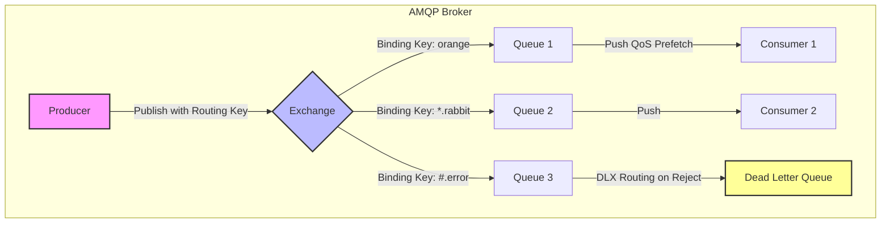

# RabbitMQ

## Introduction
RabbitMQ is a widely deployed, open-source message broker that natively implements the **Advanced Message Queuing Protocol (AMQP)**. Optimized for flexible routing, reliable message delivery, and transactional queuing semantics, RabbitMQ follows a "smart broker, dumb consumer" model, offering transient queue structures designed for low-latency asynchronous task distribution.

---

## Problem Statement
In tightly-coupled architectures:
1.  **Cascading Failures:** If Service A makes synchronous HTTP calls to Service B, and Service B experiences a slowdown, Service A's threads block, quickly exhausting connection pools and taking down the entire system.
2.  **Complex Routing Ingest:** A publisher might want to route a single event to different services depending on its metadata (e.g., routing critical errors to a slack notifier, audit events to an archiver, and all logs to a search index). Hardcoding this routing logic in the application is brittle.
3.  **Flow Control Imbalances:** Fast producers can easily overwhelm slower consumer services, causing resource exhaustion.

---

## Why This Exists
RabbitMQ provides a robust intermediary layer that acts as a buffer. By utilizing **Exchanges** and **Bindings**, it decouples publishers from consumers. Publishers only send messages to an exchange with a routing key, completely unaware of which queues or services will receive them. RabbitMQ handles the complex routing logic internally, providing rich flow control (prefetch limits), message acknowledgments, and dead-letter queues to guarantee reliable job processing.

---

## Real-world Analogy
Imagine a corporate physical mailroom sorting facility:
*   **The Producer:** An employee sending a memo.
*   **The Exchange:** The mailroom clerk. The employee hands the envelope to the clerk. They don't know who has folders; they just write a category on the envelope (Routing Key), like "Billing" or "HR".
*   **The Bindings:** The rules on the mailroom wall telling the clerk: *"Any envelope labeled 'Billing' goes into Box 3 and Box 4."*
*   **The Queues:** The physical mailboxes on the wall (Box 3, Box 4) where envelopes wait.
*   **The Consumer:** The billing department employee who walks up, takes the envelopes, reads them, and throws them away once processed (Acknowledgment).

---

## Definition
**RabbitMQ** is a message broker that receives messages from producers via **Exchanges**, routes them to **Queues** using **Routing Keys** and **Bindings**, and pushes them to **Consumers** using AMQP protocols.

---

## Key Concepts

### 1. Connection multiplexing (Channels)
Establishing TCP connections is expensive. RabbitMQ solves this by introducing **Channels**—virtual connections inside a single physical TCP connection. Applications create one TCP connection per process and multiplex multiple lightweight channels for parallel threads.

### 2. Exchange Types
An exchange receives messages from producers and determines how to route them to queues based on binding configurations:
*   **Direct Exchange:** Routes messages to queues based on an exact match of the routing key (e.g., `info` routing key matches `info` binding).
*   **Fanout Exchange:** Ignores routing keys and duplicates/broadcasts the message to **all** queues bound to it. Ideal for pub/sub notifications.
*   **Topic Exchange:** Performs wildcard matching on routing keys. Routing keys consist of dot-separated words.
    *   `*` (star) matches exactly one word (e.g., `lazy.*` matches `lazy.orange`).
    *   `#` (hash) matches zero or more words (e.g., `audit.#` matches `audit.orders.checkout`).
*   **Headers Exchange:** Uses message header attributes instead of routing keys to determine routing logic.

```
Direct:  [Key: error]    --> [Exchange] --> [Queue (Binding: error)]
Fanout:  [Key: ignored]  --> [Exchange] --> [Queue A] & [Queue B] (All)
Topic:   [Key: cn.log.err] --> [Exchange] --> [Queue (Binding: *.log.#)]
```

### 3. Message Acknowledgements (ACK / NACK)
*   **Manual Acks:** A consumer reads a message, processes it, and sends a `basic.ack` command back. Only then does RabbitMQ delete the message.
*   **Nack / Reject:** If processing fails, the consumer calls `basic.nack` or `basic.reject`. The broker can either re-queue the message for another worker or route it to a **Dead Letter Exchange (DLX)**.

### 4. Prefetch Limit (Quality of Service - QoS)
Prefetch limits prevent a consumer from being overwhelmed. If set to `prefetch=10`, RabbitMQ will not push any more messages to that consumer until it acknowledges some of the 10 outstanding messages. This ensures load balancing between fast and slow workers.

---

## Internal Working: Exchange-to-Queue Architecture



---

## Java Implementation

The following Java code simulates a lightweight RabbitMQ broker, implementing Direct, Fanout, and Topic exchange routing, along with consumer subscription and manual acknowledgment emulation.

```java
import java.util.*;
import java.util.concurrent.ConcurrentHashMap;
import java.util.regex.Pattern;

class Message {
    final String body;
    final String routingKey;

    public Message(String body, String routingKey) {
        this.body = body;
        this.routingKey = routingKey;
    }
}

class RabbitQueue {
    final String name;
    final List<Message> messages = Collections.synchronizedList(new ArrayList<>());

    public RabbitQueue(String name) {
        this.name = name;
    }

    public void enqueue(Message msg) {
        messages.add(msg);
    }

    public Message dequeue() {
        if (messages.isEmpty()) return null;
        return messages.remove(0);
    }
}

public class RabbitMQSimulator {
    // Maps ExchangeName -> ExchangeType (direct, fanout, topic)
    private final Map<String, String> exchanges = new ConcurrentHashMap<>();
    private final Map<String, RabbitQueue> queues = new ConcurrentHashMap<>();
    
    // Maps ExchangeName -> List of Bindings
    private final Map<String, List<Binding>> bindings = new ConcurrentHashMap<>();

    private static class Binding {
        final String routingPattern;
        final String queueName;

        public Binding(String routingPattern, String queueName) {
            this.routingPattern = routingPattern;
            this.queueName = queueName;
        }
    }

    public void declareExchange(String name, String type) {
        exchanges.put(name, type.toLowerCase());
        bindings.put(name, new ArrayList<>());
    }

    public void declareQueue(String name) {
        queues.put(name, new RabbitQueue(name));
    }

    public void queueBind(String queueName, String exchangeName, String routingPattern) {
        List<Binding> exchangeBindings = bindings.get(exchangeName);
        if (exchangeBindings != null) {
            exchangeBindings.add(new Binding(routingPattern, queueName));
        }
    }

    // ==========================================
    // PUBLISH: Route messages based on Exchange Type
    // ==========================================
    public void publish(String exchangeName, String routingKey, String body) {
        String type = exchanges.get(exchangeName);
        if (type == null) throw new IllegalArgumentException("Exchange not found");

        Message message = new Message(body, routingKey);
        List<Binding> exchangeBindings = bindings.get(exchangeName);

        for (Binding binding : exchangeBindings) {
            boolean matches = false;

            switch (type) {
                case "fanout":
                    matches = true; // Fanout broadcasts to all bound queues
                    break;
                case "direct":
                    matches = binding.routingPattern.equals(routingKey);
                    break;
                case "topic":
                    matches = matchesTopicPattern(binding.routingPattern, routingKey);
                    break;
            }

            if (matches) {
                RabbitQueue targetQueue = queues.get(binding.queueName);
                if (targetQueue != null) {
                    targetQueue.enqueue(message);
                    System.out.println("Routed message to [" + binding.queueName + "] via exchange [" + exchangeName + "]");
                }
            }
        }
    }

    // Helper to evaluate RabbitMQ Topic Wildcards (* and #)
    private boolean matchesTopicPattern(String pattern, String key) {
        // Convert RabbitMQ wildcards to Regex patterns
        // * matches exactly one word: [^.]+
        // # matches zero or more words: (.*)
        String regex = pattern
                .replace(".", "\\.")
                .replace("*", "[^.]+")
                .replace("#", "(.*)");
        return Pattern.matches("^" + regex + "$", key);
    }

    public Message consume(String queueName) {
        RabbitQueue q = queues.get(queueName);
        return (q != null) ? q.dequeue() : null;
    }
}
```

---

## Step-by-Step Explanation: The RabbitMQ Delivery Flow
1.  **Publishing via Channels:** The producer starts a Channel inside a multiplexed TCP connection and issues a `basic.publish` command containing:
    *   Target Exchange: `logs_exchange`
    *   Routing Key: `billing.service.error`
    *   Payload: `"Payment Timeout"`
2.  **Exchange Routing Evaluation:** The `logs_exchange` is configured as a `topic` exchange. It scans its bindings:
    *   Binding 1: Queue `email_alert_queue` with pattern `#.error` (Matches!)
    *   Binding 2: Queue `file_archive_queue` with pattern `billing.*.*` (Matches!)
    *   Binding 3: Queue `sms_queue` with pattern `sms.#` (No Match)
3.  **Enqueueing:** RabbitMQ duplicates the message and enqueues it into `email_alert_queue` and `file_archive_queue`.
4.  **Consumer Push (QoS):** The broker pushes the message to active consumers listening on `email_alert_queue`, respecting their configured prefetch counts.
5.  **Acknowledgment (Eviction):** The consumer processes the message and sends a `basic.ack`. The broker deletes the message from that queue.

---

## Multiple Real-world Examples

1.  **E-Commerce Checkout Workflows (Direct Exchange):** The user clicks "Buy". The web service publishes an `AuthorizePayment` task with a routing key `payment` directly to a payment exchange. A payment processing microservice consumes from the bound queue, ensuring checkout remains fast.
2.  **Notification Broadcast System (Fanout Exchange):** When a user goes live, a livestream service publishes a `UserLive` event to a fanout exchange. The exchange broadcasts the event to:
    *   An email notification queue.
    *   A mobile push notification queue.
    *   A logging analytics queue.
3.  **Logs Router (Topic Exchange):** System logs are published to a topic exchange with routing keys containing `module.severity` (e.g., `auth.error`, `db.info`). An alert service binds to `*.error` to catch crashes, while an archiving service binds to `#.info` to store audit logs.

---

## Pros & Cons

### Pros
*   **Flexible Routing Topologies:** Exchange types support complex routing rules directly inside the broker without requiring application code logic.
*   **Fine-Grained Flow Control:** Prefetch QoS settings prevent consumers from bottlenecking or crashing under load.
*   **Strong Delivery Guarantees:** Supports transactions, publisher confirms, durable queues, and manual consumer acknowledgments.
*   **Dead-Letter Queues (DLQ):** Failed messages can be isolated and inspected via DLXs.

### Cons
*   **Performance Bottleneck:** Under extreme write loads, tracking acknowledgments and queue states in RAM/disk limits throughput compared to sequential log appenders like Kafka.
*   **Smart Broker Overhead:** Broker complexity makes cluster scaling and split-brain resolution difficult during network partitions.
*   **Transient Storage Design:** Messages are deleted upon acknowledgment, making historic replay or data analytics impossible once processed.

---

## Interview Questions

### Beginner
*   **Q:** What is the difference between a Direct exchange and a Fanout exchange?
*   **A:** A Direct exchange routes messages to queues by matching the routing key exactly. A Fanout exchange ignores routing keys entirely and duplicates/broadcasts incoming messages to all queues bound to it.

### Intermediate
*   **Q:** What is a Dead Letter Exchange (DLX) in RabbitMQ, and when is a message sent there?
*   **A:** A DLX is a normal exchange configured to collect failed messages. A message is routed to a DLX when:
    1.  A consumer rejects it using `basic.reject` or `basic.nack` with `requeue=false`.
    2.  The message expires due to Time-To-Live (TTL).
    3.  The target queue exceeds its length limit.

### Senior
*   **Q:** What is a Channel in RabbitMQ, and why does RabbitMQ multiplex channels over a single TCP connection?
*   **A:** A Channel is a lightweight, virtual connection established within an existing TCP connection. Opening and closing TCP connections requires expensive handshakes and OS resources. Multiplexing multiple channels over a single TCP connection allows multi-threaded applications to publish/consume in parallel without the overhead of maintaining distinct TCP connections.

### Staff Engineer
*   **Q:** Explain the mechanics of a "split-brain" scenario in a RabbitMQ cluster. How does RabbitMQ handle partition clustering strategies to avoid data loss?
*   **A:** When a network partition divides a RabbitMQ cluster, nodes on both sides of the partition may assume the other side failed. If client traffic hits both sides, each side will elect new queue leaders, leading to divergent states (split-brain). To prevent this, RabbitMQ offers **partition handling strategies**:
    1.  **autoheal:** The cluster automatically selects the partition with the most connections to survive, restarting the minority partition nodes (losing their un-synced transient states).
    2.  **pause_minority:** Nodes that detect they are in a minority partition immediately pause themselves, preventing writes until the network recovers, prioritizing consistency over availability.

---

## Common Mistakes
*   **Creating One TCP Connection Per Thread:** Not utilizing channel multiplexing, which exhausts OS file descriptors.
*   **Forgetting to Acknowledge Messages:** If manual acknowledgment is enabled but the consumer fails to call `basic.ack`, messages will build up in memory, eventually exhausting the broker's RAM.
*   **Unbounded Queue Growth:** Not configuring queue limits or TTLs, which can cause RabbitMQ to freeze writes when memory hit its high watermark.

---

## Best Practices
*   **Use Durable Queues and Persistent Messages:** For critical data, declare queues as durable and set message delivery mode to persistent (2) to ensure messages survive broker restarts.
*   **Define QoS Prefetch Limits:** Always set a prefetch count (e.g., between 10 and 100) on consumers to distribute tasks evenly among workers.
*   **Isolate Exchanges by Domain:** Do not use a single monolithic exchange for all microservices; define clear routing scopes.

---

## When NOT to Use
*   **Multi-Read Event Replays:** If you need multiple systems to read the historical log of messages from 3 days ago, RabbitMQ cannot support this (use Kafka instead).
*   **Ultra-High-Throughput Streaming:** Ingesting millions of telemetry signals per second where simple sequential disk appending is faster.

---

## Comparison with Similar Concepts

*   **RabbitMQ vs. Kafka:** RabbitMQ deletes messages upon consumer acknowledgment (smart broker, transient data). Kafka stores messages in an immutable, append-only log, allowing consumers to control their own replay positions (dumb broker, durable data).
*   **RabbitMQ vs. ActiveMQ:** ActiveMQ is a legacy JMS broker. RabbitMQ implements AMQP, offering better routing performance and scaling options.

---

## Summary
RabbitMQ is a highly reliable message broker that excels at complex routing, task distribution, and event-driven microservice decoupling. By utilizing AMQP channel multiplexing, exchange routing topologies, and manual consumer acknowledgments, systems can distribute workloads safely and maintain consistent flow control.

---

## Related Topics
- [Kafka](../kafka)
- [SQS](../sqs)
- [Event-Driven Architecture](../event-driven-architecture)
