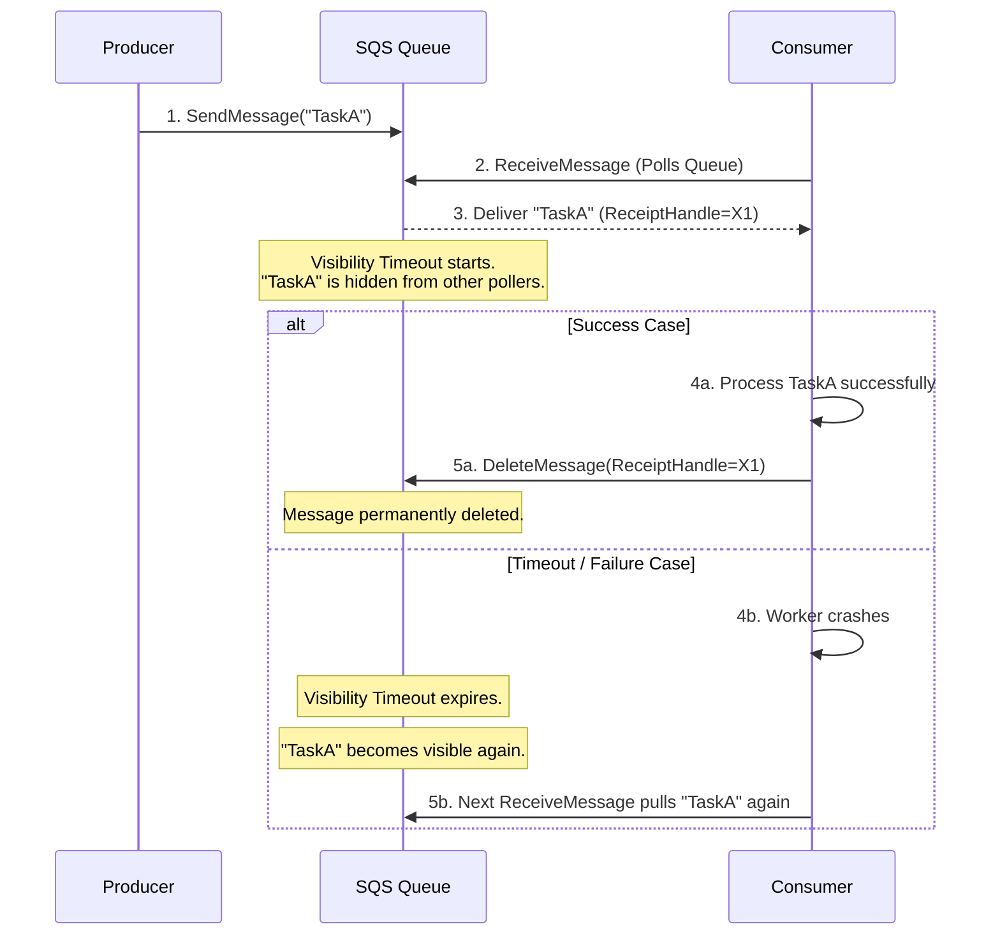

# SQS

## Introduction
Amazon Simple Queue Service (SQS) is a fully managed, serverless message queuing service designed to decouple and scale microservices, distributed systems, and serverless architectures. By removing the operational overhead of clustering, provisioning, and patching physical brokers, SQS offers elastic scaling capable of handling billions of messages daily.

---

## Problem Statement
When designing distributed cloud architectures:
1.  **Broker Maintenance Overhead:** Managing and scaling physical broker clusters (e.g., RabbitMQ or ActiveMQ) requires dedicated DevOps resources to handle disk sizing, replica synchronization, and cluster failovers.
2.  **Sudden Traffic Spikes:** Under sudden traffic loads, a self-hosted broker can run out of memory or disk space and crash, causing data loss.
3.  **Complex Scalability Syncing:** Traditional brokers do not scale elastically in sync with serverless consumers (like AWS Lambda).

---

## Why This Exists
SQS exists to provide a zero-maintenance, highly durable, and horizontally scalable message queue. By replicating messages across multiple AWS Availability Zones (AZs) internally, SQS guarantees high durability. It enables applications to scale up to virtually unlimited throughput elastically while hiding messages from other readers during processing using **Visibility Timeouts**.

---

## Real-world Analogy
Imagine a busy restaurant drive-thru lane:
*   **The Producer:** The customer placing an order at the speaker.
*   **The Queue:** The lane of cars waiting to pay and receive their food.
*   **Standard SQS (Default):** Cars are allowed to merge randomly, and sometimes a car gets served twice or out of order due to lane shifts (Standard: Best-effort ordering, at-least-once delivery).
*   **FIFO SQS:** A single, strictly walled lane. Cars can only move forward in the exact order they entered, and the kitchen only cooks one meal per order ticket (FIFO: Strict ordering, exactly-once processing).
*   **Visibility Timeout:** When a car pulls up to the pay window, it is "invisible" to the cars behind it. If the transaction takes too long (timeout expires), the car is pulled aside and the next car moves forward.

---

## Definition
**Amazon SQS** is a managed message queue service that stores messages in standard (high throughput, best-effort order) or FIFO (strict order, exactly-once) structures, allowing consumers to pull and delete messages asynchronously.

---

## Key Concepts

### 1. Standard vs. FIFO Queues
*   **Standard Queues (Default):**
    *   *Throughput:* Nearly unlimited API transactions per second.
    *   *Delivery:* **At-least-once**. Occasional duplicate messages can be delivered.
    *   *Ordering:* **Best-effort**. Messages are generally delivered in the order sent, but no strict sequence is guaranteed.
*   **FIFO Queues (First-In-First-Out):**
    *   *Throughput:* Limited to 300 transactions/sec (or 3000/sec with batching).
    *   *Delivery:* **Exactly-once**. Duplicate sends are discarded automatically using deduplication hashes.
    *   *Ordering:* **Strict ordering**. First message in is the first message out.

### 2. Visibility Timeout
When a consumer retrieves a message from SQS, the message remains in the queue but is hidden from other consumers for a configurable duration (the **Visibility Timeout**, default 30 seconds).
*   *If Processed Successfully:* The consumer calls `DeleteMessage` before the timeout expires, and the message is permanently deleted.
*   *If Processing Fails (or Times Out):* The visibility window closes, and the message becomes visible again for other consumers to pull.

### 3. Long Polling vs. Short Polling
*   **Short Polling (Default):** SQS queries only a subset of its internal storage servers and returns immediately, even if the queue is empty. This leads to empty responses and higher billing costs.
*   **Long Polling:** The consumer connection waits up to 20 seconds for a message to arrive if the queue is empty. This reduces empty responses and saves API costs.

### 4. Dead-Letter Queues (DLQ) & Redrive Policy
If a message fails to process repeatedly (e.g., due to corrupt input), it will continually expire its visibility timeout and return to the queue, blocking progress (a **poison message**). SQS uses a **Redrive Policy**—if a message's delivery count exceeds `maxReceiveCount` (e.g., 5), it is automatically moved to a secondary **Dead-Letter Queue (DLQ)** for inspection.

---

## Internal Working: The SQS Message Lifecycle



---

## Java Implementation

The following Java code simulates an Amazon SQS client wrapper, illustrating message visibility timeouts, long polling, standard queuing, and dead-letter queue routing.

```java
import java.util.*;
import java.util.concurrent.*;
import java.util.concurrent.atomic.AtomicInteger;

class SQSMessage {
    final String body;
    final String receiptHandle;
    final long visibleAtTimestamp;
    final int receiveCount;

    public SQSMessage(String body, String receiptHandle, long visibleAtTimestamp, int receiveCount) {
        this.body = body;
        this.receiptHandle = receiptHandle;
        this.visibleAtTimestamp = visibleAtTimestamp;
        this.receiveCount = receiveCount;
    }
}

public class SQSSimulator {
    private final Queue<SQSMessage> mainQueue = new ConcurrentLinkedQueue<>();
    private final Map<String, SQSMessage> inflightStore = new ConcurrentHashMap<>();
    private final List<SQSMessage> deadLetterQueue = new ArrayList<>();
    
    private final int visibilityTimeoutMs;
    private final int maxReceiveCount;

    public SQSSimulator(int visibilityTimeoutSec, int maxReceiveCount) {
        this.visibilityTimeoutMs = visibilityTimeoutSec * 1000;
        this.maxReceiveCount = maxReceiveCount;
    }

    public void sendMessage(String body) {
        String receiptHandle = UUID.randomUUID().toString();
        // New messages are visible immediately
        mainQueue.add(new SQSMessage(body, receiptHandle, System.currentTimeMillis(), 0));
    }

    // ==========================================
    // RECEIVE PATH: Simulates Visibility Lock & Long Polling
    // ==========================================
    public synchronized SQSMessage receiveMessage(int waitTimeSeconds) {
        long now = System.currentTimeMillis();
        long endTime = now + (waitTimeSeconds * 1000L);

        do {
            // Re-queue expired inflight messages first
            requeueExpiredMessages();

            // Try to find a visible message
            Iterator<SQSMessage> iterator = mainQueue.iterator();
            while (iterator.hasNext()) {
                SQSMessage msg = iterator.next();
                if (msg.visibleAtTimestamp <= System.currentTimeMillis()) {
                    iterator.remove(); // Remove from queue

                    // Check if it's a poison pill
                    int nextReceiveCount = msg.receiveCount + 1;
                    if (nextReceiveCount > maxReceiveCount) {
                        deadLetterQueue.add(msg);
                        System.out.println("Poison pill detected. Routed to DLQ: " + msg.body);
                        continue;
                    }

                    // Lock message: Calculate next visible timestamp
                    long nextVisibleAt = System.currentTimeMillis() + visibilityTimeoutMs;
                    SQSMessage inflightMsg = new SQSMessage(msg.body, msg.receiptHandle, nextVisibleAt, nextReceiveCount);
                    inflightStore.put(msg.receiptHandle, inflightMsg);
                    return inflightMsg;
                }
            }

            // Sleep briefly to simulate long polling wait
            try { Thread.sleep(100); } catch (InterruptedException ignored) {}
        } while (System.currentTimeMillis() < endTime);

        return null; // Queue Empty (Timeout)
    }

    // ==========================================
    // DELETE PATH: Acknowledging Success
    // ==========================================
    public void deleteMessage(String receiptHandle) {
        if (inflightStore.remove(receiptHandle) != null) {
            System.out.println("Acknowledged and deleted message: " + receiptHandle);
        }
    }

    private void requeueExpiredMessages() {
        long now = System.currentTimeMillis();
        Iterator<Map.Entry<String, SQSMessage>> iterator = inflightStore.entrySet().iterator();
        while (iterator.hasNext()) {
            Map.Entry<String, SQSMessage> entry = iterator.next();
            if (entry.getValue().visibleAtTimestamp <= now) {
                // Visibility timeout expired -> Put back in queue
                mainQueue.add(entry.getValue());
                iterator.remove();
                System.out.println("Visibility expired. Re-queued: " + entry.getValue().receiptHandle);
            }
        }
    }
}
```

---

## Step-by-Step Explanation: The SQS Long Polling & Deletion Flow
1.  **Publishing:** The producer publishes an order payload to SQS. SQS replicates it across three server racks.
2.  **Long Poll API:** The consumer calls `ReceiveMessage` with `WaitTimeSeconds=20`. If the queue is empty, the connection stays open, waiting.
3.  **Arrival and Invisible Lock:** As soon as a message arrives, SQS locks the message by updating its internal visibility metadata timestamp to `CurrentTime + 30s` (Visibility Timeout) and delivers the message along with a `ReceiptHandle`.
4.  **Processing:** The consumer successfully writes the order to the database.
5.  **Deletion:** Before the 30-second window closes, the consumer executes a delete command using the unique `ReceiptHandle`. SQS locates the locked message and deletes it from all three storage servers.

---

## Multiple Real-world Examples

1.  **Image Processing Pipeline (Serverless Lambda):** Users upload photos to S3. S3 triggers an event that enqueues the photo metadata into SQS. An AWS Lambda function automatically triggers, polls SQS, resizes the image, and deletes the message.
2.  **E-Commerce Checkout (FIFO Queue):** Inventory updates or reservation tickets require strict sequential execution to prevent over-selling. SQS FIFO guarantees order and prevents duplicate charges.
3.  **SMS Dispatcher:** High volume notifications are buffered in SQS. A fleet of slow worker instances polls SQS, respecting provider rate limits, and dispatches the SMS messages.

---

## Pros & Cons

### Pros
*   **Zero Operational Overhead:** Fully managed serverless architecture; no clusters to configure or maintain.
*   **Elastic Throughput:** Automatically scales to accommodate traffic surges.
*   **Cost-Efficient:** Pay-per-use billing. Empty polls are minimized using Long Polling.
*   **Built-in Durability:** Replicates messages internally across multiple AWS availability zones.

### Cons
*   **Higher Latency:** Since SQS is a distributed service accessed via HTTP APIs, it has higher latencies ($10\text{ms}-50\text{ms}$) than in-memory queues (like Redis) or AMQP sockets (like RabbitMQ).
*   **Standard Duplicate Risk:** Standard queues require consumers to be **idempotent** because duplicate messages can occasionally occur.
*   **Throughput Limits in FIFO:** FIFO queues are limited to 300 TPS (or 3,000 TPS with batching) unless split across multiple Message Group IDs.

---

## Interview Questions

### Beginner
*   **Q:** What is the difference between SQS Long Polling and Short Polling?
*   **A:** Short polling queries a subset of SQS servers and returns immediately, even if empty. Long polling waits up to 20 seconds for messages to arrive if the queue is empty, reducing empty responses and API costs.

### Intermediate
*   **Q:** What is SQS Visibility Timeout, and what happens if it is set too short?
*   **A:** Visibility Timeout is the time a message is hidden from other consumers after being retrieved. If set too short, a consumer might still be processing the message when it becomes visible again. Another consumer will retrieve and process it, leading to duplicate processing.

### Senior
*   **Q:** How do you guarantee exactly-once processing when using standard SQS queues?
*   **A:** Standard queues only guarantee at-least-once delivery. To achieve exactly-once processing:
    1.  Make your consumer **idempotent**. Use a unique ID (like `transactionId`) as a key in a database table (e.g., DynamoDB) with a unique constraint. If a duplicate message arrives, the database write fails, preventing duplicate side-effects.
    2.  Alternatively, transition to an **SQS FIFO queue**, which natively supports message deduplication using deduplication IDs.

### Staff Engineer
*   **Q:** Describe how you would design a globally distributed retry and backoff mechanism using SQS, S3, and Step Functions for a third-party payment integration.
*   **A:** 
    1.  **Primary Queue:** Payment events land in an SQS queue.
    2.  **Processing & Timeout:** If the payment API is slow, the consumer calls `ChangeMessageVisibility` to dynamically extend the timeout.
    3.  **Retry & DLQ:** If the payment fails, let the visibility timeout expire. If it fails 5 times, SQS moves it to a DLQ.
    4.  **Step Functions orchestrator:** A Step Function monitors the DLQ, implements exponential backoff (e.g., waiting 10 mins, then 1 hour), and pushes messages back to the primary queue for retries, writing payload snapshots to S3 if they exceed the 256KB SQS message limit.

---

## Common Mistakes
*   **Not Deleting Messages:** Forgetting to call `DeleteMessage` on success. The message will continually reappear in the queue, creating processing loops.
*   **Exceeding the 256KB Message Limit:** Trying to send large JSON payloads or images. Store the payload in S3 and pass the S3 URL in the SQS message instead.
*   **Tuning Visibility Timeout Too Low:** Forgetting to align the visibility timeout with the max execution time of the consumer worker.

---

## Best Practices
*   **Enable Long Polling:** Always configure `ReceiveMessageWaitTimeSeconds=20` to reduce API costs.
*   **Build Idempotent Consumers:** Design consumers to handle duplicate messages gracefully.
*   **Implement Dead-Letter Queues:** Always configure a DLQ with a redrive policy to isolate poison pill messages.

---

## When NOT to Use
*   **Sub-Millisecond Messaging:** High-frequency trading or gaming systems where HTTP overhead is too slow.
*   **Multicast Pub/Sub Fanout:** SQS is a point-to-point queue. If multiple services need the same message, you must front SQS with an SNS topic.

---

## Comparison with Similar Concepts

*   **SQS vs. SNS:** SQS is a pull-based, point-to-point queue. SNS is a push-based, one-to-many publish/subscribe service.
*   **SQS vs. RabbitMQ:** SQS is fully managed and serverless but has higher API latency. RabbitMQ requires infrastructure management but supports richer exchange routing and lower socket latency.

---

## Summary
Amazon SQS is a highly durable, serverless queuing service that eliminates the operational complexity of managing message brokers. By understanding standard vs. FIFO differences, configuring visibility timeouts, and utilizing long polling and dead-letter queues, architects can build highly resilient, decoupled cloud applications.

---

## Related Topics
- [Kafka](../kafka)
- [RabbitMQ](../rabbitmq)
- [Event-Driven Architecture](../event-driven-architecture)
