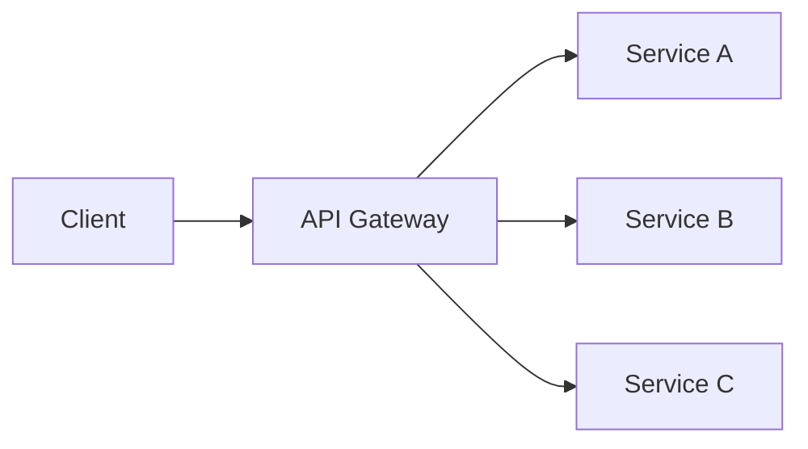

# API Gateway

## Introduction
An API Gateway is a service entry point that routes client requests to backend services and provides cross-cutting features like authentication, rate limiting, and observability.

## Problem Statement
In a microservices architecture, clients would otherwise need to call multiple services directly, which increases coupling and complexity.

## Why this exists
The API Gateway centralizes request handling and provides a single, stable interface for clients, shielding them from backend service topology changes.

## Real-world analogy
An airport terminal is a gateway where passengers enter, get routed to the right gate, and receive security checks before boarding.

## Definition
An API Gateway is a reverse proxy that receives external requests, applies policies, and forwards traffic to one or more internal services.

## Key concepts
- **Routing**
- **Authentication and authorization**
- **Rate limiting**
- **Protocol translation**
- **Aggregation**
- **Caching**

## Internal working
Requests arrive at the gateway, which validates them, routes them to target services, optionally aggregates responses, and returns a unified result.

### Mermaid diagram


## Python implementation

### Bad implementation
A direct service call from the client to each microservice.

```python
class Client:
    def call_services(self, data):
        service_a(data)
        service_b(data)
```

### Better implementation
A simple gateway router with static paths.

```python
class ApiGateway:
    def __init__(self, services):
        self.services = services

    def handle_request(self, path, payload):
        service = self.services.get(path)
        if not service:
            raise ValueError("unknown path")
        return service(payload)
```

### Best implementation
A gateway with auth, routing, and response aggregation.

```python
from dataclasses import dataclass
from typing import Any, Callable, Dict

@dataclass
class ServiceEndpoint:
    route: str
    handler: Callable[[Any], Any]

class ApiGateway:
    def __init__(self, endpoints: Dict[str, ServiceEndpoint]):
        self.endpoints = endpoints

    def authenticate(self, token: str) -> bool:
        return token == "valid-token"

    def handle_request(self, route: str, payload: Any, token: str) -> Any:
        if not self.authenticate(token):
            raise PermissionError("unauthorized")
        endpoint = self.endpoints.get(route)
        if not endpoint:
            raise ValueError("route not found")
        return endpoint.handler(payload)
```

## Step-by-step explanation
1. Clients send requests only to the gateway.
2. The gateway validates and routes the request.
3. The gateway returns a consolidated response.

## Multiple real-world examples
- Amazon API Gateway for AWS microservices.
- Kong, Ambassador, and NGINX as API gateway solutions.
- GraphQL gateways that combine multiple REST services.

## Pros
- Simplifies client integration.
- Centralizes security and traffic controls.
- Hides backend complexity from clients.

## Cons
- Creates a potential bottleneck.
- Adds another operational component.
- Can become a monolith if overloaded with too many concerns.

## Interview Questions
### Beginner
- What is an API Gateway?
- Answer: A service that routes and manages external API requests to internal services.

### Intermediate
- Why use an API Gateway in microservices?
- Answer: It centralizes cross-cutting concerns like auth, caching, and routing.

### Senior
- How would you avoid the API Gateway becoming a bottleneck?
- Answer: Use autoscaling, caching, and split responsibilities across edge services.

### Staff Engineer
- Design an API Gateway for a global e-commerce platform.
- Answer: Use regional gateways, caching, auth offload, rate limiting, and service discovery integration.

## Common mistakes
- Implementing too much business logic in the gateway.
- Treating it as a monolithic service.
- Ignoring observability and tracing.

## Best practices
- Keep the gateway lightweight and focused on cross-cutting concerns.
- Offload complex orchestration to backend services.
- Use health checks and retries for backend services.

## When NOT to use
- Simple single-service applications.
- Internal services where direct service-to-service communication is sufficient.

## Comparison with similar concepts
- **Service Mesh:** manages service-to-service traffic inside the cluster, while the API Gateway handles external traffic.
- **Load Balancer:** routes traffic but usually lacks application-level policies.
- **BFF (Backend For Frontend):** a specialized gateway for a specific client type.

## Summary
An API Gateway simplifies microservices exposure and enables centralized policy enforcement. It should handle routing, security, and aggregation while avoiding excessive business logic.

## Related topics
- [Service Discovery](../service-discovery)
- [Circuit Breaker](../circuit-breaker)
- [Event-Driven Architecture](../../messaging/event-driven-architecture)
