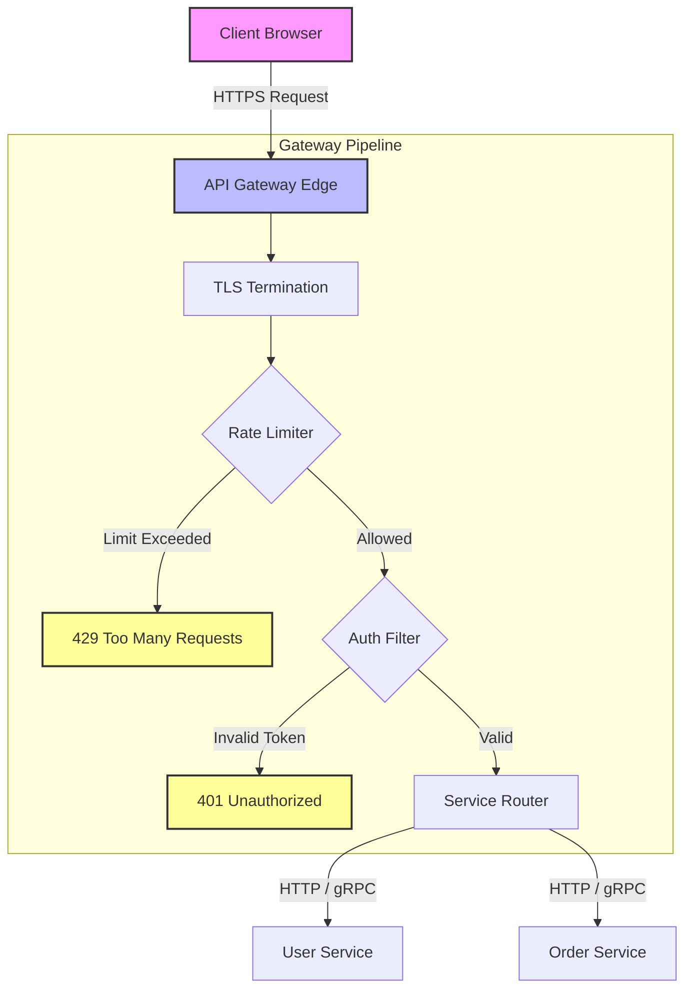

# API Gateway

## Introduction
An **API Gateway** is an architectural pattern that acts as a single entry point (reverse proxy) for all external client requests entering a microservices-based system. Situated at the edge of the network, it intercepts incoming traffic and routes it to the appropriate backend microservices, while consolidating cross-cutting concerns such as authentication, rate limiting, SSL termination, and protocol translation.

---

## Problem Statement
Exposing individual microservices directly to the public internet creates several critical issues:
1.  **High Coupling & Client Complexity:** Clients must track the IP addresses or domain names of dozens of microservices. If a service is refactored or split, the client application must be updated.
2.  **Security Vulnerabilities:** Every microservice must implement its own authentication, authorization, and TLS certificate management, widening the attack surface.
3.  **Network Overhead:** A single page (e.g., a product detail page) might need data from the Product, Review, Inventory, and Seller services. Without a gateway, the client's mobile device must make four separate HTTP requests over slow cellular networks.
4.  **Protocol Mismatch:** Internal microservices may use high-performance protocols like gRPC, AMQP, or Avro, which are not natively supported or easily consumed by web browsers.

---

## Why This Exists
The API Gateway serves as a layer of abstraction between the client and the backend cluster. It shields clients from the internal topology of the microservices. By centralizing common policies, it ensures that backend developers can focus purely on business logic rather than writing repetitive security or rate-limiting code for every service.

---

## Real-world Analogy
Imagine walking into a large, luxury hotel:
*   **Without a Gateway:** To get a room, you must find the housekeepers on floor 3, then walk to the accounting office in the basement to pay, and then locate the chef in the kitchen to order breakfast.
*   **With a Gateway (The Front Desk):** You walk up to the single front desk receptionist. You pay them, get your room keys, and order your breakfast vouchers. The receptionist coordinates with housekeeping, accounting, and the kitchen behind the scenes. You only interact with the desk.

---

## Definition
An **API Gateway** is a specialized reverse proxy server that sits between client applications and backend microservices, performing routing, request filtering, security checks, load balancing, and API response aggregation.

---

## Key Concepts

### 1. Dynamic Routing & Service Discovery
The gateway maps external URLs (e.g., `/api/v1/orders`) to internal service locations. Instead of using hardcoded IPs, modern gateways integrate with a **Service Registry** (like Consul or Eureka) to discover and load-balance requests across dynamically scaled container instances.

### 2. Edge Middleware Filters
Gateways process requests through a sequential chain of filters before routing:
*   **Authentication & Authorization:** Validates incoming JWT tokens, API keys, or OAuth sessions.
*   **Rate Limiting:** Enforces quotas (e.g., 100 requests/minute per client IP) using algorithms like the **Token Bucket** to prevent abuse.
*   **TLS/SSL Termination:** Decrypts SSL traffic at the edge, allowing internal network communications to run over fast, unencrypted HTTP.

### 3. API Composition (Aggregation)
Instead of forcing the client to make multiple calls, the gateway accepts a single request (e.g., `/product/105`), fan-out calls to the Product, Inventory, and Review services concurrently, merges the JSON payloads, and returns a single, unified response.

### 4. Backend-For-Frontend (BFF) Pattern
Rather than using a single monolithic API Gateway for all clients, the BFF pattern deploys distinct, optimized gateways for different client interfaces (e.g., one gateway optimized for mobile JSON payloads, and another for web browsers).

```
Mobile Client  ---> [ Mobile BFF Gateway ]  ---> [ Internal Services ]
Web Browser    ---> [ Web BFF Gateway ]     ---> [ Internal Services ]
```

---

## Internal Working: The Request Filter Pipeline



---

## Java Implementation

The following Java code simulates an **API Gateway Request Handler Pipeline**. It implements a Token Bucket rate limiter, JWT authentication verification, path routing, and concurrent API Response Aggregation using `CompletableFuture`.

```java
import java.util.*;
import java.util.concurrent.*;

// Mock Microservices
class UserService {
    public String getUserInfo(String userId) {
        try { Thread.sleep(50); } catch (InterruptedException ignored) {} // Simulating network latency
        return "{\"userId\":\"" + userId + "\",\"name\":\"Alice\"}";
    }
}

class OrderService {
    public String getOrders(String userId) {
        try { Thread.sleep(80); } catch (InterruptedException ignored) {} // Simulating network latency
        return "{\"orders\":[{\"orderId\":\"101\",\"total\":45.50}]}";
    }
}

// Token Bucket Rate Limiter
class TokenBucket {
    private final int capacity;
    private final double refillRatePerMs;
    private double tokens;
    private long lastRefillTimestamp;

    public TokenBucket(int capacity, int refillRatePerSecond) {
        this.capacity = capacity;
        this.tokens = capacity;
        this.refillRatePerMs = refillRatePerSecond / 1000.0;
        this.lastRefillTimestamp = System.currentTimeMillis();
    }

    public synchronized boolean allowRequest() {
        long now = System.currentTimeMillis();
        double delta = (now - lastRefillTimestamp) * refillRatePerMs;
        tokens = Math.min(capacity, tokens + delta);
        lastRefillTimestamp = now;

        if (tokens >= 1.0) {
            tokens -= 1.0;
            return true;
        }
        return false;
    }
}

// API Gateway Engine
public class ApiGatewaySimulator {
    private final TokenBucket rateLimiter = new TokenBucket(10, 50); // Cap 10, 50 tokens/sec
    private final UserService userService = new UserService();
    private final OrderService orderService = new OrderService();
    private final ExecutorService executor = Executors.newFixedThreadPool(4);

    public String handleRequest(String path, String authHeader, String userId) {
        // 1. Rate Limiting Filter
        if (!rateLimiter.allowRequest()) {
            return "HTTP 429 Too Many Requests";
        }

        // 2. Authentication Filter
        if (authHeader == null || !authHeader.startsWith("Bearer valid_jwt_")) {
            return "HTTP 401 Unauthorized";
        }

        // 3. Routing & Aggregation Path
        if ("/api/user-dashboard".equals(path)) {
            try {
                // Execute backend calls concurrently
                CompletableFuture<String> userFetch = CompletableFuture.supplyAsync(
                    () -> userService.getUserInfo(userId), executor
                );
                CompletableFuture<String> orderFetch = CompletableFuture.supplyAsync(
                    () -> orderService.getOrders(userId), executor
                );

                // Wait for all to complete and merge
                CompletableFuture.allOf(userFetch, orderFetch).join();
                
                String userJson = userFetch.get();
                String orderJson = orderFetch.get();

                // Aggregate response
                return "{\"status\":\"success\",\"user\":" + userJson + ",\"orders\":" + orderJson + "}";
            } catch (Exception e) {
                return "HTTP 500 Internal Server Error";
            }
        }

        return "HTTP 404 Route Not Found";
    }

    public void shutdown() {
        executor.shutdown();
    }
}
```

---

## Step-by-Step Explanation: Concurrent API Aggregation
Using the Java implementation above when a client requests `/api/user-dashboard`:

1.  **Rate Limiter Check:** The gateway verifies token availability. Since the bucket contains tokens, the request proceeds.
2.  **Auth Verification:** The gateway parses the `authHeader`. The token begins with `"Bearer valid_jwt_"`, confirming authentication.
3.  **Concurrency Fan-out:** The gateway initializes two `CompletableFuture` async tasks:
    *   **Task 1:** Queries `UserService` on Thread Pool Thread 1. (50ms).
    *   **Task 2:** Queries `OrderService` on Thread Pool Thread 2. (80ms).
4.  **Async Join:** The gateway calls `CompletableFuture.allOf().join()`. The main gateway thread blocks until the slowest backend finishes.
5.  **Merge & Respond:** Because the tasks executed in parallel, the total backend latency is **80ms** (the maximum of the two) rather than **130ms** (the sum of the two). The gateway merges the JSON strings and returns the consolidated payload.

---

## Multiple Real-world Examples

1.  **Kong API Gateway:** An open-source, highly performant gateway built on top of NGINX and OpenResty. Kong uses Lua plugins to manage auth, rate limiting, and transformations.
2.  **Netflix Zuul:** Zuul is the API gateway engine used by Netflix to handle edge routing and resilience. It integrates with Netflix Ribbon for load balancing and Hystrix for circuit breaking.
3.  **Apollo GraphQL Gateway:** Used in federated GraphQL setups. It accepts client queries, parses the abstract syntax tree (AST), requests distinct subgraphs from different microservices, and compiles the response.

---

## Pros & Cons

### Pros
*   **Decoupled Frontend:** Clients are insulated from backend changes; microservices can be split or refactored without breaking client APIs.
*   **Centralized Edge Logic:** Common policies (SSL, rate limiting, auth) are enforced in one place, avoiding duplicate code across services.
*   **Improved Security:** Only the API Gateway is exposed to the internet. Internal microservices reside in private subnets, shielded from direct attacks.
*   **Bandwidth Efficiency:** API Response Aggregation reduces the number of round-trips required by mobile clients.

### Cons
*   **Single Point of Failure (SPOF):** If the API Gateway cluster crashes, all services become unreachable.
*   **Latency Overhead:** Adds an extra network hop (Client $\to$ Gateway $\to$ Microservice) to every request.
*   **Gateway Bloat:** If not managed carefully, developers start adding business logic (e.g., SQL queries or custom formatting) into the gateway, turning it into a monolithic bottleneck.

---

## Interview Questions

### Beginner
*   **Q:** What is the difference between an API Gateway and a standard Load Balancer?
*   **A:** A load balancer simply distributes raw TCP/HTTP network traffic across a pool of servers. An API gateway is application-aware; it inspects HTTP headers and bodies, routes requests based on URL paths, translates protocols (like HTTP to gRPC), and enforces security policies (like JWT verification).

### Intermediate
*   **Q:** What is the Backend-For-Frontend (BFF) pattern, and why would you use it instead of a single API Gateway?
*   **A:** The BFF pattern deploys distinct API gateways tailored to specific client types (e.g., mobile app, web app, public API partners). Using a single gateway forces you to create a monolithic schema that satisfies all clients, which can bloat payloads. BFFs allow you to return lightweight, custom JSON schemas optimized for each device type's screen size and network speed.

### Senior
*   **Q:** How do you handle authentication at scale in an API Gateway? Do you authenticate at the gateway or delegate to the microservices?
*   **A:** The best practice is **Edge Authentication & Token Propagation**:
    1.  **Authenticate at the Edge:** The API Gateway validates the incoming client token (e.g., checking the signature of a JWT using public keys).
    2.  **User Context Injection:** Once verified, the gateway extracts the user identity metadata (e.g., `userId`, `roles`) and injects it into the HTTP headers (e.g., `X-User-Id: 45`).
    3.  **Internal Propagation:** The request is forwarded internally. Private microservices do not need to validate JWTs; they trust the `X-User-Id` header sent by the secure gateway.

### Staff Engineer
*   **Q:** What architectural strategies would you use to design a globally distributed API Gateway that minimizes latency and handles DDoS attacks?
*   **A:** 
    1.  **Geo-Routing & Anycast:** Deploy gateway clusters in multiple global cloud regions, routing users to the closest edge node using Anycast BGP routing.
    2.  **Edge Cache & CDN Integration:** Cache static or read-heavy API responses at the edge nodes to minimize origin queries.
    3.  **Local Rate Limiting:** Implement local rate limiting in memory at the edge nodes (rather than a centralized Redis, which adds cross-region latency), accepting minor rate variance to prioritize performance.
    4.  **TLS Termination at Edge:** Terminate SSL close to the user to reduce TCP handshake round-trip times, and use pre-warmed internal connections to backend regions.

---

## Common Mistakes
*   **Adding Business Logic:** Writing data validation, SQL queries, or business transformations in the gateway. The gateway should remain a lightweight reverse proxy.
*   **Single Instance Deployments:** Running a single gateway instance without autoscaling, creating a bottleneck and SPOF.
*   **Synchronous Aggregations:** Executing backend calls sequentially instead of concurrently when aggregating responses, multiplying latency.

---

## Best Practices
*   **Keep it Stateless:** Do not store sessions or state inside the gateway; rely on stateless JWT tokens or external caches.
*   **Inject Correlation IDs:** Always generate a unique tracking ID at the gateway and propagate it in the HTTP headers to trace requests across microservices.
*   **Enable Circuit Breakers:** Configure circuit breakers at the gateway to prevent a failing backend service from cascading failures and exhausting gateway resources.

---

## When NOT to Use
*   **Monolithic Systems:** Small applications with only one or two backend services where the gateway adds complexity without benefit.
*   **Ultra-Low Latency Internal APIs:** Service-to-service communications within a private network where direct IP calls or a service mesh are faster.

---

## Comparison with Similar Concepts

*   **API Gateway vs. Service Mesh:** An API gateway manages north-south traffic (external clients entering the cluster). A Service Mesh manages east-west traffic (internal service-to-service communication within the cluster).
*   **API Gateway vs. Reverse Proxy:** A reverse proxy (like NGINX) is a generic traffic router. An API Gateway is a reverse proxy specifically configured with application policies (Auth, API Composition, Rate Limiting plugins).

---

## Summary
An API Gateway is a critical edge component for microservice architectures. By providing a single entrance, Dynamic Routing, Edge Middleware checks (Auth, Rate Limiting), and API Response Aggregation, it shields clients from system complexity and centralizes security enforcement.

---

## Related Topics
- [Service Discovery](../service-discovery)
- [Circuit Breaker](../circuit-breaker)
- [OAuth](../../security/oauth)
- [JWT](../../security/jwt)
