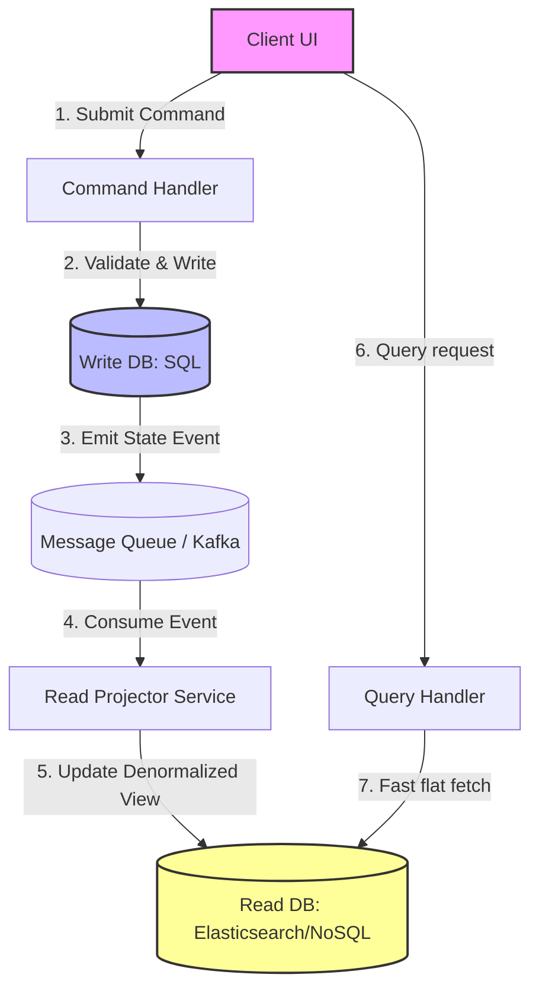

# CQRS

## Introduction
**Command Query Responsibility Segregation (CQRS)** is an architectural pattern that separates the models used to write data (Commands) from the models used to read data (Queries). Popularized by Greg Young, CQRS is based on the principle that the data structure and schema required for high-integrity writes are fundamentally different from the schema required for high-performance reads.

---

## Problem Statement
In traditional CRUD (Create, Read, Update, Delete) architectures, a single domain model and database schema are shared:
1.  **Conflicting Indexing & Performance:** Writes require narrow tables and minimal indexes to prevent locking delays. Reads require multiple indexes, search capabilities, and complex table joins, which slow down database writes.
2.  **Logic Pollution:** Domain objects become bloated as developers add properties and methods only used to render specific UI views, violating the Single Responsibility Principle.
3.  **Data Contention:** Read queries lock rows, causing write transactions to block, limiting the horizontal scalability of the database.

---

## Why This Exists
CQRS splits the database pathway.
*   **The Command Path (Write):** Handles business invariants and transactional boundaries. It modifies state but does not return data (except perhaps a record ID).
*   **The Query Path (Read):** Serves read requests using a denormalized schema. It queries data but never modifies state.
This allows the read model to use different database engines (e.g., Elasticsearch for search queries, Redis for dashboards) while the write model runs on a transactional relational database (PostgreSQL), optimizing both pathways independently.

---

## Real-world Analogy
Imagine a newspaper publishing house:
*   **The Write Model (Journalism):** Journalists (Command Path) research and write articles. They edit drafts, verify facts, and check constraints (invariants). They write to a private workspace.
*   **The Projection (Printing Press):** Once articles are approved, they are sent to the printing press, which formats, compiles, and prints them onto cheap paper sheets (Read Model/Materialized View).
*   **The Read Model (The Reader):** Readers (Query Path) buy the paper from a newsstand and read it. They do not talk to the journalists or read the raw draft databases. If a reader finds an error, they cannot edit the newspaper page directly.

---

## Definition
**CQRS** is a design pattern that enforces a strict separation between operations that mutate state (Commands) and operations that query state (Queries), utilizing distinct models, and often distinct databases, for each task.

---

## Key Concepts

### 1. Commands vs. Queries
*   **Command:** Represented as intent (e.g., `RegisterUserCommand`). Commands validate business rules (invariants) and mutate state. They return `void` (or an acknowledgment receipt/ID).
*   **Query:** Represented as requests for information (e.g., `GetUserProfileQuery`). Queries fetch pre-computed, flat data structures. They never modify any data.

### 2. Projections & Read Models
The read database is populated using **Projections** (or Materialized Views). When the write model commits an update, it emits a state change event. A background **Projector** service listens to these events and updates the read database asynchronously.

### 3. Eventual Consistency & Replication Lag
Because projections run asynchronously, there is a minor delay (replication lag) before the write reaches the read model. A user might submit a form and immediately reload the page, seeing their old data.
*   *Mitigation:* Use **Version Tracking** or **Session Pinning** (forcing the client to read from the write model for a few seconds immediately after making a command write).

---

## Internal Working: The Segregated Architecture Flow



---

## Java Implementation

The following Java code provides a complete simulation of a **CQRS Banking System**. The Write Model validates transaction constraints and emits events, while the Projector asynchronously updates a flat, denormalized read model optimized for $O(1)$ dashboard queries.

```java
import java.util.*;
import java.util.concurrent.ConcurrentHashMap;

// --- 1. EVENTS ---
class MoneyTransferredEvent {
    final String fromAccount;
    final String toAccount;
    final double amount;

    public MoneyTransferredEvent(String fromAccount, String toAccount, double amount) {
        this.fromAccount = fromAccount;
        this.toAccount = toAccount;
        this.amount = amount;
    }
}

// --- 2. COMMAND / WRITE MODEL (Strict Constraints) ---
class AccountWriteModel {
    private final String accountId;
    private double balance;

    public AccountWriteModel(String accountId, double initialBalance) {
        this.accountId = accountId;
        this.balance = initialBalance;
    }

    public boolean debit(double amount) {
        if (amount <= 0 || balance < amount) {
            System.err.println("Write Model: Debit failed on " + accountId + " (Insufficient Funds)");
            return false; // Violates business invariant
        }
        balance -= amount;
        return true;
    }

    public void credit(double amount) {
        balance += amount;
    }
}

// --- 3. PROJECTION / READ MODEL (Denormalized, Query-Optimized) ---
class AccountDashboardView {
    final String accountId;
    double currentBalance;
    int totalTransactionsCount = 0;

    public AccountDashboardView(String accountId, double currentBalance) {
        this.accountId = accountId;
        this.currentBalance = currentBalance;
    }
}

// --- 4. CQRS SYSTEM COORDINATOR ---
public class CqrsBankSystem {
    // Write Database
    private final Map<String, AccountWriteModel> writeDb = new ConcurrentHashMap<>();
    // Read Database (Denormalized flat store)
    private final Map<String, AccountDashboardView> readDb = new ConcurrentHashMap<>();

    public void createAccount(String accountId, double balance) {
        writeDb.put(accountId, new AccountWriteModel(accountId, balance));
        readDb.put(accountId, new AccountDashboardView(accountId, balance));
    }

    // ==========================================
    // COMMAND PATH (Mutate State)
    // ==========================================
    public boolean handleTransfer(String from, String to, double amount) {
        AccountWriteModel source = writeDb.get(from);
        AccountWriteModel target = writeDb.get(to);

        if (source == null || target == null) return false;

        // Perform transactional write checks
        if (source.debit(amount)) {
            target.credit(amount);
            System.out.println("Write Model: Transfer completed: $" + amount + " from " + from + " to " + to);
            
            // Project the update asynchronously (simulated)
            projectEvent(new MoneyTransferredEvent(from, to, amount));
            return true;
        }
        return false;
    }

    // ==========================================
    // PROJECTION ENGINE (Update Read Database)
    // ==========================================
    private void projectEvent(MoneyTransferredEvent event) {
        // Update read model view
        AccountDashboardView sourceView = readDb.get(event.fromAccount);
        AccountDashboardView targetView = readDb.get(event.toAccount);

        if (sourceView != null) {
            sourceView.currentBalance -= event.amount;
            sourceView.totalTransactionsCount++;
        }
        if (targetView != null) {
            targetView.currentBalance += event.amount;
            targetView.totalTransactionsCount++;
        }
        System.out.println("Projector: Updated Read Dashboard views for " + event.fromAccount + " and " + event.toAccount);
    }

    // ==========================================
    // QUERY PATH (Fast, No Constraints, O(1))
    // ==========================================
    public AccountDashboardView getAccountDashboard(String accountId) {
        System.out.println("Query Path: Fetching dashboard for: " + accountId);
        return readDb.get(accountId); // Direct O(1) map fetch
    }
}
```

---

## Step-by-Step Explanation: The CQRS Execution
Using the Java code banking simulation above:

1.  **Account Creation:** Two accounts are created: `Alice` ($1000) and `Bob` ($500).
2.  **Client Command:** The client invokes `handleTransfer("Alice", "Bob", 200)`.
3.  **Command Validation:** The `AccountWriteModel` for Alice checks if she has $200. Yes. It debits Alice's write object and credits Bob's write object.
4.  **Event Emission:** The command succeeds, committing the transaction. The system generates a `MoneyTransferredEvent`.
5.  **Read Projection:** The Projector intercepts the event, locates the flat `AccountDashboardView` records for Alice and Bob in `readDb`, updates their balances, and increments their transaction counters.
6.  **Client Query:** The client web dashboard requests Alice's account info. The query path calls `getAccountDashboard("Alice")`. The read database returns the pre-computed `AccountDashboardView` object in $O(1)$ time, bypassing any complex SQL summation or transaction locks.

---

## Multiple Real-world Examples

1.  **E-Commerce Search Engine:** Write operations (updating inventory, adding new products) are processed in PostgreSQL. A CDC pipeline streams updates to Elasticsearch (Read DB). When a user searches for products, the query hits the optimized Elasticsearch index rather than Postgres.
2.  **Social Media Timelines (Twitter/X):** Writing a tweet appends it to a Cassandra cluster (Write DB). A projection pipeline updates the cached timeline lists of the user's followers in Redis (Read DB). When a user opens their app, the query reads their pre-computed Redis timeline list instantly.
3.  **Financial Reporting Systems:** Day-to-day transactions are logged in a normalized SQL database. Periodically, transactional logs are projected into a denormalized ClickHouse database (OLAP) to support rapid analytics reporting.

---

## Pros & Cons

### Pros
*   **Independent Scaling:** Read and write databases can be scaled horizontally and optimized separately (e.g., matching the typical $10:1$ read-to-write ratio).
*   **Optimized Schemas:** The read database can be completely flat and denormalized, eliminating expensive SQL joins.
*   **Decoupled Complexity:** Prevents read query optimizations from complicating domain write business rules.
*   **High Performance:** Read operations become simple key-value fetches, dropping latency to microseconds.

### Cons
*   **Eventual Consistency:** Synchronization delays mean the UI might temporarily display stale read data.
*   **Database Bloat (Cost):** Storing data in two separate databases increases storage and infrastructure costs.
*   **Increased Complexity:** Coordinating data sync, handling projection errors, and managing two data models requires significant engineering effort.

---

## Interview Questions

### Beginner
*   **Q:** What is the primary difference between a Command and a Query in CQRS?
*   **A:** A Command modifies state but does not return data (focused on writes and business validation). A Query retrieves data but does not modify state (focused on read performance).

### Intermediate
*   **Q:** Why is CQRS often paired with Event Sourcing?
*   **A:** In Event Sourcing, the write model only stores an append-only log of events, which makes querying the database directly (e.g., getting a list of active users) impossible. CQRS solves this by consuming the event log to build and update a denormalized read database, making queries fast and simple.

### Senior
*   **Q:** How do you handle the replication lag (eventual consistency) in a CQRS system to prevent a poor user experience?
*   **A:** To mitigate replication lag in the UI:
    1.  **Write-Optimistic UI:** When the client sends a command, the UI immediately displays the updated state locally before the server confirms it.
    2.  **Session Pinning / Read-Your-Writes:** When a write occurs, set a cookie or session variable. For the next few seconds, force queries from that client to read directly from the write database instead of the read replica.
    3.  **WebSocket Push:** Once the read model projector finishes updating, push a message via WebSocket to trigger a UI refresh.

### Staff Engineer
*   **Q:** Describe the architectural patterns and failure recovery strategies you would implement to rebuild a corrupted CQRS read database containing 100 million records.
*   **A:** Rebuilding a corrupted read database (re-projection) requires:
    1.  **Durable Event Log:** Ensure all historical writes exist in a durable event store (like Kafka or a SQL event log).
    2.  **Blue-Green Projection:** Keep the corrupted read database online serving queries (despite errors). Create a *new* empty read database (Green).
    3.  **Catch-Up Consumer:** Spin up a background projector daemon that replays all historical events from index 0 and writes them to the Green database.
    4.  **Live Sync:** Once the Green database catching up, subscribe it to live incoming events to maintain sync.
    5.  **Traffic Cutover:** Once the replication lag on the Green database drops to zero, update the API gateway to point queries to the Green database and decommission the old Blue database.

---

## Common Mistakes
*   **Using CQRS on Simple CRUD Systems:** Implementing CQRS for basic databases (like a simple blog with few users) where a single SQL database is simpler.
*   **Sharing Databases:** Separating code into Command and Query paths but pointing both to the same SQL tables, which retains database contention issues.
*   **Direct Read-DB Writes:** Allowing application handlers to write directly to the read database, bypassing the command model and creating data inconsistency.

---

## Best Practices
*   **Apply Only When Workloads Diverge:** Reserve CQRS for systems where the read-to-write ratio is high (e.g., $100:1$) or read query patterns are highly complex.
*   **Ensure Projection Idempotency:** The projector must handle duplicate events without causing corrupt read values.
*   **Keep Read Models Flat:** Denormalize read tables as much as possible to ensure queries can be resolved without SQL joins.

---

## When NOT to Use
*   **Simple CRUD Applications:** Applications where database queries are straightforward and writes are low volume.
*   **Strict Real-Time Consistency:** Systems where read models must reflect writes in the exact same millisecond (e.g., high-frequency financial ledgers).

---

## Comparison with Similar Concepts

*   **CQRS vs. Read Replicas:** Read replicas copy the exact same SQL schema to another node. CQRS changes the schema entirely, denormalizing the read database to optimize for query patterns.
*   **CQRS vs. Event Sourcing:** CQRS separates reads from writes. Event Sourcing is a write model pattern that stores state changes as a sequence of events. They are orthogonal but work well together.

---

## Summary
CQRS separates write validation (Commands) from read retrieval (Queries), allowing systems to optimize both paths independently. By projecting write events into denormalized read databases, applications can achieve massive scale and sub-millisecond read times.

---

## Related Topics
- [Saga Pattern](../saga-pattern)
- [Event Sourcing](../event-sourcing)
- [API Gateway](../api-gateway)
- [NoSQL](../../databases/nosql)
