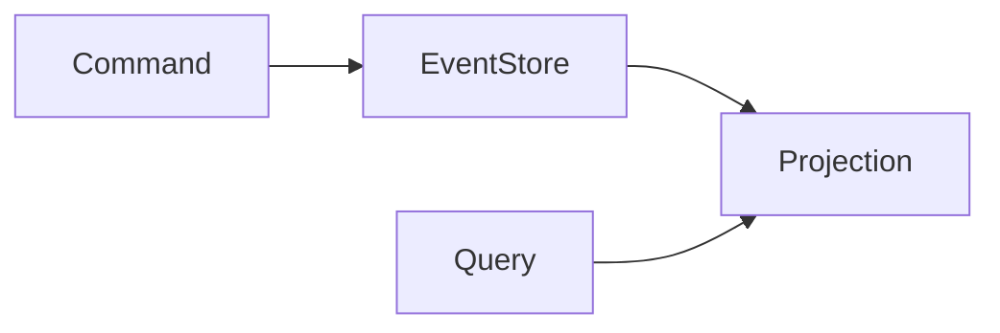

# Event Sourcing

## Introduction
Event sourcing stores all state changes as an immutable sequence of events rather than persisting only the current state.

## Problem Statement
Traditional persistence models lose the history of how state changed, making debugging and auditability harder.

## Why this exists
Event sourcing preserves every state change, supports replaying history, and simplifies event-driven architectures.

## Real-world analogy
A ledger records every transaction in a bank account, allowing you to reconstruct the balance at any point in time.

## Definition
Event sourcing is a pattern where state is derived by replaying a sequence of events, and the event log is the source of truth.

## Key concepts
- **Event log**
- **Aggregate**
- **Projection**
- **Append-only storage**
- **Replay**

## Internal working
Commands produce events that are appended to an immutable log. Read models are built by projecting events into queryable state.

### Mermaid diagram


## Python implementation

### Bad implementation
A stateful object that overwrites data without history.

```python
class UserProfile:
    def __init__(self):
        self.name = None

    def update_name(self, name):
        self.name = name
```

### Better implementation
An event-sourced aggregate with a simple event list.

```python
from dataclasses import dataclass
from typing import Any, List

@dataclass
class Event:
    type: str
    payload: Any

class UserAggregate:
    def __init__(self):
        self.events: List[Event] = []
        self.name: str | None = None

    def update_name(self, name: str) -> None:
        event = Event(type="NameUpdated", payload={"name": name})
        self.events.append(event)
        self.apply(event)

    def apply(self, event: Event) -> None:
        if event.type == "NameUpdated":
            self.name = event.payload["name"]
```

### Best implementation
An event store with replayable aggregates and projections.

```python
from dataclasses import dataclass, field
from typing import Any, Dict, List

@dataclass
class Event:
    type: str
    payload: Dict[str, Any]

class EventStore:
    def __init__(self):
        self.events: List[Event] = []

    def append(self, event: Event) -> None:
        self.events.append(event)

    def replay(self, aggregate, apply_fn):
        for event in self.events:
            apply_fn(aggregate, event)

class UserAggregate:
    def __init__(self):
        self.name: str | None = None

    def apply(self, event: Event) -> None:
        if event.type == "NameUpdated":
            self.name = event.payload["name"]

store = EventStore()
user = UserAggregate()
store.append(Event(type="NameUpdated", payload={"name": "Alice"}))
store.replay(user, UserAggregate.apply)
```

## Step-by-step explanation
1. Commands generate domain events.
2. Events are appended to the event store.
3. Aggregates and projections rebuild state from events.

## Multiple real-world examples
- Financial ledgers store every transaction event.
- Order systems capture order state changes as events.
- Audit logs and replayable workflows use event sourcing.

## Pros
- Complete history of changes.
- Supports time travel and debugging.
- Enables replay and rebuild of state.

## Cons
- More complex than traditional state models.
- Requires careful event schema design.
- Rebuilding state from events can be expensive.

## Interview Questions
### Beginner
- What is event sourcing?
- Answer: Storing state changes as a sequence of events.

### Intermediate
- How do projections work in event sourcing?
- Answer: They build queryable views by applying events to a model.

### Senior
- How do you evolve event schemas safely?
- Answer: Use versioned events, backward compatibility, and migration projections.

### Staff Engineer
- Design an event-sourced catalog service for a marketplace.
- Answer: Store product changes as events, build read models for search, and keep an audit trail for state changes.

## Common mistakes
- Treating events as a data store instead of a stream.
- Not versioning events.
- Rebuilding whole state on every read.

## Best practices
- Use event schemas and contracts.
- Build targeted projections for queries.
- Keep events immutable and append-only.

## When NOT to use
- Simple CRUD systems with low history needs.
- Applications requiring strict immediate consistency on every read.

## Comparison with similar concepts
- **CQRS:** often paired with event sourcing but not required.
- **Audit logging:** event sourcing is a full history, while audit logs may be supplementary.
- **Stateful models:** event sourcing derives state instead of storing current state only.

## Summary
Event sourcing treats events as the source of truth and enables complete history tracking. It is well-suited for complex domains and auditability.

## Related topics
- [CQRS](../cqrs)
- [Saga Pattern](../saga-pattern)
- [Event-Driven Architecture](../../messaging/event-driven-architecture)
