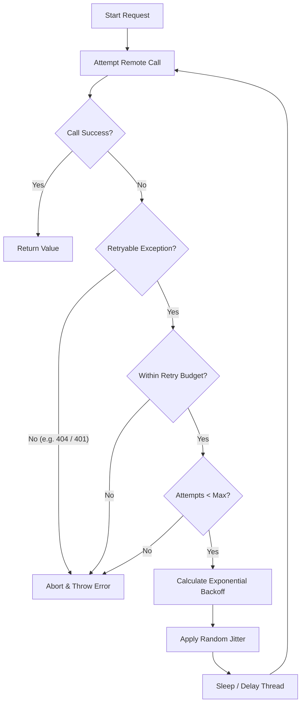

# Retry

## Introduction
The **Retry** pattern is a fundamental resilience pattern that enables an application to recover from temporary, self-correcting failures (transient errors) by automatically re-attempting a failed operation. This pattern is widely used in network clients, database connectors, and microservice communications to mask temporary faults from the end-user.

---

## Problem Statement
In distributed cloud systems:
1.  **Transient Network Faults:** Minor packet drops, network switches re-routing traffic, or temporary connection resets cause remote API calls to fail occasionally.
2.  **Service Overloads:** A downstream service might experience a brief spike in traffic, returning temporary `503 Service Unavailable` or `429 Too Many Requests` status codes.
3.  **Database Deadlocks:** Under high write contention, a database might abort a transaction due to a transient deadlock.
If the application immediately throws an error on the first failure, it degrades availability unnecessarily.

---

## Why This Exists
The retry pattern shields the client application from transient glitches. By automatically repeating the request after a calculated delay, the system resolves the failure without user intervention. However, naive retries can worsen the problem by executing a **Retry Storm** (flooding a struggling service with repetitive requests), so retries must incorporate **Exponential Backoff** and **Jitter**.

---

## Real-world Analogy
Imagine trying to place a phone call:
*   **Without Retry:** You call a friend. The call disconnects immediately because they were passing through a tunnel (Transient Drop). You throw your phone away, assuming they blocked you.
*   **Naive Retry:** You immediately redial 100 times in 10 seconds. The friend's phone keeps ringing, crashing their device (Retry Storm).
*   **Decoupled Retry with Backoff:** You wait 1 second and call again. If it drops, you wait 2 seconds, then 4 seconds. Each time, you wait slightly longer, allowing them to exit the tunnel before trying again.

---

## Definition
**Retry** is a fault-tolerance pattern that intercepts failed operations and automatically re-executes them according to a defined policy—typically incorporating exponential delay scaling, random noise (jitter), and strict classification of retryable exceptions.

---

## Key Concepts

### 1. Transient vs. Permanent Errors
*   **Retryable (Transient) Errors:** Intermittent errors like connection timeouts, `503 Service Unavailable`, `429 Too Many Requests`, and database deadlock exceptions.
*   **Non-Retryable (Permanent) Errors:** Errors indicating invalid inputs or logic errors, such as `400 Bad Request`, `401 Unauthorized`, or `404 Not Found`. Retrying these only wastes CPU and network bandwidth.

### 2. Exponential Backoff
Instead of retrying immediately or at fixed intervals, the delay grows exponentially after each failure.
$$\text{Delay} = \text{base\_delay} \times 2^{\text{attempt} - 1}$$
For a 100ms base delay, attempts occur at 100ms, 200ms, 400ms, 800ms, etc.

### 3. Jitter (Random Noise)
If thousands of clients experience a network blip at the exact same second, they will all back off and retry at the *exact same subsequent millisecond*. This creates a synchronized spike of traffic called the **Thundering Herd** problem.
To resolve this, we add **Jitter** (randomness):
*   **Full Jitter Formula:**
    $$\text{Sleep} = \text{Random}(0, \min(\text{max\_delay}, \text{base\_delay} \times 2^{\text{attempt}}))$$
This spreads out the retry attempts over time, flattening the traffic spike.

### 4. Retry Budget
To prevent a client from magnifying an outage during a downstream service crash, client engines implement a **Retry Budget** (e.g., limiting retries to a maximum of 10% of all outgoing requests over a sliding window). If the budget is exhausted, new failures fail fast immediately without retries.

---

## Internal Working: The Retry Loop with Jitter



---

## Java Implementation

The following Java code provides a thread-safe **Retry Execution Engine** implementing exponential backoff with Full Jitter, exception classification, and retry budget tracking.

```java
import java.io.IOException;
import java.util.concurrent.ThreadLocalRandom;
import java.util.concurrent.atomic.AtomicInteger;

// Simulated Transient Exception
class TransientException extends IOException {
    public TransientException(String message) { super(message); }
}

public class RetryExecutor {
    private final int maxAttempts;
    private final long baseDelayMs;
    private final long maxDelayMs;
    
    // Simple Retry Budget: Max 20% retries allowed globally
    private final AtomicInteger totalRequests = new AtomicInteger(0);
    private final AtomicInteger totalRetries = new AtomicInteger(0);

    public RetryExecutor(int maxAttempts, long baseDelayMs, long maxDelayMs) {
        this.maxAttempts = maxAttempts;
        this.baseDelayMs = baseDelayMs;
        this.maxDelayMs = maxDelayMs;
    }

    public <T> T execute(java.util.concurrent.Callable<T> operation) throws Exception {
        totalRequests.incrementAndGet();
        int attempt = 1;

        while (true) {
            try {
                return operation.call();
            } catch (Exception e) {
                // 1. Exception Classification: abort if not transient
                if (!isTransient(e)) {
                    throw e; 
                }

                // 2. Check retry budget
                if (attempt > 1 && getRetryRate() > 0.20) {
                    System.err.println("Retry Budget Exhausted (" + (getRetryRate() * 100) + "%). Failing fast...");
                    throw e;
                }

                // 3. Check max attempt limit
                if (attempt >= maxAttempts) {
                    throw e;
                }

                // 4. Calculate Backoff with Full Jitter
                long backoff = calculateJitterDelay(attempt);
                System.out.println("Attempt " + attempt + " failed. Retrying in " + backoff + "ms...");
                
                totalRetries.incrementAndGet();
                attempt++;
                
                try { Thread.sleep(backoff); } catch (InterruptedException ignored) {}
            }
        }
    }

    private boolean isTransient(Exception e) {
        // Only retry connection drops or transient database deadlocks
        return e instanceof TransientException || e.getMessage().contains("Connection timeout");
    }

    private long calculateJitterDelay(int attempt) {
        // Exponential calculation: base * 2^(attempt - 1)
        long exponentialDelay = baseDelayMs * (1L << (attempt - 1));
        long boundedDelay = Math.min(exponentialDelay, maxDelayMs);
        // Apply Full Jitter: Random(0, boundedDelay)
        return ThreadLocalRandom.current().nextLong(0, boundedDelay + 1);
    }

    public double getRetryRate() {
        int req = totalRequests.get();
        return (req == 0) ? 0.0 : (double) totalRetries.get() / req;
    }
}
```

---

## Step-by-Step Explanation: The Jitter Backoff Execution
Using the Java implementation above:

1.  **First Failure:** A network request throws a `TransientException`. The system catches it at `attempt = 1`.
2.  **Backoff Calculation:**
    *   `exponentialDelay` = $100\text{ms} \times 2^0 = 100\text{ms}$.
    *   `boundedDelay` = $\min(100\text{ms}, 2000\text{ms}) = 100\text{ms}$.
    *   `Full Jitter Sleep` = `Random(0, 100ms)`. Suppose it picks **65ms**. The thread sleeps.
3.  **Second Failure:** The retry fails again at `attempt = 2`.
    *   `exponentialDelay` = $100\text{ms} \times 2^1 = 200\text{ms}$.
    *   `Full Jitter Sleep` = `Random(0, 200ms)`. Suppose it picks **142ms**.
4.  **Flattening the Peak:** If 100 instances fail concurrently, instead of all hitting the server at exactly 100ms and 200ms, they are distributed randomly between 0-100ms and 0-200ms, protecting the downstream server from a synchronized traffic surge.

---

## Multiple Real-world Examples

1.  **AWS SDK Client Retries:** The AWS Java SDK client automatically retries failed calls (like S3 uploads or DynamoDB writes) that return throttling or internal server errors using a built-in exponential backoff and jitter policy.
2.  **Spring Retry (Spring Boot):** Provides declarative retry capabilities using annotations (`@Retryable(value = TransientException.class, maxAttempts = 3, backoff = @Backoff(delay = 100, multiplier = 2))`).
3.  **Kubernetes Pod Rescheduling:** When a container crashes, Kubernetes uses an exponential backoff retry loop (starting at 10s and capping at 5 mins) to restart the container, preventing crash loops from consuming host CPU.

---

## Pros & Cons

### Pros
*   **High Resilience:** Automatically handles transient network and database hiccups.
*   **Improved User Experience:** Resolves failures behind the scenes without prompting the user.
*   **Thundering Herd Prevention:** Adding Jitter prevents synchronized load spikes on recovering backends.

### Cons
*   **Increased Client Latency:** Retries accumulate delays, increasing the overall response time of requests.
*   **Write Multiplication Risks:** Retrying non-idempotent updates can lead to duplicate database rows or duplicate financial charges.
*   **Resource Stalling:** Thread-blocking sleep operations during retries can saturate caller thread pools if not configured asynchronously.

---

## Interview Questions

### Beginner
*   **Q:** What is the difference between transient and permanent errors in a retry policy?
*   **A:** Transient errors are temporary (e.g., network timeout, database deadlock) and likely to succeed if retried. Permanent errors indicate logic or input failures (e.g., `404 Not Found`, `400 Bad Request`) and will continue to fail no matter how many times they are retried.

### Intermediate
*   **Q:** Why is jitter critical when implementing exponential backoff in distributed systems?
*   **A:** Without jitter, if a network blip occurs, all affected clients will back off and retry at the exact same subsequent milliseconds. This creates synchronized traffic spikes (Thundering Herd) that can crash the recovering backend. Jitter adds random noise to the delay, spreading the retries out over time.

### Senior
*   **Q:** What is a "Retry Budget" and why is it necessary in addition to per-request retry limits?
*   **A:** A per-request limit (e.g., max 3 attempts) protects individual calls but fails if a downstream service crashes. If the downstream service is down, 100% of incoming client requests will retry 3 times, tripling the load on the dead service and preventing it from recovering. A Retry Budget caps the total percentage of retries globally (e.g., max 10% of total outgoing requests). Once this limit is reached, new failures fail fast immediately, letting the downstream service recover.

### Staff Engineer
*   **Q:** How do you guarantee idempotency in a microservices checkout pipeline that must support retries for external payment gateway integrations?
*   **A:** To ensure payment retries do not result in double-charging:
    1.  **Generate a Unique Idempotency Key:** The Checkout service generates a unique, deterministic key (e.g., `idempotency_key = UUID(order_id)`) before calling the payment gateway.
    2.  **Propagate the Key:** The checkout service passes this key in the HTTP header (`Idempotency-Key: <key>`) to the Payment Gateway.
    3.  **Payment Gateway Lock:** The payment gateway checks if it has processed this key before:
        *   *If yes:* It returns the cached payment response without executing a new charge.
        *   *If no:* It acquires a lock on the key, executes the transaction, saves the result, and returns.
    4.  **Transaction Log:** If the network drop occurs after the gateway executes the charge but before returning the response, the Checkout service's retry will submit the same key, retrieving the success response safely without double-charging.

---

## Common Mistakes
*   **Retrying Non-Idempotent Operations:** Retrying POST requests that create resources (e.g., placing orders, sending money) without an idempotency key.
*   **Omitting Jitter:** Implementing plain exponential backoff, which leads to synchronized traffic spikes.
*   **Retrying Permanent Errors:** Retrying HTTP `400` or `404` errors, wasting bandwidth and logging systems.

---

## Best Practices
*   **Always Use Jitter:** Enforce Full Jitter to flatten retry spikes.
*   **Design for Idempotency:** Ensure all APIs targeted by retries support idempotency keys or are naturally idempotent.
*   **Implement Retry Budgets:** Limit global retries to a small fraction of overall traffic.
*   **Combine with Circuit Breakers:** Wrap retries inside a circuit breaker. If retries fail repeatedly, the breaker opens, stopping new attempts immediately.

---

## When NOT to Use
*   **High Latency Request Chains:** If Service A calls B, which calls C, which calls D, and all have retries, a timeout at D can trigger nested retries, causing the client request to take minutes to return.
*   **Non-Idempotent APIs:** Legacy endpoints that do not support duplicate detection.

---

## Comparison with Similar Concepts

*   **Retry vs. Circuit Breaker:** Retries try to solve transient errors on the current request. Circuit breakers stop all traffic after repeated failures to give the downstream service time to recover.
*   **Retry vs. Rate Limiter:** Retries re-attempt calls after a failure. Rate limiters proactively block calls before a failure occurs to prevent system overload.

---

## Summary
The Retry pattern is a powerful tool for masking transient network and database hiccups. By utilizing exponential backoff, Full Jitter, exception classification, and global retry budgets, systems can recover from minor faults smoothly without overloading downstream services.

---

## Related Topics
- [Circuit Breaker](../circuit-breaker)
- [API Gateway](../api-gateway)
- [Service Discovery](../service-discovery)
- [Saga Pattern](../saga-pattern)
