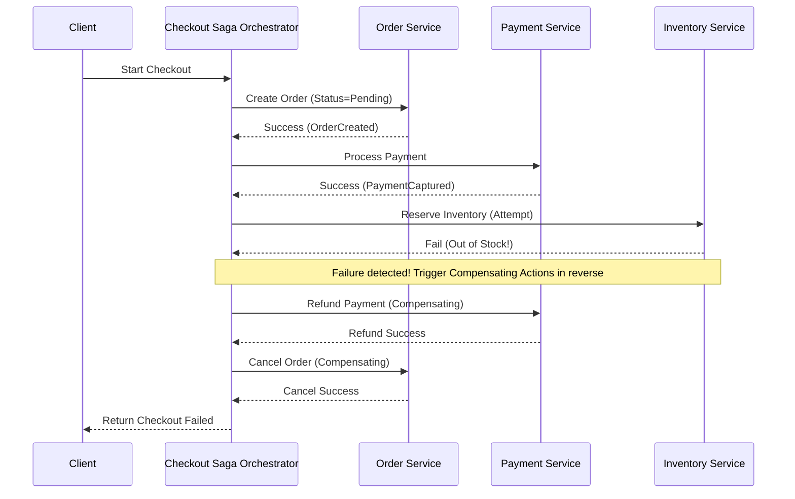

# Saga Pattern

## Introduction
The **Saga Pattern** is a design pattern used to manage and coordinate transactions across multiple independent microservices to guarantee data consistency. Since traditional distributed transaction protocols (like Two-Phase Commit / 2PC) are blocking and degrade scale in modern cloud-native architectures, the Saga pattern replaces them by breaking a global transaction into a sequence of asynchronous, localized database transactions, coupled with **Compensating Transactions** to handle rollbacks during failures.

---

## Problem Statement
In monolithic architectures, maintaining consistency is simple: wrap database queries inside a local ACID transaction. If any step fails, the database rolls back all writes. However, in microservices:
1.  **Database Per Service:** Every service owns its own database (e.g., Order Service uses Postgres, Payment Service uses Stripe/DynamoDB). A single transaction cannot span multiple physical databases without distributed locking.
2.  **2PC Scalability Bottleneck:** Two-Phase Commit (2PC) requires locking database rows across all participating nodes until the coordinator commits. This holds up resources, causing high write latencies and deadlocks, which violates microservice autonomy.
3.  **Third-Party API Limits:** You cannot run a database transaction rollback on a external payment gateway (like Stripe) after you have charged a card.

---

## Why This Exists
The Saga pattern exists to provide **Eventual Consistency** across distributed services without locking databases. By defining a workflow where each service commits its local transaction immediately and emits an event to trigger the next step, systems preserve high throughput. If a step fails, the Saga runs compensating transactions in reverse order to undo the committed changes, resolving data drift gracefully.

---

## Real-world Analogy
Imagine booking a vacation through a travel agency:
*   **Two-Phase Commit (Synchronous):** The agent locks a flight ticket, locks a hotel room, and locks a rental car. You are charged, and only then are all locks released. If the car rental office is closed (Node offline), the entire booking hangs and you cannot buy the flight.
*   **Saga Pattern (Asynchronous with Compensation):**
    1.  The agent books and pays for the flight (Local transaction 1 - committed).
    2.  The agent books and pays for the hotel room (Local transaction 2 - committed).
    3.  The agent attempts to book the rental car but finds none are available (Failure).
    4.  The agent runs compensating actions: cancels the hotel room (refund issued) and cancels the flight ticket (refund issued). Your state returns to "No vacation booked," but no resources were held locked during the process.

---

## Definition
**Saga** is a sequence of local transactions. Each transaction updates the local database of a service and publishes an event or message. If a local transaction fails due to business rule violations, the Saga coordinator executes a series of compensating transactions in reverse order to roll back state updates.

---

## Saga Topologies

### 1. Choreography (Decoupled, Event-Based)
There is no central coordinator. Each service subscribes to events emitted by other services and executes its local transaction autonomously.
*   *Pros:* Simple, natural fit for event-driven systems; low coupling.
*   *Cons:* Difficult to understand the overall workflow; risk of cyclic dependencies; hard to debug.

### 2. Orchestration (Centralized)
A dedicated service (the **Saga Orchestrator**) acts as the coordinator. It sends command messages to participants, tracks execution logs, and directs compensating actions if a step fails.
*   *Pros:* Centralized control; easy to understand and trace; prevents cyclic dependencies.
*   *Cons:* Risk of aggregating too much business logic inside the orchestrator; adds another service layer.

```
Choreography:  [Order Service] --OrderPlaced--> [Payment Service] --Paid--> [Inventory Service]
Orchestration: [Order Service] ---> [Saga Orchestrator] ---> [Payment Service]
                                             |
                                             v
                                     [Inventory Service]
```

### 3. The Lack of Isolation (ACID vs. BASE)
Sagas satisfy Atomicity, Consistency, and Durability, but lack **Isolation**. Because local transactions commit immediately, other concurrent sagas can read "dirty" uncommitted state changes (e.g., seeing an item as reserved before payment is confirmed).
*   *Mitigation:* Use **Semantic Locks** (e.g., marking order status as `PENDING_APPROVAL` so other services know it is in-flight).

---

## Internal Working: Orchestrated Saga Rollback



---

## Java Implementation

The following Java code provides a complete simulation of an **Orchestrated Saga Coordinator** managing a checkout pipeline. If a downstream step (Inventory) fails, the orchestrator triggers compensating actions for all previously completed steps.

```java
import java.util.*;

interface SagaAction {
    boolean execute();
    void compensate();
    String getName();
}

// Mock service participants
class CreateOrderAction implements SagaAction {
    public boolean execute() {
        System.out.println("[Order Service]: Local transaction committed -> Created Order (PENDING)");
        return true;
    }
    public void compensate() {
        System.out.println("[Order Service]: Compensating -> Canceled Order");
    }
    public String getName() { return "Create Order"; }
}

class CapturePaymentAction implements SagaAction {
    public boolean execute() {
        System.out.println("[Payment Service]: Local transaction committed -> Captured $100");
        return true;
    }
    public void compensate() {
        System.out.println("[Payment Service]: Compensating -> Refunded $100");
    }
    public String getName() { return "Capture Payment"; }
}

class ReserveInventoryAction implements SagaAction {
    private final boolean simulateOutOfStock;

    public ReserveInventoryAction(boolean simulateOutOfStock) {
        this.simulateOutOfStock = simulateOutOfStock;
    }

    public boolean execute() {
        if (simulateOutOfStock) {
            System.err.println("[Inventory Service]: Local transaction failed -> Out of Stock!");
            return false;
        }
        System.out.println("[Inventory Service]: Local transaction committed -> Reserved items");
        return true;
    }
    public void compensate() {
        System.out.println("[Inventory Service]: Compensating -> Released items");
    }
    public String getName() { return "Reserve Inventory"; }
}

// Saga Orchestrator
public class SagaOrchestrator {
    private final List<SagaAction> steps = new ArrayList<>();
    private final List<SagaAction> completedSteps = new ArrayList<>();

    public void addStep(SagaAction step) {
        steps.add(step);
    }

    public boolean execute() {
        System.out.println("Saga Orchestrator: Starting transaction workflow...");

        for (SagaAction step : steps) {
            System.out.println("Saga Orchestrator: Executing step -> " + step.getName());
            if (step.execute()) {
                completedSteps.add(step);
            } else {
                System.err.println("Saga Orchestrator: Step failed! Initiating rollback...");
                rollback();
                return false;
            }
        }
        System.out.println("Saga Orchestrator: Workflow completed successfully.");
        return true;
    }

    private void rollback() {
        // Rollback completed steps in reverse order (LIFO)
        for (int i = completedSteps.size() - 1; i >= 0; i--) {
            SagaAction step = completedSteps.get(i);
            System.out.println("Saga Orchestrator: Running compensation for -> " + step.getName());
            step.compensate();
        }
        System.out.println("Saga Orchestrator: Rollback completed. System in consistent state.");
    }
}
```

---

## Step-by-Step Explanation: The Rollback Execution
Using the Java code above (with `ReserveInventoryAction` set to simulate a failure):

1.  **Orchestrator Start:** The client triggers `orchestrator.execute()`.
2.  **Order Step:** The orchestrator executes `CreateOrderAction`. It succeeds, committing `"PENDING"` in the order database. Added to `completedSteps`.
3.  **Payment Step:** The orchestrator executes `CapturePaymentAction`. It succeeds, charging the card. Added to `completedSteps`.
4.  **Inventory Step:** The orchestrator executes `ReserveInventoryAction(simulateOutOfStock = true)`. The method returns `false` (failure).
5.  **Rollback Loop:** The loop terminates. The orchestrator enters `rollback()`.
6.  **Reverse Compensations:**
    *   Iterates backward: It runs the compensation for `CapturePaymentAction`, refunding the payment.
    *   It runs the compensation for `CreateOrderAction`, updating the order database status to `"CANCELED"`.
7.  **Final Consistent State:** Both databases are updated, preventing money or reservation leaks.

---

## Multiple Real-world Examples

1.  **Uber Ride Request Lifecycle:** When booking a ride: 1) Match passenger with driver (success), 2) Set up trip metadata (success), 3) Charge credit card (fails). The orchestrator cancels the driver assignment and notifies the passenger.
2.  **Microservices E-Commerce:** Modern e-commerce checkouts span Customer, Payment, Inventory, and Delivery services. Sagas are used to ensure the customer receives their order or a refund if delivery setup fails.
3.  **Flight and Hotel Booking Engines:** Sites like Expedia book travel components across different third-party reservation APIs (Airlines, Hotels, Car Rentals) using sagas to handle API timeout cancellations.

---

## Pros & Cons

### Pros
*   **High Scalability:** Avoids blocking distributed locks; local transactions commit immediately.
*   **No Central Database Locks:** Keeps microservices independent and autonomous.
*   **API Agnostic:** Can coordinate transactions that span internal databases and external third-party APIs (Stripe, Twilio).

### Cons
*   **Lack of Isolation:** Concurrent transactions can read dirty, uncommitted data, requiring careful design of semantic lock states.
*   **Complex Rollbacks:** Writing compensating actions for every single step increases code complexity.
*   **Eventual Consistency:** User interfaces must handle eventual consistency (e.g., showing a "Pending" screen instead of instant confirmation).

---

## Interview Questions

### Beginner
*   **Q:** What is the Saga pattern in microservices?
*   **A:** The Saga pattern coordinates distributed transactions across multiple microservices using a sequence of local transactions. Each step updates its local database, and if a later step fails, the Saga runs compensating transactions in reverse order to undo changes.

### Intermediate
*   **Q:** What is the difference between Choreography-based and Orchestration-based Sagas?
*   **A:** In Choreography, there is no central coordinator; services react to events published by other services. In Orchestration, a dedicated coordinator service (orchestrator) directs the flow of command messages and coordinates rollbacks.

### Senior
*   **Q:** Since Sagas lack the "Isolation" property of local database transactions, how do you prevent concurrency anomalies?
*   **A:** By using **Semantic Locks**. When a saga starts modifying a record, it does not lock the database row. Instead, it updates the record status to a pending state (e.g., setting an order status to `PENDING_CHECKOUT` or a balance to `RESERVED`). Other concurrent transactions read this status and know they should treat the data as locked or in-flight, preventing dirty writes.

### Staff Engineer
*   **Q:** How do you guarantee that a Saga Orchestrator itself is fault-tolerant? If the orchestrator server crashes mid-workflow, how does the system recover?
*   **A:** 
    1.  **State Machine Persistence:** The orchestrator must persist its state (current step, event payloads, completed steps) to a durable database (a **Saga Log** or State Store) before sending any command RPC.
    2.  **Idempotency Keys:** Every request sent by the orchestrator to a participant service must include a unique transaction ID.
    3.  **Recovery Daemon:** When the orchestrator recovers from a crash, it reads the Saga Log, finds all in-progress transactions, and resumes execution from the last recorded state.
    4.  **Idempotent Participants:** Since the orchestrator might send duplicate command requests during recovery, participant services must use the transaction ID as an idempotency key to prevent repeating side-effects.

---

## Common Mistakes
*   **Non-Idempotent Compensations:** Designing compensating actions that cannot be safely executed multiple times. If a network timeout occurs during rollback, the orchestrator will retry the compensation; if the compensation is not idempotent, it can result in duplicate refunds.
*   **Assuming Isolation:** Forgetting to design semantic states, allowing users to buy products that are currently reserved by an incomplete saga.
*   **Synchronous Orchestration:** Making synchronous, blocking HTTP calls from the orchestrator, which creates temporal coupling. Sagas should communicate asynchronously using message queues.

---

## Best Practices
*   **Ensure Idempotency:** All saga participants and compensating actions must be idempotent.
*   **Use Asynchronous Messaging:** Communicate between orchestrators and participants using queues (Kafka, RabbitMQ) to ensure message delivery guarantees.
*   **Implement Outbox Pattern:** Use the Transactional Outbox pattern when publishing saga events from local databases to ensure atomicity.

---

## When NOT to Use
*   **Monolithic Databases:** If all tables reside in a single relational database, use local database transactions, which are much simpler and safer.
*   **High-Volume Low-Consistency Feeds:** Analytics pipelines or telemetry where transactions are not required.

---

## Comparison with Similar Concepts

*   **Saga vs. Two-Phase Commit (2PC):** 2PC is synchronous, blocking, and guarantees immediate consistency (CP). Sagas are asynchronous, non-blocking, and guarantee eventual consistency (AP).
*   **Saga vs. Orchestrator Orchestration:** Sagas specifically include compensating actions to revert state. Generic workflow orchestrators (like Airflow) only manage sequence flows without transactional rollback guarantees.

---

## Summary
The Saga pattern is the industry standard for managing distributed transactions across microservices. By replacing synchronous 2PC locks with asynchronous local transactions and idempotent compensating rollbacks, systems maintain high throughput while ensuring eventual data consistency.

---

## Related Topics
- [CQRS](../cqrs)
- [Event Sourcing](../event-sourcing)
- [Retry](../retry)
- [Event-Driven Architecture](../../messaging/event-driven-architecture)
