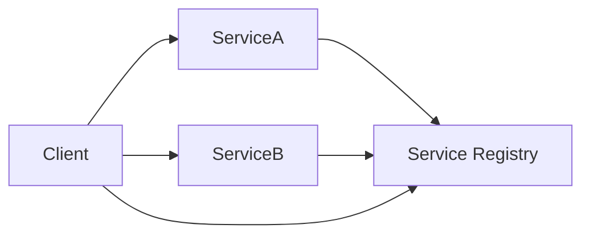

# Service Discovery

## Introduction
Service discovery is the process that enables services to locate each other dynamically in a distributed system.

## Problem Statement
Hard-coding service endpoints prevents scalability and resilience when services move or scale.

## Why this exists
Service discovery allows services to register and discover endpoints automatically, supporting resilient service-to-service communication.

## Real-world analogy
A phone directory helps you find the current contact information for a business instead of using outdated addresses.

## Definition
Service discovery is a mechanism for resolving service names to network locations, often via a registry or DNS.

## Key concepts
- **Service registry**
- **Client-side discovery**
- **Server-side discovery**
- **Health checks**
- **TTL-based registrations**

## Internal working
Services register their address and port with a registry. Clients query the registry or use DNS to find healthy service instances.

### Mermaid diagram


## Python implementation

### Bad implementation
A static configuration file with hard-coded endpoints.

```python
SERVICES = {
    "orders": "10.0.0.1:8080",
    "inventory": "10.0.0.2:8080",
}
```

### Better implementation
A registry with direct lookups.

```python
class ServiceRegistry:
    def __init__(self):
        self.services = {}

    def register(self, name, address):
        self.services.setdefault(name, []).append(address)

    def discover(self, name):
        return self.services.get(name, [])
```

### Best implementation
A registry with TTL-based health checks and round-robin discovery.

```python
import random
import time
from typing import Any, Dict, List

class ServiceRegistry:
    def __init__(self):
        self.services: Dict[str, List[Dict[str, Any]]] = {}

    def register(self, name: str, address: str, ttl: float = 30.0) -> None:
        self.services.setdefault(name, []).append({
            "address": address,
            "expires_at": time.time() + ttl,
        })

    def discover(self, name: str) -> List[str]:
        now = time.time()
        available = [entry["address"] for entry in self.services.get(name, []) if entry["expires_at"] > now]
        return available

    def choose(self, name: str) -> str | None:
        addresses = self.discover(name)
        return random.choice(addresses) if addresses else None
```

## Step-by-step explanation
1. Services register their current address with the registry.
2. Clients ask the registry for healthy endpoints.
3. The registry returns one or more viable instances.

## Multiple real-world examples
- HashiCorp Consul provides service registration and discovery.
- Kubernetes uses DNS and API discovery for pods and services.
- Eureka is a JVM-based service registry from Netflix.

## Pros
- Supports dynamic service scaling.
- Avoids hard-coded endpoints.
- Integrates health checks into discovery.

## Cons
- Introduces another component to manage.
- Can add discovery latency.
- Requires accurate health-checking.

## Interview Questions
### Beginner
- What is service discovery?
- Answer: A mechanism for services to find each other dynamically.

### Intermediate
- What is the difference between client-side and server-side discovery?
- Answer: Client-side discovery queries the registry; server-side discovery uses a load balancer that queries the registry.

### Senior
- How do TTLs help service discovery?
- Answer: They remove stale registrations automatically if instances fail to renew.

### Staff Engineer
- Design a resilient service discovery system for a multi-cloud architecture.
- Answer: Use multiple registries, DNS fallback, health checks, and cross-region service caching.

## Common mistakes
- Relying on stale registry entries.
- Using discovery without health checks.
- Hard-coding service names in application code.

## Best practices
- Use short TTLs and frequent heartbeats.
- Keep discovery clients simple and retry gracefully.
- Monitor registry health and lookup latency.

## When NOT to use
- Static environments where endpoints never change.
- Simple applications with few services.

## Comparison with similar concepts
- **API Gateway:** a gateway can also perform discovery for external requests.
- **Load Balancer:** discovery resolves service locations, while load balancers distribute traffic.
- **Service Mesh:** often includes discovery as a core capability.

## Summary
Service discovery is critical for scalable microservice communication. A resilient registry and health checking keep services connected and reduce configuration drift.

## Related topics
- [API Gateway](../api-gateway)
- [Service Mesh](../../service-mesh-observability/service-mesh)
- [Circuit Breaker](../circuit-breaker)
