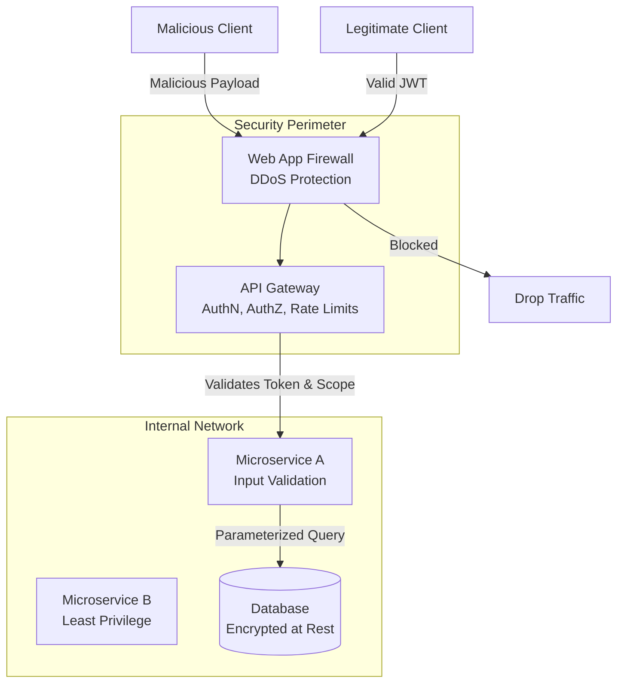

# API Security

## Introduction
API Security encompasses the strategies, practices, and technologies used to protect Application Programming Interfaces (APIs) from malicious attacks, misuse, and data breaches. Because APIs expose the internal logic and databases of an application directly to the internet, they are the primary target for modern hackers.

## Problem Statement
Traditional security focused on protecting web pages via firewalls. However, Single Page Applications (SPAs) and Mobile apps rely entirely on APIs. If an API is poorly designed, an attacker doesn't need to hack through the UI; they can bypass the frontend entirely, sending automated HTTP requests directly to the backend to scrape data, execute unauthorized commands, or crash the server.

## Why this exists
To ensure that APIs provide Confidentiality (only authorized people see data), Integrity (data cannot be tampered with), and Availability (the API remains responsive under load).

## Real-world analogy
Think of a bank. The bank branch with tellers is the UI. Security guards can watch people walking in. 
An ATM is an API. It sits on the street and connects directly to the bank's vault system. Because it is exposed directly to the public, it needs incredible security: encrypted communication, PIN pads, rate limiting (transaction limits), and heavy physical armor.

## Key concepts & Vulnerabilities (OWASP API Top 10)

1. **BOLA (Broken Object Level Authorization):** Also known as IDOR. A user requests `GET /api/accounts/101`. They change the ID to `102` and the API serves someone else's account.
2. **Broken Authentication:** Weak password rules, lack of MFA, or improperly validated JWTs allow attackers to steal or forge sessions.
3. **Mass Assignment:** An API accepts a JSON payload to update a profile `{"name": "Alice"}`. The attacker injects `{"name": "Alice", "role": "admin"}` and the backend blindly updates the database, granting admin privileges.
4. **Lack of Rate Limiting:** Allowing an attacker to send 10,000 requests per second, exhausting server resources (DDoS) or brute-forcing passwords.
5. **Security Misconfiguration:** Missing CORS policies, exposing verbose error messages (stack traces), or using outdated TLS protocols.

## Internal working / Mermaid diagram

## Step-by-step Defense Strategy
1. **Transport Security:** Force TLS (HTTPS) everywhere to encrypt data in transit.
2. **Edge Security:** Deploy a Web Application Firewall (WAF) to block SQL Injection, XSS, and botnets before they hit your servers.
3. **API Gateway:** Route all traffic through a gateway that enforces Rate Limiting (e.g., 100 requests per minute per IP) and verifies JWT signatures.
4. **Endpoint Security (AuthZ):** Inside the microservice, verify that the caller is authorized to view the *specific object* they requested (preventing BOLA).
5. **Input Validation:** Never trust client data. Validate data types, lengths, and formats. Strip out unexpected fields to prevent Mass Assignment.

## Multiple real-world examples
1. **Financial APIs (Open Banking):** Utilizing Mutual TLS (mTLS) where both the client and the server must present cryptographic certificates to establish a connection.
2. **Public APIs (Twitter/GitHub):** Requiring API Keys or OAuth tokens, and implementing strict rate limiting headers (`X-RateLimit-Remaining`).
3. **E-commerce:** Masking credit card numbers in API responses to prevent Data Exposure vulnerabilities.

## Pros
- Prevents catastrophic data breaches.
- Ensures system stability against volumetric attacks (DDoS).
- Builds user trust.

## Cons
- Security layers introduce slight latency.
- Designing proper authorization (ABAC/RBAC) is complex and increases development time.
- Strict security can degrade developer experience (e.g., dealing with CORS issues).

## Interview questions

### Beginner
- **Q: What is an API Gateway and how does it improve security?**
  - **A:** An API Gateway is a central entry point for all API requests. It improves security by centralizing authentication checks, enforcing rate limits, and hiding the internal network topology of the microservices from the public.

### Intermediate
- **Q: Explain Mass Assignment and how to prevent it.**
  - **A:** Mass Assignment occurs when a backend framework automatically binds client JSON data directly to database models. Attackers can inject hidden fields (like `"is_admin": true`). Prevent it by using strict Data Transfer Objects (DTOs) and explicitly defining which fields are allowed to be updated.

### Senior
- **Q: What is BOLA (Broken Object Level Authorization) and how do you mitigate it?**
  - **A:** BOLA happens when an API endpoint uses an ID from the client (e.g., `/users/5`) but fails to verify if the currently logged-in user is authorized to access user 5. Mitigation involves checking permissions at the data access layer for *every* request: `SELECT * FROM users WHERE id = 5 AND owner_id = :current_user_id`. Also, using non-guessable IDs (like UUIDs) helps reduce visibility, though it's not a substitute for proper auth checks.

## Common mistakes
- **Relying on Obscurity:** Assuming an API is safe because the endpoints aren't published anywhere. Attackers easily intercept mobile app traffic and discover all "hidden" endpoints.
- **Returning Stack Traces:** Leaving debug mode on in production, returning full SQL errors to the client which reveals database architecture to attackers.
- **Improper CORS configuration:** Setting `Access-Control-Allow-Origin: *` with credentials enabled, allowing malicious websites to make authenticated requests on behalf of the user.

## Best practices
- Use an API Gateway.
- Implement Zero Trust architecture (even internal microservices must authenticate with each other).
- Use tools like OWASP ZAP or Burp Suite to automate security scanning in your CI/CD pipeline.
- Implement robust logging and monitoring to detect anomalous behavior (like an IP address requesting thousands of user profiles).

## When NOT to use
- There is no scenario where API Security should be ignored. The strictness of the security (e.g., mTLS vs standard OAuth) depends on the sensitivity of the data.

## Comparison with similar concepts
- **AuthN vs AuthZ vs API Security:** AuthN is verifying identity. AuthZ is verifying permissions. API security is the overarching umbrella that includes AuthN, AuthZ, input validation, encryption, and threat protection.

## Summary
APIs are the nervous system of modern applications, and securing them is paramount. A defense-in-depth strategy—utilizing HTTPS, Gateways, Rate Limiting, strict Input Validation, and rigorous Object-Level Authorization—is required to defend against sophisticated modern attacks.

## Related topics
- [Authentication](../authentication)
- [Authorization](../authorization)
- [OAuth](../oauth)
- [API Gateway](../../microservices/api-gateway)
