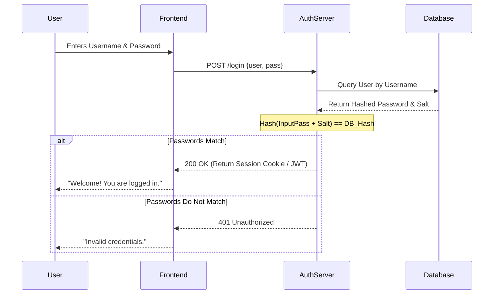

# Authentication

## Introduction
Authentication (often abbreviated as AuthN) is the process of verifying the identity of a user, device, or system. It answers the question: **"Who are you?"**

## Problem Statement
When a user attempts to access a system (like a bank account or an email inbox), the system must have absolute certainty that the person requesting access is truly the owner of that account, and not a malicious actor.

## Why this exists
To protect user data and system resources by ensuring that only verifiable, legitimate entities are granted a session.

## Real-world analogy
When you travel internationally, you must present a passport at the border. The border guard looks at your face, looks at the photo in the passport, and verifies the cryptographic watermark. The passport is your proof of identity. The act of the guard verifying it is **Authentication**.

## Definition
The process of verifying the identity of a subject requesting access to a system.

## Key concepts
Authentication is typically based on one or more "factors":
- **Something you know:** Passwords, PINs, security questions.
- **Something you have:** A physical security key (YubiKey), a smartphone (for SMS codes or Authenticator apps), an ID card.
- **Something you are:** Biometrics (fingerprint, FaceID, retina scan).

**Multi-Factor Authentication (MFA):** Requiring two or more of the above factors to grant access (e.g., Password + SMS code / TOTP token).

## Internal working / Mermaid diagram



## Python/Java implementation

Below is a Java simulation demonstrating secure password hashing, verification, and session management.

### Bad implementation
*Storing passwords in plaintext or using fast, insecure hashes like MD5 without salts.*

```java
import java.security.MessageDigest;

// BAD: Insecure plaintext comparison or weak MD5 hashing without salt
public class PlaintextPasswordService {

    public String registerUser(String password) {
        // Storing password directly in plaintext or MD5 (vulnerable to dictionary/rainbow tables)
        try {
            MessageDigest md = MessageDigest.getInstance("MD5");
            byte[] bytes = md.digest(password.getBytes());
            StringBuilder sb = new StringBuilder();
            for (byte b : bytes) {
                sb.append(String.format("%02x", b));
            }
            return sb.toString(); // Weak hash, no salt!
        } catch (Exception e) {
            throw new RuntimeException(e);
        }
    }

    public boolean authenticate(String inputPassword, String storedMd5) {
        // Directly comparing MD5 without salt
        return registerUser(inputPassword).equals(storedMd5);
    }
}
```

### Better implementation
*Using SHA-256 with a unique salt to protect against pre-computed rainbow tables, but using a fast hash function vulnerable to GPU acceleration.*

```java
import java.security.MessageDigest;
import java.security.SecureRandom;
import java.util.Base64;

// BETTER: SHA-256 hashing with salt
// Prevents rainbow table attacks, but hash calculation is too fast and susceptible to brute-forcing.
public class SaltedSha256PasswordService {

    public String generateSalt() {
        SecureRandom sr = SecureRandom.getInstanceStrong();
        byte[] salt = new byte[16];
        sr.nextBytes(salt);
        return Base64.getEncoder().encodeToString(salt);
    }

    public String hashPassword(String password, String salt) {
        try {
            MessageDigest md = MessageDigest.getInstance("SHA-256");
            md.update(Base64.getDecoder().decode(salt));
            byte[] hashedPassword = md.digest(password.getBytes());
            return Base64.getEncoder().encodeToString(hashedPassword);
        } catch (Exception e) {
            throw new RuntimeException(e);
        }
    }

    public boolean authenticate(String inputPassword, String salt, String storedHash) {
        String inputHash = hashPassword(inputPassword, salt);
        return MessageDigest.isEqual(inputHash.getBytes(), storedHash.getBytes());
    }
}
```

### Best implementation
*Using a slow, computationally expensive algorithm (like PBKDF2, bcrypt, or Argon2) with a unique salt, combined with both Session and Token based authentication manager.*

```java
import javax.crypto.SecretKeyFactory;
import javax.crypto.spec.PBEKeySpec;
import java.security.SecureRandom;
import java.security.spec.KeySpec;
import java.util.Base64;
import java.util.concurrent.ConcurrentHashMap;

// BEST: PBKDF2WithHmacSHA512 Hashing & Multi-Session Authenticator
public class SecureAuthenticationManager {
    private static final int ITERATIONS = 120000; // Intentionally slow to deter brute force
    private static final int KEY_LENGTH = 256;
    private final ConcurrentHashMap<String, String> sessionStore = new ConcurrentHashMap<>();

    // 1. Password Hashing using PBKDF2
    public String hashPassword(String password, byte[] salt) throws Exception {
        KeySpec spec = new PBEKeySpec(password.toCharArray(), salt, ITERATIONS, KEY_LENGTH);
        SecretKeyFactory factory = SecretKeyFactory.getInstance("PBKDF2WithHmacSHA512");
        byte[] hash = factory.generateSecret(spec).getEncoded();
        return Base64.getEncoder().encodeToString(hash);
    }

    public byte[] generateSalt() {
        SecureRandom random = new SecureRandom();
        byte[] salt = new byte[32];
        random.nextBytes(salt);
        return salt;
    }

    public boolean verifyPassword(String password, String saltStr, String storedHash) throws Exception {
        byte[] salt = Base64.getDecoder().decode(saltStr);
        String newHash = hashPassword(password, salt);
        return MessageDigest.isEqual(newHash.getBytes(), storedHash.getBytes());
    }

    // 2. Session ID Management (Stateful Session Option)
    public String createSession(String username) {
        SecureRandom random = new SecureRandom();
        byte[] randomBytes = new byte[32];
        random.nextBytes(randomBytes);
        String sessionId = Base64.getUrlEncoder().withoutPadding().encodeToString(randomBytes);
        sessionStore.put(sessionId, username);
        return sessionId;
    }

    public boolean validateSession(String sessionId) {
        return sessionStore.containsKey(sessionId);
    }

    public void logout(String sessionId) {
        sessionStore.remove(sessionId);
    }
}
```

## Step-by-step explanation (Password-based)
1. **Registration:** The user provides a password. The server generates a random string (a "salt"), combines it with the password, hashes the combination using a slow, resource-intensive algorithm (like bcrypt, Argon2, or PBKDF2), and stores the salt and the resulting hash in the database. The raw password is never logged or saved.
2. **Login Request:** The user submits their username and raw password.
3. **Retrieval:** The server queries the database by username to fetch the salt and the stored hash.
4. **Verification:** The server computes a hash of the input password using the fetched salt and the same slow hashing parameters.
5. **Comparison:** The server compares the newly computed hash with the stored hash using a time-constant string comparison function (preventing timing attacks).
6. **Session Issue:** If they match, a session (or token) is generated and returned.

## Multiple real-world examples
1. **Basic Auth:** Sending a Base64-encoded `username:password` string in the HTTP header of every request (highly insecure unless over HTTPS, and mostly used for simple server-to-server API calls).
2. **Session-based (Stateful):** The server creates a session in its database or memory store (e.g., Redis) and gives the browser a Cookie containing the Session ID.
3. **Token-based (Stateless):** The server verifies the user and issues a JSON Web Token (JWT). The client sends this token in the `Authorization: Bearer <token>` header on subsequent requests.
4. **OAuth 2.0 / OpenID Connect:** Utilizing an external IdP (like Azure AD or Google Workspace) to authenticate the user and return identity claims (OIDC).
5. **FIDO2 / Passkeys (WebAuthn):** Biometric or hardware-based public key cryptography where the user's device signs a server challenge using their private key.

## Pros
- Essential for access control and privacy.
- Multi-Factor Authentication (MFA) dramatically blocks credential stuffing and brute-force attacks.
- Passkeys (WebAuthn) eliminate phishing risks entirely.

## Cons
- Creates friction for the user (password fatigue, 2FA prompt timeouts).
- Designing secure account recovery (e.g., "Forgot Password") is a common point of compromise.
- Storing credentials safely requires high security hygiene to avoid leaks.

## Interview questions

### Beginner
- **Q: What is the difference between Authentication and Authorization?**
  - **A:** Authentication verifies **who you are** (checking your passport). Authorization verifies **what you are allowed to do** (checking your VIP pass to see if you can enter the backstage).
- **Q: Why do we hash passwords instead of encrypting them?**
  - **A:** Encryption is two-way (can be decrypted back to plaintext if the key is known). Hashing is a one-way mathematical function; we never want to decrypt a password back to plaintext. We only need to check if the hashed input matches the hashed original.

### Intermediate
- **Q: Why do we "salt" passwords before hashing them?**
  - **A:** A salt is a random string appended to the password before hashing. If two users have the same password ("password123"), their hashes will look completely different due to different salts. This prevents the use of pre-computed Rainbow Tables to instantly look up passwords from hashes.
- **Q: What is the difference between Stateful Session cookies and Stateless Tokens (JWTs)?**
  - **A:** Stateful sessions store a Session ID in the user's cookie, and the server retains session details in databases or Redis. Stateless tokens (JWTs) package session data inside the token itself, signed cryptographically, allowing the server to decode and trust it without doing any database lookups.

### Senior
- **Q: How does a Time-Based One-Time Password (TOTP) algorithm work for 2FA?**
  - **A:** TOTP (RFC 6238) uses a shared secret key between the server and the user's authenticator app, combined with the current epoch timestamp (divided into 30-second steps). Both calculate `HMAC-SHA1(Secret, TimeStep)`. The resulting hash is truncated to a 6-digit number. The server compares its calculated code with the code entered by the user.
- **Q: What are timing attacks, and how do we prevent them in authentication systems?**
  - **A:** A timing attack is an exploit where an attacker determines secret data by measuring how long a server takes to process inputs. For instance, comparing two strings character-by-character returns false instantly upon the first mismatched character. The first character matching takes slightly longer. To prevent this, use a time-constant equality checker (`MessageDigest.isEqual()`) which checks every byte regardless of when a mismatch is found.

### Staff Engineer
- **Q: Design a zero-trust authentication architecture for a globally distributed enterprise with 10,000 microservices across multiple cloud regions.**
  - **A:** A zero-trust model implies that no request is trusted simply because it originated inside the corporate network.
    1. **Identity Provider (IdP):** Consolidate user identities at an IdP using OpenID Connect + SAML, backed by hardware-based FIDO2 WebAuthn (Passkeys) for MFA.
    2. **Edge API Gateway:** All incoming external requests terminate at the API Gateway, which authenticates the user's session and mints a short-lived, cryptographically signed internal token containing the user's identity, tenant context, and scopes.
    3. **Internal Mutual TLS (mTLS):** All microservice-to-microservice traffic is encrypted and authenticated using SPIFFE/SPIRE for automatic cryptographic identity provisioning (X.509 certificates).
    4. **Policy Enforcement Point (PEP) at Services:** Each service checks the internal token and applies localized authorization rules.
    5. **Continuous Adaptive Trust:** An anomaly engine monitors requests (IP changes, unusual times, high request rates) and dynamically forces step-up authentication (re-prompting for MFA).

## Common mistakes
- **Storing passwords in plaintext:** A catastrophic failure. Always hash passwords.
- **Using weak hashing algorithms:** MD5 and SHA-1 are fast and cryptographically broken. They can be brute-forced in seconds using modern GPUs. Always use slow, memory-hard algorithms like `bcrypt`, `scrypt`, or `Argon2`.
- **Logging credentials:** Accidentally logging the raw password object in server access logs or error logs.

## Best practices
- Enforce strong password policies (length is more important than complexity).
- Implement rate-limiting on login endpoints to prevent brute-force attacks.
- Support and encourage Multi-Factor Authentication (MFA).

## When NOT to use
- You almost always need authentication. The only exception is a fully public website or a read-only public API where identity doesn't matter.

## Comparison with similar concepts
- **Authentication (AuthN) vs Authorization (AuthZ):** AuthN = Identity verification. AuthZ = Permission verification.

## Summary
Authentication is the foundational security layer of any application. Properly handling passwords with salting and hashing, utilizing secure session management, and implementing MFA are non-negotiable requirements for modern software engineering.

## Related topics
- [Authorization](../authorization)
- [JWT](../jwt)
- [OAuth](../oauth)
- [API Security](../api-security)
