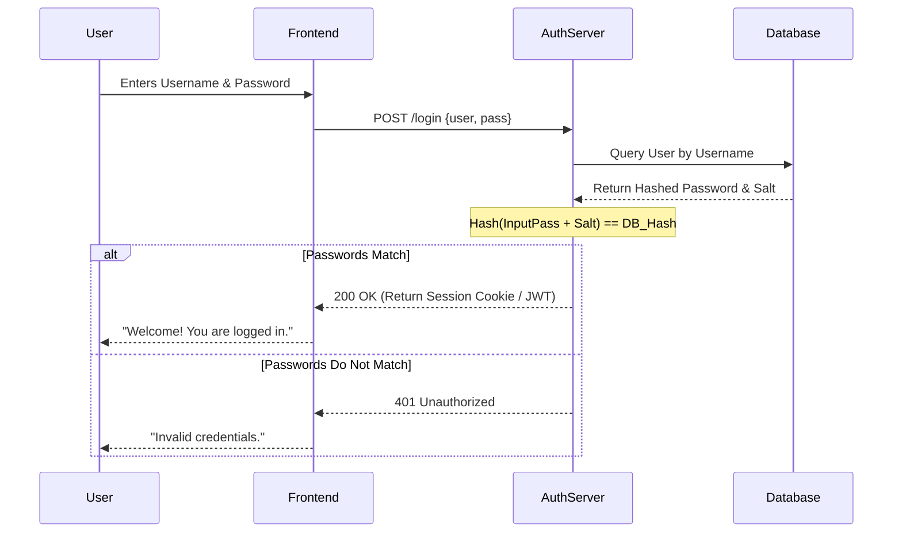

# Authentication

## Introduction
Authentication (often abbreviated as AuthN) is the process of verifying the identity of a user, device, or system. It answers the question: **"Who are you?"**

## Problem Statement
When a user attempts to access a system (like a bank account or an email inbox), the system must have absolute certainty that the person requesting access is truly the owner of that account, and not a malicious actor.

## Why this exists
To protect user data and system resources by ensuring that only verifiable, legitimate entities are granted a session.

## Real-world analogy
When you travel internationally, you must present a passport at the border. The border guard looks at your face, looks at the photo in the passport, and verifies the cryptographic watermark. The passport is your proof of identity. The act of the guard verifying it is **Authentication**.

## Definition
The process of verifying the identity of a subject requesting access to a system.

## Key concepts
Authentication is typically based on one or more "factors":
- **Something you know:** Passwords, PINs, security questions.
- **Something you have:** A physical security key (YubiKey), a smartphone (for SMS codes or Authenticator apps), an ID card.
- **Something you are:** Biometrics (fingerprint, FaceID, retina scan).

**Multi-Factor Authentication (MFA):** Requiring two or more of the above factors to grant access. (e.g., Password + SMS code).

## Internal working / Mermaid diagram

## Step-by-step explanation (Password-based)
1. **Registration:** The user provides a password. The server generates a random string (a "salt"), combines it with the password, hashes the combination using a strong algorithm (like bcrypt or Argon2), and stores the salt and the hash in the database. The raw password is NEVER stored.
2. **Login Request:** The user submits their username and raw password.
3. **Retrieval:** The server looks up the user and retrieves their salt and stored hash.
4. **Verification:** The server takes the submitted raw password, combines it with the retrieved salt, and hashes it using the same algorithm.
5. **Comparison:** If the newly computed hash exactly matches the stored hash, the user is authenticated.
6. **Session Creation:** The server generates a token (JWT) or a Session ID and gives it to the user's browser, so they don't have to send their password on every subsequent request.

## Multiple real-world examples
1. **Basic Auth:** Sending a Base64 encoded `username:password` string in the HTTP header of every single request (highly insecure unless over HTTPS, and mostly used for server-to-server API calls).
2. **Session-based (Stateful):** The server creates a session in its database and gives the browser a Cookie containing the Session ID.
3. **Token-based (Stateless):** The server verifies the user and issues a JSON Web Token (JWT). The client sends this token in the `Authorization` header on subsequent requests.
4. **SSO (Single Sign-On):** Using a central Identity Provider (IdP) like Google or Okta. You log in once to Okta, and Okta vouches for your identity to all your company's internal apps.

## Pros
- Validates identity and protects user data.
- Modern MFA significantly reduces the risk of account takeovers from leaked passwords.

## Cons
- Creates friction for the user (people hate remembering passwords and typing in 2FA codes).
- Managing secure password storage, account recovery (forgot password flows), and session revocation is complex for developers.

## Interview questions

### Beginner
- **Q: What is the difference between Authentication and Authorization?**
  - **A:** Authentication verifies **who you are** (checking your passport). Authorization verifies **what you are allowed to do** (checking your concert ticket to see if you have VIP access).

### Intermediate
- **Q: Why do we "salt" passwords before hashing them?**
  - **A:** If two users have the same password (e.g., "password123"), a basic hash will look identical for both. A salt is a random string added to the password before hashing. It ensures that even if two users have the same password, their hashes will be completely different. It also protects against pre-computed Rainbow Table attacks.

### Senior
- **Q: Describe how a typical SSO (Single Sign-On) flow works using SAML or OIDC.**
  - **A:** The user attempts to access the Service Provider (SP). The SP redirects the user to the Identity Provider (IdP). The user logs into the IdP. The IdP generates a cryptographically signed token/assertion and redirects the user back to the SP. The SP verifies the signature. If valid, the user is authenticated.

## Common mistakes
- **Storing passwords in plaintext:** A catastrophic failure. Always hash passwords.
- **Using weak hashing algorithms:** MD5 and SHA-1 are fast and cryptographically broken. They can be brute-forced in seconds using modern GPUs. Always use slow, memory-hard algorithms like `bcrypt`, `scrypt`, or `Argon2`.
- **Logging credentials:** Accidentally logging the raw password object in server access logs or error logs.

## Best practices
- Enforce strong password policies (length is more important than complexity).
- Implement rate-limiting on login endpoints to prevent brute-force attacks.
- Support and encourage Multi-Factor Authentication (MFA).

## When NOT to use
- You almost always need authentication. The only exception is a fully public website or a read-only public API where identity doesn't matter.

## Comparison with similar concepts
- **Authentication (AuthN) vs Authorization (AuthZ):** AuthN = Identity verification. AuthZ = Permission verification.

## Summary
Authentication is the foundational security layer of any application. Properly handling passwords with salting and hashing, utilizing secure session management, and implementing MFA are non-negotiable requirements for modern software engineering.

## Related topics
- [Authorization](../authorization)
- [JWT](../jwt)
- [OAuth](../oauth)
