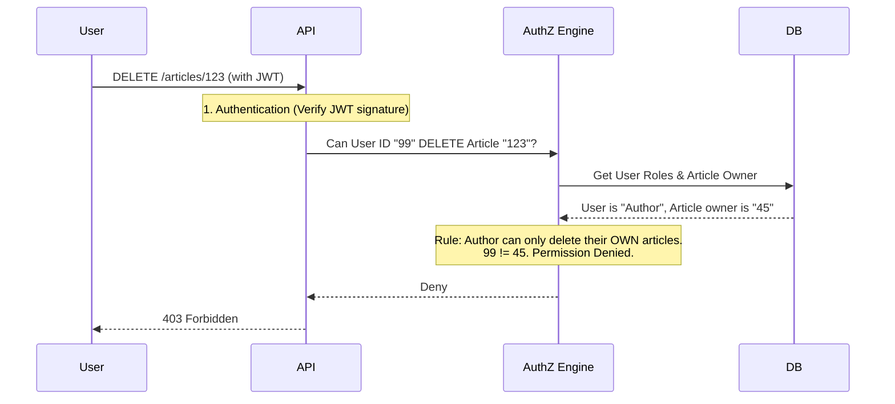

# Authorization

## Introduction
Authorization (often abbreviated as AuthZ) is the process of determining whether an authenticated user has the necessary permissions to access a specific resource or perform a specific action. It answers the question: **"Are you allowed to do this?"**

## Problem Statement
Just because a user is logged into an application (Authenticated) doesn't mean they should be able to do everything. A regular user should not be able to delete another user's account, view the company's financial dashboard, or drop the database. You need a system to enforce rules around who can access what.

## Why this exists
To enforce access controls, ensuring data privacy and system integrity by restricting actions based on a user's role, attributes, or ownership.

## Real-world analogy
Imagine flying on an airplane. 
Showing your passport at the security gate to prove your identity is **Authentication**. 
When you board the plane, the flight attendant looks at your boarding pass. The boarding pass dictates your privileges: Are you in First Class or Economy? Can you enter the cockpit? (No). Checking the boarding pass to see where you are allowed to go is **Authorization**.

## Definition
The process of granting or denying access rights to a user, program, or process.

## Key concepts

### 1. Role-Based Access Control (RBAC)
The most common model. Permissions are assigned to **Roles** (e.g., `Admin`, `Editor`, `Viewer`), and users are assigned to those roles. 
- Example: An `Editor` can publish articles. Alice is an `Editor`. Therefore, Alice can publish articles.

### 2. Attribute-Based Access Control (ABAC)
More granular. Access is granted based on attributes of the user, the resource, and the environment.
- Example: A user can edit a document IF (User.Department == "Finance" AND Document.Sensitivity == "High" AND CurrentTime < 5:00 PM).

### 3. Access Control Lists (ACL)
A list attached directly to a resource specifying which users have access.
- Example: `File_A` has an ACL: [Alice: Read/Write, Bob: Read-Only].

### 4. Relationship-Based Access Control (ReBAC)
Access is granted based on relationships between entities.
- Example: User A can view User B's post because User A is a "friend" of User B.

## Internal working / Mermaid diagram



## Python/Java implementation

Below is a Java simulation illustrating how authorization models operate.

### Bad implementation
*Directly fetching resources by ID without checking if the authenticated user owns or is authorized to view the resource (Insecure Direct Object Reference - IDOR).*

```java
// BAD: Insecure Direct Object Reference (IDOR) vulnerability
public class InsecureInvoiceService {
    
    public Invoice getInvoice(String invoiceId, String authenticatedUserId) {
        // Fetches invoice directly from database using ID
        Invoice invoice = Database.findInvoiceById(invoiceId);
        
        // VULNERABILITY: No check to see if invoice belongs to authenticatedUserId!
        return invoice; 
    }
}

class Invoice {
    public String id;
    public String ownerId;
    public double amount;
}

class Database {
    public static Invoice findInvoiceById(String id) {
        Invoice invoice = new Invoice();
        invoice.id = id;
        invoice.ownerId = "user_abc"; // Owned by someone else
        invoice.amount = 5000.0;
        return invoice;
    }
}
```

### Better implementation
*Basic Role-Based Access Control (RBAC) preventing users with invalid roles from accessing endpoints.*

```java
import java.util.Set;

// BETTER: Checking user roles before performing operations (RBAC)
public class RoleBasedUserService {

    public void deleteUserAccount(User user, String userIdToDelete) {
        // Enforcing that only ADMIN role can delete users
        if (!user.getRoles().contains("ADMIN")) {
            throw new SecurityException("Access Denied: Requires ADMIN role");
        }
        
        // Process deletion...
        System.out.println("Deleted account " + userIdToDelete);
    }
}

class User {
    private final String id;
    private final Set<String> roles;

    public User(String id, Set<String> roles) {
        this.id = id;
        this.roles = roles;
    }

    public String getId() { return id; }
    public Set<String> getRoles() { return roles; }
}
```

### Best implementation
*An Attribute-Based Access Control (ABAC) engine validating subjects, resources, environment variables (time, IP), and resource ownership (preventing IDOR).*

```java
import java.time.LocalTime;
import java.util.Map;

// BEST: Dynamic Policy/ABAC Engine
public class AbacAuthorizationEngine {

    public static class Subject {
        public String id;
        public String role;
        public String department;
        public String sourceIp;
    }

    public static class Resource {
        public String id;
        public String type;
        public String ownerId;
        public String sensitivity; // e.g. "HIGH", "LOW"
    }

    public static class Environment {
        public LocalTime time;
        public String allowedIpRange;
    }

    public boolean isAuthorized(Subject sub, Resource res, String action, Environment env) {
        // Rule 1: Admins can do anything
        if ("ADMIN".equalsIgnoreCase(sub.role)) {
            return true;
        }

        // Rule 2: Owners can read/write their own resources if they are low-medium sensitivity
        if (res.ownerId.equals(sub.id)) {
            if ("HIGH".equalsIgnoreCase(res.sensitivity)) {
                // High sensitivity resources require working hour checks (e.g., 9 AM to 5 PM)
                if (env.time.isBefore(LocalTime.of(9, 0)) || env.time.isAfter(LocalTime.of(17, 0))) {
                    return false; // Denied outside working hours
                }
            }
            return true; // Approved
        }

        // Rule 3: Department sharing (e.g., HR department can READ employee records during shift)
        if ("HR".equalsIgnoreCase(sub.department) && "employee_record".equalsIgnoreCase(res.type) && "READ".equalsIgnoreCase(action)) {
            return sub.sourceIp.startsWith("10.0."); // Must be from internal VPN
        }

        return false; // Default Deny
    }
}
```

## Step-by-step explanation (RBAC implementation)
1. A user makes an API request (e.g., `POST /delete-user/5`).
2. The application verifies the user's identity (AuthN) usually via a session token or JWT.
3. The application extracts the user's roles from the token or queries the database.
4. The application checks its authorization policy: "Does the `DELETE /user` endpoint require the `Admin` role?"
5. If the user has the `Admin` role, the request proceeds to the database logic.
6. If the user does not have the role, the application immediately returns an HTTP `403 Forbidden` response.

## Multiple real-world examples
1. **GitHub Repositories:** You can be authenticated to GitHub, but you only have `Write` authorization on repositories you own or have been invited to as a collaborator.
2. **AWS IAM:** Extremely granular ABAC/RBAC policies defining exactly which users or EC2 instances can access specific S3 buckets or DynamoDB tables.
3. **Forum Software:** `Guests` can read posts. `Members` can create posts. `Moderators` can delete posts. `Admins` can ban users.
4. **Healthcare Portals:** Doctors can view records of patients assigned to them, but not records of other patients (ABAC based on patient-doctor assignment attributes).
5. **Operating Systems:** Unix File Permissions (`chmod`) specify access at the Owner, Group, and Others level.

## Pros
- **Security:** Limits the blast radius if an account is compromised. An attacker who steals a standard user's password still cannot access admin functions.
- **Compliance:** Ensures data is only visible to personnel with a "need to know" basis.
- **Auditability:** Makes security auditing easier by mapping permissions to specific entities.

## Cons
- **Complexity:** Designing a robust ABAC system or managing thousands of specific permissions across hundreds of roles is difficult and prone to configuration errors.
- **Performance:** Checking permissions on every single database query (e.g., row-level security) can slow down the application.
- **Role Explosion:** Occurs in RBAC when developers create hundreds of micro-roles (`AdminEastCoast`, `AdminWestCoast`) to handle specialized access needs.

## Interview questions

### Beginner
- **Q: What HTTP status code should you return if a user is not authorized?**
  - **A:** `403 Forbidden`. (Note: `401 Unauthorized` is technically used when the user is not *authenticated*).
- **Q: What is the Principle of Least Privilege?**
  - **A:** It is the security design rule stating that users, processes, and systems should only be given the minimal permissions necessary to perform their specific duties.

### Intermediate
- **Q: What is the difference between RBAC and ABAC?**
  - **A:** RBAC (Role-Based) grants access based on static roles (Admin, User). It is simpler but less flexible. ABAC (Attribute-Based) evaluates rules dynamically based on user attributes, resource attributes, and context (like time of day or IP address). It is highly granular but complex to implement.
- **Q: What is the difference between static authorization and dynamic authorization?**
  - **A:** Static authorization checks permanent flags (e.g. `user.isAdmin == true`). Dynamic authorization checks relationships or environments at runtime (e.g., checking if the user is the owner of the document they are requesting to edit right now).

### Senior
- **Q: What is "Insecure Direct Object Reference" (IDOR), and how do you prevent it?**
  - **A:** IDOR happens when a user requests a resource by ID (e.g., `GET /invoice/88`), and the server retrieves it without checking if the user actually owns invoice 88. To prevent it, the authorization check must verify both the user's role AND their relationship to the specific resource being requested (Resource-level authorization).
- **Q: What is Role Explosion, and how do you solve it?**
  - **A:** Role Explosion happens in RBAC when static roles are used to solve granular access permissions, leading to a massive increase in roles (e.g., `hr-manager-chicago`, `hr-manager-london`). It is resolved by switching to ABAC or ReBAC, where location is treated as an attribute/relationship rather than a distinct role.

### Staff Engineer
- **Q: How would you design a high-throughput, low-latency authorization engine for a global financial platform that supports dynamic policies?**
  - **A:** 
    1. **Decouple Policy from Code:** Use a dedicated engine like Open Policy Agent (OPA) or SpiceDB. Write policies in a declarative language (like Rego).
    2. **Local Engine Sidecar:** Deploy the policy engine as a sidecar process next to each microservice. This eliminates network overhead by allowing local evaluation of authorization queries.
    3. **Policy and Data Caching:** Store policy files locally in the sidecar. For dynamic relational data (like resource ownership), replicate relationships to a fast graph database (like Google's Zanzibar model) or local Redis caches, updating them asynchronously via Kafka events.
    4. **Decision Logging:** Log all authorization evaluations asynchronously to a security auditing stack (e.g., Elasticsearch) to meet compliance rules without blocking the request pipeline.

## Common mistakes
- **Trusting the UI:** Hiding the "Delete" button in the frontend HTML if the user isn't an admin, but forgetting to actually check the permission on the backend API. An attacker can just send the HTTP request manually.
- **Missing Resource-Level checks:** Verifying the user has the "Edit Document" role, but failing to check if the specific document they are trying to edit belongs to them.
- **Hardcoding Rules:** Putting raw if-statements inside controllers (`if(role == "ADMIN")`) instead of utilizing middleware, decorators, or policy engines.

## Best practices
- **Principle of Least Privilege:** Users should be granted only the absolute minimum permissions needed to do their job.
- **Centralize AuthZ logic:** Don't scatter checks randomly. Use middleware or policy engines.
- **Deny by Default:** If a permission isn't explicitly granted, access must be denied.

## When NOT to use
- All modern applications require authorization, though the complexity (RBAC vs ABAC) should match the application's needs.

## Comparison with similar concepts
- **Authentication (AuthN) vs Authorization (AuthZ):** Authentication = "Who are you?". Authorization = "What can you do?".

## Summary
Authorization is the critical mechanism that restricts user capabilities within an application. Whether using simple Roles (RBAC) or complex Attributes (ABAC), authorization logic must be rigorously applied on the backend to prevent unauthorized access and data breaches.

## Related topics
- [Authentication](../authentication)
- [API Security](../api-security)
- [JWT](../jwt)
