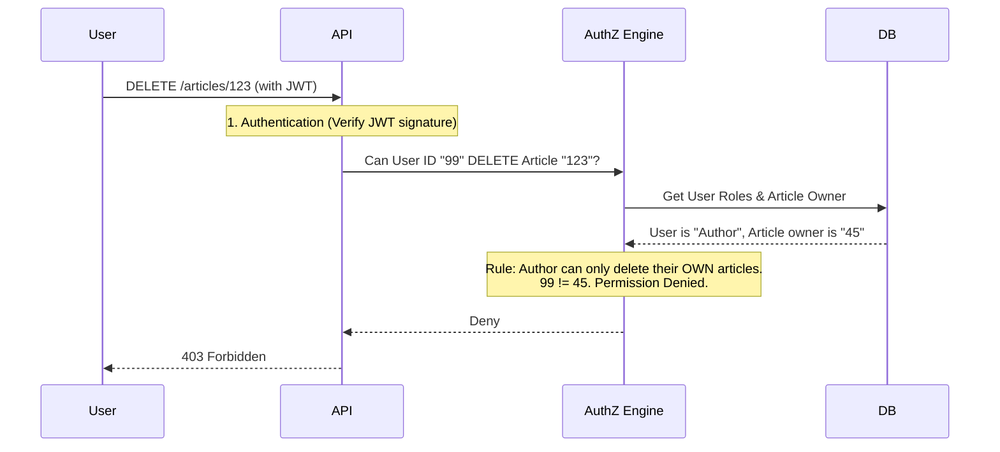

# Authorization

## Introduction
Authorization (often abbreviated as AuthZ) is the process of determining whether an authenticated user has the necessary permissions to access a specific resource or perform a specific action. It answers the question: **"Are you allowed to do this?"**

## Problem Statement
Just because a user is logged into an application (Authenticated) doesn't mean they should be able to do everything. A regular user should not be able to delete another user's account, view the company's financial dashboard, or drop the database. You need a system to enforce rules around who can access what.

## Why this exists
To enforce access controls, ensuring data privacy and system integrity by restricting actions based on a user's role, attributes, or ownership.

## Real-world analogy
Imagine flying on an airplane. 
Showing your passport at the security gate to prove your identity is **Authentication**. 
When you board the plane, the flight attendant looks at your boarding pass. The boarding pass dictates your privileges: Are you in First Class or Economy? Can you enter the cockpit? (No). Checking the boarding pass to see where you are allowed to go is **Authorization**.

## Definition
The process of granting or denying access rights to a user, program, or process.

## Key concepts

### 1. Role-Based Access Control (RBAC)
The most common model. Permissions are assigned to **Roles** (e.g., `Admin`, `Editor`, `Viewer`), and users are assigned to those roles. 
- Example: An `Editor` can publish articles. Alice is an `Editor`. Therefore, Alice can publish articles.

### 2. Attribute-Based Access Control (ABAC)
More granular. Access is granted based on attributes of the user, the resource, and the environment.
- Example: A user can edit a document IF (User.Department == "Finance" AND Document.Sensitivity == "High" AND CurrentTime < 5:00 PM).

### 3. Access Control Lists (ACL)
A list attached directly to a resource specifying which users have access.
- Example: `File_A` has an ACL: [Alice: Read/Write, Bob: Read-Only].

## Internal working / Mermaid diagram

## Step-by-step explanation (RBAC implementation)
1. A user makes an API request (e.g., `POST /delete-user/5`).
2. The application verifies the user's identity (AuthN) usually via a session token or JWT.
3. The application extracts the user's roles from the token or queries the database.
4. The application checks its authorization policy: "Does the `DELETE /user` endpoint require the `Admin` role?"
5. If the user has the `Admin` role, the request proceeds to the database logic.
6. If the user does not have the role, the application immediately returns an HTTP `403 Forbidden` response.

## Multiple real-world examples
1. **GitHub Repositories:** You can be authenticated to GitHub, but you only have `Write` authorization on repositories you own or have been invited to as a collaborator.
2. **AWS IAM:** Extremely granular ABAC/RBAC policies defining exactly which users or EC2 instances can access specific S3 buckets or DynamoDB tables.
3. **Forum Software:** `Guests` can read posts. `Members` can create posts. `Moderators` can delete posts. `Admins` can ban users.

## Pros
- **Security:** Limits the blast radius if an account is compromised. An attacker who steals a standard user's password still cannot access admin functions.
- **Compliance:** Ensures data is only visible to personnel with a "need to know" basis.

## Cons
- **Complexity:** Designing a robust ABAC system or managing thousands of specific permissions across hundreds of roles is difficult and prone to configuration errors.
- **Performance:** Checking permissions on every single database query (e.g., row-level security) can slow down the application.

## Interview questions

### Beginner
- **Q: What HTTP status code should you return if a user is not authorized?**
  - **A:** `403 Forbidden`. (Note: `401 Unauthorized` is technically used when the user is not *authenticated*).

### Intermediate
- **Q: What is the difference between RBAC and ABAC?**
  - **A:** RBAC (Role-Based) grants access based on static roles (Admin, User). It is simpler but less flexible. ABAC (Attribute-Based) evaluates rules dynamically based on user attributes, resource attributes, and context (like time of day or IP address). It is highly granular but complex to implement.

### Senior
- **Q: What is "Insecure Direct Object Reference" (IDOR), and how do you prevent it?**
  - **A:** IDOR happens when a user requests a resource by ID (e.g., `GET /invoice/88`), and the server retrieves it without checking if the user actually owns invoice 88. To prevent it, the authorization check must verify both the user's role AND their relationship to the specific resource being requested (Resource-level authorization).

## Common mistakes
- **Trusting the UI:** Hiding the "Delete" button in the frontend HTML if the user isn't an admin, but forgetting to actually check the permission on the backend API. An attacker can just send the HTTP request manually.
- **Missing Resource-Level checks:** Verifying the user has the "Edit Document" role, but failing to check if the specific document they are trying to edit belongs to them.

## Best practices
- **Principle of Least Privilege:** Users should be granted only the absolute minimum permissions needed to do their job.
- **Centralize AuthZ logic:** Don't scatter `if (user.role == 'admin')` checks randomly throughout your code. Use middleware, decorators, or a dedicated policy engine (like Open Policy Agent - OPA).
- **Deny by Default:** If a permission isn't explicitly granted, access must be denied.

## When NOT to use
- All modern applications require authorization, though the complexity (RBAC vs ABAC) should match the application's needs.

## Comparison with similar concepts
- **Authentication (AuthN) vs Authorization (AuthZ):** Authentication = "Who are you?". Authorization = "What can you do?".

## Summary
Authorization is the critical mechanism that restricts user capabilities within an application. Whether using simple Roles (RBAC) or complex Attributes (ABAC), authorization logic must be rigorously applied on the backend to prevent unauthorized access and data breaches.

## Related topics
- [Authentication](../authentication)
- [API Security](../api-security)
- [JWT](../jwt)
