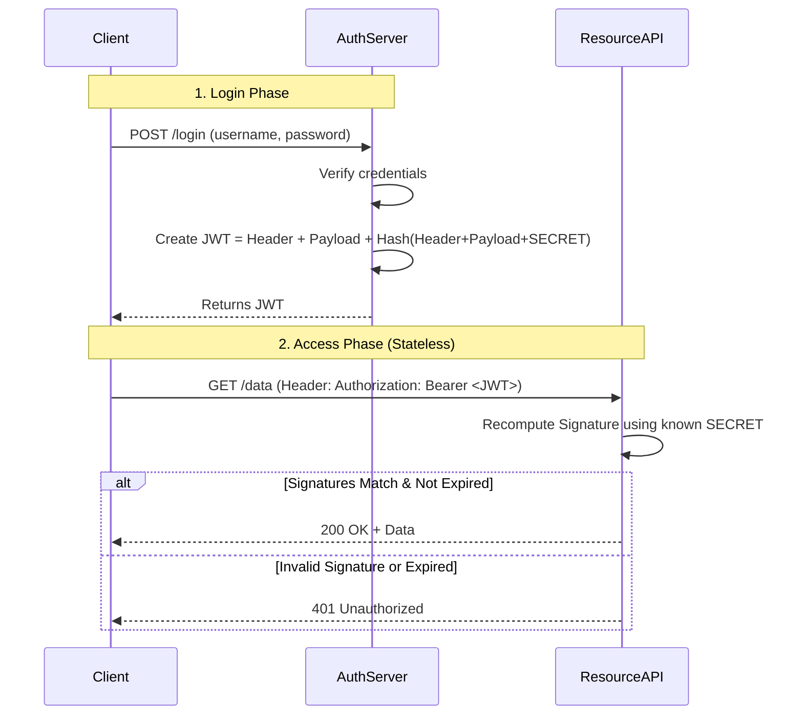

# JWT (JSON Web Token)

## Introduction
JSON Web Token (JWT) is an open standard (RFC 7519) that defines a compact and self-contained way for securely transmitting information between parties as a JSON object. This information can be verified and trusted because it is digitally signed.

## Problem Statement
In traditional web applications, authentication is stateful. The server stores a Session ID in memory or a database and sends a cookie to the user. Every time the user makes a request, the server must look up the Session ID in the database to verify the user. In a microservices architecture with hundreds of servers, maintaining and sharing this centralized session state is a massive bottleneck.

## Why this exists
To enable **stateless** authentication. Because a JWT contains all the necessary user information and a cryptographic signature, any server can independently verify the user's identity mathematically, without needing to query a central database.

## Real-world analogy
Think of a traditional Session ID as a valet parking ticket with a number on it. To know whose car it is, the valet must look at a ledger book (the Database).
A JWT is like a government-issued Driver's License. It contains your name, age, and photo directly on it (the payload), and it has a holographic seal from the state (the signature). A bouncer can look at the license, verify the holographic seal is real, and know exactly who you are without having to call the DMV.

## Definition
A compact, URL-safe means of representing claims to be transferred between two parties, cryptographically signed to ensure integrity.

## Key concepts
A JWT consists of three parts separated by dots (`.`): `Header.Payload.Signature`

1. **Header:** Contains the token type (JWT) and the signing algorithm used (e.g., HMAC SHA256 or RSA).
2. **Payload (Claims):** Contains the actual data. Claims are statements about an entity (typically, the user) and additional data. Common claims include `sub` (subject/user ID), `exp` (expiration time), and `iat` (issued at).
3. **Signature:** Created by taking the encoded header, encoded payload, and a secret key known only to the server, and running them through the algorithm specified in the header.

## Internal working / Mermaid diagram



## Python/Java implementation

### Python Implementation (using PyJWT)
```python
import jwt
import datetime

SECRET_KEY = "my_super_secret_key"

# 1. Generate JWT on Login
def generate_token(user_id):
    payload = {
        'sub': user_id,
        'role': 'admin',
        'exp': datetime.datetime.utcnow() + datetime.timedelta(hours=1) # Expires in 1 hr
    }
    # Encode creates the Base64 header/payload and appends the signature
    token = jwt.encode(payload, SECRET_KEY, algorithm='HS256')
    return token

# 2. Verify JWT on API Request
def verify_token(token):
    try:
        # Decode automatically checks the signature and the 'exp' expiration time
        decoded_payload = jwt.decode(token, SECRET_KEY, algorithms=['HS256'])
        print(f"Valid token for User: {decoded_payload['sub']}, Role: {decoded_payload['role']}")
        return decoded_payload
    except jwt.ExpiredSignatureError:
        print("Token has expired.")
    except jwt.InvalidTokenError:
        print("Invalid token signature. Tampering detected!")

# Example execution
my_token = generate_token(123)
verify_token(my_token)
```

## Step-by-step explanation
1. The user authenticates with a username and password.
2. The authentication server creates a JSON object with the user's ID, roles, and an expiration time.
3. The server signs this JSON using a secret key (Symmetric) or a Private Key (Asymmetric RSA).
4. The server base64-encodes the parts and sends the string to the client.
5. The client stores the JWT (usually in memory or an `HttpOnly` cookie).
6. On subsequent requests, the client attaches the JWT in the HTTP headers (`Authorization: Bearer <token>`).
7. The receiving microservice takes the header and payload, and signs it using its copy of the secret (or public key). If its generated signature matches the signature attached to the token, the token is mathematically proven to be valid and untampered.

## Multiple real-world examples
1. **Microservices Authentication:** An API Gateway issues a JWT, and backend microservices verify it independently without talking to the database.
2. **OAuth2 / OIDC:** OpenID Connect uses JWTs (called ID Tokens) to share user profile information securely between identity providers (like Google) and third-party apps.
3. **Password Reset Links:** Generating a short-lived JWT containing the user's ID, putting it in a URL, and emailing it to the user. When they click the link, the server verifies the token.

## Pros
- **Stateless:** No need to store sessions in a database. Massive performance boost for distributed systems.
- **Compact:** Fits easily into HTTP headers or URLs.
- **Decoupled:** The server that issues the token (Auth Server) can be completely separate from the server that verifies it (Resource Server).

## Cons
- **Payload is readable:** Base64 is NOT encryption. Anyone who intercepts the token can decode it and read the payload. (Do not put passwords or PII in a JWT).
- **Revocation is hard:** Because JWTs are stateless, you cannot simply "delete" them from a server database to log a user out. The token remains valid until it mathematically expires.

## Interview questions

### Beginner
- **Q: Are JWTs encrypted? Can I put sensitive data in them?**
  - **A:** No. JWTs are encoded (Base64) and signed, but they are generally NOT encrypted. Anyone who has the token can decode the payload. Never put passwords or sensitive PII in the payload.

### Intermediate
- **Q: How do you handle user logout or forced session termination with JWTs?**
  - **A:** This is the biggest flaw of stateless JWTs. Solutions include:
    1. Keep JWT lifespans very short (e.g., 15 minutes) and use a stateful Refresh Token.
    2. Maintain a "Blacklist" or "Deny List" of revoked JWT signatures in a fast cache like Redis (which somewhat defeats the purpose of being fully stateless).

### Senior
- **Q: Explain the difference between symmetric and asymmetric signing algorithms for JWTs (HS256 vs RS256).**
  - **A:** 
    - **HS256 (Symmetric):** Uses a single shared secret key. Every microservice that needs to verify the token must have a copy of this secret. If one service is compromised, the attacker can generate valid forged tokens.
    - **RS256 (Asymmetric):** Uses a Private Key to sign the token (kept only on the Auth Server), and a Public Key to verify the token (distributed to all microservices). Microservices can verify tokens, but cannot forge them. Much safer for large distributed architectures.

## Common mistakes
- **Ignoring the algorithm header (`alg: none`):** In the past, some JWT libraries blindly trusted the `alg` field in the header. Attackers changed the header to `none`, stripped the signature, and bypassed authentication. Always hardcode the expected algorithm in your verify function.
- **Infinite expiration:** Issuing JWTs that never expire. If stolen, the attacker has permanent access.

## Best practices
- Keep JWT lifetimes very short (10-15 minutes).
- Use **Refresh Tokens** (which are stateful and stored in the DB) to get new JWTs when they expire.
- Store JWTs in the browser using `HttpOnly`, `Secure` cookies to prevent XSS (Cross-Site Scripting) attacks from stealing them via JavaScript.

## When NOT to use
- For simple, monolithic applications where traditional stateful sessions (cookies) are easier to manage and provide native logout/revocation capabilities without complex engineering.

## Comparison with similar concepts
- **JWT vs Session Cookies:** JWTs are stateless and the payload is stored on the client. Sessions are stateful and the data is stored on the server.

## Summary
JWTs solved the scaling problem of maintaining session state in distributed microservice architectures. While they offer incredible performance and decoupling benefits, they introduce significant complexity regarding token revocation and security lifecycle management.

## Related topics
- [Authentication](../authentication)
- [OAuth](../oauth)
- [API Gateway](../../microservices/api-gateway)
