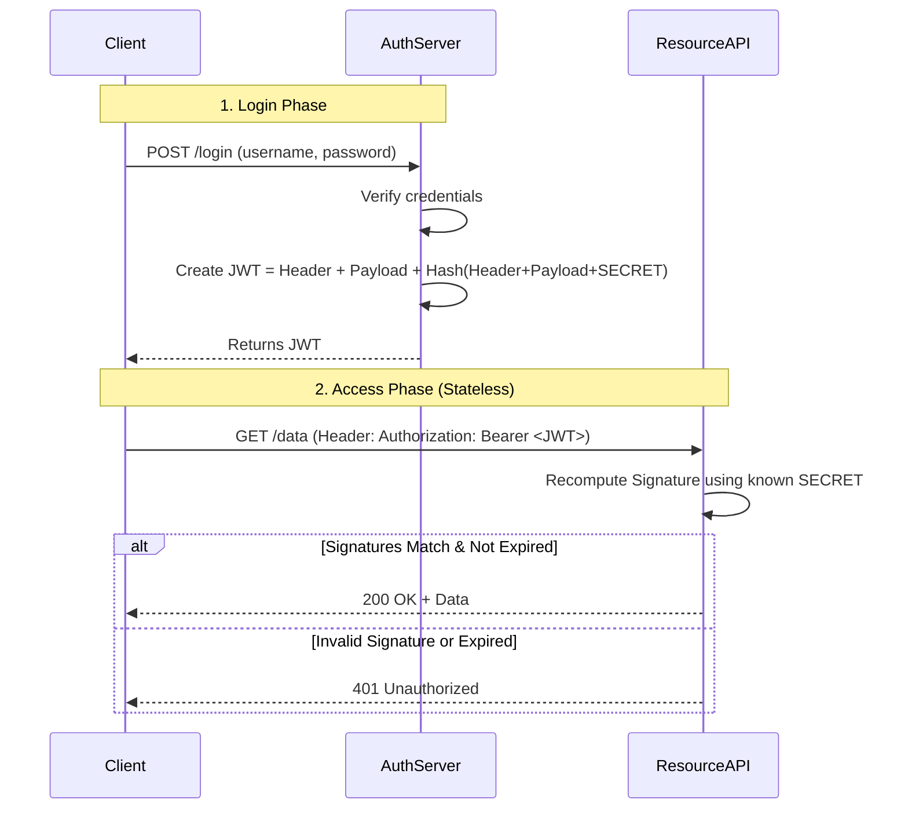

# JWT (JSON Web Token)

## Introduction
JSON Web Token (JWT) is an open standard (RFC 7519) that defines a compact and self-contained way for securely transmitting information between parties as a JSON object. This information can be verified and trusted because it is digitally signed.

## Problem Statement
In traditional web applications, authentication is stateful. The server stores a Session ID in memory or a database and sends a cookie to the user. Every time the user makes a request, the server must look up the Session ID in the database to verify the user. In a microservices architecture with hundreds of servers, maintaining and sharing this centralized session state is a massive bottleneck.

## Why this exists
To enable **stateless** authentication. Because a JWT contains all the necessary user information and a cryptographic signature, any server can independently verify the user's identity mathematically, without needing to query a central database.

## Real-world analogy
Think of a traditional Session ID as a valet parking ticket with a number on it. To know whose car it is, the valet must look at a ledger book (the Database).
A JWT is like a government-issued Driver's License. It contains your name, age, and photo directly on it (the payload), and it has a holographic seal from the state (the signature). A bouncer can look at the license, verify the holographic seal is real, and know exactly who you are without having to call the DMV.

## Definition
A compact, URL-safe means of representing claims to be transferred between two parties, cryptographically signed to ensure integrity.

## Key concepts
A JWT consists of three parts separated by dots (`.`): `Header.Payload.Signature`

1. **Header:** Contains the token type (JWT) and the signing algorithm used (e.g., HMAC SHA256 or RSA).
2. **Payload (Claims):** Contains the actual data. Claims are statements about an entity (typically, the user) and additional data. Common claims include `sub` (subject/user ID), `exp` (expiration time), and `iat` (issued at).
3. **Signature:** Created by taking the encoded header, encoded payload, and a secret key known only to the server, and running them through the algorithm specified in the header.

## Internal working / Mermaid diagram



## Python/Java implementation

Below are implementations showing how to generate and verify JWTs.

### Python Implementation (using PyJWT)
```python
import jwt
import datetime

SECRET_KEY = "my_super_secret_key"

# 1. Generate JWT on Login
def generate_token(user_id):
    payload = {
        'sub': user_id,
        'role': 'admin',
        'exp': datetime.datetime.utcnow() + datetime.timedelta(hours=1) # Expires in 1 hr
    }
    # Encode creates the Base64 header/payload and appends the signature
    token = jwt.encode(payload, SECRET_KEY, algorithm='HS256')
    return token

# 2. Verify JWT on API Request
def verify_token(token):
    try:
        # Decode automatically checks the signature and the 'exp' expiration time
        decoded_payload = jwt.decode(token, SECRET_KEY, algorithms=['HS256'])
        print(f"Valid token for User: {decoded_payload['sub']}, Role: {decoded_payload['role']}")
        return decoded_payload
    except jwt.ExpiredSignatureError:
        print("Token has expired.")
    except jwt.InvalidTokenError:
        print("Invalid token signature. Tampering detected!")
```

### Java Implementation

#### Bad implementation
*Trusting the token's header algorithm blindly (which enables the `alg: none` exploit) or skipping signature validation.*

```java
import java.util.Base64;

// BAD: Parsing and relying on payload without verifying signature, or accepting "alg: none"
public class VulnerableJwtParser {
    public String parseSubject(String token) {
        String[] parts = token.split("\\.");
        if (parts.length < 2) {
            throw new IllegalArgumentException("Invalid JWT format");
        }

        // Trusting header without validating signature
        String headerJson = new String(Base64.getUrlDecoder().decode(parts[0]));
        if (headerJson.contains("\"alg\":\"none\"") || headerJson.contains("\"alg\":\"NONE\"")) {
            System.out.println("No signature validation requested. Skipping...");
            String payloadJson = new String(Base64.getUrlDecoder().decode(parts[1]));
            return extractSub(payloadJson);
        }
        
        // Even if there is a signature, this method completely ignores it!
        String payloadJson = new String(Base64.getUrlDecoder().decode(parts[1]));
        return extractSub(payloadJson);
    }

    private String extractSub(String payloadJson) {
        // Simple mock regex-based extraction of "sub" claim
        return payloadJson.replaceAll(".*\"sub\":\"([^\"]+)\".*", "$1");
    }
}
```

#### Better implementation
*Using symmetric HMAC256 validation with a strictly enforced algorithm and strong, secure secret.*

```java
import javax.crypto.Mac;
import javax.crypto.spec.SecretKeySpec;
import java.nio.charset.StandardCharsets;
import java.util.Base64;

// BETTER: Enforcing Symmetric HMAC-SHA256 signature checks strictly.
public class SymmetricJwtService {
    private final String secretKey;

    public SymmetricJwtService(String secretKey) {
        if (secretKey.length() < 32) {
            throw new IllegalArgumentException("Secret key must be at least 256 bits (32 chars)");
        }
        this.secretKey = secretKey;
    }

    public boolean verifyToken(String token) {
        String[] parts = token.split("\\.");
        if (parts.length != 3) {
            return false;
        }

        String header = parts[0];
        String payload = parts[1];
        String signature = parts[2];

        try {
            // Verify algorithm in header is indeed HS256
            String headerJson = new String(Base64.getUrlDecoder().decode(header), StandardCharsets.UTF_8);
            if (!headerJson.contains("\"alg\":\"HS256\"")) {
                return false;
            }

            // Recompute signature
            Mac hmac = Mac.getInstance("HmacSHA256");
            SecretKeySpec secretKeySpec = new SecretKeySpec(
                secretKey.getBytes(StandardCharsets.UTF_8), "HmacSHA256"
            );
            hmac.init(secretKeySpec);
            
            String dataToSign = header + "." + payload;
            byte[] rawSig = hmac.doFinal(dataToSign.getBytes(StandardCharsets.UTF_8));
            String recomputedSignature = Base64.getUrlEncoder().withoutPadding().encodeToString(rawSig);

            // Time-constant comparison to prevent timing attacks
            return MessageDigest.isEqual(
                signature.getBytes(StandardCharsets.UTF_8), 
                recomputedSignature.getBytes(StandardCharsets.UTF_8)
            );
        } catch (Exception e) {
            return false;
        }
    }
}
```

#### Best implementation
*Using asymmetric RS256 (Public/Private key pair) signatures so that only the Auth Server can sign tokens, but any microservice can verify them with the Public Key.*

```java
import java.security.KeyPair;
import java.security.KeyPairGenerator;
import java.security.PrivateKey;
import java.security.PublicKey;
import java.security.Signature;
import java.util.Base64;

// BEST: Asymmetric RSA Cryptographic Verification
public class AsymmetricJwtService {
    private final PrivateKey privateKey;
    private final PublicKey publicKey;

    public AsymmetricJwtService() throws Exception {
        // In production, load public/private keys from secure vaults or JWKS endpoints
        KeyPairGenerator kpg = KeyPairGenerator.getInstance("RSA");
        kpg.initialize(2048);
        KeyPair kp = kpg.generateKeyPair();
        this.privateKey = kp.getPrivate();
        this.publicKey = kp.getPublic();
    }

    public String generateToken(String sub, long expTimestamp) throws Exception {
        String header = "{\"alg\":\"RS256\",\"typ\":\"JWT\"}";
        String payload = String.format("{\"sub\":\"%s\",\"exp\":%d}", sub, expTimestamp);

        String encodedHeader = Base64.getUrlEncoder().withoutPadding().encodeToString(header.getBytes());
        String encodedPayload = Base64.getUrlEncoder().withoutPadding().encodeToString(payload.getBytes());
        String dataToSign = encodedHeader + "." + encodedPayload;

        Signature privateSignature = Signature.getInstance("SHA256withRSA");
        privateSignature.initSign(privateKey);
        privateSignature.update(dataToSign.getBytes());
        byte[] signatureBytes = privateSignature.sign();
        
        String encodedSignature = Base64.getUrlEncoder().withoutPadding().encodeToString(signatureBytes);
        return dataToSign + "." + encodedSignature;
    }

    public boolean verifyToken(String token) {
        String[] parts = token.split("\\.");
        if (parts.length != 3) {
            return false;
        }

        String dataToSign = parts[0] + "." + parts[1];
        byte[] signatureBytes = Base64.getUrlDecoder().decode(parts[2]);

        try {
            Signature publicSignature = Signature.getInstance("SHA256withRSA");
            publicSignature.initVerify(publicKey);
            publicSignature.update(dataToSign.getBytes());
            return publicSignature.verify(signatureBytes);
        } catch (Exception e) {
            return false;
        }
    }
}
```

## Step-by-step explanation
1. The user authenticates with a username and password.
2. The authentication server creates a JSON object with the user's ID, roles, and an expiration time.
3. The server signs this JSON using a secret key (Symmetric) or a Private Key (Asymmetric RSA).
4. The server base64-encodes the parts and sends the string to the client.
5. The client stores the JWT (usually in memory or an `HttpOnly` cookie).
6. On subsequent requests, the client attaches the JWT in the HTTP headers (`Authorization: Bearer <token>`).
7. The receiving microservice takes the header and payload, and signs it using its copy of the secret (or public key). If its generated signature matches the signature attached to the token, the token is mathematically proven to be valid and untampered.

## Multiple real-world examples
1. **Microservices Authentication:** An API Gateway issues a JWT, and backend microservices verify it independently without talking to the database.
2. **OAuth2 / OIDC:** OpenID Connect uses JWTs (called ID Tokens) to share user profile information securely between identity providers (like Google) and third-party apps.
3. **Password Reset Links:** Generating a short-lived JWT containing the user's ID, putting it in a URL, and emailing it to the user. When they click the link, the server verifies the token.
4. **IoT Device Verification:** Microcontrollers presenting signed JWTs to an MQTT Broker or Web API to verify identity and capability scopes.
5. **CDN Routing & Access:** Signed JWT tokens attached to media URLs to authorize CDN edge nodes to serve video segments for paid subscribers.

## Pros
- **Stateless:** No need to store sessions in a database. Massive performance boost for distributed systems.
- **Compact:** Fits easily into HTTP headers or URLs.
- **Decoupled:** The server that issues the token (Auth Server) can be completely separate from the server that verifies it (Resource Server).

## Cons
- **Payload is readable:** Base64 is NOT encryption. Anyone who intercepts the token can decode it and read the payload. (Do not put passwords or PII in a JWT).
- **Revocation is hard:** Because JWTs are stateless, you cannot simply "delete" them from a server database to log a user out. The token remains valid until it mathematically expires.
- **Size overhead:** Large payloads in JWTs increase request sizes significantly on every HTTP hop.

## Interview questions

### Beginner
- **Q: Are JWTs encrypted? Can I put sensitive data in them?**
  - **A:** No. JWTs are encoded (Base64) and signed, but they are generally NOT encrypted. Anyone who has the token can decode the payload. Never put passwords or sensitive PII in the payload.
- **Q: What are the three parts of a JWT?**
  - **A:** Header (tells the algorithm), Payload (the data/claims), and Signature (verifies integrity).

### Intermediate
- **Q: How do you handle user logout or forced session termination with JWTs?**
  - **A:** This is the biggest flaw of stateless JWTs. Solutions include:
    1. Keep JWT lifespans very short (e.g., 15 minutes) and use a stateful Refresh Token.
    2. Maintain a "Blacklist" or "Deny List" of revoked JWT signatures in a fast cache like Redis (which somewhat defeats the purpose of being fully stateless).
- **Q: What is the `alg: none` exploit in JWT?**
  - **A:** A vulnerability in early JWT libraries that accepted tokens specifying `none` as their signing algorithm in the header. Attackers could forge any payload they wanted, set the algorithm to `none`, leave the signature blank, and access the system. The fix is to configure the validator to only accept secure algorithms (e.g., HS256, RS256) and reject `none`.

### Senior
- **Q: Explain the difference between symmetric and asymmetric signing algorithms for JWTs (HS256 vs RS256).**
  - **A:** 
    - **HS256 (Symmetric):** Uses a single shared secret key. Every microservice that needs to verify the token must have a copy of this secret. If one service is compromised, the attacker can generate valid forged tokens.
    - **RS256 (Asymmetric):** Uses a Private Key to sign the token (kept only on the Auth Server), and a Public Key to verify the token (distributed to all microservices). Microservices can verify tokens, but cannot forge them. Much safer for large distributed architectures.
- **Q: What is a JWKS (JSON Web Key Set) and how does it support key rotation?**
  - **A:** A JWKS is an endpoint hosted by the Authorization Server that exposes public keys in JSON format. When verify servers receive a token signed with RS256, they look up the key ID (`kid`) from the JWT header, retrieve the corresponding public key from the JWKS endpoint, and verify the signature. Key rotation is done by publishing a new key pair on the Auth Server, publishing the new public key on JWKS, and gradually phasing out the old private key.

### Staff Engineer
- **Q: If a stateless JWT is compromised, how would you design a remediation pipeline that minimizes database hits while keeping verification latencies sub-millisecond at the API gateway?**
  - **A:** 
    1. **Short-lived tokens:** Enforce a short expiration TTL (e.g., 5-10 minutes) for access tokens.
    2. **Event-driven Blacklisting:** When a compromise is detected or user logs out, broadcast a "Revocation Event" via Kafka/RabbitMQ containing the token identifier (`jti`) and the user ID.
    3. **Edge Cache Sync:** A daemon on the API Gateway consumes this event and updates a highly efficient in-memory bloom filter or a local Key-Value cache (e.g., Envoy's admin cache or Redis cluster) at the gateway layer.
    4. **Local Verification:** Gateway validates signature first using cached public keys. If signature is valid, it does a sub-millisecond check against its local Revocation Cache. If blocked, it rejects the request instantly.

## Common mistakes
- **Ignoring the algorithm header (`alg: none`):** In the past, some JWT libraries blindly trusted the `alg` field in the header. Attackers changed the header to `none`, stripped the signature, and bypassed authentication. Always hardcode the expected algorithm in your verify function.
- **Infinite expiration:** Issuing JWTs that never expire. If stolen, the attacker has permanent access.
- **Using weak secret keys:** Using short strings for HS256, which can be brute-forced easily offline.

## Best practices
- Keep JWT lifetimes very short (10-15 minutes).
- Use **Refresh Tokens** (which are stateful and stored in the DB) to get new JWTs when they expire.
- Store JWTs in the browser using `HttpOnly`, `Secure` cookies to prevent XSS (Cross-Site Scripting) attacks from stealing them via JavaScript.

## When NOT to use
- For simple, monolithic applications where traditional stateful sessions (cookies) are easier to manage and provide native logout/revocation capabilities without complex engineering.

## Comparison with similar concepts
- **JWT vs Session Cookies:** JWTs are stateless and the payload is stored on the client. Sessions are stateful and the data is stored on the server.
- **JWT vs JWS vs JWE:** JWT is the general container. JWS (JSON Web Signature) secures the content with a signature (what most people mean when they say JWT). JWE (JSON Web Encryption) encrypts the payload, ensuring the data is confidential.

## Summary
JWTs solved the scaling problem of maintaining session state in distributed microservice architectures. While they offer incredible performance and decoupling benefits, they introduce significant complexity regarding token revocation and security lifecycle management.

## Related topics
- [Authentication](../authentication)
- [OAuth](../oauth)
- [API Gateway](../../microservices/api-gateway)
