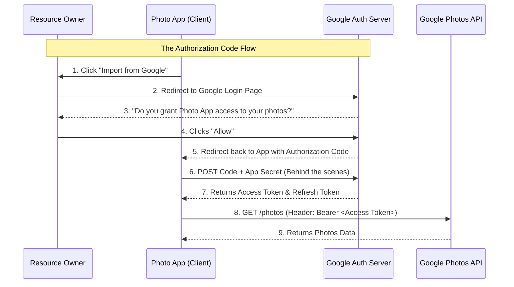

# OAuth 2.0

## Introduction
OAuth 2.0 is the industry-standard authorization protocol. It allows an application to access resources hosted by other web apps on behalf of a user, without the user ever having to share their credentials (username and password) with the application.

## Problem Statement
Imagine you download a new photo printing app. The app asks: "Please enter your Google username and password so we can access your Google Photos." If you give them your password, the app can access your photos, but it could also read your emails, delete your Drive files, and lock you out. You need a way to give the app restricted access to *just* your photos, without giving them your master key.

## Why this exists
To enable delegated access. It allows users to grant third-party applications limited access to their resources on a server, without exposing their credentials.

## Real-world analogy
A Valet Key for a car.
When you give your car to a valet, you don't give them your master key (which opens the trunk, unlocks the glovebox, and disables the alarm). You give them a valet key that only allows them to start the ignition and drive short distances. OAuth is the digital equivalent of a valet key.

## Definition
An authorization framework that enables applications to obtain limited access to user accounts on an HTTP service.

## Key concepts
- **Resource Owner:** The user who owns the data (You).
- **Client:** The application requesting access to the data (The Photo Printing App).
- **Resource Server:** The API hosting the data (Google Photos API).
- **Authorization Server:** The server that authenticates the user and issues access tokens (Google Login).
- **Access Token:** The "valet key". A short-lived token (often a JWT) that the Client uses to access the Resource Server.
- **Scopes:** The specific permissions granted by the token (e.g., `read:photos`).

## Internal working / Mermaid diagram

## Step-by-step explanation (Authorization Code Flow)
1. **Authorization Request:** The Client redirects the user's browser to the Authorization Server, specifying the required `scopes` (permissions).
2. **Consent:** The user logs in to the Authorization Server and clicks "Allow" to grant the requested scopes.
3. **Authorization Code:** The Authorization Server redirects the user's browser back to the Client with a temporary Authorization Code in the URL.
4. **Token Exchange:** The Client's backend server sends the Authorization Code, along with its own Client ID and Secret, directly to the Authorization Server.
5. **Access Token Issue:** The Authorization Server verifies the code and secret, and returns an Access Token (and usually a Refresh Token).
6. **Resource Request:** The Client uses the Access Token to make API calls to the Resource Server.

## Multiple real-world examples
1. **Social Login (OIDC):** "Log in with Google" or "Log in with Apple". (Note: OAuth is for authorization, but OpenID Connect builds on top of OAuth to provide identity/authentication).
2. **CI/CD Integrations:** A CI/CD tool requesting access to your private GitHub repositories to run automated tests.
3. **Smart Home:** Giving Alexa permission to turn on your Philips Hue lights.

## Pros
- **Security:** The third-party app never sees your password.
- **Granular Control:** You can limit exactly what the app can do via Scopes.
- **Revocability:** You can go into your Google/GitHub settings and revoke the app's token at any time without changing your password.

## Cons
- **Highly Complex:** Implementing an OAuth Authorization Server from scratch is notoriously difficult and prone to severe security flaws. (Always use managed solutions like Okta, Auth0, or Keycloak).
- **Phishing Risks:** Malicious apps can create consent screens that look legitimate to trick users into granting access to their data.

## Interview questions

### Beginner
- **Q: Is OAuth an Authentication protocol or an Authorization protocol?**
  - **A:** It is an **Authorization** protocol. It was designed to grant access to APIs (delegated authorization). However, an extension called OpenID Connect (OIDC) was built on top of OAuth to handle Authentication.

### Intermediate
- **Q: Why do we use an Authorization Code first, instead of the Auth Server just sending the Access Token directly to the browser?**
  - **A:** Security. If the Access Token is sent in the URL redirect to the browser (Implicit Flow), it is exposed in browser history, logs, and easily stolen. By sending a temporary Code, the Client's *backend server* exchanges it for the Token through a secure, hidden back-channel communication, keeping the Token out of the browser.

### Senior
- **Q: What is PKCE (Proof Key for Code Exchange) and why is it used?**
  - **A:** Originally, Mobile Apps and Single Page Applications (SPAs) couldn't safely store a "Client Secret" to perform the backend token exchange. PKCE replaces the static Client Secret with a dynamically generated cryptographic hash on every single request. It is now the recommended standard for ALL OAuth flows, preventing authorization code interception attacks.

## Common mistakes
- **Using the Implicit Flow:** The Implicit Flow (returning the token directly in the URL hash) is now considered insecure and deprecated for modern applications. Always use the Authorization Code Flow with PKCE.
- **Treating OAuth as Authentication:** Trying to parse an OAuth Access Token to "log a user in" is fundamentally flawed. Use OpenID Connect (which issues an ID Token) for authentication.

## Best practices
- Always use TLS (HTTPS) for all OAuth communications.
- Keep the lifespan of Access Tokens short (e.g., 1 hour) and rely on Refresh Tokens for continuous access.
- Validate `redirect_uri` strictly on the Auth Server to prevent Open Redirect vulnerabilities.

## When NOT to use
- If a user is just accessing their own data within your own first-party monolithic application, standard session cookies or simple JWTs are entirely sufficient. OAuth is meant for third-party integrations.

## Comparison with similar concepts
- **OAuth vs JWT:** OAuth is the framework/protocol for *getting* a token. JWT is the format/structure of the token itself. OAuth often uses JWTs as its Access Tokens.
- **OAuth vs SAML:** Both are used for SSO. SAML is an older, XML-based protocol mostly used in enterprise/corporate environments. OAuth/OIDC is JSON-based and dominates modern web and mobile apps.

## Summary
OAuth 2.0 is the backbone of modern API security and delegated access. By separating the roles of the client, the resource server, and the authorization server, it allows ecosystems of applications to safely interact without compromising user credentials.

## Related topics
- [Authorization](../authorization)
- [JWT](../jwt)
- [Authentication](../authentication)
