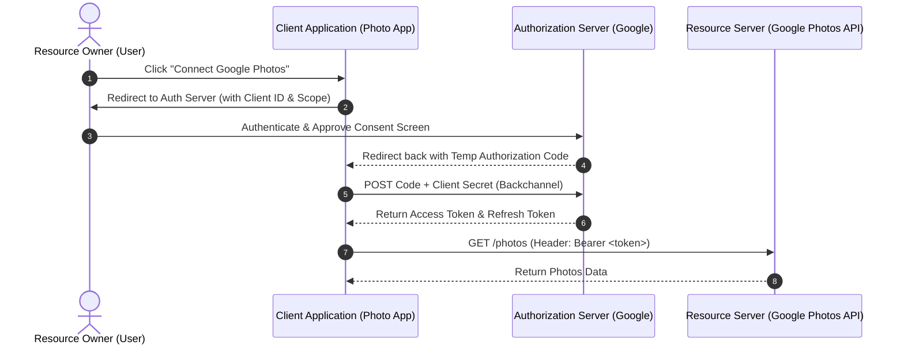

# OAuth 2.0

## Introduction
OAuth 2.0 is the industry-standard authorization framework. It allows a third-party application to obtain limited access to an HTTP service on behalf of a user, without the user ever having to share their master credentials (username and password) with the application.

## Problem Statement
Imagine you download a photo printing web application. To print your digital photos, the application asks: *"Please enter your Google username and password so we can log into your Google Photos account."* 
If you give them your credentials:
1. The app can read your private emails, delete files in Google Drive, and change your password.
2. The app must store your password in plaintext or reversible format, making them a high-value target for hackers.
3. You cannot revoke access to *only* the photo printing app without changing your Google password and breaking all other integrations.

## Why this exists
To enable secure, delegated access. It allows users to issue a restricted "valet key" (access token) to third-party applications, defining exactly which resources they can access (scopes) and for how long.

## Real-world analogy
**The Valet Key:**
When you park your car at a restaurant, you don't hand the valet your master key (which unlocks the glovebox, trunk, and home garage door opener). Instead, you hand them a valet key. The valet key only allows the car to be started and driven a short distance. OAuth 2.0 is the digital equivalent of a valet key.

## Definition
An open standard authorization protocol that delegates user authentication to the service hosting the user account and authorizes third-party applications to access the user account.

## Key concepts
- **Resource Owner:** The user who owns the data and grants access to it.
- **Client:** The application requesting access (e.g., the photo printing app).
- **Resource Server:** The server hosting the protected resources (e.g., Google Photos API).
- **Authorization Server:** The server that authenticates the Resource Owner, obtains consent, and issues access tokens (e.g., Google Accounts).
- **Access Token:** A string representing an authorization issued to the client. It is usually a short-lived JSON Web Token (JWT) signed by the Authorization Server.
- **Refresh Token:** A long-lived token used by the client to obtain new access tokens without prompting the user.
- **Scopes:** A mechanism to limit an application's access (e.g., `read:photos` vs `write:photos`).

## Internal working / Mermaid diagram



## Python/Java implementation

Below is a Java simulation demonstrating how authorization flows and code verifications are handled.

### Bad implementation
*Insecurely executing the implicit flow or sharing client secrets on public clients (mobile/frontend), or skipping validation.*

```java
import java.net.URI;

// BAD: Executing Implicit Flow in the browser/client directly.
// The access token is exposed in the redirect URI, browser logs, and history.
public class InsecureClient {
    private static final String CLIENT_ID = "photo_app_123";
    private static final String REDIRECT_URI = "https://myphotoapp.com/callback";

    public URI getImplicitAuthUrl() {
        // Return URL requesting access token directly.
        // Token is returned in the URL fragment (#access_token=...), visible to interceptors.
        return URI.create("https://accounts.google.com/o/oauth2/auth" +
                "?response_type=token" + 
                "&client_id=" + CLIENT_ID +
                "&redirect_uri=" + REDIRECT_URI +
                "&scope=read:photos");
    }
}
```

### Better implementation
*Using the Authorization Code Flow with a secure backend server to execute the code-to-token exchange privately.*

```java
import java.net.URI;
import java.net.http.HttpClient;
import java.net.http.HttpRequest;
import java.net.http.HttpResponse;
import java.util.Map;

// BETTER: Authorization Code Flow (Backend Channel)
// Client Secret is stored safely on the backend server.
public class SecureBackendClient {
    private final String clientId = System.getenv("OAUTH_CLIENT_ID");
    private final String clientSecret = System.getenv("OAUTH_CLIENT_SECRET"); // Kept secret
    private final String redirectUri = "https://api.myphotoapp.com/callback";
    private final HttpClient httpClient = HttpClient.newHttpClient();

    public URI getAuthUrl(String state) {
        return URI.create("https://accounts.google.com/o/oauth2/auth" +
                "?response_type=code" +
                "&client_id=" + clientId +
                "&redirect_uri=" + redirectUri +
                "&scope=read:photos" +
                "&state=" + state); // State prevents CSRF attacks
    }

    public String exchangeCodeForToken(String code) throws Exception {
        String requestBody = String.format(
            "grant_type=authorization_code&code=%s&redirect_uri=%s&client_id=%s&client_secret=%s",
            code, redirectUri, clientId, clientSecret
        );

        HttpRequest request = HttpRequest.newBuilder()
                .uri(URI.create("https://oauth2.googleapis.com/token"))
                .header("Content-Type", "application/x-www-form-urlencoded")
                .POST(HttpRequest.BodyPublishers.ofString(requestBody))
                .build();

        HttpResponse<String> response = httpClient.send(request, HttpResponse.BodyHandlers.ofString());
        return response.body(); // Contains Access Token
    }
}
```

### Best implementation
*Using Authorization Code Flow with PKCE (Proof Key for Code Exchange). Essential for mobile/SPAs, and now recommended for all clients to prevent authorization code interception.*

```java
import java.nio.charset.StandardCharsets;
import java.security.MessageDigest;
import java.security.NoSuchAlgorithmException;
import java.security.SecureRandom;
import java.util.Base64;

// BEST: Authorization Code Flow + PKCE (Proof Key for Code Exchange)
// Prevents Authorization Code interception attacks by binding a dynamic verifier.
public class PkceAuthService {

    // 1. Generate high-entropy code verifier
    public String generateCodeVerifier() {
        SecureRandom sr = new SecureRandom();
        byte[] code = new byte[32];
        sr.nextBytes(code);
        return Base64.getUrlEncoder().withoutPadding().encodeToString(code);
    }

    // 2. Generate code challenge using SHA-256
    public String generateCodeChallenge(String codeVerifier) {
        try {
            byte[] bytes = codeVerifier.getBytes(StandardCharsets.US_ASCII);
            MessageDigest messageDigest = MessageDigest.getInstance("SHA-256");
            byte[] digest = messageDigest.digest(bytes);
            return Base64.getUrlEncoder().withoutPadding().encodeToString(digest);
        } catch (NoSuchAlgorithmException e) {
            throw new RuntimeException("SHA-256 algorithm not available", e);
        }
    }

    // 3. Authorization Server validates code challenge during exchange
    public boolean verifyChallenge(String codeVerifier, String codeChallenge) {
        String calculatedChallenge = generateCodeChallenge(codeVerifier);
        return calculatedChallenge.equals(codeChallenge);
    }
}
```

## Step-by-step explanation
1. **User Initiation:** The user clicks "Connect" in the photo printing client app.
2. **Redirect to Authorization Server:** The client redirects the user to the authorization server with a query containing the client ID, requested scopes, state token, and a code challenge (under PKCE).
3. **User Authentication & Consent:** The authorization server prompts the user to log in and accept or deny permissions.
4. **Redirection with Auth Code:** If approved, the authorization server redirects the user's browser back to the client's redirect URI with a temporary authorization code.
5. **Token Exchange:** The client sends a backend POST request (backchannel) to the authorization server containing the authorization code and the original code verifier.
6. **Token Verification & Return:** The authorization server hashes the code verifier and compares it to the original code challenge. If they match, it issues access and refresh tokens.
7. **Resource Request:** The client calls the resource server with the access token in the `Authorization: Bearer <token>` header.

## Multiple real-world examples
1. **Single Sign-On (SSO) & Social Login:** "Login with Google/GitHub/Facebook" where identity details are delegated via OpenID Connect (OIDC).
2. **Third-Party Integrations:** Slack integrations accessing your Jira tickets using OAuth scopes.
3. **Smart Home Devices:** Giving Amazon Alexa permission to query or control Philips Hue lights.
4. **Developer APIs:** GitHub API access tokens created for CI/CD pipelines (e.g., GitHub Actions).
5. **Fintech Aggregators:** Plaid retrieving read-only transaction history from your bank account securely.

## Pros
- **User Password Protection:** Client apps never see or store the user's password.
- **Granular Access Control:** Scopes restrict clients to minimum privilege.
- **Revocability:** Users can revoke access tokens via centralized dashboards.
- **Short-Lived Access:** Tokens expire quickly, minimizing exposure.

## Cons
- **Implementation Complexity:** Setting up a secure, compliant authorization server requires high cryptographic and security expertise.
- **Phishing Vulnerability:** Attackers can build identical authorization screens to steal authorization codes.
- **Token Storage Overhead:** Access and refresh tokens must be securely stored, avoiding Web Storage (localStorage) for sensitive actions due to XSS vulnerability.

## Interview questions

### Beginner
- **Q: What is the main difference between Authentication and Authorization?**
  - **A:** Authentication is verifying *who* you are (identity). Authorization is verifying *what* you are allowed to do (permissions). OAuth 2.0 is an authorization protocol, while OpenID Connect (OIDC) is an authentication layer on top of it.
- **Q: What is the purpose of the 'state' parameter in OAuth requests?**
  - **A:** It is a unique, random token generated by the client to prevent Cross-Site Request Forgery (CSRF). The authorization server returns it back to the client, which validates that it matches the stored token.

### Intermediate
- **Q: Why does the Authorization Code flow use a code to get a token rather than just sending the token directly?**
  - **A:** Returning the token directly (Implicit Flow) exposes it in the user's browser address bar, browser history, proxy logs, and referrer headers. The code flow returns a short-lived authorization code which can only be exchanged for a token via a secure server-to-server backchannel.
- **Q: What is a Refresh Token, and how does it differ from an Access Token?**
  - **A:** An Access Token is short-lived (e.g., 1 hour) and sent with every API request. A Refresh Token is long-lived, stored securely, and used strictly to request new Access Tokens when the old one expires, eliminating the need to prompt the user.

### Senior
- **Q: Explain how PKCE (Proof Key for Code Exchange) works and why it is recommended over the standard Authorization Code Flow.**
  - **A:** In public clients (mobile apps, SPAs), the client secret cannot be kept secure. An attacker could intercept the redirect URI and steal the authorization code. PKCE eliminates the client secret by dynamically generating a `code_verifier` and its SHA-256 hash (`code_challenge`). The challenge is sent during authorization, and the verifier is sent during token exchange. Only the client who initiated the request can produce the matching verifier.
- **Q: How does OAuth 2.0 handle token revocation?**
  - **A:** RFC 7009 defines a token revocation endpoint. When a client requests revocation, the authorization server invalidates the access/refresh token in its database. If using stateless JWT access tokens, they cannot be instantly revoked without a distributed blacklist or checking against an active blocklist at the gateway level.

### Staff Engineer
- **Q: How would you design a global, low-latency API gateway authorization strategy for stateless JWT tokens that also supports instantaneous token revocation?**
  - **A:** Combine stateless validation with a fast caching layer (like Redis cluster) at the Edge/API Gateway. The Gateway decrypts and verifies the JWT signature locally using cached public keys (JWKS). To support instant revocation:
    1. Keep access token lifetimes extremely short (e.g., 5-15 minutes).
    2. Maintain a Bloom filter or Redis cluster containing blacklisted token IDs (`jti`) or user IDs.
    3. During verification, check if the token's `jti` is in the blacklist. 
    4. To reduce Redis lookups, use a local in-memory cache with short TTLs at the edge proxy, checking Redis only when the local cache misses.

## Common mistakes
- **Hardcoding Client Secrets:** Storing client secrets in mobile apps or SPA frontend code.
- **Implicit Flow usage:** Using the implicit flow instead of Auth Code + PKCE.
- **Weak Redirect URI Validation:** Using wildcard matches or patterns for `redirect_uri` which permits open redirects.

## Best practices
- Always enforce HTTPS for all authorization, token, and resource server communications.
- Validate `redirect_uri` using strict exact-string match.
- Use PKCE (`code_challenge` / `code_verifier`) for all clients, not just public ones.

## When NOT to use
- Do not use if building a simple, first-party monolith where session cookies or basic token authentication are sufficient and no third-party integrations are planned.

## Comparison with similar concepts
- **OAuth 2.0 vs SAML:** SAML (Security Assertion Markup Language) is XML-based and widely used in enterprise enterprise/B2B SSO. OAuth 2.0 is JSON-based, lighter, and better suited for API-driven architectures and mobile devices.
- **OAuth 2.0 vs JWT:** OAuth is an authorization framework. JWT (JSON Web Token) is a standard format for representing claims, often used as the access token format inside OAuth.

## Summary
OAuth 2.0 solves the delegation problem by decoupling authentication from authorization. It enables third-party client apps to securely request resource access via granular scopes, while keeping user credentials safe.

## Related topics
- [JWT](../jwt)
- [Authentication](../authentication)
- [Authorization](../authorization)
- [API Security](../api-security)
