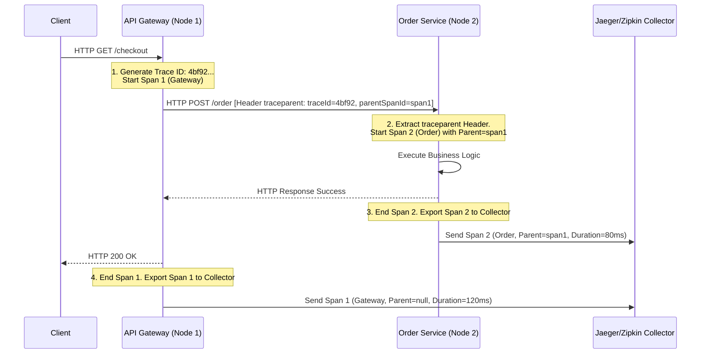

# Distributed Tracing

## Introduction
**Distributed Tracing** is a diagnostics method used to profile, monitor, and debug requests as they flow through a multi-tiered microservices architecture. First formalized by Google in their seminal **Dapper** paper (2010), distributed tracing reconstructs the entire execution path of a single client request, mapping out service dependencies, tracking execution times (latency), and highlighting exactly where failures or bottlenecks occur.

---

## Problem Statement
When a user clicks "Checkout" in a modern e-commerce application, the request traverses the API Gateway, Auth Service, Order Service, Payment Gateway, and Inventory Database.
1.  **Invisible Latency:** If the request takes 5 seconds to complete, each individual service might report normal latencies (e.g., 20ms). Without tracing, it is impossible to identify which specific network call, database query, or thread lock caused the delay.
2.  **Disconnected Logs:** Each service writes isolated logs to separate files. If a checkout fails, matching a specific error in the Inventory service with a specific request in the Gateway requires tedious timestamp correlation.
3.  **Complex Dependency Graphs:** As systems grow, mapping which microservices call each other becomes impossible to document manually.

---

## Why This Exists
Distributed tracing solves these transparency challenges by introducing **Correlation IDs** that cross network boundaries. By assigning a globally unique ID to a request at the front door, and forcing every downstream service to pass this ID along with its internal operations, the system builds an end-to-end DAG (Directed Acyclic Graph) of the request. This isolates latency bottlenecks and ties related logs together.

---

## Real-world Analogy
Imagine mailing a registered international package:
*   **Without Tracing (Standard Logs):** The sender knows they shipped a package, and the receiver knows they got it. If it gets stuck for two weeks, no one knows which sorting facility is holding it.
*   **With Tracing (Registered Barcode):** A barcode sticker (Trace ID) is slapped on the box.
    *   At the local post office, they scan it (Span 1).
    *   At customs, they scan it (Span 2).
    *   At the delivery truck, they scan it (Span 3).
    *   By querying the barcode on the tracking website (Jaeger/Trace View), you see the exact timeline: *"Package sat in London customs for 13 days."*

---

## Definition
**Distributed Tracing** is a tracing method that records the end-to-end execution path of a transaction across process boundaries by propagating a unique **Trace Context** and logging timed intervals called **Spans**.

---

## Key Concepts

### 1. Traces and Spans
*   **Trace:** The complete lifecycle representation of a request. It is a collection of spans.
*   **Span:** A single unit of work (e.g., an HTTP request, a database query, or an in-memory execution block). Every span contains a name, start time, duration, parent Span ID, and tags/logs (metadata).

### 2. Context Propagation (W3C Standard)
To link spans across different physical servers, the trace context must be passed over network protocols. Modern systems use the **W3C Trace Context** HTTP header standard:
*   `traceparent: 00-4bf92f3577b34da6a3ce929d0e0e4736-00f067aa0ba902b7-01`
    *   `00` – Version.
    *   `4bf92f3577b34da6a3ce929d0e0e4736` – **Trace ID** (16 bytes, globally unique).
    *   `00f067aa0ba902b7` – **Parent Span ID** (8 bytes, unique to the calling span).
    *   `01` – **Trace Flags** (e.g., `01` means "Sampled" - record this trace).

### 3. Context Storage (Thread-Local)
Within a single JVM/process, the active Span ID is stored in **Thread-Local Storage** (e.g., using `ThreadLocal` variables in Java). This allows the application to automatically link new sub-spans to the active parent span without passing the context as an argument to every Java method.

### 4. Asynchronous Propagation
When crossing asynchronous boundaries (e.g., writing to a Kafka queue), the trace context is injected into the message metadata headers. The consumer extracts the headers to continue the trace.

---

## Internal Working: Context Propagation Pipeline



---

## Java Implementation

The following Java code provides a complete simulation of a **Distributed Tracing Engine**. It implements W3C context header parsing (`inject` and `extract`), maintains active span states in thread-local context storage, and exports completed spans to a mock Jaeger collector.

```java
import java.util.*;
import java.util.concurrent.ConcurrentHashMap;

// Span class representing a timed block of work
class Span {
    final String name;
    final String traceId;
    final String spanId;
    final String parentSpanId;
    final long startTime;
    long endTime;

    public Span(String name, String traceId, String spanId, String parentSpanId) {
        this.name = name;
        this.traceId = traceId;
        this.spanId = spanId;
        this.parentSpanId = parentSpanId;
        this.startTime = System.currentTimeMillis();
    }

    public void end() {
        this.endTime = System.currentTimeMillis();
    }

    public long getDurationMs() {
        return endTime - startTime;
    }
}

// Distributed Tracing Context Manager (Thread-Local Tracer)
class Tracer {
    private static final ThreadLocal<Span> activeSpan = new ThreadLocal<>();

    public static Span startSpan(String name, String traceId, String parentSpanId) {
        String newSpanId = "span_" + UUID.randomUUID().toString().substring(0, 8);
        Span span = new Span(name, traceId, newSpanId, parentSpanId);
        activeSpan.set(span);
        return span;
    }

    public static Span getActiveSpan() {
        return activeSpan.get();
    }

    public static void clearActiveSpan() {
        activeSpan.remove();
    }
}

// Mock Jaeger Collector
class JaegerCollector {
    private final List<String> spansLog = Collections.synchronizedList(new ArrayList<>());

    public void exportSpan(Span span) {
        String log = String.format("Jaeger Span: Name=%s | TraceID=%s | SpanID=%s | ParentID=%s | Duration=%dms",
                span.name, span.traceId, span.spanId, span.parentSpanId, span.getDurationMs());
        spansLog.add(log);
        System.out.println("[Jaeger Collector Export]: " + log);
    }
}

// Tracing Orchestrator
public class DistributedTracingSimulator {
    private final JaegerCollector jaeger = new JaegerCollector();

    // ==========================================
    // CONTEXT PROPAGATION: W3C Inject & Extract
    // ==========================================
    public void injectContext(Map<String, String> carrier, Span activeSpan) {
        if (activeSpan != null) {
            // Inject context: version-traceId-spanId-flags
            carrier.put("traceparent", "00-" + activeSpan.traceId + "-" + activeSpan.spanId + "-01");
        }
    }

    public Span extractContextAndStart(Map<String, String> carrier, String newSpanName) {
        String header = carrier.get("traceparent");
        String traceId;
        String parentSpanId = null;

        if (header != null && header.startsWith("00-")) {
            // Parse W3C header
            String[] parts = header.split("-");
            traceId = parts[1];
            parentSpanId = parts[2];
        } else {
            // Start fresh trace
            traceId = "tr_" + UUID.randomUUID().toString().replace("-", "").substring(0, 16);
        }

        return Tracer.startSpan(newSpanName, traceId, parentSpanId);
    }

    // Simulated microservice routing execution
    public void simulateCrossServiceCall() {
        // --- 1. GATEWAY NODE ---
        // Gateway starts a root trace (parent = null)
        Span gatewaySpan = Tracer.startSpan("Gateway_Root", "tr_first_request_123", null);
        try { Thread.sleep(50); } catch (InterruptedException ignored) {}

        // Prepare HTTP Headers to call Order Service
        Map<String, String> httpHeaders = new HashMap<>();
        injectContext(httpHeaders, gatewaySpan);

        // --- 2. ORDER SERVICE NODE ---
        // Order service extracts headers and starts a child span
        Span orderSpan = extractContextAndStart(httpHeaders, "Order_Service_Work");
        try { Thread.sleep(80); } catch (InterruptedException ignored) {}

        // Complete Order Span and export
        orderSpan.end();
        jaeger.exportSpan(orderSpan);

        // Complete Gateway Span and export
        gatewaySpan.end();
        jaeger.exportSpan(gatewaySpan);
    }
}
```

---

## Step-by-Step Explanation: Context Injection & Extraction
Using the Java distributed tracing simulator above:

1.  **Root Span Start:** The Gateway boots a trace: `startSpan("Gateway_Root", "tr_first_request_123", null)`.
2.  **Context Injection:** Before making an outbound call, the gateway executes `injectContext()`. It adds a `traceparent` key containing `"00-tr_first_request_123-span_gateway_id-01"` into the HTTP headers.
3.  **Network Transport:** The HTTP request traverses the network.
4.  **Context Extraction:** The Order Service intercepts the request, calls `extractContextAndStart()`, and parses the `traceparent` header.
5.  **Child Span Linking:** The Order Service starts `Order_Service_Work` with `traceId = "tr_first_request_123"` and `parentId = "span_gateway_id"`.
6.  **Collector Union:** Both services export their completed spans to Jaeger. The Jaeger UI merges them using the common `traceId`, rendering the full call tree.

---

## Multiple Real-world Examples

1.  **Jaeger / Zipkin:** Open-source distributed tracing backends. They receive spans, store them (in Cassandra or Elasticsearch), and render a Gantt-chart timeline UI.
2.  **AWS X-Ray:** A fully managed AWS service that tracks requests across ECS, Lambda, API Gateway, and DynamoDB, rendering a dynamic visual service map.
3.  **GraphQL Federation (Apollo Studio):** Traces queries across federated subgraphs, showing how much latency each microservice subgraph contributed to the total GraphQL response.

---

## Pros & Cons

### Pros
*   **Pinpoints Latency Hotspots:** Gantt charts immediately reveal which database query or network hop is slowing down requests.
*   **Isolates Failure Points:** Shows the exact microservice where the error exception was thrown during a multi-service call chain.
*   **Dynamic Dependency Mapping:** Automatically renders real-time topological graphs showing how services communicate.

### Cons
*   **High Ingestion Volume:** Tracing 100% of requests in high-volume systems consumes massive disk storage and network bandwidth.
*   **Code Instrumentation Effort:** Retrofitting distributed tracing across legacy codebases (especially managing manual context propagation in async thread pools) is difficult.
*   **Network Header Bloat:** Injecting tracing headers adds minor bytes to every HTTP and message queue payload.

---

## Interview Questions

### Beginner
*   **Q:** What is a Span in distributed tracing?
*   **A:** A Span is the primary building block of a trace. It represents a single unit of work (e.g., an HTTP call, database query, or execution block) and contains a name, start time, duration, parent Span ID, and metadata tags.

### Intermediate
*   **Q:** How does context propagation work in distributed tracing?
*   **A:** Context propagation is the process of passing trace metadata (Trace ID, Span ID) across network boundaries. The calling service serializes this metadata into standard HTTP headers (like W3C `traceparent` or B3 headers) or message broker properties. The receiving service extracts these headers and starts its own child span using the same Trace ID and the caller's Span ID as its parent.

### Senior
*   **Q:** How do you propagate trace context across asynchronous boundaries (e.g., executing tasks on thread pools or publishing to Kafka queues) in Java?
*   **A:** 
    1.  **Thread Pools (ExecutorService):** Standard `ThreadLocal` context does not automatically copy to new threads. You must wrap the `ExecutorService` using libraries like OpenTelemetry's context wrappers, which copy the parent thread's context to the worker thread before execution.
    2.  **Message Queues (Kafka):** Before publishing a message, inject the W3C `traceparent` header into the Kafka `RecordHeaders` collection. The consumer reads the Kafka record headers, extracts the context, and starts a new span, linking the async worker to the publisher's trace.

### Staff Engineer
*   **Q:** Design a highly scalable trace processing pipeline for a system with 50,000 requests/sec. How do you handle storage limits, search indexing, and real-time anomaly alerts?
*   **A:** 
    1.  **Tail-Based Sampling:** Run an OTel Collector gateway. Route 100% of traces to the collector's memory buffer. Discard success traces under 50ms, but index and write all traces that returned HTTP errors or took $> 200\text{ms}$ to Elasticsearch/Cassandra.
    2.  **Decoupled Ingestion Queue:** Buffer incoming trace spans in a Kafka topic before writing them to the database, insulating the storage engine from traffic spikes.
    3.  **HyperLogLog Aggregation:** To calculate aggregate metrics (like p99 latency) in real-time without storing raw trace documents, aggregate statistics on the fly in memory using stream processors (like Flink) and output them to Prometheus, dropping trace storage requirements.

---

## Common Mistakes
*   **Losing Context in Async Blocks:** Forgetting to wrap custom thread pools, resulting in broken traces (the trace splits into two separate disconnected traces).
*   **Logging Heavy Payload Data in Spans:** Attaching large JSON bodies or database results as tags on spans, bloating memory and storage costs. Only log lightweight metadata (IDs, error messages).
*   **Relying on Head-Based Sampling for Debugging:** Using head-based sampling (e.g., sample 1% random requests) and hoping to catch a rare, intermittent error. Use tail-based sampling instead.

---

## Best Practices
*   **Adopt W3C Trace Context:** Standardize on W3C headers to ensure compatibility across diverse language stacks.
*   **Correlate Logs with Spans:** Write the `trace_id` and `span_id` into all structured application logs.
*   **Use Auto-Instrumentation:** Use OpenTelemetry agents (e.g., the OTel Java agent) to automatically instrument standard HTTP clients, databases, and frameworks without writing manual tracing code.

---

## When NOT to Use
*   **Monolithic Architectures:** Simple single-process applications where local Profilers (like JProfiler) are sufficient.

---

## Comparison with Similar Concepts

*   **Distributed Tracing vs. Structured Logging:** Structured logging prints detailed text files of events on a single server. Tracing links these events across multiple servers into a unified chronological Gantt-chart.
*   **Jaeger vs. OpenTelemetry:** OpenTelemetry is the open API/SDK standard used to *generate* telemetry. Jaeger is a backend system used to *store* and *visualize* traces.

---

## Summary
Distributed tracing is the ultimate diagnostic tool for microservices. By propagating trace context across HTTP and messaging boundaries, and capturing timed spans in a central collector, architects can visualize request journeys, isolate latency hotspots, and debug complex distributed failures.

---

## Related Topics
- [Observability](../observability)
- [Service Mesh](../service-mesh)
- [API Gateway](../../microservices/api-gateway)
- [Fault Tolerance](../../fundamentals/fault-tolerance)
