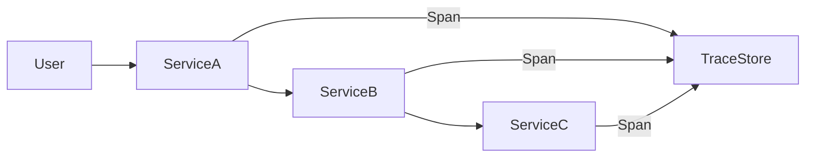

# Distributed Tracing

## Introduction
Distributed tracing captures the path of a request across a distributed system.

## Problem Statement
In a microservices architecture, it is hard to connect individual service logs to the end-to-end request flow.

## Why this exists
Distributed tracing helps diagnose latency, failures, and service dependencies across boundaries.

## Real-world analogy
Tracking a package as it moves through multiple shipping facilities and carriers.

## Definition
Distributed tracing records a request's lifecycle as it travels through services with spans and context propagation.

## Key concepts
- **Trace**
- **Span**
- **Context propagation**
- **Sampling**
- **Correlation IDs**

## Internal working
A trace is created at request entry, spans are added by each service, and trace data is aggregated by a backend.

### Mermaid diagram


## Python implementation

### Bad implementation
Each service logs independently without a shared correlation ID.

```python
def handle_request(request):
    print("received request")
    service_a()
    print("finished request")
```

### Better implementation
Inject a trace context into service calls.

```python
from typing import Dict

class TraceContext:
    def __init__(self, trace_id: str, span_id: str):
        self.trace_id = trace_id
        self.span_id = span_id

class ServiceB:
    def process(self, ctx: TraceContext):
        print({"trace_id": ctx.trace_id, "span_id": ctx.span_id, "event": "service_b.start"})
        # do work

class ServiceA:
    def __init__(self, service_b: ServiceB):
        self.service_b = service_b

    def process(self, ctx: TraceContext):
        new_ctx = TraceContext(trace_id=ctx.trace_id, span_id="span-2")
        print({"trace_id": ctx.trace_id, "span_id": ctx.span_id, "event": "service_a.start"})
        self.service_b.process(new_ctx)
```

## Step-by-step explanation
1. Generate a trace at the front door.
2. Pass context with each service call.
3. Emit spans to a tracing backend.

## Multiple real-world examples
- OpenTelemetry instruments services for Jaeger and Zipkin.
- AWS X-Ray tracks requests across cloud services.
- Google Cloud Trace records latency across microservices.

## Pros
- Visualizes an end-to-end request path.
- Reveals latency hotspots and service dependencies.
- Helps debug distributed failures.

## Cons
- Trace ingestion can be expensive.
- Requires consistent context propagation.
- Sampling can hide rare issues.

## Interview Questions
### Beginner
- What is a span in tracing?
- Answer: A timed operation within a trace.

### Intermediate
- Why is context propagation important for distributed tracing?
- Answer: It links spans from different services into a single trace.

### Senior
- How do you instrument asynchronous workflows in tracing?
- Answer: Use context continuation and attach trace IDs to messages or callbacks.

## Common mistakes
- Not propagating trace context through message queues.
- Emitting too much raw span data.
- Failing to correlate logs with trace IDs.

## Best practices
- Use standard instrumentation libraries.
- Sample traces intelligently.
- Link spans to logs and metrics.

## Related topics
- [Observability](../observability)
- [Service Mesh](../service-mesh)
- [Fault Tolerance](../../fundamentals/fault-tolerance)
