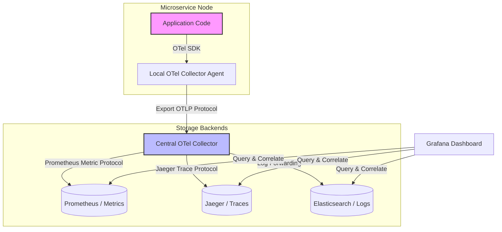

# Observability

## Introduction
In distributed systems, **Observability** is the degree to which you can understand, measure, and infer the internal state of a running system based solely on its external outputs (telemetry data). While traditional **Monitoring** focuses on detecting known failure modes ("is the server CPU $> 90\%$?"), observability provides the deep debugging context required to diagnose novel, unpredictable failure modes—referred to as "unknown-unknowns"—in complex microservice clusters.

---

## Problem Statement
In monolithic applications, diagnosing bugs is simple: log onto the server, check the local log file, and trace the execution path. However, in distributed microservice architectures:
1.  **Divergent Context:** A single client request traverses dozens of network nodes and databases. Standard print statements or unstructured logs are scattered across separate server disks, making it impossible to reconstruct the execution timeline.
2.  **Alert Fatigue:** Triggering alerts on low-level infrastructure metrics (like CPU spikes) causes engineers to ignore notifications, as CPU spikes do not always correlate with actual client-facing errors.
3.  **Unknown-Unknown Failures:** Systems fail in bizarre, compound ways (e.g., a specific database query taking 5 seconds only when a user from region X checks out with payment type Y). Static dashboards cannot diagnose these anomalies.

---

## Why This Exists
Observability exists to establish high-cardinality, correlated telemetry across the entire system. By standardizing on the **Three Pillars of Observability** (Logs, Metrics, and Traces) and correlating them using unique identifiers, developers can query their telemetry interactively. They can ask: *"For this specific slow request, show me the exact database query log, the host's memory metrics at that second, and the downstream service spans."*

---

## Real-world Analogy
Imagine maintaining a fleet of commercial airplanes:
*   **Monitoring (The Dashboard Light):** A red light on the cockpit panel labeled "Engine Overheating". This is a binary check of a known threshold. It tells you *that* something is wrong, but not *why*.
*   **Observability (The Black Box):** A flight data recorder that continuously tracks hundreds of high-resolution sensor metrics (fuel flow, turbine temperature, cabin pressure, control surface angles, cockpit audio logs). After a near-miss landing, investigators load the black box data and reconstruct the exact aerodynamic state of the plane at 30,000 feet, diagnosing a brand-new mechanical anomaly (unknown-unknown).

---

## Definition
**Observability** is a system property enabled by gathering and correlating three types of telemetry data: **Metrics** (aggregates), **Logs** (events), and **Traces** (contextual journeys), allowing operators to query and debug complex, distributed failure paths.

---

## The Three Pillars of Observability

### 1. Metrics (Time-Series Data)
Aggregatable numeric values measuring system state over time (e.g., requests/sec, error rate, CPU utilization). They are highly structured, extremely cheap to store, and excellent for triggering alerts.
*   **The RED Method (Microservices):** **R**ate (requests/sec), **E**rrors (failed requests/sec), **D**uration (latency distribution).
*   **The USE Method (Infrastructure):** **U**tilization (percent busy), **S**aturation (backlog queue depth), **E**rrors.
*   **The Google SRE Golden Signals:** Latency, Traffic, Errors, and Saturation.

### 2. Logs (Structured Events)
A text record of a discrete event that occurred within the application at a specific timestamp. Modern systems require **Structured Logging** (JSON output) to include context (e.g., `{"level":"ERROR", "userId":"45", "action":"checkout", "latency_ms":120}`).

### 3. Traces (The Request Journey)
A trace represents the end-to-end journey of a request through the distributed system. It is composed of a hierarchy of **Spans**, where each span represents a unit of work (e.g., a database query or an HTTP call) with a start time, duration, and parent-child relationship.

```
Trace 101:
[-------- Gateway Span: 150ms --------]
  [-- Auth Service: 20ms --]
  [------- Order Service: 120ms -------]
    [-- DB Query: 90ms --]
```

---

## Internal Working: OpenTelemetry Collector Pipeline

Modern architectures standardize on **OpenTelemetry (OTel)** to collect and process telemetry data.



---

## Java Implementation

The following Java code simulates an **OpenTelemetry-style Telemetry Engine**. It tracks RED metrics (Rate, Errors, Duration) for incoming API calls, writes structured JSON logs, and checks them against Service Level Objectives (SLOs) to log warning alerts.

```java
import java.util.*;
import java.util.concurrent.ConcurrentHashMap;
import java.util.concurrent.atomic.AtomicInteger;

// Structured Telemetry Log Record
class StructuredLog {
    final long timestamp;
    final String traceId;
    final String serviceName;
    final String message;
    final int status;
    final long latencyMs;

    public StructuredLog(String traceId, String serviceName, String message, int status, long latencyMs) {
        this.timestamp = System.currentTimeMillis();
        this.traceId = traceId;
        this.serviceName = serviceName;
        this.message = message;
        this.status = status;
        this.latencyMs = latencyMs;
    }

    public String toJSONString() {
        return String.format("{\"timestamp\":%d, \"traceId\":\"%s\", \"service\":\"%s\", \"msg\":\"%s\", \"status\":%d, \"latency_ms\":%d}",
                timestamp, traceId, serviceName, message, status, latencyMs);
    }
}

// Telemetry Collector Engine
public class TelemetryEngine {
    private final String serviceName;
    
    // RED Metrics
    private final AtomicInteger requestCount = new AtomicInteger(0);
    private final AtomicInteger errorCount = new AtomicInteger(0);
    private final List<Long> latencyDistribution = Collections.synchronizedList(new ArrayList<>());
    
    // SLO Configuration
    private final double maxErrorRateSLO = 0.05; // Max 5% errors
    private final long maxLatencyMsSLO = 100;    // Max 100ms latency threshold

    public TelemetryEngine(String serviceName) {
        this.serviceName = serviceName;
    }

    // ==========================================
    // API EVENT INSTRUMENTATION
    // ==========================================
    public void recordCall(String traceId, String path, int statusCode, long durationMs) {
        requestCount.incrementAndGet();
        latencyDistribution.add(durationMs);
        
        if (statusCode >= 400) {
            errorCount.incrementAndGet();
        }

        // 1. Emit Structured Log
        String logMessage = "Request processed for path: " + path;
        StructuredLog log = new StructuredLog(traceId, serviceName, logMessage, statusCode, durationMs);
        System.out.println("[STRUCTURED LOG]: " + log.toJSONString());

        // 2. Perform Real-time SLO check
        evaluateSLOs();
    }

    private void evaluateSLOs() {
        int total = requestCount.get();
        if (total < 10) return; // Wait for initial sample size

        // Calculate current error rate
        double currentErrorRate = (double) errorCount.get() / total;
        if (currentErrorRate > maxErrorRateSLO) {
            System.err.println("!!! SLO BREACHED: Error Rate on " + serviceName + " is " + (currentErrorRate * 100) + "% (SLO Limit: 5%) !!!");
        }

        // Calculate p95 Latency (95th percentile)
        long p95Latency = calculateP95Latency();
        if (p95Latency > maxLatencyMsSLO) {
            System.err.println("!!! SLO BREACHED: p95 Latency on " + serviceName + " is " + p95Latency + "ms (SLO Limit: 100ms) !!!");
        }
    }

    private long calculateP95Latency() {
        synchronized (latencyDistribution) {
            if (latencyDistribution.isEmpty()) return 0;
            List<Long> sorted = new ArrayList<>(latencyDistribution);
            Collections.sort(sorted);
            int index = (int) Math.ceil(0.95 * sorted.size()) - 1;
            return sorted.get(Math.max(0, index));
        }
    }
}
```

---

## Step-by-Step Explanation: The Telemetry Pipeline
Using the Java code simulation above:

1.  **Incoming Call:** A client hits a user dashboard path. The system generates a unique `traceId = "tr_abc123"`.
2.  **Execution & Timing:** The server starts a stopwatch. The request completes in 120ms with a `500 Server Error` response.
3.  **Metrics Update:** The gateway calls `recordCall("tr_abc123", "/api/dashboard", 500, 120)`.
    *   Increments `requestCount` and `errorCount`.
    *   Adds `120` to `latencyDistribution`.
4.  **Log Emission:** The system prints a structured JSON string containing the traceId, latency, status, and message, which is picked up by a log forwarding agent.
5.  **SLO Evaluation:** The collector thread evaluates the current metrics:
    *   If the error rate exceeds 5% or the 95th percentile of latencies exceeds 100ms, the system flags an alert, allowing developers to immediately query Jaeger for `"tr_abc123"` to isolate the failing microservice span.

---

## Multiple Real-world Examples

1.  **OpenTelemetry (Standardization):** OpenTelemetry provides language-agnostic APIs and SDKs to generate logs, metrics, and traces. It also provides the **OTel Collector**, a proxy that receives telemetry, batches it, and forwards it to backends (like Datadog, Prometheus, or Jaeger).
2.  **Prometheus + Grafana (Metrics):** Prometheus pulls (scrapes) metrics from HTTP endpoints exposed by applications (e.g. `/actuator/prometheus` in Spring Boot) and stores them in a time-series database. Grafana queries Prometheus to render real-time charts and dashboards.
3.  **The ELK Stack (Logs):** Elasticsearch (Search/Storage), Logstash (Ingestion/Filtering), and Kibana (Visualization) form the classic logging pipeline.

---

## Pros & Cons

### Pros
*   **Rapid Incident Resolution:** Correlated traces drop mean-time-to-repair (MTTR) from hours to minutes during complex microservice outages.
*   **Capacity Planning:** Metrics time-series charts reveal usage patterns, enabling accurate auto-scaling and database sizing predictions.
*   **Data-Driven Alerting:** Focuses alerts on client-facing SLOs (e.g., p99 latency) rather than noisy infrastructure alerts, reducing engineer alert fatigue.

### Cons
*   **Performance Overhead:** Generating traces requires allocating memory for span contexts and making network calls to export telemetry.
*   **High Ingestion & Storage Costs:** Logs and traces consume huge amounts of disk storage. Caching and storing 100% of telemetry at high scale is prohibitively expensive.
*   **Configuration Complexity:** Standardizing logging formats and trace propagation headers across legacy applications requires significant code refactoring.

---

## SLIs, SLOs, and SLAs
*   **SLI (Service Level Indicator):** What you measure. The specific metric (e.g., *"Percentage of HTTP requests resolved in under 100ms"*).
*   **SLO (Service Level Objective):** What you target. The reliability target for an SLI (e.g., *"We want the SLI to be >= 99% over a 30-day sliding window"*).
*   **SLA (Service Level Agreement):** The business contract. What happens if you fail to meet the SLO (e.g., *"If our availability drops below 99%, we refund 10% of the subscription cost to customers"*).

---

## Interview Questions

### Beginner
*   **Q:** What are the three pillars of observability?
*   **A:** 
    *   **Metrics:** Time-series numeric values measuring system state (best for alerts and dashboards).
    *   **Logs:** Timestamped records of discrete events (best for detailed textual debugging).
    *   **Traces:** The end-to-end execution path of a request through a distributed system (best for isolating latency bottlenecks).

### Intermediate
*   **Q:** How does Observability differ from traditional Monitoring?
*   **A:** Monitoring tells you *that* something is failing by testing for predefined, known error conditions (e.g., "CPU is $> 90\%$"). Observability tells you *why* something is failing by providing rich, correlated context (Logs + Traces + Metrics) to diagnose new, unpredictable failures (unknown-unknowns) interactively.

### Senior
*   **Q:** How do you control the massive storage cost of distributed tracing in a high-traffic microservices cluster processing billions of requests daily?
*   **A:** By implementing **Trace Sampling**:
    1.  **Head-based Sampling:** The gateway decides whether to trace a request *before* the request runs (e.g., only trace 1% of random requests). It is simple and cheap but might miss rare, critical error paths.
    2.  **Tail-based Sampling:** The system traces 100% of requests in memory. When a request completes, a collector inspects the trace. If the request was slow or returned an error, the trace is saved to disk; if it was fast and successful, the trace is discarded. This preserves critical error traces while discarding 90% of useless success traces, drastically reducing storage costs.

### Staff Engineer
*   **Q:** What is OpenTelemetry (OTel), and how does its architecture prevent vendor lock-in for enterprise systems?
*   **A:** OpenTelemetry is a CNCF open-source project providing a standardized set of APIs, SDKs, and tooling to collect logs, metrics, and traces. Prior to OTel, switching from one telemetry vendor to another (e.g., from Datadog to Dynatrace) required replacing all proprietary agents and code annotations across every microservice. OTel solves this by:
    1.  **Standardized API/SDK:** Applications are instrumented only with the open-source OTel API.
    2.  **The OTel Collector:** Applications export telemetry in a generic format (OTLP) to a local OTel Collector proxy. The collector is configured with pipelines that transform and route data to any backend. If you want to switch vendors, you only edit a single YAML file in the OTel Collector configuration to point to the new vendor's endpoint, requiring zero code changes in the microservices.

---

## Common Mistakes
*   **Logging Unstructured Text:** Writing logs like `System.out.println("User logged in: " + user)` which cannot be parsed or indexed by Elasticsearch. Use structured JSON logs instead.
*   **No Correlation IDs:** Not injecting trace IDs into log statements, which prevents developers from linking logs to specific trace spans.
*   **Alerting on Resource Utilization:** Creating urgent alerts for CPU or memory utilization. If CPU spikes but user-facing latency and error rates remain perfectly normal, the alert is a false alarm. Alert only on SLO breaches.

---

## Best Practices
*   **Correlate Everything:** Ensure every trace span injects its `trace_id` into the structured log context so they can be queried together.
*   **Focus Alerts on SLOs:** Alert engineers only when p95/p99 latency or error rate SLO budgets are being consumed.
*   **Enforce Tail-Based Sampling:** Save storage costs by discarding successful, fast traces while persisting error and slow traces.

---

## When NOT to Use
*   **Small Monoliths:** Simple applications running on a single server where basic logging is sufficient.

---

## Comparison with Similar Concepts

*   **Observability vs. Monitoring:** Monitoring detects *known* problems (passive alerts). Observability allows you to ask *new* questions to diagnose *unknown* problems (active debugging).
*   **SLO vs. SLA:** An SLO is an internal reliability target set by engineering. An SLA is an external legal agreement with financial consequences for the business.

---

## Summary
Observability provides end-to-end visibility into complex distributed systems. By correlating Metrics, Logs, and Traces, and structuring telemetry around client-facing SLOs, developers can quickly isolate bottlenecks and resolve outages in real-time.

---

## Related Topics
- [Distributed Tracing](../distributed-tracing)
- [Service Mesh](../service-mesh)
- [API Gateway](../../microservices/api-gateway)
- [Fault Tolerance](../../fundamentals/fault-tolerance)
