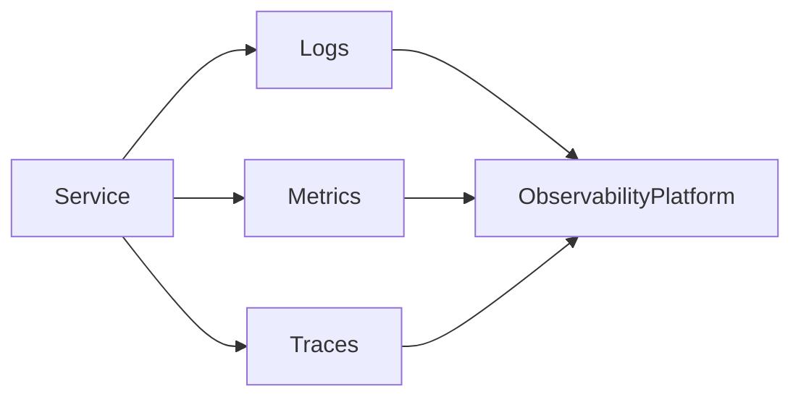

# Observability

## Introduction
Observability is the capability to understand system behavior by collecting and analyzing telemetry data.

## Problem Statement
Without observability, it is difficult to diagnose failures, understand performance, and validate system behavior.

## Why this exists
Modern distributed systems require end-to-end visibility to detect issues and optimize performance.

## Real-world analogy
A weather station collects temperature, pressure, and wind data so meteorologists can understand current conditions.

## Definition
Observability is the ability to infer internal system state from external outputs such as logs, metrics, and traces.

## Key concepts
- **Logs**
- **Metrics**
- **Traces**
- **Alerts**
- **Dashboards**

## Internal working
Services emit telemetry, a collection system stores it, and operators use dashboards and alerts to detect anomalies.

### Mermaid diagram


## Python implementation

### Bad implementation
No centralized telemetry and ad hoc log files.

```python
def process_request(request):
    print("request received")
    result = handle(request)
    print("request complete")
    return result
```

### Better implementation
Structured logging and metric counters.

```python
import time
from collections import Counter

metrics = Counter()

def process_request(request):
    start = time.time()
    result = handle(request)
    duration = time.time() - start
    print({"event": "request.complete", "duration_ms": duration})
    metrics["requests"] += 1
    return result
```

## Step-by-step explanation
1. Instrument services with logs, metrics, and traces.
2. Route telemetry to a platform.
3. Use dashboards and alerts to understand behavior.

## Multiple real-world examples
- Datadog collects and correlates logs, metrics, and traces.
- Prometheus scrapes metrics and powers alerts.
- OpenTelemetry standardizes telemetry collection.

## Pros
- Faster incident response.
- Better capacity planning.
- More confidence when deploying changes.

## Cons
- Requires ongoing instrumentation and maintenance.
- Can generate large volumes of data.
- Observability tooling can be complex to operate.

## Interview Questions
### Beginner
- What are the three pillars of observability?
- Answer: Logs, metrics, traces.

### Intermediate
- How does observability differ from monitoring?
- Answer: Monitoring checks known conditions, observability helps diagnose unknown issues.

### Senior
- How do you balance telemetry volume and cost?
- Answer: Use sampling, aggregation, and targeted instrumentation.

## Common mistakes
- Logging only errors and ignoring structured context.
- Relying on monitoring alerts without trace data.
- Ignoring telemetry for internal services.

## Best practices
- Instrument code with structured logs and distributed tracing.
- Correlate data with request and user context.
- Use alerting thresholds and anomaly detection.

## When NOT to use
- There is no excuse not to use observability in production services.

## Related topics
- [Distributed Tracing](../distributed-tracing)
- [Event-Driven Architecture](../../messaging/event-driven-architecture)
- [Fault Tolerance](../../fundamentals/fault-tolerance)
