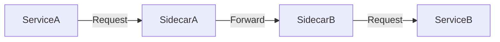

# Service Mesh

## Introduction
A service mesh is an infrastructure layer that manages service-to-service communication in microservices.

## Problem Statement
Application code can become cluttered with networking concerns such as retries, routing, TLS, and observability.

## Why this exists
A service mesh abstracts cross-cutting communication features from business logic and centralizes them in a sidecar or proxy layer.

## Real-world analogy
A transportation network that manages traffic lights, routing, and tolls so individual drivers can focus on reaching destinations.

## Definition
A service mesh provides resilience, observability, security, and traffic management for microservices without changing application code.

## Key concepts
- **Sidecar proxy**
- **Traffic routing**
- **Mutual TLS**
- **Circuit breaking**
- **Policy enforcement**

## Internal working
Service requests are intercepted by sidecar proxies, which apply routing, retry, and security policies before forwarding traffic.

### Mermaid diagram


## Python implementation

### Bad implementation
Each service handles its own networking and retries.

```python
class ServiceClient:
    def __init__(self):
        self.retries = 3

    def request(self, endpoint, payload):
        for _ in range(self.retries):
            response = self.call(endpoint, payload)
            if response.ok:
                return response
        raise RuntimeError("Request failed")
```

### Better implementation
A sidecar proxy handles retries and routing separately from service logic.

```python
class SidecarProxy:
    def request(self, endpoint, payload):
        # HTTP client logic, retries, and policy enforcement
        pass

class ApplicationService:
    def __init__(self, proxy):
        self.proxy = proxy

    def call_service(self, endpoint, payload):
        return self.proxy.request(endpoint, payload)
```

## Step-by-step explanation
1. Each service is paired with a local sidecar proxy.
2. Outgoing requests pass through the proxy.
3. The mesh enforces policies, telemetry, and resilience behavior.

## Multiple real-world examples
- Istio uses Envoy sidecars for mesh traffic control.
- Linkerd provides lightweight service mesh features for Kubernetes.
- Consul integrates service discovery and mesh routing.

## Pros
- Centralizes cross-cutting communication concerns.
- Improves visibility and security.
- Reduces duplicate networking code in services.

## Cons
- Adds architectural and operational complexity.
- Can increase latency and resource usage.
- Requires careful mesh configuration and observability.

## Interview Questions
### Beginner
- What is a service mesh?
- Answer: A dedicated layer for managing service-to-service communication.

### Intermediate
- Why use a sidecar proxy in a service mesh?
- Answer: To decouple networking, security, and telemetry from application code.

### Senior
- How do you avoid service mesh overload in production?
- Answer: Start with limited features, monitor proxy resource usage, and adopt a gradual rollout.

## Common mistakes
- Deploying a service mesh too early.
- Using mesh features without understanding their operational cost.
- Treating the mesh as a replacement for service design.

## Best practices
- Use service mesh for complex microservice topologies.
- Keep control plane and data plane metrics visible.
- Apply policies consistently across services.

## When NOT to use
- Small, simple deployments.
- Systems with rigid latency budgets and limited infrastructure.

## Related topics
- [API Gateway](../../microservices/api-gateway)
- [Service Discovery](../../microservices/service-discovery)
- [Observability](../observability)
