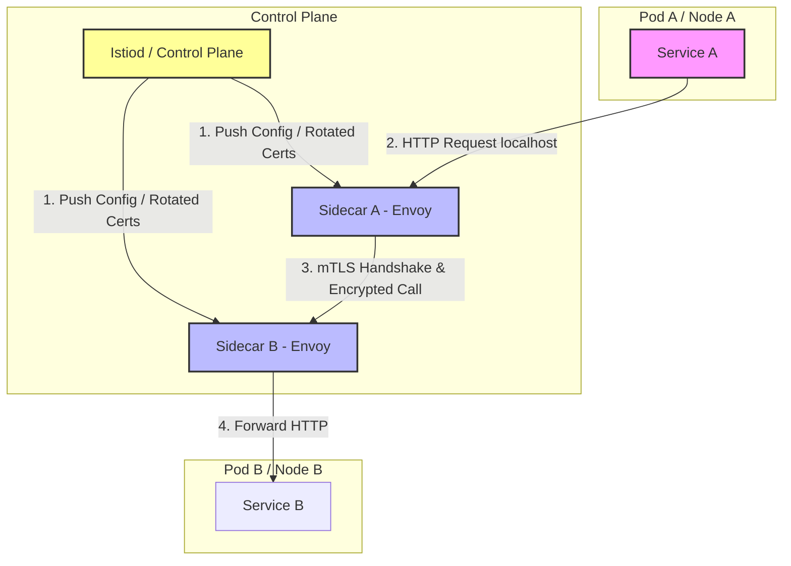

# Service Mesh

## Introduction
A **Service Mesh** is a dedicated, configurable infrastructure layer designed to handle high-volume, service-to-service (east-west) network communication within a microservices architecture. By intercepting all network traffic using a **Sidecar Proxy** pattern, a service mesh manages routing, security (mutual TLS), fault tolerance (retries, timeouts, circuit breaking), and telemetry out-of-process, completely removing networking concerns from the application code.

---

## Problem Statement
In a heterogeneous microservices cluster containing hundreds of services written in different languages (Java, Go, Python):
1.  **Duplicate Code Bloat:** Every service must duplicate code for retries, backoffs, timeouts, circuit breakers, and metrics collection. Maintaining consistency across different client library implementations is highly error-prone.
2.  **Zero-Trust Security Complexity:** Securing service-to-service communication requires rotating TLS certificates on every host, verifying identities, and writing access control policies at the code level.
3.  **Black-Box Observability:** Without uniform logging, tracing, and metric collection, identifying which specific network hop is causing a latency spike is nearly impossible.

---

## Why This Exists
A service mesh abstracts these concerns by running a lightweight network proxy (typically **Envoy**) alongside every service instance. The application code only talks to `localhost`, completely unaware of the complex topology, security protocols, or retry policies happening over the network. This splits the architecture into a **Data Plane** (which routes traffic) and a **Control Plane** (which pushes configurations and manages certificates).

---

## Real-world Analogy
Imagine a network of embassies in a foreign city:
*   **Without a Service Mesh (Application-level Networking):** Every diplomat (microservice) must drive their own car, learn the local driving laws, carry a gun for security, speak five languages, and check their own GPS. If a diplomat gets lost or shot, communication breaks down.
*   **With a Service Mesh (Sidecar Proxy):** Every diplomat is assigned a dedicated professional bodyguard and driver (Sidecar Proxy) who drives an armored car. The diplomat simply sits in the back seat and speaks. The driver handles GPS routing, translates languages, terminating attacks (Circuit Breaking), and verifies identities with other guards (mTLS).

---

## Definition
A **Service Mesh** is an infrastructure layer composed of local sidecar proxies (Data Plane) and a central coordinator (Control Plane) designed to automate traffic management, security policies, and observability for inter-service communication.

---

## Key Concepts

### 1. Data Plane vs. Control Plane
*   **Data Plane:** A network of sidecar proxies (e.g., Envoy, Linkerd-proxy) deployed alongside services. They intercept all inbound and outbound traffic, applying policies, managing retries, and gathering metrics.
*   **Control Plane:** The management console (e.g., `istiod` in Istio). It does not intercept any network traffic. Instead, it translates YAML routing rules into proxy configurations and distributes them to the data plane, while also acting as a Certificate Authority (CA) to rotate mTLS certificates.

### 2. Mutual TLS (mTLS) & SPIFFE Identity
To enforce zero-trust, proxies execute **mTLS** handshakes for every connection. The control plane assigns each service a unique **SPIFFE ID** (Secure Production Identity Framework for Everyone) encoded inside an X.509 certificate. The proxy validates this certificate on every call, proving the caller's identity before allowing access.

### 3. Traffic Management & Shadowing
*   **Canary Deployments:** Route 90% of traffic to version 1.0 and 10% to version 1.1 based on proxy routing tables.
*   **Traffic Shadowing (Mirroring):** Duplicates a percentage of live production traffic and sends it to a test version in the background, allowing developers to test performance under real load without affecting users.

---

## Internal Working: The Sidecar Proxy Architecture



---

## Java Implementation

The following Java code simulates a **Sidecar Proxy System** managing mutual TLS handshakes, access control validations (using SPIFFE-like identities), path routing, and telemetry reporting.

```java
import java.util.*;
import java.util.concurrent.ConcurrentHashMap;

// Client Request wrapper containing headers
class MeshRequest {
    final String path;
    final String body;
    String clientSpiffeId; // Injected by client sidecar

    public MeshRequest(String path, String body) {
        this.path = path;
        this.body = body;
    }
}

// Sidecar Proxy Simulator
class EnvoySidecarProxy {
    private final String nodeId;
    private final String localServiceAddress;
    private final String spiffeId;
    
    // Inbound Access Control List (rules pushed by control plane)
    private final Set<String> allowedClientSpiffeIds = new HashSet<>();
    private final Map<String, String> routingTable = new ConcurrentHashMap<>();

    public EnvoySidecarProxy(String nodeId, String localServiceAddress, String spiffeId) {
        this.nodeId = nodeId;
        this.localServiceAddress = localServiceAddress;
        this.spiffeId = spiffeId;
    }

    public void allowClient(String clientSpiffeId) {
        allowedClientSpiffeIds.add(clientSpiffeId);
    }

    public void addRoute(String path, String targetProxyAddress) {
        routingTable.put(path, targetProxyAddress);
    }

    // =====================================================================
    // OUTBOUND PATH: Intercepts request from Local Service
    // =====================================================================
    public void handleOutbound(MeshRequest request, Map<String, EnvoySidecarProxy> meshNetwork) {
        System.out.println("[" + nodeId + " Outbound]: Intercepted local request to path: " + request.path);
        
        // 1. Inject SPIFFE identity into request
        request.clientSpiffeId = this.spiffeId;

        // 2. Resolve destination using routing table
        String targetProxyAddress = routingTable.get(request.path);
        if (targetProxyAddress == null) {
            System.err.println("[" + nodeId + " Outbound]: No route found for: " + request.path);
            return;
        }

        // 3. Forward request to target proxy (simulated network call)
        EnvoySidecarProxy targetProxy = meshNetwork.get(targetProxyAddress);
        if (targetProxy != null) {
            targetProxy.handleInbound(request);
        }
    }

    // =====================================================================
    // INBOUND PATH: Receives encrypted remote calls
    // =====================================================================
    public void handleInbound(MeshRequest request) {
        System.out.println("[" + nodeId + " Inbound]: Received mTLS connection from: " + request.clientSpiffeId);

        // 1. Access Control Check (AuthorizationPolicy)
        if (!allowedClientSpiffeIds.contains(request.clientSpiffeId)) {
            System.err.println("[" + nodeId + " Inbound]: Access DENIED for client: " + request.clientSpiffeId);
            return;
        }

        // 2. Forward request to local service over localhost
        System.out.println("[" + nodeId + " Inbound]: Access GRANTED. Forwarding payload to local service (" + localServiceAddress + ")");
        deliverToLocalService(request.body);

        // 3. Telemetry Log
        logMetric(request.path, request.clientSpiffeId, 200);
    }

    private void deliverToLocalService(String body) {
        System.out.println("  Local Service executing business logic on: " + body);
    }

    private void logMetric(String path, String client, int status) {
        System.out.println("  [Telemetry Log]: Path=" + path + " | Client=" + client + " | Status=" + status);
    }
}
```

---

## Step-by-Step Explanation: The Sidecar Flow
Using the Java code simulation above:

1.  **Boot & Config Push:** Two pods boot.
    *   `Pod-A` runs `Service-A` with `EnvoySidecarProxy-A` (`spiffe://prod/service-a`).
    *   `Pod-B` runs `Service-B` with `EnvoySidecarProxy-B` (`spiffe://prod/service-b`).
    *   The Control Plane configures `Proxy-B` to allow calls only from `spiffe://prod/service-a`.
    *   The Control Plane configures `Proxy-A` with a routing mapping `/order` $\to$ `Proxy-B`.
2.  **Outbound Interception:** `Service-A` sends a request to `/order`. `Proxy-A` intercepts it, injects the SPIFFE ID into the request headers, and resolves the path to `Proxy-B`.
3.  **mTLS & Auth Check:** `Proxy-B` receives the call, extracts the client SPIFFE ID (`spiffe://prod/service-a`), and verifies it exists in its `allowedClientSpiffeIds` whitelist.
4.  **Local Forwarding:** Since authorization succeeds, `Proxy-B` forwards the payload to `Service-B` over localhost, logs request latency metrics, and returns the response.

---

## Multiple Real-world Examples

1.  **Istio + Envoy (Kubernetes):** Istio injects an Envoy proxy container into every application pod. Istio's control plane daemon (`istiod`) manages service discovery, distributes certificate authorities (SPIRE), and monitors routing tables.
2.  **Linkerd:** A CNCF graduated service mesh. Unlike Istio, Linkerd uses a custom, ultra-lightweight data plane proxy written in Rust (`linkerd2-proxy`) specifically optimized for low memory usage and high speed in Kubernetes.
3.  **HashiCorp Consul Connect:** Integrates service discovery with service mesh capabilities, utilizing Envoy proxies to secure service-to-service traffic.

---

## Pros & Cons

### Pros
*   **Separation of Concerns:** Application developers do not write networking or retry code; they focus purely on business logic.
*   **Zero-Trust Security:** Automatic, transparent mutual TLS (mTLS) encryption and certificate rotation out-of-the-box.
*   **Advanced Traffic Control:** Canary routing, path rewriting, and traffic mirroring are easily configured via YAML without code changes.
*   **Consistent Observability:** Uniform metrics (latency, error rates, saturations) and distributed tracing span the entire mesh.

### Cons
*   **Extreme Complexity:** Operating control planes and managing thousands of sidecar configurations requires specialized DevOps expertise.
*   **Resource Overhead:** Every application pod runs an extra container (Envoy). In large clusters, sidecars can consume gigabytes of RAM and significant CPU.
*   **Latency Penalty:** Every request incurs two extra proxy hops (Client $\to$ Sidecar A $\to$ Sidecar B $\to$ Target Service), adding $1\text{ms}-5\text{ms}$ of latency per call.

---

## Interview Questions

### Beginner
*   **Q:** What is a Sidecar Proxy in a service mesh?
*   **A:** A sidecar proxy is a lightweight network proxy (like Envoy) deployed alongside an application container inside the same host or pod. It intercepts all inbound and outbound traffic to manage routing, security, and telemetry on behalf of the application.

### Intermediate
*   **Q:** What is the difference between the Data Plane and the Control Plane in a service mesh?
*   **A:** The Data Plane consists of the actual sidecar proxies running next to services that intercept and forward network traffic. The Control Plane is the management panel that does not touch traffic; instead, it distributes routing configurations, access policies, and TLS certificates to the data plane proxies.

### Senior
*   **Q:** How does a service mesh enforce Mutual TLS (mTLS) without application code changes?
*   **A:** 
    1.  **Interception:** Application traffic is intercepted by iptables rules and redirected to the local sidecar proxy.
    2.  **Handshake:** When Sidecar A calls Sidecar B, the proxies execute a standard TLS handshake in the background.
    3.  **Identity Verification:** During the handshake, both proxies exchange X.509 certificates (containing SPIFFE IDs) managed and rotated by the control plane.
    4.  **Forwarding:** Once the identity is verified, Sidecar A encrypts the payload, Sidecar B decrypts it, and forwards it to the target service over localhost.

### Staff Engineer
*   **Q:** Discuss the architectural trade-offs of a Sidecar-based Service Mesh (like Istio) vs. a Sidecarless Service Mesh (like Cilium/eBPF or Proxyless gRPC).
*   **A:** 
    *   **Sidecar-based (Istio/Envoy):**
        *   *Pros:* Highly mature, runs at the application layer (Layer 7), supporting advanced HTTP header routing, path rewrites, and body parsing.
        *   *Cons:* High CPU/Memory overhead (one proxy per pod), adds $2$ extra network hops per call, increasing latency.
    *   **Sidecarless (Cilium/eBPF):**
        *   *Pros:* eBPF runs directly in the Linux Kernel, intercepting packets at the socket level (Layer 3/4). This eliminates sidecar containers, drastically reducing memory footprint and network latency.
        *   *Cons:* Lacks Layer 7 context. Parsing complex application protocols (GraphQL, HTTP header modifications, XML payloads) is slow and complex inside the kernel, requiring occasional fallback to a shared node-level proxy.
    *   **Proxyless (gRPC):**
        *   *Pros:* Low latency; the application client library directly talks to the control plane.
        *   *Cons:* Couples the application code to specific gRPC libraries, requiring distinct implementations for different programming languages.

---

## Common Mistakes
*   **Deploying Too Early:** Implementing a service mesh for small clusters (under 10 services) where the operational complexity outweighs the benefits.
*   **Ignoring Sidecar Memory Limits:** Under-provisioning RAM for Envoy sidecars. If a service experiences traffic spikes, Envoy can run out of memory and crash, taking down the service.
*   **Not Tuning Proxy Configs:** Distributing the entire cluster's service routing table to every single sidecar. In large clusters, this causes sidecars to consume hundreds of megabytes of RAM. Use Istio's `Sidecar` resources to limit configurations to only relevant endpoints.

---

## Best Practices
*   **Keep Control Plane Configs Localized:** Limit configuration distribution to only services that communicate with each other.
*   **Expose Sidecar Telemetry:** Export proxy metrics (latency, error rates) to Prometheus/Grafana for centralized alerting.
*   **Combine with API Gateways:** Use an API Gateway for north-south traffic (external users) and a Service Mesh for east-west traffic (internal service-to-service).

---

## When NOT to Use
*   **Monolithic or Low-Node Systems:** Clusters with few services where network topologies are static.
*   **Strict Latency Budgets:** High-frequency trading systems where the extra $2\text{ms}$ proxy latency is unacceptable.

---

## Comparison with Similar Concepts

*   **Service Mesh vs. API Gateway:** An API gateway manages public external traffic entering the cluster (north-south). A Service mesh manages private internal service communication within the cluster (east-west).
*   **Service Mesh vs. Load Balancer:** A load balancer simply routes traffic across servers. A Service mesh provides Layer 7 policy enforcement (canary routing, mTLS, circuit breaking, distributed tracing) out-of-process.

---

## Summary
A Service Mesh is an infrastructure layer that handles service-to-service communication. By deploying sidecar proxies, it decouples traffic control, zero-trust security (mTLS), and telemetry from application code, allowing developers to focus on business logic while maintaining robust system reliability.

---

## Related Topics
- [API Gateway](../../microservices/api-gateway)
- [Service Discovery](../../microservices/service-discovery)
- [Observability](../observability)
- [Distributed Tracing](../distributed-tracing)
